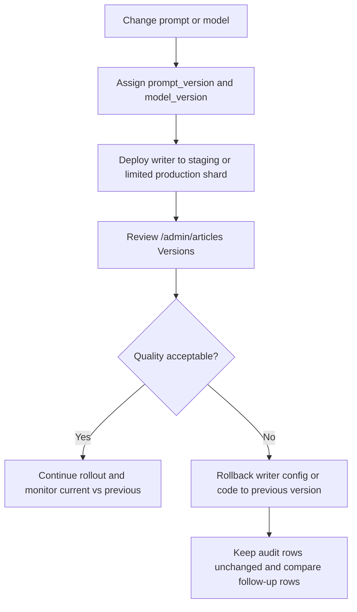

# Admin Article Review Dashboard

This document explains the NutsNews article review dashboard created for GitHub issue #18 and expanded for AI prompt/model auditability in issue #98.

Issue #18 asks for an admin dashboard that lets an operator review accepted and rejected stories, filter by decision/source/category/positivity score, see rejection reasons, and manually investigate bad decisions.

Issue #98 adds prompt/model version tracking so every AI review can be traced to the version that made the decision, and so operators can compare current versus previous acceptance/rejection quality before a bad rollout becomes hard to isolate.

---

## Route

```text
/admin/articles
```

The route is protected by the existing admin Google login and owner allowlist.

---

## Purpose

The article review dashboard helps operators answer:

* Which stories were recently reviewed?
* Was a story accepted or rejected?
* Why was it accepted or rejected?
* Which source did it come from?
* What category and positivity score did the AI assign?
* Was an accepted story published to the public site?
* Which decisions need manual investigation?
* Which AI provider processed the article: OpenAI, local AI, local prefilter, or no-thumbnail rule?
* Which model processed the article, such as `gpt-4o-mini` or `qwen2.5:3b`?
* Which prompt version and model version produced the decision?
* Did the current prompt/model version accept or reject stories at a different rate than the previous version?

---

## AI Decision Versioning Summary

### Simple

Every AI review row now has a `prompt_version` and `model_version`. The admin dashboard shows those values on review cards and adds a version report comparing current versus previous acceptance/rejection rates.

### Intermediate

`public.article_ai_reviews` stores the per-row audit values. Existing rows are marked `legacy-unversioned`; future rows can be written with explicit prompt/model versions. If a writer does not pass `model_version`, the database derives it from `ai_model` so the row is still traceable.

### Expert

The app migration adds `prompt_version`, `model_version`, format constraints, version indexes, a trigger that normalizes missing values, and the read-only `public.ai_decision_version_report` view. The view groups by prompt version, model version, provider, and model, ranks the newest group as `current`, the next as `previous`, and reports acceptance, rejection, score, and deltas. Only `service_role` is granted direct view access; the admin page reads it server-side.

---

## Data Source

The dashboard reads from:

```text
public.article_ai_reviews
```

Issue #98 adds these fields to each AI review row:

| Field | Purpose |
| --- | --- |
| `prompt_version` | Stable prompt identifier that produced the decision. Existing rows use `legacy-unversioned`. |
| `model_version` | Stable model or model-release identifier that produced the decision. Defaults from `ai_model` if not supplied. |
| `ai_provider` | Provider path such as `openai`, `local`, `prefilter`, or `no_thumbnail`. |
| `ai_model` | Runtime model name such as `gpt-4o-mini` or `qwen2.5:3b`. |

The version comparison section reads from:

```text
public.ai_decision_version_report
```

For accepted stories, it also looks for a matching published article in:

```text
public.articles
```

Matching is done by `original_url`.

---

## Sorting

Reviews are sorted by review time.

Default sort:

```text
Newest reviewed first
```

Operators can switch to:

```text
Oldest reviewed first
```

This makes it easy to review fresh decisions first or investigate older backlog decisions.

---

## Filters

The dashboard supports filters for:

| Filter | Purpose |
| --- | --- |
| Decision | Show all, accepted, or rejected stories |
| Source | Focus on one RSS publisher/source |
| Category | Filter by AI category labels |
| Min score | Show stories at or above a positivity score |
| Max score | Show stories at or below a positivity score |
| Time sort | Newest first or oldest first |

---

## Review Cards

Each review card shows:

* Decision badge
* Positivity score
* AI provider badge
* AI model badge
* Prompt version badge
* Model version badge
* Published/not published badge
* Title
* Source
* Category
* Review time
* Review duration
* AI summary
* Decision reason
* Original article link
* Published NutsNews story link when available

For rejected stories, the decision reason is the most important field because it explains why the article was not published.

---

## Manual Investigation Workflow

Use this workflow when reviewing questionable decisions:

1. Open `/admin/articles`.
2. Filter to rejected stories.
3. Sort by newest first.
4. Review low-score stories and rejection reasons.
5. Open the original article when the reason looks suspicious.
6. Check whether the source should be improved, disabled, or kept.
7. Use `/admin/feeds` and `/admin/feed-health` if the issue appears source-specific.

---

## Version Quality Workflow

Use this workflow after any prompt or model change:

1. Open `/admin/articles`.
2. Jump to the `Versions` section.
3. Compare `Current Acceptance`, `Previous Acceptance`, `Acceptance Delta`, and `Current Rejects`.
4. Inspect the current and previous version cards for review count, rejection rate, score delta, first review time, and latest review time.
5. Scroll to `Reviews` and inspect individual accepted/rejected rows for the same `prompt_version` and `model_version`.
6. If the current version has a worse acceptance rate, higher rejection rate, or lower average score, run a small controlled shard before allowing broader ingestion.
7. Keep the old prompt/model version available until the current version has enough accepted and rejected samples to compare.



---

## Version Bump Rules

Use stable version strings. Keep them short enough for dashboard badges and SQL filters.

Recommended examples:

```text
article-review-v2026.07.17
qwen2.5-3b-local-v2
gpt-4o-mini-2026-07
```

Rules:

* Bump `prompt_version` whenever the review instructions, scoring rubric, accept/reject policy, JSON shape, summary target, or safety wording changes.
* Bump `model_version` whenever the model family, hosted model alias, local Ollama tag, quantization, system wrapper, or fallback behavior changes.
* Do not reuse a version string for different behavior.
* Do not rewrite old rows to a new version. Historical rows are the comparison baseline.
* If the Worker or local AI service cannot write explicit versions yet, the database still records `legacy-unversioned` and derives `model_version` from `ai_model`; add explicit writer support before using the report as release evidence.

Writer-side change checklist:

1. Update the Worker or local AI review writer to include `prompt_version` and `model_version` when inserting/upserting `public.article_ai_reviews`.
2. Keep `ai_provider` and `ai_model` populated.
3. Run a low `MAX_AI_REVIEWS` shard or staging fixture first.
4. Confirm the new version appears as `current` in `/admin/articles`.
5. Compare the current row against the previous row before increasing review volume.

---

## Rollback Rules

Rollback is a writer/config change, not a database rewrite.

If a prompt/model version causes bad decisions:

1. Stop or reduce new AI review volume.
2. Revert the Worker/local AI prompt, model, or config to the previous known-good behavior.
3. Restore the previous `prompt_version` and `model_version` values in the writer.
4. Redeploy through the normal app/Worker/infra workflow for the changed repository.
5. Run one low-volume shard and inspect `/admin/articles`.
6. Leave the bad-version rows intact so the report continues to show what happened.

Only correct historical `prompt_version` or `model_version` values if they were written wrong due to a logging bug. Do not relabel rows to hide a bad rollout.

---

## Supabase SQL

The dashboard prints a SQL query that matches the active filters.

Base query:

```sql
select
  reviewed_at,
  decision,
  source,
  category,
  positivity_score,
  ai_provider,
  ai_model,
  prompt_version,
  model_version,
  review_duration_ms,
  title,
  reason,
  original_url
from public.article_ai_reviews
order by reviewed_at desc
limit 50;
```

Find recent rejected stories:

```sql
select
  reviewed_at,
  source,
  category,
  positivity_score,
  ai_provider,
  ai_model,
  prompt_version,
  model_version,
  review_duration_ms,
  title,
  reason,
  original_url
from public.article_ai_reviews
where decision = 'reject'
order by reviewed_at desc
limit 50;
```

Find accepted stories that were reviewed most recently:

```sql
select
  reviewed_at,
  source,
  category,
  positivity_score,
  ai_provider,
  ai_model,
  prompt_version,
  model_version,
  review_duration_ms,
  title,
  summary,
  original_url
from public.article_ai_reviews
where decision = 'accept'
order by reviewed_at desc
limit 50;
```

Compare prompt/model versions:

```sql
select
  version_window,
  version_rank,
  prompt_version,
  model_version,
  ai_provider,
  ai_model,
  total_reviews,
  accepted_reviews,
  rejected_reviews,
  acceptance_rate_pct,
  rejection_rate_pct,
  average_positivity_score,
  acceptance_rate_delta_pct,
  rejection_rate_delta_pct,
  average_score_delta,
  first_reviewed_at,
  latest_reviewed_at
from public.ai_decision_version_report
order by version_rank asc
limit 20;
```

---

## Performance Indexes

The migration below supports dashboard filtering and time sorting:

```text
supabase/migrations/20260615004500_add_article_review_dashboard_indexes.sql
```

Indexes added:

```sql
article_ai_reviews_source_reviewed_idx
article_ai_reviews_category_reviewed_idx
article_ai_reviews_score_reviewed_idx
article_ai_reviews_decision_score_reviewed_idx
```

The migration below supports prompt/model auditability and version comparison:

```text
supabase/migrations/20260717103000_add_ai_decision_versions.sql
```

Objects added:

```sql
article_ai_reviews.prompt_version
article_ai_reviews.model_version
article_ai_reviews_prompt_model_version_reviewed_idx
article_ai_reviews_version_decision_reviewed_idx
public.set_article_ai_review_versions()
public.ai_decision_version_report
```

---

## Related Dashboards

| Dashboard | Use |
| --- | --- |
| `/admin/ai-usage` | See OpenAI usage and accepted/rejected counts by Worker run |
| `/admin/feed-health` | See source health and feed reliability |
| `/admin/feeds` | Enable/disable feeds and inspect source quality |
| `/admin/shards` | Check Worker shard execution health |
