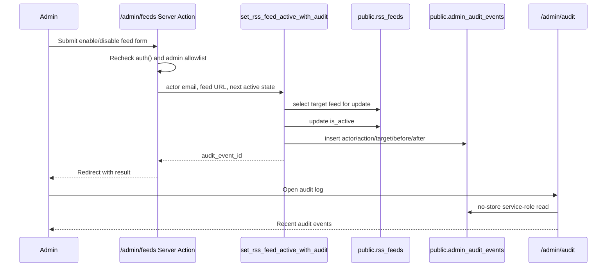

# NutsNews Admin Audit Log

Issue: https://github.com/ramideltoro/nutsnews/issues/112

This runbook documents the protected admin audit log for sensitive operational
changes in the NutsNews web admin.

## Simple Summary

When an admin changes something sensitive, NutsNews writes down who did it, what
changed, what it changed from, what it changed to, and when it happened. The log
is only visible inside the protected admin area.

## Intermediate Summary

Issue #112 adds a protected audit trail for admin mutations. The first audited
action is RSS feed enable/disable from `/admin/feeds`. The mutation now rechecks
the signed-in admin inside the Server Action, calls a database RPC that updates
`public.rss_feeds.is_active`, and appends the matching row to
`public.admin_audit_events` in the same database transaction. Admins can review
recent events at `/admin/audit`.

Audit rows include:

| Field | Purpose |
| --- | --- |
| `actor_email` | Lowercased admin email from the server-side session |
| `action` | Stable action name such as `rss_feed.disable` |
| `target_type` / `target_id` / `target_label` | Machine and human target identity |
| `before_values` | JSON object for the relevant pre-change fields |
| `after_values` | JSON object for the relevant post-change fields |
| `created_at` | Server-side timestamp |

The admin audit page reads at most 50 recent rows with `cache: "no-store"` and
is under the existing protected `/admin` route boundary.

## Expert Summary

The app migration `20260716180000_create_admin_audit_events.sql` creates
`public.admin_audit_events`, enables RLS, revokes table access from `anon` and
`authenticated`, and grants `select, insert` only to `service_role`. It also
creates `public.set_rss_feed_active_with_audit(actor_email, feed_url,
is_active)`, a `security definer` RPC granted only to `service_role`. The RPC
selects the target feed `for update`, updates `rss_feeds.is_active`, inserts the
audit event, and returns the audit event ID to the server action.

The Next.js admin path stays server-side:

- `web/app/admin/(protected)/feeds/page.tsx` verifies `auth()` and
  `isAllowedAdminEmail()` inside the Server Action before calling the mutation.
- `web/lib/adminFeedManagement.ts` validates the feed URL, calls the audit RPC
  with `cache: "no-store"`, and returns the audit event ID.
- `web/lib/adminAuditLog.ts` reads recent audit rows with service-role
  credentials and `cache: "no-store"`.
- `web/app/admin/(protected)/audit/page.tsx` renders the protected recent-event
  view.



## Retention

The visible admin page defaults to an operating window of 180 days. The display
window can be configured with:

```bash
NUTSNEWS_ADMIN_AUDIT_RETENTION_DAYS=180
```

The value is bounded between 30 and 3650 days. This is a display and operating
policy value, not an automatic delete job. Rows remain in PostgreSQL until a
reviewed retention cleanup is added and run through the normal migration or
maintenance workflow.

Do not delete audit rows during an active incident, security review, recovery
test, or release investigation. If cleanup is added later, it must preserve any
events linked from open incidents, PRs, or post-incident reviews.

## Privacy

Audit rows contain admin email addresses and operational before/after JSON. They
must be treated as private operations data:

- Do not expose audit rows to anonymous or authenticated browser clients.
- Do not copy raw audit JSON into public issues, PRs, screenshots, or support
  messages.
- Do not store secrets, tokens, service-role keys, database URLs, OAuth material,
  SMTP values, or raw provider credentials in `before_values`, `after_values`, or
  `metadata`.
- Store only fields required to explain the operational change.

The first audited feed mutation stores feed ID, source, URL, active state, and
positive-source state. That is enough to reconstruct the source-control change
without adding unrelated feed health details or secrets.

## Operational Checks

Use `/admin/audit` after a sensitive admin change. The newest row should show
the actor, action, target, timestamp, and before/after values.

For database-level validation in a disposable environment:

```sql
select relrowsecurity
from pg_class
where oid = 'public.admin_audit_events'::regclass;

select has_table_privilege('anon', 'public.admin_audit_events', 'select'),
       has_table_privilege('authenticated', 'public.admin_audit_events', 'select'),
       has_table_privilege('service_role', 'public.admin_audit_events', 'select'),
       has_table_privilege('service_role', 'public.admin_audit_events', 'insert');
```

Expected: RLS is enabled, `anon` and `authenticated` cannot select, and
`service_role` can select and insert.

## Risks And Mitigations

| Risk | Mitigation |
| --- | --- |
| A sensitive action changes data without an audit row | Feed toggles use a database RPC that updates the feed and writes the audit row in one transaction. Add future sensitive actions through the same pattern. |
| Audit data is cached | The admin audit loader uses `cache: "no-store"` and the route lives under the no-store `/admin` boundary. |
| Audit data leaks private operational context | RLS blocks browser roles; the page is protected by the admin allowlist; docs forbid secrets and public raw audit dumps. |
| A future action stores excessive JSON | Keep before/after values to the fields needed to explain the change. Add regression coverage for each new sensitive action. |
| Retention cleanup erases needed evidence | No automatic cleanup exists yet. Future cleanup must preserve events linked to active incidents, PRs, and post-incident reviews. |

## Rollback

Revert the app PR that added migration `20260716180000`, `/admin/audit`,
`web/lib/adminAuditLog.ts`, and the audited feed-toggle path. If the migration
was already applied, use a reviewed follow-up migration to drop the audit RPC and
table only after confirming no incident or review depends on those rows. Then
revert this documentation update.

## Related

- App issue: https://github.com/ramideltoro/nutsnews/issues/112
- Incident response policy: [INCIDENT_RESPONSE_POLICY.md](INCIDENT_RESPONSE_POLICY.md)
- Production readiness dashboard: [PRODUCTION_READINESS_DASHBOARD.md](PRODUCTION_READINESS_DASHBOARD.md)
- Feed health docs: [RSS_SOURCE_QUALITY.md](RSS_SOURCE_QUALITY.md)
