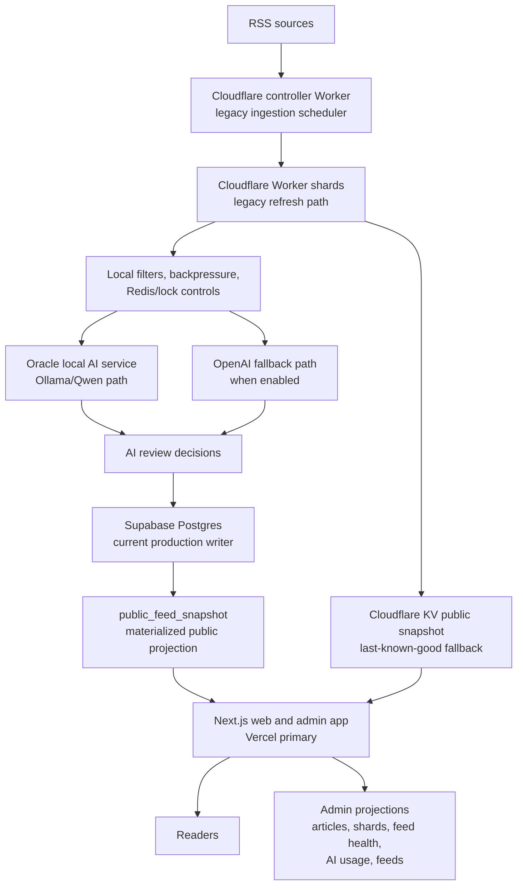
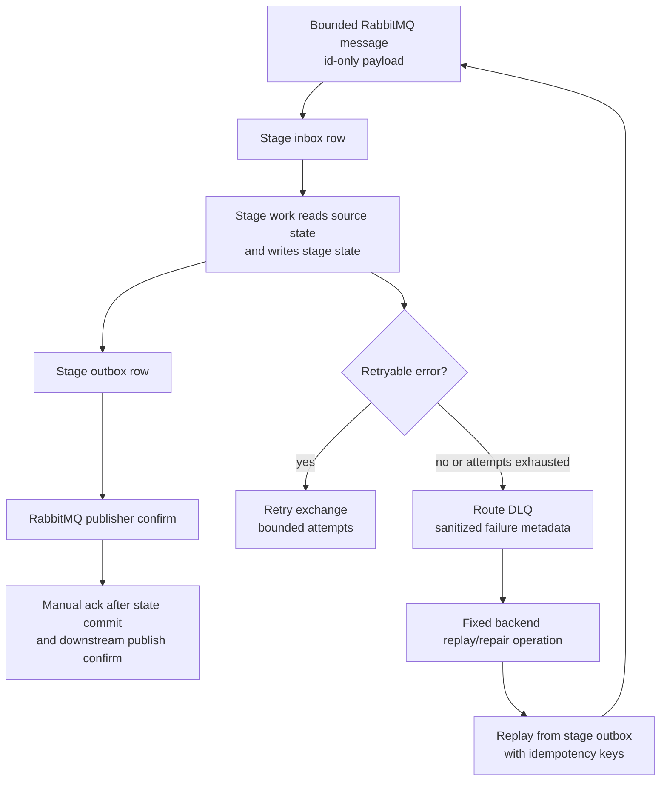
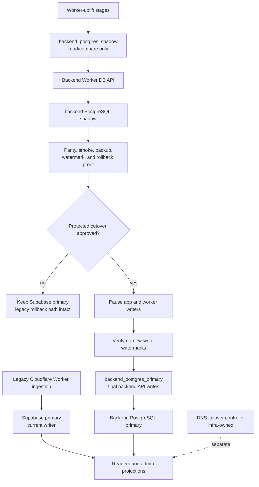
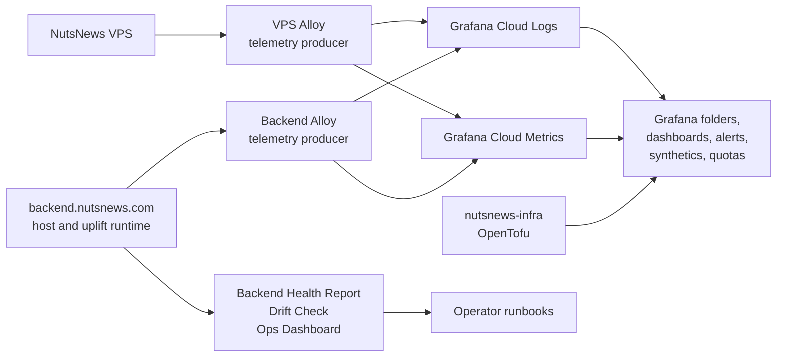

# Architecture

This is the current NutsNews architecture and the approved worker-uplift target
as of 2026-07-23. The uplift is approved for implementation, not production
cutover.

## Source Of Truth

| Area | Source |
| --- | --- |
| Worker-uplift ADR | `ramideltoro/nutsnews-backend/docs/worker-uplift-architecture-adr.json` |
| Operation owner map | [Worker-Uplift Operation Map](NUTSNEWS_WORKER_UPLIFT_OPERATION_MAP.md) |
| Backend database and cutover gates | [Backend PostgreSQL Failover](NUTSNEWS_BACKEND_POSTGRES_FAILOVER.md) |
| Public feed and edge fallback | [Public Feed Snapshot](PUBLIC_FEED_SNAPSHOT.md) |
| Grafana Cloud ownership | [Grafana Cloud Observability](NUTSNEWS_GRAFANA_CLOUD_OBSERVABILITY.md) |
| Legacy controller/shard operation | [Controller and Shards](CONTROLLER_AND_SHARDS.md) |

Do not copy secret values, production payloads, provider IDs, database URLs, or
token fragments into architecture docs. Link to the owning repo, workflow,
runbook, or value-free evidence file instead.

## Current Production Flow

Supabase remains the production write source until a separate protected cutover
is approved and executed. The backend PostgreSQL primary path, Worker DB API,
and app DB API exist for shadow validation and future primary cutover, but the
uplift pipeline is not production yet.

Current responsibilities:

- Cloudflare Worker shards and the controller still run the legacy ingestion
  path until cutover retirement.
- The local AI/Qwen path is still part of the legacy Worker review flow and is
  copied into the approved target as the approval-stage local model path.
- Supabase stores current public articles, review history, feed health, Worker
  runs, AI usage, runtime flags, public snapshot rows, and admin projections.
- Cloudflare KV stores only bounded public-feed fallback payloads.
- `backend.nutsnews.com` hosts the protected backend platform, PostgreSQL
  shadow/primary target, Worker DB API, app DB API, backups, host telemetry, and
  future worker-uplift runtime controls.
- Public apex/www DNS failover is separate from ingestion and belongs to
  `ramideltoro/nutsnews-infra`.

## Approved Target Flow

The target breaks the monolithic Worker refresh into source-controlled stages
connected by RabbitMQ and backend PostgreSQL stage state.

```mermaid
flowchart LR
  scheduler["scheduler\nfeed cadence and shard leases"] --> q1["RabbitMQ\nscheduler_to_fetcher"]
  q1 --> fetcher["fetcher\nRSS/Atom fetch and feed health"]
  fetcher --> q2["fetcher_to_canonicalizer"]
  q2 --> canonicalizer["canonicalizer\nURL normalization and dedupe"]
  canonicalizer --> q3["canonicalizer_to_enrichment"]
  q3 --> enrichment["enrichment\narticle metadata and images"]
  enrichment --> q4["enrichment_to_approval"]
  q4 --> approval["approval\nlocal filters and Qwen review"]
  approval --> q5["approval_to_translation"]
  q5 --> translation["translation\nsummary coverage and quality"]
  translation --> q6["translation_to_persistence"]
  q6 --> persistence["persistence\nidempotent backend API writes"]
  persistence --> q7["persistence_to_publication"]
  q7 --> publication["publication\ntranslation gate and snapshot refresh"]
  publication --> api["Backend Worker DB API\n/api/worker/db/*"]
  api --> pg["Backend PostgreSQL\nfuture primary after cutover"]
  pg --> publicSnapshot["public_feed_snapshot"]
  publicSnapshot --> web["Next.js web/admin"]
```

Stage source repositories are listed in
`ramideltoro/nutsnews-backend/docs/worker-uplift-architecture-adr.json`. The
backend repo owns the host runtime, credentials, protected workflows, database
schemas, broker topology, queue/DLQ operations, smoke, health, reconciliation,
and cutover gates.

## Message And Data Ownership

RabbitMQ is durable transport and backpressure, not the only copy of work.
Backend PostgreSQL stage schemas are authoritative for inbox, outbox, attempts,
watermarks, reconciliation, and cutover proof.

The target model is at-least-once. Every stage must be idempotent by
`message_id` plus natural domain keys. Poison messages go to route DLQs after a
bounded number of attempts. Replay is explicit, source-controlled, and recorded
through backend-owned operations.

Messages must stay bounded. They carry identifiers, route metadata, attempt
counts, schema versions, and hashes. They must not carry article bodies, full
prompts, provider responses, secrets, credentials, bearer tokens, or raw
production payloads.

## Shadow Mode And Cutover

Shadow mode compares the backend path while keeping production writes on
Supabase. Final backend-primary writes are allowed only after protected cutover
gates pass.

Rollback before cutover is explicit: keep or return the app and Worker provider
mode to `supabase_primary`. After backend PostgreSQL accepts authoritative
writes beyond a verified Supabase sync point, rollback is limited to the
documented rollback window; otherwise recovery is forward from backend
PostgreSQL backups, stage outbox, and reconciliation evidence.

DNS failover is not ingestion. It is a separate infra-owned Cloudflare DNS
controller for public apex/www routing and must remain visible in cutover
diagrams as separate from Worker or backend data processing.

## Observability And Operations

Grafana Cloud resources belong to `ramideltoro/nutsnews-infra`. The backend
repo is a telemetry producer and may validate its historical Grafana catalog,
but it must not manage Grafana folders, dashboards, datasources, alert rules,
contact points, Synthetic Monitoring checks, or quota resources.

Backend operations are centralized in `ramideltoro/nutsnews-backend`:

- deploy and runtime bootstrap: `Protected Backend Ansible Apply`;
- restart and fixed recovery: `Backend Recovery`;
- status and health: `Backend Health Report`, `Backend Drift Check`, and the
  read-only Ops Dashboard;
- logs and metrics: backend Alloy with Prometheus/Loki write credentials only;
- queue/DLQ/replay/drain/broker/reconciliation: backend-owned fixed workflows
  as the stage services are implemented;
- backup/restore/cutover: backend PostgreSQL proof, failover, smoke, and
  production cutover workflows.

## Repository Ownership

| Repository | Owns |
| --- | --- |
| `ramideltoro/nutsnews` | Next.js public reader/admin app, Vercel deployment, app DB API client, app provider-mode safety |
| `ramideltoro/nutsnews-backend` | `backend.nutsnews.com`, backend PostgreSQL, Worker/App DB API, RabbitMQ and stage runtime operations, queue/DLQ/replay/drain/broker/reconciliation runbooks, backend credentials, backend telemetry production |
| Stage service repos | Deployable worker-uplift stage code for scheduler, fetcher, canonicalizer, enrichment, approval, translation, persistence, and publication |
| `ramideltoro/nutsnews-infra` | VPS platform, public app promotion to VPS, Grafana Cloud resources, DNS failover controller, protected infrastructure workflows |
| `ramideltoro/nutsnews-worker` | Tracking issues and legacy Cloudflare Worker rollback surface until retirement |
| `ramideltoro/nutsnews-docs` | Explanatory architecture, operations, release, recovery, and cross-repo documentation |

## Current Data Surfaces

| Surface | Current owner | Target owner |
| --- | --- | --- |
| `public.articles` | Supabase primary | Backend PostgreSQL after cutover |
| `public.article_ai_reviews` | Supabase primary | Backend PostgreSQL after cutover |
| `public.article_summaries` | Supabase primary | Backend PostgreSQL after cutover |
| `public.rss_feeds` | Supabase primary | Backend PostgreSQL after cutover |
| `public.worker_runs` | Supabase primary | Backend PostgreSQL after cutover |
| `public.feed_health` | Supabase primary | Backend PostgreSQL after cutover |
| `public.public_feed_snapshot` | Supabase materialized projection | Backend PostgreSQL projection after cutover |
| Cloudflare KV edge snapshot | Legacy Worker fallback surface | Publication-stage output to Worker/public edge contract after cutover |
| Worker-uplift stage schemas | Not production | Backend PostgreSQL stage schemas |
| RabbitMQ queues and DLQs | Not production | Backend host runtime controlled by backend workflows |

## Superseded Language

Older docs that say NutsNews is only a modular serverless/Supabase system are
superseded by this architecture for worker-uplift planning. The legacy
controller, shard, Worker backpressure, Supabase backup, and public snapshot
docs remain valid for current production operation and rollback until cutover
retirement. They are not the target owner map for new worker-uplift deployments.
