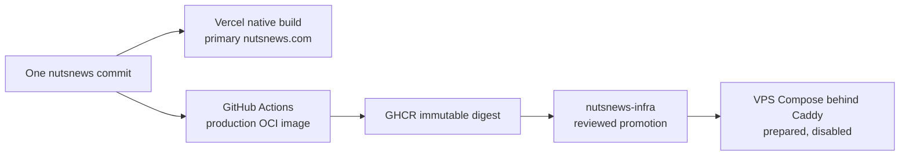

# Architecture

NutsNews uses a modular serverless architecture. Each part of the system has a focused responsibility.

---

## High-Level Flow

```text
RSS Sources
  ↓
Cloudflare Worker Shards
  ↓
Local Filtering
  ↓
AI Review Provider
  ├── OpenAI
  └── Oracle Local AI Service → Ollama/qwen
  ↓
Supabase Postgres
  ↓
Public Feed Snapshot
  ↓
Next.js Website on Vercel
  ↓
Cloudflare CDN
  ↓
Reader
```

The public production site remains on Vercel. Issue
[nutsnews-infra #67](https://github.com/ramideltoro/nutsnews-infra/issues/67)
also prepares a second artifact from the same application commit: GitHub
Actions builds an OCI image in `ramideltoro/nutsnews`, and
`ramideltoro/nutsnews-infra` promotes its immutable digest to the VPS. This is
one codebase with two platform-native artifacts, not two application forks.



See [Dual-Target Web Deployment](NUTSNEWS_DUAL_TARGET_WEB_DEPLOYMENT.md) for
the environment boundary, build identity, staged gate, public opt-in, and
rollback rules.

---

## Operations Flow

```text
Supabase Review Data
Worker Activity
Worker Run Records
AI Usage Metrics
Shard Health Metrics
Feed Health Metrics
Operational Signals
  ↓
Private Admin Portal
  ↓
Admin Dashboards
  ↓
Operator Visibility
```

---

## Observability Flow

```text
Next.js App
Cloudflare Worker Shards
Controller Worker
  ↓
Structured Logs
  ↓
Better Stack Telemetry
  ↓
Search by service, level, event, shard, duration, status
```

Application errors are monitored through:

```text
Frontend Errors
Server Errors
Worker Errors
  ↓
Sentry
```

---

## Core Components

### `web`

The public website and admin portal.

Its source remains in `ramideltoro/nutsnews/web`. Vercel builds that directory
directly, while the application repository also owns the production
Dockerfile and GHCR publishing workflow. The infrastructure repository never
copies the web source.

It includes:

* Mobile-first public feed
* Article pages
* SEO metadata
* Dynamic Open Graph images
* CDN-friendly public routes
* Google-protected admin portal
* Admin dashboards
* Sentry integration
* Better Stack web logging

Important routes:

```text
/
/api/articles
/articles/[id]
/admin
/admin/articles
/admin/ai-usage
/admin/local-ai
/admin/shards
/admin/feed-health
/admin/feeds
/admin/login
```

### `worker`

The automated ingestion engine.

It fetches RSS feeds, parses articles, applies local filters, calls the configured AI review provider, stores accepted articles, stores rejected review history, saves Worker run records, saves AI usage, saves feed health, and logs structured activity. The configured provider can be OpenAI or the Oracle-hosted local AI service.

### `local-ai-service`

The optional Oracle-hosted AI endpoint.

It exposes:

```text
GET /health
POST /review
```

The service runs on Node, calls Ollama on localhost, and returns the same JSON review shape as the OpenAI path. The Worker protects the endpoint with `x-nutsnews-ai-key` and records the provider/model for each reviewed article.

### `controller`

The orchestration layer.

It triggers Worker shards in a controlled way so every shard does not need to run at once.

### `supabase`

The data layer.

It stores articles, RSS feeds, AI review history, AI usage runs, Worker run records, feed health, admin dashboard data, and the materialized public feed snapshot. Cloudflare KV can also hold a bounded last-known-good public feed snapshot for outage fallback.

### `docs`

The GitHub documentation layer.

The root README stays short. Detailed documentation lives in `docs/`. Operational routines such as deployment, dependency updates, source quality scoring, restore, and troubleshooting are documented here.

---

## Repository Structure

```text
nutsnews/
├── web/
│   ├── app/
│   ├── lib/
│   ├── public/
│   ├── next.config.ts
│   └── package.json
│
├── worker/
│   ├── src/
│   ├── scripts/
│   ├── generated-wrangler/
│   └── package.json
│
├── controller/
│   ├── src/
│   ├── wrangler.jsonc
│   └── package.json
│
├── local-ai-service/
│   ├── server.mjs
│   ├── package.json
│   └── .env.example
│
├── supabase/
│   └── migrations/
│
├── .github/
│   └── dependabot.yml
│
├── docs/
│   ├── README.md
│   ├── PROJECT.md
│   ├── ARCHITECTURE.md
│   ├── OPERATIONS.md
│   ├── ADMIN_ARTICLE_REVIEWS.md
│   ├── PUBLIC_FEED_SNAPSHOT.md
│   ├── DEPENDENCY_UPDATES.md
│   ├── PERFORMANCE_AND_RESILIENCY.md
│   ├── OBSERVABILITY.md
│   └── TROUBLESHOOTING.md
│
├── scripts/
│   ├── dependency_update_routine.sh
│   ├── post_deploy_verify.sh
│   └── validate_cloudflare_cache_hit_rate.sh
├── README.md
└── LICENSE
```


---

## Dependency Maintenance

NutsNews has a repeatable dependency update routine for the web app, Worker shards, and controller Worker.

The routine is implemented in:

```text
scripts/dependency_update_routine.sh
```

The runbook is documented in:

```text
docs/DEPENDENCY_UPDATES.md
```

The process covers:

* `npm outdated --long`
* `npm audit --audit-level=moderate`
* Safe patch/minor updates with `npm update --save`
* Web lint and build validation
* Worker Wrangler config generation
* Worker TypeScript validation
* Dependabot weekly npm checks for `web/`, `worker/`, and `controller/`

Major upgrades are intentionally kept out of the normal routine and should be handled as separate issues.

---

## Data Model Summary

### Admin article review dashboard

Route:

```text
/admin/articles
```

The dashboard reads `public.article_ai_reviews`, joins matching published records from `public.articles` by `original_url`, and sorts reviews by `reviewed_at`. Operators can filter by decision, source, category, and positivity score to investigate accepted and rejected story decisions.


### `public_feed_snapshot`

Materialized Supabase view used by the homepage and `/api/articles` as the first-read optimized public feed source.

It contains only published, image-backed article card fields and a precomputed `snapshot_rank`.

The Worker refreshes it by calling:

```text
public.refresh_public_feed_snapshot()
```

The web app falls back to `public.articles` if the Supabase snapshot is unavailable. If both Supabase read paths fail, `/api/articles` can serve the Cloudflare KV edge snapshot through the Worker fallback endpoint.

### `articles`

Stores the stories shown on the public website.

Important fields:

* `id`
* `source`
* `title`
* `original_url`
* `image_url`
* `published_at`
* `published_on_site_at`
* `ai_summary`
* `category`
* `positivity_score`
* `status`

### `article_ai_reviews`

Stores AI or local-filter decisions for each reviewed article.

This prevents the same story from being reviewed repeatedly.

Important fields:

* `original_url`
* `decision`
* `category`
* `positivity_score`
* `summary`
* `reason`
* `reviewed_at`

### `rss_feeds`

Stores RSS feed configuration.

This allows feeds to be added, disabled, or prioritized without changing core Worker code.

Important fields:

* `source`
* `url`
* `is_positive_source`
* `is_active`

### `ai_usage_runs`

Stores run-level OpenAI usage metrics.

Powers `/admin/ai-usage`.

### `worker_runs`

Stores successful and failed Worker executions.

Powers `/admin/shards`.

### `feed_health`

Stores source-level health and operational metrics such as fetch success, failures, image coverage, accepted output, and rejected output.

Powers `/admin/feed-health` and contributes to `/admin/feeds`.

### `feed_quality_scores`

Computed Supabase view that ranks RSS feeds from 0 to 100 using success rate, thumbnail rate, accepted rate, failure rate, and duplicate/already-seen rate.

Powers source quality badges and rankings in `/admin/feeds`.

---

## Tech Stack

### Frontend

| Technology | Purpose |
| --- | --- |
| Next.js | Public website, article pages, admin portal, server-rendered dashboards |
| React | UI rendering |
| TypeScript | Safer application code |
| Tailwind CSS | Mobile-first styling |
| Vercel | Primary frontend/admin hosting and native Git deployment |
| GHCR | Immutable OCI images built from the same reviewed web commit |
| VPS + Caddy | Prepared secondary runtime; promotion and routing remain GitOps-controlled and disabled until approved |

### Automation

| Technology | Purpose |
| --- | --- |
| Cloudflare Workers | RSS ingestion and automation |
| Worker shards | Split RSS processing across many workers |
| Controller Worker | Coordinates shard execution |
| Wrangler | Worker deployment and configuration |
| Cloudflare Secrets Store | Shared Worker secrets |

### Data

| Technology | Purpose |
| --- | --- |
| Supabase | Hosted Postgres database |
| Postgres | Article, feed, review, and operational data |
| Supabase REST API | Worker-to-database communication |

### Observability

| Technology | Purpose |
| --- | --- |
| Better Stack Uptime | External uptime monitoring |
| Better Stack Logs | Centralized structured logs |
| Sentry | Application error monitoring |
| Admin dashboards | Internal platform health visibility |
