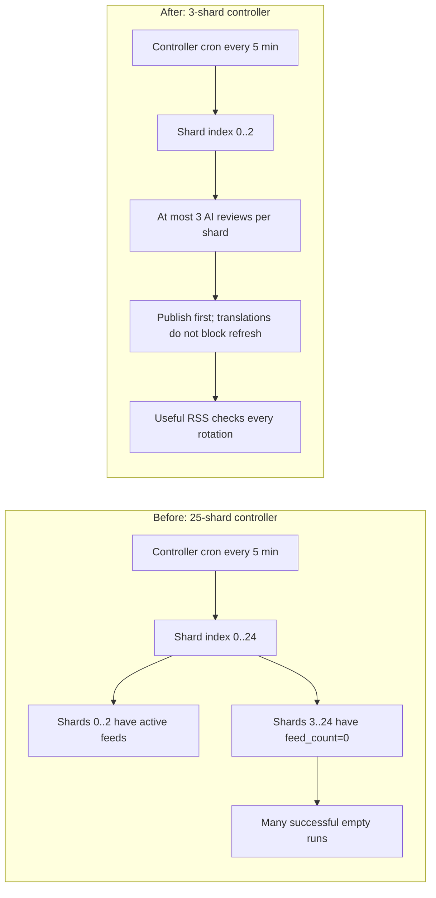

# Controller and Shard Operations

This document explains how to operate and test the NutsNews controller Worker and individual Worker shards.

Created for GitHub issue #37.

Issue #37 asks for documentation covering:

* Controller manual trigger
* Specific shard trigger
* Wrangler tail for shard debugging
* Expected response fields

Acceptance criteria:

```text
Operator can test any shard without searching old chat.
```

---

## Quick Reference

| Task | Command |
| --- | --- |
| Run controller automatic shard selection | `curl "https://nutsnews-controller.nutsnews.workers.dev/"` |
| Run a specific shard through controller | `curl "https://nutsnews-controller.nutsnews.workers.dev/?shard=0"` |
| Run a shard directly | `curl "https://nutsnews-worker-0.nutsnews.workers.dev/?limit=1"` |
| Tail controller logs | `cd controller && npx wrangler tail nutsnews-controller` |
| Tail shard logs by Worker name | `cd worker && npx wrangler tail nutsnews-worker-0` |
| Tail shard logs by generated config | `cd worker && npx wrangler tail --config generated-wrangler/wrangler.shard0.jsonc` |
| Regenerate shard configs | `cd worker && npm run generate:wrangler` |
| Deploy one shard | `cd worker && npx wrangler deploy --config generated-wrangler/wrangler.shard0.jsonc` |
| Deploy controller | `cd controller && npx wrangler deploy` |

---

## Controller Purpose

The controller Worker coordinates shard execution.

Instead of every Worker shard running at once, the controller chooses one shard per run. This spreads RSS processing over time and reduces the chance that all shards hit external services at the same moment.

Controller URL:

```text
https://nutsnews-controller.nutsnews.workers.dev/
```

## Current Production Shard Topology

Updated: 2026-07-17.

### Simple Summary

NutsNews currently has 49 active RSS feeds. The controller should only rotate through shards 0, 1, and 2, because those are the only shards with feeds right now.

### Intermediate Summary

The production controller is configured with `SHARD_COUNT=3`, `SHARD_RUN_INTERVAL_MINUTES=5`, `FEEDS_PER_SHARD=20`, and `MAX_AI_REVIEWS_PER_SHARD=3`. This covers the active feed set without spending most controller runs on empty shards. A previous 25-shard controller configuration caused frequent successful-but-empty Worker runs against shards 3 through 24, which made ingestion look quiet and delayed useful feed checks.

### Expert Summary

On 2026-07-17, production Supabase showed 49 active `rss_feeds` rows out of 763 total rows. With `FEEDS_PER_SHARD=20`, only shards 0, 1, and 2 can return feed rows. Worker telemetry showed repeated `run_source=manual` rows for shards 3 through 24 with `feed_count=0`, `fetched_count=0`, and `accepted_count=0`. The controller was redeployed with `SHARD_COUNT=3`; `https://nutsnews-controller.nutsnews.workers.dev/?shard=3` now fails fast with `Invalid shard. Use a number from 0 to 2.` A manual shard-2 controller run returned `shardCount=3`, `feedCount=9`, `fetchedCount=304`, and refreshed the public feed snapshot at `2026-07-17T03:11:09Z`.

The same incident showed that shard 0 could spend almost two minutes in Local AI and translation fallback work. Long runs accepted articles but sometimes failed to save `worker_runs`, `ai_usage_runs`, review rows, or `public_feed_snapshot` before the invocation ran out of useful request budget. Production Worker shards now use bounded external fetches and deploy with `SUMMARY_TRANSLATION_LIMIT=0`, `HOLD_ARTICLES_FOR_TRANSLATIONS=false`, `LOCAL_AI_TIMEOUT_MS=15000`, `OPENAI_TIMEOUT_MS=30000`, `RSS_FEED_FETCH_TIMEOUT_MS=15000`, and `ARTICLE_PAGE_FETCH_TIMEOUT_MS=10000`. Translations should be backfilled separately instead of blocking the publishing path.



Operational notes:

* Increase `SHARD_COUNT` only when active feeds exceed the current capacity. At 20 feeds per shard, 1-20 active feeds need 1 shard, 21-40 need 2 shards, and 41-60 need 3 shards.
* If feed management intentionally re-enables many sources, update the controller `SHARD_COUNT` and Worker generated configs in the same deployment.
* Keep `SUMMARY_TRANSLATION_LIMIT=0` and `HOLD_ARTICLES_FOR_TRANSLATIONS=false` until translation backlog processing has separate budget controls. Publishing freshness is the priority for the scheduled refresh path.
* Keep `LOCAL_AI_TIMEOUT_MS` long enough for the home-server model to answer during normal load, but short enough that OpenAI fallback can run before the Worker reaches subrequest or wall-time limits. The current production default is 15000 ms.
* Do not treat `success=true` alone as ingestion health. Check `feed_count`, `fetched_count`, `eligible_for_ai_count`, and `accepted_count`.
* Rollback for shard count is to redeploy the previous controller config, but only do this if active feed count again requires more than 3 shards or if a new controller bug appears. Rollback for translation hold is to restore `SUMMARY_TRANSLATION_LIMIT=5` and `HOLD_ARTICLES_FOR_TRANSLATIONS=true` only after proving shard refreshes still save reviews, usage, worker telemetry, and snapshots.

---

## Manual Controller Trigger

Run the controller with automatic shard selection:

```bash
curl "https://nutsnews-controller.nutsnews.workers.dev/"
```

The controller decides which shard to call based on time, shard count, and the configured shard interval.

Expected top-level response:

```json
{
  "message": "NutsNews controller run complete",
  "controllerMode": "automatic",
  "shardCount": 3,
  "shardRunIntervalMinutes": 5,
  "maxAiReviewsPerShard": 3,
  "requestId": "<uuid>",
  "result": {
    "shardIndex": 0,
    "shardUrl": "https://nutsnews-worker-0.nutsnews.workers.dev/?limit=3",
    "ok": true,
    "status": 200,
    "response": {
      "message": "NutsNews refresh complete"
    }
  }
}
```

---

## Trigger a Specific Shard Through the Controller

Use the `shard` query parameter:

```bash
curl "https://nutsnews-controller.nutsnews.workers.dev/?shard=0"
```

Examples:

```bash
curl "https://nutsnews-controller.nutsnews.workers.dev/?shard=1"
curl "https://nutsnews-controller.nutsnews.workers.dev/?shard=2"
```

The controller validates the shard index. With the current 3-shard production controller, valid values are:

```text
0 through 2
```

Invalid example:

```bash
curl "https://nutsnews-controller.nutsnews.workers.dev/?shard=3"
```

Expected failure response:

```json
{
  "message": "NutsNews controller run failed",
  "requestId": "<uuid>",
  "error": {
    "name": "Error",
    "message": "Invalid shard. Use a number from 0 to 2."
  }
}
```

---

## Trigger a Worker Shard Directly

Use the shard Worker URL directly:

```bash
curl "https://nutsnews-worker-0.nutsnews.workers.dev/?limit=1"
```

Examples:

```bash
curl "https://nutsnews-worker-1.nutsnews.workers.dev/?limit=1"
curl "https://nutsnews-worker-2.nutsnews.workers.dev/?limit=1"
```

Use a small limit during manual testing to control OpenAI usage:

```bash
curl "https://nutsnews-worker-0.nutsnews.workers.dev/?limit=1"
```

Use the normal shard limit when testing production-like behavior:

```bash
curl "https://nutsnews-worker-0.nutsnews.workers.dev/?limit=3"
```

---

## Test Every Shard Directly

Run this from your terminal to test all current controller shards with a low AI review limit:

```bash
for shard in $(seq 0 2); do
  echo "== shard $shard =="
  curl -s "https://nutsnews-worker-${shard}.nutsnews.workers.dev/?limit=1" \
    | python3 -m json.tool
  echo
  sleep 2
done
```

If `python3 -m json.tool` is too noisy, use a compact check:

```bash
for shard in $(seq 0 2); do
  echo "== shard $shard =="
  curl -s "https://nutsnews-worker-${shard}.nutsnews.workers.dev/?limit=1" \
    | grep -E 'message|shardIndex|feedCount|acceptedCount|workerRunSaveOk' || true
  echo
  sleep 2
done
```

---

## Test Every Shard Through the Controller

This calls each shard through the controller instead of calling the shard URLs directly:

```bash
for shard in $(seq 0 2); do
  echo "== controller shard $shard =="
  curl -s "https://nutsnews-controller.nutsnews.workers.dev/?shard=${shard}" \
    | python3 -m json.tool
  echo
  sleep 2
done
```

Use this when validating controller routing, controller logs, and shard URL construction.

---

## Controller Response Fields

The controller returns these fields:

| Field | Meaning |
| --- | --- |
| `message` | Controller status message |
| `controllerMode` | `automatic` or `manual` |
| `requestedMode` | `refresh` or `translate-backlog` |
| `translationBacklogEnabled` | Whether the controller also calls the translation backlog mode |
| `shardCount` | Total configured shard count |
| `shardRunIntervalMinutes` | Rotation interval used for automatic shard selection |
| `maxAiReviewsPerShard` | AI review limit sent to the shard |
| `requestId` | UUID used to correlate logs |
| `result.shardIndex` | Shard selected or manually requested |
| `result.shardUrl` | Worker URL called by the controller |
| `result.ok` | Whether the shard HTTP response was OK |
| `result.status` | HTTP status returned by the shard call |
| `result.response` | Parsed shard response body |
| `translationBacklogResult` | Parsed result from the translation backlog call when enabled |

---

## Worker Shard Response Fields

A successful shard response should include:

| Field | Meaning |
| --- | --- |
| `message` | Worker run status message |
| `mode` | `manual` for direct manual requests |
| `requestId` | UUID used to correlate logs |
| `shardIndex` | Which shard ran |
| `feedsPerShard` | How many feeds this shard is configured to load |
| `maxAiReviews` | Maximum AI reviews allowed in this run |
| `feedCount` | Number of feeds loaded for the shard |
| `feedFetchSuccessCount` | Number of feeds fetched successfully |
| `feedFetchFailureCount` | Number of feeds that failed |
| `failedFeeds` | Details for failed feeds |
| `fetchedCount` | Raw articles fetched from feeds |
| `candidateCount` | Candidate articles after parsing |
| `alreadyReviewedCount` | Previously reviewed URLs skipped |
| `unreviewedCount` | Articles not yet reviewed |
| `imageHydrationLookupCount` | Article pages checked for images |
| `imageHydrationFoundCount` | Images recovered from article pages |
| `noThumbnailRejectedCount` | Articles rejected because no usable thumbnail exists |
| `locallyRejectedCount` | Articles rejected before AI by local filters |
| `eligibleForAiCount` | Articles eligible for OpenAI review |
| `aiReviewedCount` | Articles reviewed by OpenAI |
| `acceptedCount` | Accepted articles saved for the public site |
| `rejectedCount` | Rejected articles |
| `reviewSaveOk` | AI review save success flag |
| `articleSaveOk` | Accepted article save success flag |
| `feedHealthSaveOk` | Feed health save success flag |
| `aiUsageSaveOk` | AI usage save success flag |
| `workerRunSaveOk` | Worker run save success flag |
| `openAiModel` | OpenAI model used |
| `openAiCallCount` | OpenAI calls made |
| `openAiPromptTokens` | Prompt tokens used |
| `openAiCompletionTokens` | Completion tokens used |
| `openAiTotalTokens` | Total tokens used |
| `estimatedOpenAiCostUsd` | Estimated OpenAI cost for the run |
| `costProtectionLimitReached` | Whether cost protection stopped more AI reviews |
| `spikeWarningTriggered` | Whether spike warning thresholds were reached |
| `durationMs` | Worker run duration |

---

## What a Healthy Controller Run Looks Like

A healthy controller run usually has:

```text
message = NutsNews controller run complete
ok = true
status = 200
response.message = NutsNews refresh complete
```

Healthy shard response flags usually show:

```text
reviewSaveOk = true
articleSaveOk = true
feedHealthSaveOk = true
aiUsageSaveOk = true
workerRunSaveOk = true
```

It is normal for `acceptedCount` to be `0` if there were no new matching stories in that run.

It is normal for `feedFetchFailureCount` to be greater than `0` when one publisher feed fails but the overall shard still completes.

---

## Wrangler Tail for Controller Debugging

Tail controller logs:

```bash
cd controller
npx wrangler tail nutsnews-controller
```

Useful events to search for:

```text
controller.request_started
controller.shard.call_started
controller.shard.call_completed
controller.shard.call_failed_status
controller.shard.call_failed_exception
controller.request_completed
controller.request_failed
controller.scheduled_started
controller.scheduled_completed
```

---

## Wrangler Tail for Shard Debugging

Tail by Worker name:

```bash
cd worker
npx wrangler tail nutsnews-worker-0
```

Tail by generated Wrangler config:

```bash
cd worker
npx wrangler tail --config generated-wrangler/wrangler.shard0.jsonc
```

Useful Worker events to search for:

```text
worker.request.started
worker.request.completed
worker.request.failed
worker.scheduled.started
worker.scheduled.completed
worker.rss.fetch_failed_status
worker.refresh.completed
better_stack.delivery_failed
```

---

## Better Stack Searches

Controller logs:

```text
service:nutsnews-controller
```

Shard logs:

```text
service:nutsnews-worker shardIndex:0
```

Failed controller calls:

```text
service:nutsnews-controller level:warn
service:nutsnews-controller level:error
```

Failed Worker runs:

```text
service:nutsnews-worker level:error
```

---

## Supabase Checks After Manual Runs

Check latest Worker run rows:

```sql
select
  run_started_at,
  shard_index,
  success,
  error_name,
  error_message,
  feed_count,
  fetched_count,
  candidate_count,
  accepted_count,
  rejected_count,
  review_save_ok,
  article_save_ok,
  feed_health_save_ok,
  ai_usage_save_ok,
  duration_ms
from public.worker_runs
order by run_started_at desc
limit 25;
```

Check latest AI usage rows:

```sql
select
  run_started_at,
  shard_index,
  openai_call_count,
  openai_total_tokens,
  estimated_openai_cost_usd,
  openai_accepted_count,
  openai_rejected_count,
  cost_protection_limit_reached,
  spike_warning_triggered
from public.ai_usage_runs
order by run_started_at desc
limit 25;
```

Check feed health updates:

```sql
select
  source,
  feed_url,
  last_checked_at,
  last_success_at,
  last_failure_at,
  last_status,
  consecutive_failure_count,
  total_fetch_count,
  total_success_count,
  total_failure_count,
  total_article_count,
  total_image_count,
  total_accepted_count
from public.feed_health
order by last_checked_at desc nulls last
limit 25;
```

---

## Common Failure Patterns

### Controller returns `ok: false`

Check:

* Did the target shard deploy successfully?
* Does the shard URL match the deployed Worker name?
* Is `SHARD_WORKER_PREFIX` correct?
* Is `SHARD_WORKER_SUBDOMAIN` correct?
* Does the shard throw Worker 1101?
* Does the shard have required secrets?

### Controller returns status `0`

This usually means the controller failed to fetch the shard URL.

Check:

* Worker route exists
* Worker name is correct
* Cloudflare deployment finished
* Shard URL is reachable directly with curl

### Shard returns `workerRunSaveOk: false`

Check Supabase service role key and `worker_runs` table migrations.

### Shard returns many `failedFeeds`

Check feed health dashboard and consider disabling weak feeds.

### Shard returns many `noThumbnailRejectedCount`

Check image coverage and source quality in `/admin/feed-health`.

---

## Safe Manual Testing Rules

Use low limits when testing manually:

```bash
curl "https://nutsnews-worker-0.nutsnews.workers.dev/?limit=1"
```

Avoid repeatedly running all shards with high limits because that can increase OpenAI usage.

Use Better Stack and Supabase after a run to confirm what happened.

---

## Issue #37 Acceptance Check

An operator should be able to test any shard with these commands:

```bash
curl "https://nutsnews-controller.nutsnews.workers.dev/?shard=0"
curl "https://nutsnews-worker-0.nutsnews.workers.dev/?limit=1"
cd worker && npx wrangler tail --config generated-wrangler/wrangler.shard0.jsonc
```

Replace `0` with any valid shard number from `0` through `24`.
