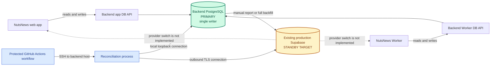
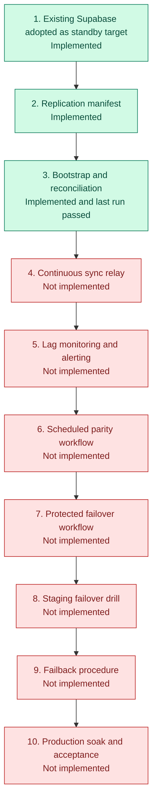
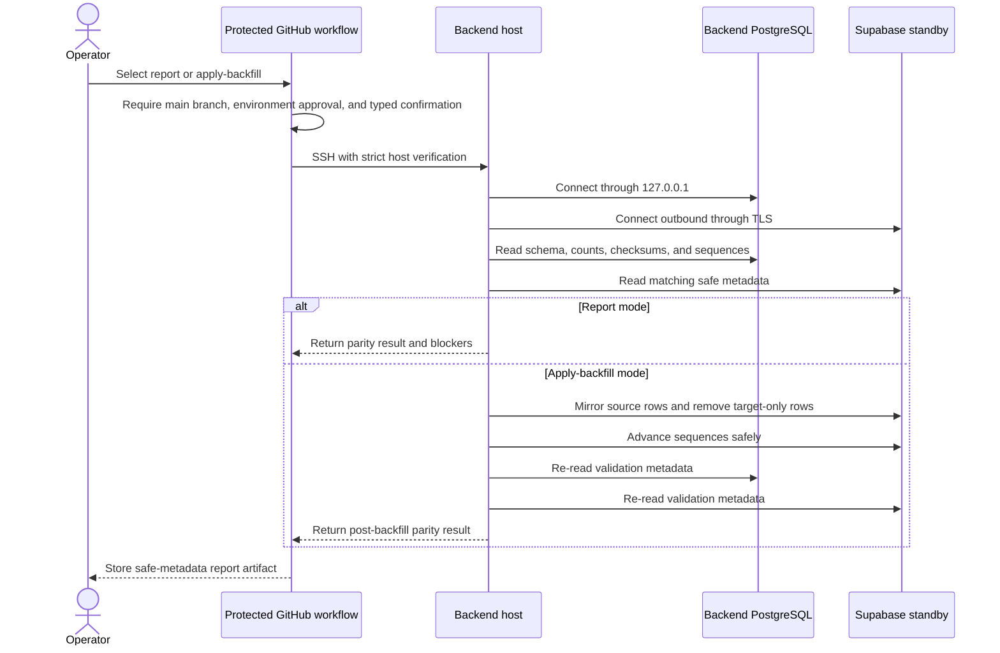
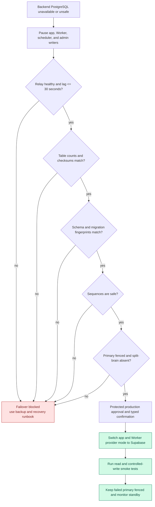
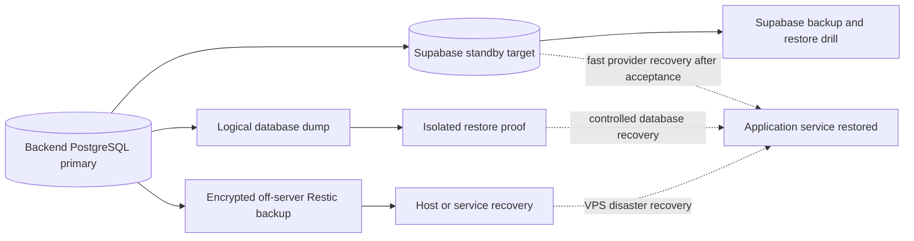

# NutsNews Database Resiliency

Last verified: 2026-07-26

## Executive Summary

NutsNews uses a single-writer database design:

- **Primary:** PostgreSQL on `backend.nutsnews.com` is the production read/write database.
- **Standby target:** the existing production Supabase PostgreSQL database is retained as the protected backup database.
- **Application path:** the web app and Worker use backend compatibility APIs; PostgreSQL remains private on the backend host.
- **Current synchronization:** a protected, operator-triggered reconciliation workflow can compare and mirror backend PostgreSQL into Supabase.
- **Current failover status:** **not yet operational**. Continuous synchronization, lag alerting, protected promotion, staging drills, failback, and the production acceptance soak are still open work.

The architecture deliberately avoids active-active writes. Only one database may be authoritative at a time.

## Current State At A Glance



Solid application arrows are active production paths. The dotted provider-switch arrows are not implemented.

Production currently reports `databaseProviderMode=backend_postgres_primary`, and normal writes are not paused. PostgreSQL and its administration interface are bound to loopback on the backend host; public database access is not part of the design.

## What Is Implemented



This means Supabase has been prepared and reconciled, but it is not yet a continuously current, monitored, promotable hot standby.

## Primary Database

Backend PostgreSQL is the only normal production writer and source of truth.

The web app and Worker do not connect to the database port directly. They use separate allow-listed compatibility API routes:

```text
https://backend.nutsnews.com/api/app/db/*
https://backend.nutsnews.com/api/worker/db/*
```

The backend API owns database credentials, operation allow-lists, provider-mode checks, and write guardrails. PostgreSQL listens on `127.0.0.1:5432`, which limits the database network boundary to the backend host and approved SSH-based operations.

## Standby Database

The standby target is the existing production Supabase project. It is not a new project and is not an active second writer.

Standby database credentials are restricted to protected GitHub environments and recovery workflows. Normal app and Worker workflows must not receive the standby write credentials before an approved failover.

The source-controlled standby manifest defines:

| Control | Current contract |
| --- | --- |
| Replication direction | Backend PostgreSQL to existing production Supabase |
| Replicated objects | 15 `public` base tables |
| Excluded row-copy objects | 7 views or materialized views |
| Sequence-backed tables | 6 |
| Table identity | Primary key or explicit replica identity required |
| Schema guard | Schema and migration-contract fingerprints must match |
| Promotion lag gate | At most 30 seconds |
| Write policy | One authoritative writer; no active-active writes |

Views and materialized views are not copied as rows. They are validated through schema and derived-query parity.

## How Data Synchronization Works Today

Synchronization is currently a **manual protected reconciliation**, not a continuous replication stream.



The workflow supports two modes:

| Mode | Behavior |
| --- | --- |
| `report` | Compares schema fingerprints, migration contracts, table row counts, row checksums, and sequence safety without changing either database. |
| `apply-backfill` | Treats backend PostgreSQL as authoritative, mirrors the 15 tables into Supabase, removes target-only rows, advances the 6 sequences, and reruns the same validation. |

The final protected reconciliation for the bootstrap step passed on 2026-07-26 with no required failures. That proves parity at the time of that run; it does not provide an ongoing lag guarantee.

Reports contain safe metadata only. Database URLs, passwords, tokens, service-role keys, PostgreSQL error text, and raw rows are excluded.

## Failover Safety Model

The intended failover is protected and manual. Automatic detection may raise an incident, but promotion must fail closed until every safety gate passes.



Today this is the required design, not an executable end-to-end production procedure. The sync relay, lag signal, provider-switch workflow, and drill evidence must exist before Supabase can be promoted safely.

## Split-Brain Prevention

Split-brain would occur if backend PostgreSQL and Supabase both accepted independent production writes.

The design prevents this by requiring:

1. App, Worker, scheduler, and admin writers to pause before promotion.
2. A final lag and parity check after the pause.
3. The failed or old primary to remain fenced.
4. A single provider-mode switch for the app and Worker.
5. No automatic bidirectional replication.
6. Forward recovery before the old primary can be reused.

After a failover, Supabase becomes authoritative. Backend PostgreSQL must not resume as primary until it has been rebuilt or reconciled from Supabase and the same parity, sequence, writer-pause, and split-brain gates pass again.

## Backup And Restore Layers

Standby failover and backups solve different problems and are both required.



- The standby is intended to reduce service recovery time after primary failure.
- Logical dumps and Restic protect against host loss, corruption, and operator error.
- Isolated restore proofs show that backup artifacts can be restored.
- Supabase backup and disposable restore drills provide an additional recovery path.

Backups do not make the standby current, and a synchronized standby does not replace point-in-time recovery.

## Recovery Objectives

| Objective | Current position |
| --- | --- |
| Standby RPO | Not guaranteed while synchronization is manual. Data age is bounded only by the last successful reconciliation or usable backup. |
| Standby promotion RTO | Not established because the end-to-end failover workflow and drill are not complete. |
| Controlled restore RTO | Existing runbooks use a 4-hour target after restore drills pass. |
| Target sync lag | 30 seconds or less before failover may be approved. |
| Target future backup RPO | 15 minutes after WAL/PITR or reviewed continuous replication is implemented and tested. |

## Observability

Existing backend PostgreSQL visibility includes:

- PostgreSQL readiness status on the backend host;
- backend health-report checks;
- loopback operations dashboard data;
- Grafana metrics for PostgreSQL restore and replication readiness;
- backup freshness, verification, and restore-proof status.

The Supabase standby still needs dedicated relay signals for:

- relay service state;
- last successfully applied change;
- lag in seconds;
- failed table count;
- last safe error code;
- failover-ready status.

Missing relay health or lag above 30 seconds must block promotion and raise a critical alert.

## Opportunities To Improve

| Priority | Opportunity | Why it matters |
| --- | --- | --- |
| P0 | Implement the private one-way backend-to-Supabase sync relay | Removes the current manual data-age gap and supports inserts, updates, and deletes without exposing backend PostgreSQL publicly. |
| P0 | Add relay health, 30-second lag enforcement, and alerting | Makes standby freshness measurable and prevents promotion of a stale database. |
| P0 | Add scheduled parity and reconciliation | Detects silent drift in rows, schema, migration contracts, and sequences before an incident. |
| P0 | Build the protected manual failover workflow | Turns the documented gates into a repeatable, audited, fail-closed operation. |
| P0 | Run a staging failover drill and a 24-hour production soak | Proves provider switching, writer fencing, smoke tests, and monitoring under realistic conditions. |
| P1 | Complete the forward-recovery and failback runbook | Prevents the recovered backend database from rejoining with stale or conflicting data. |
| P1 | Add WAL archiving or managed PITR with immutable off-site retention | Reduces data loss from corruption or accidental deletion that has already reached the standby. |
| P1 | Rehearse restores on a schedule and record measured RPO/RTO | Replaces target values with evidence and catches unusable backups early. |
| P1 | Reduce the primary host failure domain | A second database node, managed PostgreSQL HA, or a tested replacement-host workflow would reduce dependence on one backend VPS. |
| P2 | Generate this status page from issue/workflow evidence | Keeps “implemented” and “planned” labels from drifting as the failover project advances. |

Automatic promotion should be considered only after the manual workflow, alerts, drills, fencing, and failback process have a strong operating history. Until then, protected manual promotion is the safer choice.

## Related Documentation And Tracking

- [Detailed backend PostgreSQL and Supabase standby runbook](https://github.com/ramideltoro/nutsnews-docs/blob/main/NUTSNEWS_BACKEND_POSTGRES_FAILOVER.md)
- [Backend backup and restore baseline](https://github.com/ramideltoro/nutsnews-docs/blob/main/NUTSNEWS_BACKEND_BACKUP_RESTORE.md)
- [Backend monitoring](https://github.com/ramideltoro/nutsnews-docs/blob/main/NUTSNEWS_BACKEND_MONITORING.md)
- [Supabase standby manifest](https://github.com/ramideltoro/nutsnews/blob/main/supabase/standby_manifest.json)
- [Protected reconciliation workflow](https://github.com/ramideltoro/nutsnews-backend/blob/main/.github/workflows/backend-supabase-standby-reconciliation.yml)
- [Database standby and failover tracking](https://github.com/ramideltoro/nutsnews/issues/223)
