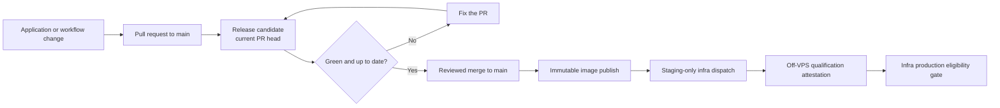

# Deployment Checklist

This checklist explains how to safely deploy NutsNews across the web app, Worker shards, controller Worker, Cloudflare cache, and post-deploy verification.

Created for GitHub issue #29.

Issue #29 asks for one clear deployment checklist covering:

* Web deployment checklist
* Worker shard deployment checklist
* Controller deployment checklist
* Cloudflare cache purge checklist
* Post-deploy verification commands

Acceptance criteria:

```text
README or docs include one clear deployment checklist.
```

---


## Cloudflare production cache purge

Normal production traffic is VPS-primary through Cloudflare, with Vercel kept
as the secondary production target. Production releases do not automatically
purge the Cloudflare zone. Use the guarded manual purge workflow only when a
release changes public cache behavior or stale edge content is observed.

Before relying on the automation, confirm these GitHub Actions secrets exist:

```text
CLOUDFLARE_API_TOKEN
CLOUDFLARE_ZONE_ID
```

Manual purge workflow:

```text
.github/workflows/cloudflare-production-cache-purge.yml
confirmation=purge-production-cache
dry_run=false
```

After purge, verify `https://www.nutsnews.com` and rerun
`Cloudflare Cache Observability` against the same public URL.

## Deployment Principles

Use this deployment flow for normal production releases:

```text
1. Pull latest main
2. Check local status
3. Run dependency routine when dependency/package files changed
4. Build the web app
5. Generate Worker shard configs
6. Merge the reviewed app PR and let main publish the immutable GHCR image
7. Deploy Worker shards when Worker code/config changed
8. Deploy controller when controller code/config changed
9. Let infra staging, qualification, GitOps promotion, protected VPS apply, and Vercel secondary production complete
10. Purge Cloudflare cache only when public web/cache behavior changed or stale edge content is observed
11. Run post-deploy verification
12. Check Better Stack, Sentry, the failover controller, and cache observability
```

Keep deployments small when possible. A documentation-only change does not need Worker or controller redeploys.

---

## Main Release Boundary

### Simple Summary

Before NutsNews can make a production image, its change must go through a pull
request and pass one clear green-light check named `Release candidate`. Nobody
should send a change straight to `main`.

### Intermediate Summary

This policy was delivered in two deliberate stages under
[nutsnews #173](https://github.com/ramideltoro/nutsnews/issues/173): the
always-running `Release candidate` check was merged and proven on a real pull
request, then the live GitHub ruleset was updated to require that exact check
and a pull request for `refs/heads/main`. This affects maintainers who release
the web application: a reviewed, green PR merge is now the only route that may
publish the immutable image and request the staging-first release handoff.

### Expert Summary

`Release candidate` is bound to the current pull-request head and requires a
successful production-image build and smoke test. It also runs the staging
handoff workflow contract, immutable-test guards, Actions linting, and
release-critical web checks without production secrets or elevated
pull-request permissions. The active ruleset pins that exact check to GitHub
Actions, requires the branch to be up to date, retains
deletion/non-fast-forward protection, has no bypass actors, and uses zero
external approvals only to avoid a solo-maintainer self-approval loop.



Live verification confirmed the active `refs/heads/main` ruleset requires a
pull request and the exact `Release candidate` context from GitHub Actions,
with strict up-to-date policy, no bypass actors, deletion protection, and
non-fast-forward protection. Direct-push testing is intentionally not used as
validation.

For every normal application change after the ruleset is active:

1. Open a pull request targeting `main`.
2. Wait for `Release candidate` to succeed on the current pull request head.
   It includes the production-image build and smoke test, release-workflow
   contracts, immutable-test guards, Actions linting, and release-critical web
   checks.
3. Merge the green pull request. That merge is the only event that may publish
   the immutable image and request the staging-first release handoff.

The scheduled/manual `Main ruleset audit` detects remote settings drift. It
requires the repository secret `NUTSNEWS_RULESET_AUDIT_TOKEN`: a fine-grained
token limited to `ramideltoro/nutsnews` with **Administration: read** only. Do
not expose that token to pull-request workflows or application code. A missing
token causes the audit to fail visibly rather than treating protection as
healthy. The credential was not configured during the initial Stage 2 update,
so the direct GitHub API readback is the current audit evidence until that
least-privilege secret is added.

---

## 1. Pre-Deployment Checklist

Run from repo root:

```bash
cd /Users/ramideltoro/WebstormProjects/nutsnews2

git status
git checkout main
git pull origin main
```

Confirm there are no accidental local files:

```bash
git status --short
```

Check changed files for the release:

```bash
git diff --stat HEAD~1..HEAD
```

If the release includes secrets, `.env` files, `.dev.vars`, build output, or `node_modules`, stop and remove them before pushing.

Files that should not be committed:

```text
.env
.env.local
.dev.vars
node_modules/
.next/
dist/
build/
.wrangler/
.turbo/
coverage/
.DS_Store
```


---

## 1A. Dependency Update Checklist

Use this section when the release includes `package.json`, `package-lock.json`, dependency, or security maintenance changes.

The full dependency runbook lives in:

```text
docs/DEPENDENCY_UPDATES.md
```

Check dependency health without changing lockfiles:

```bash
cd /Users/ramideltoro/WebstormProjects/nutsnews2
./scripts/dependency_update_routine.sh check
```

Apply safe patch/minor updates only:

```bash
cd /Users/ramideltoro/WebstormProjects/nutsnews2
./scripts/dependency_update_routine.sh update
```

Before committing dependency changes, confirm:

```text
[ ] npm audit output was reviewed
[ ] npm outdated output was reviewed
[ ] no npm audit fix --force was used
[ ] web lint passed
[ ] web build passed
[ ] Worker Wrangler generation passed when Worker dependencies changed
[ ] Worker TypeScript check passed when Worker dependencies changed
[ ] major upgrades were moved to their own issue
```

Review package diffs:

```bash
git diff -- web/package.json web/package-lock.json worker/package.json worker/package-lock.json controller/package.json controller/package-lock.json
```

---

## 2. Web Deployment Checklist

The web app lives in:

```text
web/
```

Use this checklist when changing:

* Homepage
* Article pages
* API routes
* Admin portal
* Article review dashboard
* Sentry web config
* Better Stack web logging
* Cloudflare cache headers
* Next.js config
* Public docs shown from the repo

The web application has one source commit and two platform-native build paths:

- Vercel continues to build `web/` for previews and the secondary production target.
- GitHub Actions validates a production container on pull requests without
  pushing it, then publishes the merged `main` commit to GHCR.
- Only `ramideltoro/nutsnews-infra` may promote the resulting immutable digest
  to the VPS. Normal apex and `www` production traffic serve the VPS primary.

See [Dual-Target Web Deployment](NUTSNEWS_DUAL_TARGET_WEB_DEPLOYMENT.md). Issue
[nutsnews-infra #67](https://github.com/ramideltoro/nutsnews-infra/issues/67)
established the dual-target release design; production is now VPS-primary with
Vercel as the secondary target.

### Local web build

```bash
cd /Users/ramideltoro/WebstormProjects/nutsnews2/web
npm install
npm run build
```

If TypeScript or linting fails, fix that before deploying.

Optional lint check:

```bash
npm run lint
```

### Required Vercel environment variables

Confirm these exist in Vercel for production when web behavior depends on them:

```text
NEXT_PUBLIC_SUPABASE_URL
NEXT_PUBLIC_SUPABASE_ANON_KEY
NEXT_PUBLIC_APP_ENV
NEXT_PUBLIC_GA_ID
NEXT_PUBLIC_SENTRY_DSN
SENTRY_ORG
SENTRY_PROJECT
SENTRY_AUTH_TOKEN
BETTER_STACK_SOURCE_TOKEN
BETTER_STACK_INGESTING_HOST
NEXTAUTH_URL
NEXTAUTH_SECRET
GOOGLE_CLIENT_ID
GOOGLE_CLIENT_SECRET
ADMIN_EMAIL
NEXT_PUBLIC_TURNSTILE_SITE_KEY
TURNSTILE_SECRET_KEY
```

### Required runtime/data policy

Set the runtime policy separately for **Production** and **Preview**. Preview is staging, not a writable production schema.

| Target | Runtime/data/credential identity | Side effects | Supabase credentials |
|---|---|---|---|
| Production | `production` / `production` / `production` | `live` | Production project only |
| Preview | `staging` / `staging` / `staging` | `disabled` by default | Separate staging project only |

For both targets configure `NUTSNEWS_RUNTIME_ENV`, `NUTSNEWS_SIDE_EFFECTS_MODE`, `NUTSNEWS_DATA_ENV`, `NUTSNEWS_SUPABASE_CREDENTIALS_ENV`, `NUTSNEWS_SUPABASE_PROJECT_REF`, and `NUTSNEWS_PRODUCTION_SUPABASE_PROJECT_REF`. Also configure the two `NEXT_PUBLIC_NUTSNEWS_*` values so the browser cannot initialize production Sentry telemetry in Preview.

Before promoting a deployment, request `/api/health`. A `503` with `runtime-safety-policy` is a release blocker; correct the identity/configuration without logging or copying secrets.

### Deploy web

Normal Vercel production deploy and immutable image publishing are triggered by
the reviewed pull-request merge to `main`, never by a direct push:

```bash
cd /Users/ramideltoro/WebstormProjects/nutsnews2

git status
git add <changed-files>
git commit -m "<release message>"
git push -u origin <feature-branch>
# Open a PR targeting main. Merge only after Release candidate is green.
```

For production, do not stop at Vercel. Verify the coupled release finishes
successfully.
For production, also verify the coupled infra release finishes successfully:

```text
Container Image -> staging deploy -> staging qualification -> production promotion
-> protected VPS apply -> Vercel secondary production
```

Also verify the `Container Image` workflow:

- built the exact merged commit;
- published the full-commit tag only from `main`;
- reported a real `sha256` registry digest;
- uploaded the `nutsnews-staging-release` metadata artifact;
- did not publish from an unreviewed pull request;
- did not expose build inputs or credentials.

Do not deploy `latest`. Do not copy application source into
`nutsnews-infra`. The app repository may request only the
`nutsnews-staging-release` infra event with `NUTSNEWS_INFRA_STAGING_TOKEN`; it
must not request production apply, use `production-vps`, or carry production
SSH, production app secrets, or an infra release token. Production apply is
owned by infra after staging deploy, independent off-VPS qualification,
attestation verification, and protected production eligibility checks.

Do not run `post_deploy_verify.sh`, Worker/controller smoke triggers, AI backfills, cache purges, indexing, or production analytics from Preview/staging. Those commands require the explicit Production + `live` policy.

### Web post-deploy checks

```bash
curl -I "https://www.nutsnews.com/"
curl -i "https://www.nutsnews.com/healthz"
curl -i "https://www.nutsnews.com/readyz"
curl -i "https://vps.nutsnews.com/healthz"
curl -i "https://nutsnews.vercel.app/healthz"
curl -s "https://www.nutsnews.com/api/articles?page=0" | head -c 500
curl -I "https://www.nutsnews.com/articles/sitemap/0.xml"
```

Expected:

```text
HTTP/2 200
```

Admin article dashboard smoke check after signing in:

```text
/admin/articles
```

Expected:

```text
Article Review Dashboard
Accepted and Rejected Story Reviews
```

For `/api/articles`, expected response shape includes:

```text
articles
nextPage or nextCursor
```

The public and direct VPS `/healthz` responses must identify the expected
source commit and build ID. Public `/readyz` must be ready for
`production-vps`. The Vercel secondary health target must identify the same
source commit and build ID with `vercel-production`. None of these responses
may expose secrets or private configuration.

### VPS-primary promotion

Normal app releases promote to production only through the infra-owned
staging-qualified path:

```text
1. Merge the application PR and let app main publish the image.
2. Verify the Container Image workflow published a real immutable digest.
3. Let Request Verified Staging Release dispatch the exact metadata to infra.
4. Wait for infra staging deploy and independent staging qualification.
5. Let Promote NutsNews Production Release create and merge the GitOps release PR.
6. Wait for Protected Ansible Apply to verify the VPS image, health identity, and safe production smoke.
7. Wait for the app Vercel secondary production workflow to stage, smoke, promote, and verify the same source commit.
8. Verify public `www`, direct VPS, direct Vercel secondary, Better Stack monitors, Sentry, controller `/status`, and cache observability.
```

The direct VPS health target is:

```text
https://vps.nutsnews.com/healthz
```

Preserve `https://vps.nutsnews.com/health` as the infrastructure endpoint.
Use `https://vps.nutsnews.com/healthz` for direct app liveness/build identity.

### PageSpeed check after major UI changes

Run this after public UI changes that may affect mobile performance, image loading, JavaScript weight, layout shift, or SEO:

```bash
cd /Users/ramideltoro/WebstormProjects/nutsnews3/web
npm run audit:pagespeed:mobile
```

For larger releases, run both mobile and desktop:

```bash
cd /Users/ramideltoro/WebstormProjects/nutsnews3/web
npm run audit:pagespeed
```

Reports are saved under:

```text
web/reports/pagespeed/
```

See `docs/PAGESPEED_INSIGHTS.md` for thresholds, GitHub Actions usage, and API key setup.

---

## 3. Worker Shard Deployment Checklist

The RSS ingestion Worker lives in:

```text
worker/
```

Use this checklist when changing:

* RSS fetching
* AI review logic
* thumbnail extraction
* Supabase writes
* Better Stack Worker logs
* Sentry Worker capture
* Worker environment bindings
* generated Wrangler config behavior

### Local Worker checks

```bash
cd /Users/ramideltoro/WebstormProjects/nutsnews2/worker
npm install
npm run generate:wrangler
npx tsc --noEmit
```

### Required Cloudflare Worker secrets

Each shard needs access to:

```text
SUPABASE_URL
SUPABASE_SERVICE_ROLE_KEY
OPENAI_API_KEY
BETTER_STACK_SOURCE_TOKEN
BETTER_STACK_INGESTING_HOST
SENTRY_DSN
```

### Deploy one shard first

Deploy shard 0 first for a safer smoke test:

```bash
cd /Users/ramideltoro/WebstormProjects/nutsnews2/worker
npm run generate:wrangler
npx wrangler deploy --config generated-wrangler/wrangler.shard0.jsonc
```

Then run a low-limit manual test:

```bash
curl "https://nutsnews-worker-0.nutsnews.workers.dev/?limit=1"
```

Expected:

```text
NutsNews refresh complete
```

Important healthy fields:

```text
message
shardIndex
feedCount
fetchedCount
candidateCount
eligibleForAiCount
aiReviewedCount
acceptedCount
rejectedCount
reviewSaveOk
articleSaveOk
feedHealthSaveOk
aiUsageSaveOk
workerRunSaveOk
durationMs
```

### Deploy all shards

After shard 0 looks healthy:

```bash
cd /Users/ramideltoro/WebstormProjects/nutsnews2/worker
npm run deploy:all
```

### Worker post-deploy checks

Test a few shards:

```bash
curl "https://nutsnews-worker-0.nutsnews.workers.dev/?limit=1"
curl "https://nutsnews-worker-12.nutsnews.workers.dev/?limit=1"
curl "https://nutsnews-worker-24.nutsnews.workers.dev/?limit=1"
```

Optional full shard sweep:

```bash
for shard in $(seq 0 24); do
  echo "== shard $shard =="
  curl -s "https://nutsnews-worker-${shard}.nutsnews.workers.dev/?limit=1"     | python3 -m json.tool
  echo
  sleep 2
done
```

Tail a shard while testing:

```bash
cd /Users/ramideltoro/WebstormProjects/nutsnews2/worker
npx wrangler tail --config generated-wrangler/wrangler.shard0.jsonc
```

---

## 4. Controller Deployment Checklist

The controller Worker lives in:

```text
controller/
```

Use this checklist when changing:

* shard orchestration
* shard selection
* controller cron behavior
* controller logging
* controller Sentry handling
* controller environment config

### Local controller checks

```bash
cd /Users/ramideltoro/WebstormProjects/nutsnews2/controller
npm install
npx tsc --noEmit
```

### Deploy controller

```bash
cd /Users/ramideltoro/WebstormProjects/nutsnews2/controller
npm run deploy
```

### Controller post-deploy checks

Run automatic shard selection:

```bash
curl "https://nutsnews-controller.nutsnews.workers.dev/"
```

Run a specific shard through the controller:

```bash
curl "https://nutsnews-controller.nutsnews.workers.dev/?shard=0"
```

Expected top-level fields:

```text
message
mode
shardCount
shardRunIntervalMinutes
maxAiReviewsPerShard
requestId
shardIndex
shardUrl
ok
status
response
```

Healthy values:

```text
message: NutsNews controller run complete
ok: true
status: 200
response.message: NutsNews refresh complete
```

Tail controller logs:

```bash
cd /Users/ramideltoro/WebstormProjects/nutsnews2/controller
npx wrangler tail nutsnews-controller
```

More detailed controller and shard commands live in:

```text
docs/CONTROLLER_AND_SHARDS.md
```

---

## 5. Supabase Migration Checklist

Use this checklist when a release includes files in:

```text
supabase/migrations/
```

Review migration files:

```bash
ls -la supabase/migrations
```

Apply migrations:

```bash
supabase db push
```

After applying migrations, check important tables:

```sql
select table_name
from information_schema.tables
where table_schema = 'public'
  and table_name in (
    'articles',
    'article_ai_reviews',
    'ai_usage_runs',
    'worker_runs',
    'rss_feeds',
    'feed_health'
  )
order by table_name;
```

Check latest Worker run writes:

```sql
select
  run_started_at,
  shard_index,
  success,
  error_name,
  error_message,
  review_save_ok,
  article_save_ok,
  feed_health_save_ok,
  ai_usage_save_ok,
  worker_run_save_ok,
  duration_ms
from public.worker_runs
order by run_started_at desc
limit 25;
```

---

## 6. Cloudflare Cache Purge Checklist

Use this checklist when changing:

* homepage rendering
* article page rendering
* `/api/articles`
* cache headers
* `web/middleware.ts`
* `web/next.config.ts`
* Open Graph images
* `robots.txt`
* `sitemap.xml`

### Purge from Cloudflare dashboard

In Cloudflare:

```text
Website → nutsnews.com → Caching → Configuration → Purge Cache
```

For major cache/header changes, use:

```text
Purge Everything
```

For smaller changes, purge specific URLs:

```text
https://www.nutsnews.com/
https://www.nutsnews.com/api/articles?page=0
https://www.nutsnews.com/robots.txt
https://www.nutsnews.com/sitemap.xml
```

### Optional API purge

Set these locally only for the command session:

```bash
export CLOUDFLARE_ZONE_ID="your_zone_id"
export CLOUDFLARE_API_TOKEN="your_cache_purge_token"
```

Purge everything:

```bash
curl -X POST "https://api.cloudflare.com/client/v4/zones/${CLOUDFLARE_ZONE_ID}/purge_cache"   -H "Authorization: Bearer ${CLOUDFLARE_API_TOKEN}"   -H "Content-Type: application/json"   --data '{"purge_everything":true}'
```

Purge specific files:

```bash
curl -X POST "https://api.cloudflare.com/client/v4/zones/${CLOUDFLARE_ZONE_ID}/purge_cache"   -H "Authorization: Bearer ${CLOUDFLARE_API_TOKEN}"   -H "Content-Type: application/json"   --data '{"files":["https://www.nutsnews.com/","https://www.nutsnews.com/api/articles?page=0"]}'
```

Do not commit Cloudflare API tokens.

---

## 7. Post-Deploy Verification Checklist

Run the bundled verification script from repo root:

```bash
./scripts/post_deploy_verify.sh
```

With an article path:

```bash
./scripts/post_deploy_verify.sh https://www.nutsnews.com /articles/<article-id>
```

The script checks:

* homepage HTTP response
* article API HTTP response
* article API basic JSON shape
* Cloudflare cache HIT behavior through `validate_cloudflare_cache_hit_rate.sh`
* controller automatic trigger
* controller specific shard trigger
* direct Worker shard trigger

Manual verification commands:

```bash
curl -I "https://www.nutsnews.com/"
curl -s "https://www.nutsnews.com/api/articles?page=0"
./scripts/validate_cloudflare_cache_hit_rate.sh https://www.nutsnews.com
curl "https://nutsnews-controller.nutsnews.workers.dev/"
curl "https://nutsnews-controller.nutsnews.workers.dev/?shard=0"
curl "https://nutsnews-worker-0.nutsnews.workers.dev/?limit=1"
```

Expected public site result:

```text
HTTP/2 200
```

Expected cache result after repeated requests:

```text
cf-cache-status: HIT
```

Expected controller result:

```text
NutsNews controller run complete
```

Expected Worker result:

```text
NutsNews refresh complete
```

---

## 8. Observability Verification Checklist

After deploy, check Better Stack, Sentry, and admin dashboards.

### Better Stack searches

```text
service:nutsnews-web
service:nutsnews-worker
service:nutsnews-controller
```

Useful Worker search:

```text
service:nutsnews-worker shardIndex:0
```

Useful controller search:

```text
service:nutsnews-controller
```

### Sentry checks

Check the Sentry project for:

* new frontend errors
* new server errors
* hydration errors
* Worker errors
* controller errors

### Admin dashboards

```text
/admin
/admin/ai-usage
/admin/shards
/admin/feed-health
/admin/feeds
```

Check that:

* shard freshness looks normal
* latest Worker runs are saving
* AI usage is within expectations
* feed health is not getting worse
* Sentry has no new deployment-related errors

---

## 9. Rollback Checklist

### Web rollback

Use Vercel deployment rollback if the web app is broken.

For production releases promoted by the GitHub Actions coupling workflow, Vercel deployment failures after a successful VPS apply now trigger an automated VPS rollback via `protected-nutsnews-rollback.yml`, so the app should not end up in a split-brain state.

Then verify:

```bash
curl -I "https://www.nutsnews.com/"
curl -s "https://www.nutsnews.com/api/articles?page=0" | head -c 500
```

For a future VPS deployment, rollback is a reviewed promotion of the recorded
last-known-good immutable digest through `nutsnews-infra` and Protected Ansible
Apply. Do not rebuild an old commit, retag `latest`, or run Compose manually on
the host. Disable the public route first when that is the safest containment.

### Worker rollback

Redeploy the previous known-good commit or config.

Safer approach:

```bash
cd /Users/ramideltoro/WebstormProjects/nutsnews2/worker
npm run generate:wrangler
npx wrangler deploy --config generated-wrangler/wrangler.shard0.jsonc
```

Test shard 0 before deploying all shards:

```bash
curl "https://nutsnews-worker-0.nutsnews.workers.dev/?limit=1"
```

### Controller rollback

Redeploy the previous known-good controller:

```bash
cd /Users/ramideltoro/WebstormProjects/nutsnews2/controller
npm run deploy
```

Verify:

```bash
curl "https://nutsnews-controller.nutsnews.workers.dev/?shard=0"
```

### Cache rollback/purge

After rollback, purge Cloudflare cache if public pages or API responses may still be stale.

Then validate:

```bash
./scripts/validate_cloudflare_cache_hit_rate.sh https://www.nutsnews.com
```

---

## 10. Release Completion Checklist

Before closing a deployment issue, confirm:

```text
[ ] Web build passed
[ ] Vercel `/healthz` reports the expected source/build identity
[ ] Container pull-request build passed without publishing, if web changed
[ ] Main image publication reported a real immutable digest, after app merge
[ ] VPS app, staged route, and public route remain disabled unless separately approved
[ ] Supabase migrations applied, if any
[ ] Worker configs regenerated, if Worker changed
[ ] Worker shard 0 tested, if Worker changed
[ ] All Worker shards deployed, if Worker changed
[ ] Controller deployed, if controller changed
[ ] Cloudflare cache purged, if public/cache behavior changed
[ ] Post-deploy verification passed
[ ] Better Stack logs checked
[ ] Sentry checked
[ ] Admin dashboards checked
[ ] GitHub issue updated with validation notes
```

---

## Related Docs

| Document | Purpose |
| --- | --- |
| [Operations](OPERATIONS.md) | Day-to-day operating model |
| Controller and Shards | Moved to ramideltoro/nutsnews-worker |
| [Performance and Resiliency](PERFORMANCE_AND_RESILIENCY.md) | Cache, performance, resiliency, and cost controls |
| [Observability](OBSERVABILITY.md) | Better Stack, Sentry, structured logs, and dashboards |
| [Troubleshooting Guide](TROUBLESHOOTING.md) | Diagnose production problems |
| [Dual-Target Web Deployment](NUTSNEWS_DUAL_TARGET_WEB_DEPLOYMENT.md) | Vercel/GHCR build identity, digest promotion, staged validation, public opt-in, and rollback |


---

## Public Feed Snapshot Checks

When deploying Issue #8 or any change to the public homepage/API feed source:

```bash
supabase db push
```

Then verify the materialized view exists and can be refreshed:

```sql
select public.refresh_public_feed_snapshot();

select
  snapshot_rank,
  source,
  title,
  published_on_site_at
from public.public_feed_snapshot
order by snapshot_rank asc
limit 10;
```

Confirm the article API is using the optimized snapshot path:

```bash
curl -I "https://www.nutsnews.com/api/articles?page=0"
```

Expected headers:

```text
X-NutsNews-Article-Data-Source: public_feed_snapshot
X-NutsNews-Feed-Snapshot: hit
```

If the headers show fallback, the API should still work, but the migration or snapshot refresh needs attention.
