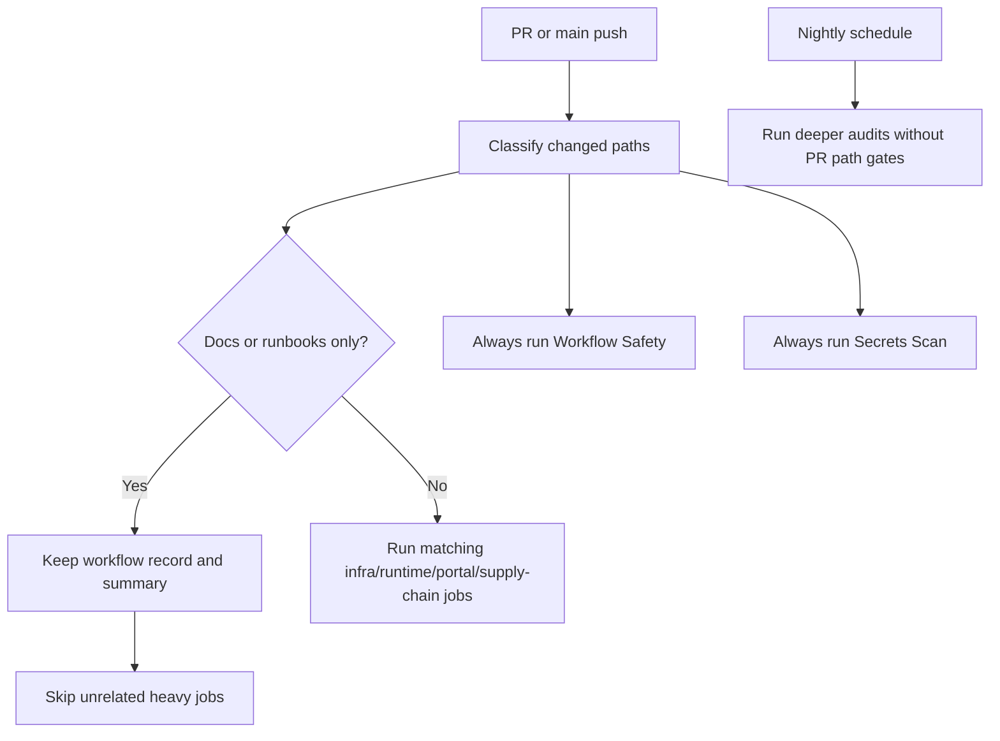

# NutsNews GitHub Actions Automation

This update adds the missing GitHub Actions around build safety, operations, backups, feed quality, translations, image coverage, links, sitemap/robots, and release notes.

## Added workflows

- `web-ci.yml` — TypeScript, lint, and Next.js build for the web app.
- `worker-controller-ci.yml` — TypeScript checks for Cloudflare Worker and controller packages.
- `link-check.yml` — Markdown local-link validation.
- `sitemap-robots-check.yml` — Production `/robots.txt` and `/sitemap.xml` validation.
- `worker-smoke-test.yml` — Production API and optional Worker/shard endpoint smoke test.
- `supabase-backup.yml` — Scheduled Supabase REST backup artifact.
- `db-size-warning.yml` — Scheduled table-growth warning report.
- `translation-coverage.yml` — Scheduled article summary translation coverage report.
- `feed-health-report.yml` — Scheduled RSS feed and worker run health report.
- `image-coverage-report.yml` — Scheduled image coverage report for published articles.
- `app-store-docs-check.yml` — Checks that App Store support/privacy/contact docs still exist.
- `release-notes.yml` — Generates GitHub release notes when a `v*` tag is pushed.

- `cloudflare-production-cache-purge.yml` — Purges the full Cloudflare zone cache after a successful production deployment status, plus manual dry-run support.
- `cloudflare-production-cache-purge-regression.yml` — Locks the production-only purge trigger, Cloudflare secret usage, and purge-everything behavior.

The branch already had Dependabot, CodeQL, Snyk, Lighthouse CI, accessibility CI, PageSpeed Insights, SEO structured data audit, and GitHub Wiki sync.

## Recommended repository secrets

Add these in GitHub under **Settings → Secrets and variables → Actions**:

- `NEXT_PUBLIC_SUPABASE_URL`
- `NEXT_PUBLIC_SUPABASE_ANON_KEY`
- `SUPABASE_URL`
- `SUPABASE_SERVICE_ROLE_KEY`
- `AUTH_SECRET`
- `NEXT_PUBLIC_TURNSTILE_SITE_KEY`
- `TURNSTILE_SECRET_KEY`
- `NUTSNEWS_WORKER_URL` — optional controller or health endpoint.
- `NUTSNEWS_SHARD_URL` — optional shard endpoint, for example a shard 0 URL without `?limit=1`.
- `PAGESPEED_INSIGHTS_API_KEY` — optional for PageSpeed API quota.
- `SNYK_TOKEN` — only needed if using the existing Snyk workflow.
- `CLOUDFLARE_API_TOKEN` — Cloudflare token scoped to the NutsNews zone with cache purge permission.
- `CLOUDFLARE_ZONE_ID` — Cloudflare zone id for the NutsNews production zone.

Most operational workflows skip cleanly if their required Supabase secrets are missing. Web CI needs the normal build-time environment variables for a complete production-like build.

## Notes

- Backup artifacts are retained for 14 days by default.
- Reports are retained for 30 days by default.
- The Supabase backup workflow uses REST exports. It is useful for diagnostics and lightweight recovery, but it is not a full `pg_dump` replacement.
- The Worker smoke test always checks `https://www.nutsnews.com/api/articles?limit=1`. Worker and shard checks run only when their URLs are configured.

## Infra CI Cost Controls

### Simple Summary

Infra CI now skips unrelated heavy jobs on docs-only or runbook-only pull requests, while secret scans and workflow safety checks still run.

### Intermediate Summary

`ramideltoro/nutsnews-infra` classifies changed paths at the start of the infrastructure, runtime, portal, and supply-chain workflows. Docs-only and runbook-only changes keep the visible workflow record but skip expensive checks such as OpenTofu validation, TFLint, Checkov, Trivy, OSV, Compose validation, and portal app checks when those areas were not touched. The workflow summary shows the changed-file sample and active categories so a skipped job is explainable from the Actions run.

### Expert Summary

The infra repo uses a repository-owned classifier instead of workflow-level `paths-ignore`, so required checks can complete with clear skip context rather than disappearing. Workflow-safety, restricted-event checks, Gitleaks, and scheduled nightly audits remain ungated. Python tooling for `yamllint` and `ansible-lint` is installed from pinned requirements files through a pinned `actions/setup-python` step with pip caching. The guardrail validator in workflow-safety fails if future edits remove the classifier, bypass the cache, gate the always-on security workflows, or stop validating the cost controls.

Operational rule: if a workflow, secret boundary, deployment path, runtime config, Terraform/OpenTofu file, Ansible role, Compose file, Dockerfile, portal file, dependency manifest, or scanner config changes, the matching safety checks should run. A docs-only skip is expected only when the changed files are documentation or runbooks.
