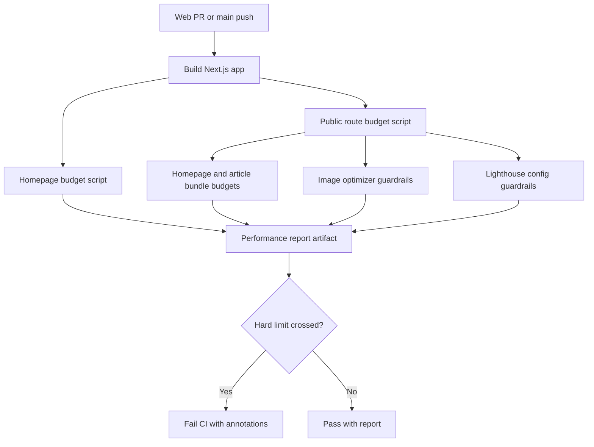

# Public Performance Budgets

NutsNews is mobile-first and image-heavy, so public page speed needs explicit limits. This page defines the current budgets, the CI checks, and the common fixes to use before raising a limit.

---

## Simple Summary

Every pull request that changes the web app builds NutsNews and checks public page performance budgets. If JavaScript, CSS, image weight, Lighthouse, or response-time guardrails cross a hard limit, CI fails and uploads a report.

## Intermediate Summary

The budget workflow runs `npm run test:performance-budget` from `web/`. That command reuses the homepage budget report, adds route bundle checks for the homepage and article detail page, verifies the image optimizer stays bounded, and confirms Lighthouse keeps response-time and Core Web Vitals-style assertions.

## Expert Summary

The budget layer uses generated Next.js build manifests and route client reference manifests instead of live production traffic for bundle checks. Lighthouse remains the browser-level check for public pages and now includes a server response-time assertion. Budget file changes still require `[performance-budget-reviewed]` in the PR title or body.



---

## Budget Targets

These targets apply to the public homepage route:

```text
/
```

| Area | Target | Warn | Hard limit | Checked by |
| --- | ---: | ---: | ---: | --- |
| Largest Contentful Paint | 2.5 s | 3.0 s | 4.0 s | Lighthouse CI and PageSpeed Insights |
| Initial JavaScript, gzip | 180 KB | 220 KB | 260 KB | Homepage budget script |
| Initial CSS, gzip | 30 KB | 45 KB | 60 KB | Homepage budget script |
| Homepage static images, raw | 250 KB | 350 KB | 400 KB | Homepage budget script |
| Runtime image transfer | 200 KB | 300 KB | 400 KB | Lighthouse CI and PageSpeed Insights |
| Total initial transfer, gzip | 360 KB | 450 KB | 550 KB | Homepage budget script |

The public route budget script also checks build output for these routes:

```text
/
/articles/[id]
```

| Route | Area | Target | Warn | Hard limit | Checked by |
| --- | --- | ---: | ---: | ---: | --- |
| Homepage | Initial JavaScript, gzip | 300 KB | 330 KB | 380 KB | Public performance budget script |
| Homepage | Initial CSS, gzip | 30 KB | 45 KB | 60 KB | Public performance budget script |
| Homepage | Total initial transfer, gzip | 360 KB | 450 KB | 550 KB | Public performance budget script |
| Article detail | Initial JavaScript, gzip | 300 KB | 340 KB | 400 KB | Public performance budget script |
| Article detail | Initial CSS, gzip | 40 KB | 56 KB | 72 KB | Public performance budget script |
| Article detail | Total initial transfer, gzip | 400 KB | 500 KB | 600 KB | Public performance budget script |

Hard limits fail CI. Warning limits create GitHub Actions annotations and should be fixed before the next UI change pushes them into failure territory.

The budget source of truth is:

```text
web/performance-budget.json
web/public-performance-budget.json
```

The Lighthouse resource budget is:

```text
web/lighthouse-budget.json
web/lighthouserc.js
```

---

## CI Workflow

The homepage budget workflow runs on pull requests and pushes that touch the web app:

```text
.github/workflows/homepage-performance-budget.yml
```

It does five things:

1. Builds the Next.js app.
2. Reads the generated `.next` manifests for the homepage route.
3. Reads route client reference manifests for homepage and article detail bundle budgets.
4. Verifies image optimizer and Lighthouse response-time guardrails.
5. Writes Markdown and JSON reports to `web/reports/performance-budget` and uploads them as a GitHub Actions artifact.

Run the same check locally:

```bash
cd web
npm run build
npm run test:performance-budget
```

Create a warning-only report while investigating:

```bash
cd web
npm run analyze:homepage:warn
node scripts/public-performance-budget.mjs --warn-only
```

---

## Budget Change Review

Budget changes should be rare. They need an intentional PR review because raising a budget can hide a real regression.

If a PR changes either budget file, include this marker in the PR title or body after reviewing the reason:

```text
[performance-budget-reviewed]
```

Use that marker only when the increase is justified, documented, and safer than reducing the bundle or image weight.

---

## Common Fixes Before Raising Budgets

### JavaScript

Prefer these fixes first:

- Keep the homepage mostly server-rendered.
- Avoid adding new client components unless they are needed for interaction.
- Move non-critical behavior behind dynamic imports.
- Avoid adding broad UI/helper libraries for small homepage interactions.
- Reuse existing components instead of introducing a second implementation.

### CSS

Prefer these fixes first:

- Remove unused homepage classes when a layout is replaced.
- Keep animation and theme styles scoped to the components that use them.
- Avoid duplicate responsive rules for the same card layout.
- Prefer one shared card system over multiple visual variants.

### Images

Prefer these fixes first:

- Compress static homepage images before committing them.
- Keep only the true first-screen image marked as priority.
- Use `next/image` sizes that match the rendered card width.
- Do not increase image quality unless the visual difference is obvious on a phone.
- Avoid adding large decorative images to the initial viewport.

### LCP

Prefer these fixes first:

- Keep the first visible card simple and stable.
- Avoid layout shifts in the masthead and first article card.
- Keep the initial homepage data request cache-friendly.
- Do not block the first paint on analytics, animations, or optional UI.
- Check mobile Lighthouse output before trusting desktop-only results.

---

## Reports

CI uploads these files when the workflow runs:

```text
web/reports/performance-budget/homepage-performance-budget.md
web/reports/performance-budget/homepage-performance-budget.json
web/reports/performance-budget/public-performance-budget.md
web/reports/performance-budget/public-performance-budget.json
```

The Markdown report is the easiest one to read. The JSON report is better for automation or comparing two runs.
