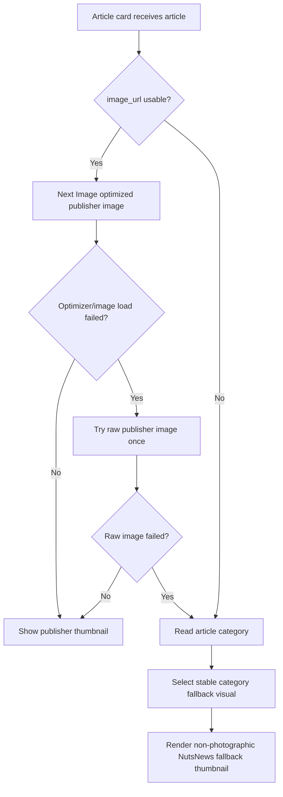

# Image Delivery

NutsNews article cards now use the Next.js image pipeline instead of sending every reader directly to each publisher's original image file.

This improves perceived feed speed because article images are requested at mobile-friendly sizes, served through responsive `srcset` candidates, cached after optimization, and displayed over a warm amber loading backdrop while the browser downloads the final image.

---

## Why This Exists

Publisher images can be large, slow, redirected, or hosted far away from the reader. A plain `` tag asks the browser to download the original publisher image exactly as provided by the RSS/article page.

For a mobile-first feed, that can make the screen feel slow because a card may need to wait on a large remote image even though the card only needs a small thumbnail.

The optimized flow is:

```text
article.image_url
  -> normalize and validate URL
  -> Next Image optimizer
  -> AVIF/WebP/mobile-sized candidate
  -> browser lazy/eager loading
  -> cached optimized image
```

---

## Code Paths

| File | Purpose |
| --- | --- |
| `web/app/components/OptimizedArticleImage.tsx` | Shared image component for public article cards and article detail images |
| `web/lib/imageDelivery.ts` | Image quality, responsive sizes, placeholder, URL normalization, and SVG bypass helpers |
| `web/app/components/ArticleFeed.tsx` | Uses optimized images for article cards and eager-loads the first visible card image |
| `web/app/articles/[id]/page.tsx` | Uses optimized image delivery for article detail header images |
| `web/next.config.ts` | Configures remote image patterns, AVIF/WebP formats, responsive widths, cache TTL, redirect limit, and max source image size |

---

## Runtime Behavior

The public feed image component does four important things:

1. **Normalizes image URLs** so protocol-relative images such as `//example.com/image.jpg` become valid `https://` URLs.
2. **Uses Next Image for normal publisher images** so browsers receive smaller responsive image candidates instead of the original full-size source image.
3. **Eager-loads the first feed image** because it is the image most likely to be visible immediately on page load.
4. **Falls back safely** if a publisher blocks the optimizer or returns an unsupported image. In that case, the component tries the raw publisher image once, then shows the branded NutsNews fallback art if the raw image also fails.

SVG images bypass optimization and render as normal images because they are not useful targets for raster optimization.

---

## Next Image Configuration

The web app configures:

```text
formats: AVIF and WebP
minimumCacheTTL: 86400 seconds
maximumRedirects: 2
maximumResponseBody: 8 MB
deviceSizes: mobile-first widths
imageSizes: thumbnail widths
```

Because NutsNews discovers publisher image hosts from RSS feeds and article metadata, the image optimizer allows `http` and `https` remote image hosts. The safety boundary is the ingestion pipeline: only stored `image_url` values that passed the Worker thumbnail checks are rendered in the public feed.

---

## What This Optimizes

This update helps with:

* Faster mobile article-card image display after the first optimized request
* Smaller downloaded image files through responsive widths and modern formats
* Better above-the-fold loading through eager loading and `fetchPriority="high"` for the first card
* Better perceived loading through an amber loading backdrop and data-URI placeholder
* More resilient image display through optimizer-to-raw-image fallback behavior

---

## What This Does Not Fix Automatically

Some image problems still depend on the source publisher:

* A publisher may block hotlinking or server-side image fetches.
* A publisher image may be deleted after the article was stored.
* The first ever request for a never-before-seen image still has to fetch the source once.
* Very large source images above the configured max size are intentionally rejected by the optimizer to protect memory and cost.

The fallback behavior keeps the feed readable even when one publisher image is slow or unavailable.

---

## Category-Aware Fallback Thumbnails

Issue #24 adds richer fallback thumbnails for articles that reach a reader-facing card without a usable image. These fallbacks are intentionally non-photographic so they do not imply NutsNews has a real publisher image for the story.

### Simple Summary

When a story has no picture, NutsNews now shows a designed card that matches the story category instead of showing a generic blank image.

### Intermediate Summary

Article cards use a centralized fallback-thumbnail helper that maps categories such as community, animals, science, wellness, travel, culture, achievements, and uplifting stories to stable non-photo visuals. The same fallback behavior is used across main feed cards, category sections, footer search results, and article detail headers. Admin article review screens also warn when a published row is missing a thumbnail so no-image publication is easier to catch.

### Expert Summary

The web app centralizes fallback selection in `web/lib/fallbackThumbnails.ts` and rendering in `web/app/components/OptimizedArticleImage.tsx`. Fallbacks expose stable `data-fallback-thumbnail` IDs, accessible labels that say the image is non-photographic, category-specific monograms, and theme-consistent dark amber/accent gradients. Public feed card variants pass `article.category` into the shared image component. Footer search cards now use `OptimizedArticleImage` instead of a separate raw `` branch, so missing thumbnails render consistently. The article detail page also renders the same fallback if a detail record ever lacks `image_url`, although public article queries still prefer rows with usable images. The admin article review dashboard flags published rows with missing images instead of silently treating them as normal.

### Render Flow



### Category Mapping

| Category signal | Fallback visual |
| --- | --- |
| `community`, `volunteer`, `kindness`, `neighbors`, `local` | Community |
| `animal`, `wildlife`, `pet`, `rescue` | Animals |
| `science`, `research`, `discovery`, `space`, `climate` | Science |
| `wellness`, `health`, `healing`, `medical` | Wellness |
| `travel`, `journey`, `destination`, `outdoor` | Travel |
| `culture`, `art`, `music`, `creative`, `education` | Culture |
| `achievement`, `award`, `milestone`, `sports`, `record` | Achievement |
| No match | Uplifting |

### Publishing Guardrail

NutsNews still prefers not to publish no-image articles. Public article queries continue to favor records with `image_url`, and the Worker no-thumbnail rejection path remains the primary protection. The admin article review dashboard now makes accidental no-image publication more visible with a missing-thumbnail warning and a concrete next step: verify the Worker no-image rejection path and add a usable publisher image before further promotion.

### Validation

Local validation:

```bash
cd /Users/ramideltoro/nutsnews-fluid-cpu-reduction/web
npm run test:fallback-thumbnails
npm run lint
npx tsc --noEmit
NEXT_PUBLIC_SUPABASE_URL=https://example.supabase.co NEXT_PUBLIC_SUPABASE_ANON_KEY=dummy npm run build
npm run test:e2e:offline
```

The focused regression checks that fallback mappings are centralized, category-aware, explicitly non-photographic, used by reader-facing cards, and paired with admin no-image warnings.

---

## Validation

Local validation:

```bash
cd /Users/ramideltoro/WebstormProjects/nutsnews2/web
npm install
npm run lint
npx tsc --noEmit
```

After deploy, open the public feed and inspect a card image in browser DevTools. Optimized article images should be requested through:

```text
/_next/image?url=...
```

The first visible article image should load eagerly. Lower cards should stay lazy-loaded.
