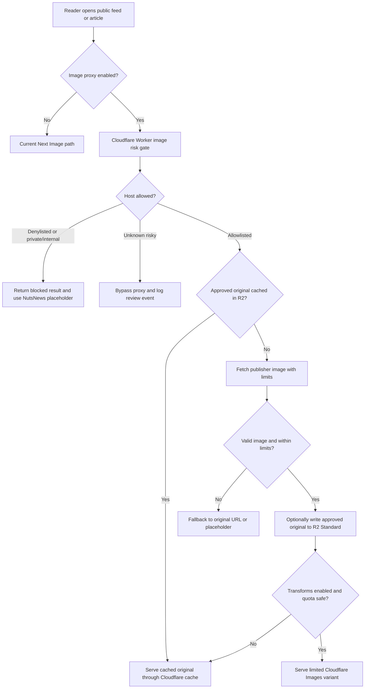

# Secure Image Proxy/Cache Design

Issue: https://github.com/ramideltoro/nutsnews/issues/105

Simple Summary: NutsNews is not changing image delivery yet. This design explains how NutsNews could add a safer image gate later so article pictures still load, unsafe hosts are blocked, and free Cloudflare limits are protected.

Intermediate Summary: NutsNews currently renders publisher article images through the Next.js image optimizer with broad `http` and `https` remote host support, then falls back to the original publisher image or the branded placeholder when optimization fails. The proposed path keeps that behavior as the default while designing an optional Cloudflare Worker image proxy, optional R2 Standard approved-original cache, and optional limited Cloudflare Images transformations. The rollout starts with logging and allowlist-only shadow checks, then adds cache writes and transforms only after guardrails show quota headroom.

Expert Summary: The current web path uses `web/app/components/OptimizedArticleImage.tsx`, `web/lib/imageDelivery.ts`, and `web/next.config.ts`. Article rows carry `image_url` values from ingestion; the web app normalizes URL shape, rejects non-HTTP(S) protocols, bypasses optimization for SVGs, configures Next Image `remotePatterns` for any `http` or `https` host, limits redirects to 2, limits source body size to 8 MB, emits AVIF/WebP candidates, and falls back from Next Image to a raw publisher `` and then the NutsNews placeholder. The future proxy/cache path would live in the Worker-owned repo and act as a risk gate before any optional R2 or Cloudflare Images usage. It must preserve source attribution, never imply NutsNews owns publisher images, and remain disabled by default until quota, security, and observability guardrails are proven.

## Current State

NutsNews stores article image URLs from RSS feeds and article metadata in `articles.image_url`. Public reader surfaces then render those URLs through the shared optimized image component.

| Area | Current behavior |
| --- | --- |
| Public cards | `web/app/components/ArticleFeed.tsx` renders `OptimizedArticleImage` for article thumbnails. |
| Article detail | `web/app/articles/[id]/page.tsx` renders `OptimizedArticleImage` for the article header image. |
| Footer search | `web/app/components/SiteFooter.tsx` renders thumbnails for search results when `image_url` exists. |
| URL normalization | `web/lib/imageDelivery.ts` trims URLs, converts protocol-relative URLs to HTTPS, strips fragments, rejects non-HTTP(S), and rejects very long values. |
| Next Image config | `web/next.config.ts` allows broad `http` and `https` remote patterns, AVIF/WebP output, mobile-first widths, `minimumCacheTTL: 86400`, `maximumRedirects: 2`, and `maximumResponseBody: 8000000`. |
| Fallback | If Next Image fails, the browser retries the raw publisher URL once with `referrerPolicy="no-referrer"`. If raw loading fails, NutsNews shows the branded fallback art. |

The current path is simple and mostly free because the publisher remains the source of truth and Vercel/Next handles optimization. Its main weakness is that the web app trusts a wide set of remote publisher/CDN hosts discovered by ingestion.

## Current Path vs Optional Proxy/Cache Path

| Decision point | Current Next Image / remote publisher path | Optional proxy/cache path |
| --- | --- | --- |
| Request path | Browser requests `/_next/image?url=<publisher-image>` or falls back to raw publisher URL. | Browser requests a NutsNews image proxy URL that validates host and object risk before fetching. |
| Host controls | Broad Next Image `remotePatterns` allow `http` and `https`; safety mostly depends on ingestion checks and component normalization. | Worker enforces allowlist, denylist, unknown-host risk scoring, SSRF controls, redirect limits, byte limits, content-type checks, and TTL rules. |
| Cache | Next Image optimized cache plus browser/CDN behavior; original remains with publisher. | Optional R2 Standard cache for approved originals, plus Cloudflare CDN caching; optional limited transformations only for small variant set. |
| Reliability | Fast after optimizer cache warmup, but first load depends on publisher availability and hotlink policy. | Can serve cached approved originals when publisher is slow or gone; proxy outage must fall back to current original/placeholder behavior. |
| Cost | Mostly Vercel/Next image optimization and bandwidth pressure. | Adds Workers requests/CPU, possible R2 operations/storage, and optional Cloudflare Images transformation quota pressure. |
| Attribution | Article UI links to source and publisher data; image remains a publisher asset. | Attribution must stay visible; cache/proxy headers and docs must state images remain publisher-owned. |
| Rollback | Disable optimized image use or rely on raw fallback. | Kill switch returns all image URLs to the current Next Image/original publisher path. |

## Proposed Free-Tier-First Architecture

The initial implementation must stay free-tier-first and optional.

Recommended pieces:

- Cloudflare Worker as the image proxy/risk gate.
- Optional R2 Standard storage cache for approved originals only.
- Optional Cloudflare Images transformations for a small set of variants only.
- Existing original image or NutsNews placeholder fallback when proxy/cache fails.
- No Cloudflare Images hosted storage/delivery in the first rollout because it is paid-only.

## Domain Controls

The proxy must treat image URLs as untrusted input.

| Control | Requirement |
| --- | --- |
| Allowlist | Known-good publisher/CDN hosts may be proxied and cached after validation. Store exact hosts or explicit suffix rules, not broad wildcard guesses. |
| Denylist | Always block local, private, loopback, link-local, metadata, internal, onion, bare-IP, and known-abusive hosts. |
| Unknown-host risk scoring | Score by domain age/reputation if available, source feed trust, redirect behavior, content type, response size, HTTPS availability, and historical failures. Unknown hosts default to bypass or shadow-only, not cache-write. |
| SSRF protection | Resolve DNS server-side, reject private/internal IP ranges before and after redirects, reject userinfo URLs, reject non-HTTP(S), and re-check the final destination after every redirect. |
| Redirect limits | Keep the current limit of 2 redirects unless a measured publisher need justifies a higher per-host rule. |
| Timeout limits | Use short connect and total timeouts so image fetching cannot pin Worker capacity. Start with 2 seconds connect and 5 seconds total for proxy fetches. |
| Max byte limits | Keep the current 8 MB source body ceiling as an upper bound; prefer lower per-host limits for thumbnails. |
| Content-type validation | Accept only expected raster image MIME types for cache writes. SVG remains bypassed/unoptimized unless a future sanitizer is designed. |
| Cache TTL rules | Use longer TTLs only for allowlisted, validated image responses. Use short or no cache for unknown-host shadow results and negative decisions. |
| Attribution | Preserve publisher/source attribution in article UI and docs. Proxying or caching publisher images must not imply NutsNews owns, created, or relicensed the image. |

## Risks

| Risk | Why it matters | Mitigation |
| --- | --- | --- |
| SSRF | A proxy can be abused to fetch internal networks or metadata endpoints. | Deny private/internal IPs, validate redirects, reject unsafe schemes, enforce DNS/IP checks, and log blocked attempts. |
| Malware or unsafe content | Publisher hosts can return unexpected files. | Validate content type, byte size, and response status before caching; never execute image payloads. |
| Hotlink or license surprise | Publishers may not expect cached delivery. | Preserve attribution, cache only approved hosts, honor removals, and keep per-host bypass. |
| Quota exhaustion | Proxy traffic can consume Workers, R2, or Images limits. | Add admin guardrails, alert at 70%, freeze new writes/transforms at 90%, and disable writes/proxy at 100%. |
| Paid-tier drift | Cloudflare Images storage/delivery is paid-only and R2 Infrequent Access free tier does not apply. | Use R2 Standard only for initial approved-original cache and avoid Cloudflare Images hosted storage/delivery. |
| Reliability regression | Proxy outage could hide article images. | Keep current Next Image/original publisher path and NutsNews placeholder fallback. Add kill switch and per-host bypass. |
| Cache staleness | Cached publisher images can outlive source corrections or removals. | Use bounded TTLs, allow purge by original URL hash, and keep rollback/purge runbooks. |

## Quotas And Costs

Official references:

- Cloudflare Workers pricing: https://developers.cloudflare.com/workers/platform/pricing/
- Cloudflare R2 pricing: https://developers.cloudflare.com/r2/pricing/
- Cloudflare Images pricing: https://developers.cloudflare.com/images/pricing/

| Service | Free-tier-first guidance | Admin guardrail action |
| --- | --- | --- |
| Cloudflare Workers Free | 100,000 requests/day and 10 ms CPU per invocation. Proxy traffic must share this pool with existing Worker traffic. | Alert at 70%, shrink traffic slice at 90%, disable proxy writes or bypass proxy at 100%. |
| Cloudflare R2 Standard | 10 GB-month storage/month, 1M Class A ops/month, 10M Class B ops/month, and free internet egress. Free tier does not apply to Infrequent Access storage. | Use Standard only, alert at 70%, freeze new cache writes at 90%, disable writes at 100%, and check R2 dashboard monthly. |
| Cloudflare Images Free transformations | 5,000 unique transformations/month. Cached existing transformations continue after the limit; new transformations return error `9422`; Free plan is not charged for exceeding the limit. | Use only fixed variants, alert at 70%, freeze new variants at 90%, disable transforms at 100%. |
| Cloudflare Images hosted storage/delivery | Paid-only. | Do not use for initial rollout. Revisit only with explicit owner approval and a billing budget. |

Who checks quotas:

- Owner/admin checks `/admin/guardrails` before rollout and weekly during rollout.
- Owner/admin also checks the Cloudflare dashboard for Workers, R2, and Images during the first month.
- If quota approaches exhaustion, freeze rollout, disable writes/transforms, and leave readers on the current Next Image/original fallback path.

## Rollout Plan

| Phase | Scope | Gate to continue | Fallback |
| --- | --- | --- | --- |
| Phase 0: design/logging only | Keep current delivery. Add design, guardrails, and optionally shadow logs for observed image hosts without proxying user traffic. | Admin guardrails show safe headroom and host review list is clean. | No user behavior changes. |
| Phase 1: allowlist-only shadow/proxy | Proxy a small traffic slice for known-good hosts only. Unknown hosts remain on current path. | Error rate, blocked-host rate, Workers CPU, and request quota stay below warning thresholds. | Global kill switch or per-host bypass returns to current path. |
| Phase 2: R2 approved-original cache | Cache only validated originals from allowlisted hosts in R2 Standard. | R2 storage and ops stay below 70%, purge path works, and stale-cache risk is acceptable. | Disable R2 writes and serve current Next Image/original path. |
| Phase 3: optional transforms | Enable a tiny fixed variant set through Cloudflare Images only if free transformation quota has headroom. | Unique transformations stay below 70%, variants remain bounded, and `9422` errors are absent. | Disable transforms; serve cached originals or current path. |

Kill switches:

- `IMAGE_PROXY_ENABLED=false`: route all images through the current Next Image/original publisher path.
- `IMAGE_PROXY_WRITE_ENABLED=false`: keep validation/proxy reads but disable R2 writes.
- `IMAGE_TRANSFORMS_ENABLED=false`: disable Cloudflare Images transformations.
- `IMAGE_PROXY_BYPASS_HOSTS=host1,host2`: bypass problematic hosts.
- Per-host allowlist removal immediately stops proxy/cache use for that host.

## Observability

Required signals before production rollout:

- Proxy requests by host and decision: allow, deny, bypass, fallback.
- Fetch latency, timeout count, redirect count, response size, and content type.
- SSRF/private-host block count.
- R2 writes, reads, storage, cache hit ratio, purge count, and write failures.
- Cloudflare Images unique transformations and `9422` errors if transforms are enabled.
- Reader fallback rate: proxy to original, original to placeholder.
- Admin guardrail warning/danger counts.

## Validation Before Shipping A Proxy

This issue does not ship the proxy. A future implementation PR must add:

- Unit tests for URL normalization, allowlist/denylist, private IP rejection, redirect validation, content-type validation, max byte enforcement, and fallback decisions.
- Worker integration tests with mocked publisher responses.
- Admin guardrail regression coverage for new quota inputs.
- Staging rollout with the global kill switch tested before production traffic.

## Rollback

If proxy/cache behavior causes reliability, security, or quota risk:

1. Set `IMAGE_PROXY_ENABLED=false`.
2. Set `IMAGE_PROXY_WRITE_ENABLED=false`.
3. Set `IMAGE_TRANSFORMS_ENABLED=false`.
4. Add affected hosts to `IMAGE_PROXY_BYPASS_HOSTS`.
5. Purge any bad R2 objects or transformed variants.
6. Keep current Next Image/original publisher fallback active while investigating.
