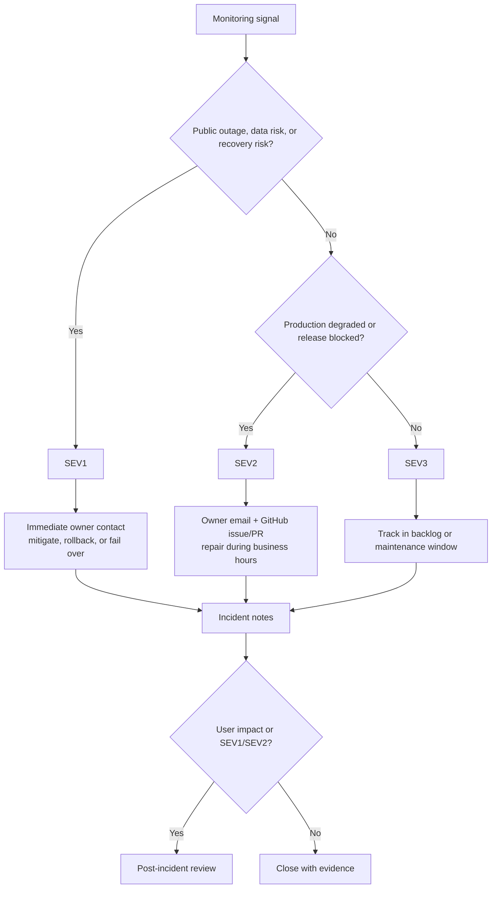

# NutsNews Incident Response Policy

Issue: https://github.com/ramideltoro/nutsnews/issues/111

This runbook defines how NutsNews turns monitoring signals into incident
severity, alert channels, response steps, and post-incident review.

## Simple Summary

When NutsNews breaks, first decide how bad it is. SEV1 means readers or
production data are directly at risk and the owner should be contacted right
away. SEV2 means an important system is unhealthy but readers still have a
working experience or a safe fallback. SEV3 means something needs scheduled
maintenance before it becomes urgent.

## Intermediate Summary

NutsNews uses three incident severities:

| Severity | Meaning | Initial response target | Primary channels |
| --- | --- | --- | --- |
| SEV1 | Public reader outage, production data risk, security exposure, or a failed backup/restore gate blocking safe recovery | Acknowledge immediately and start mitigation within 15 minutes | Uptime/mobile push, owner email, direct owner contact |
| SEV2 | Degraded production operations with fallback still working, stale ingestion, failed CI/release gate, quota danger, or backup verification gap | Acknowledge within 4 hours | Owner email, GitHub issue or PR, admin/Ops Portal evidence |
| SEV3 | Maintenance warning, capacity trend, incomplete optional telemetry, or quality gap that does not threaten the current reader experience | Triage in the next maintenance window | GitHub issue, daily report, dashboard review |

Use the highest severity that matches the evidence. If a condition escalates
from warning to critical, notify again even if a lower-severity alert was
already sent.

## Expert Summary

This policy maps the existing NutsNews monitoring surfaces to operational
severity without changing runtime behavior. It references:

- external uptime checks for `https://www.nutsnews.com/healthz` and selected
  public pages;
- the protected admin readiness dashboard at `/admin/readiness`;
- the protected admin guardrails dashboard at `/admin/guardrails`;
- the VPS Ops Portal at `https://ops.nutsnews.com`;
- GitHub Actions workflow results for CI, backups, migrations, and protected
  applies;
- Supabase restore fire drill reports from the `Supabase Backup` workflow; and
- translation and image quality dashboards that preserve public fallbacks.

The VPS Ops Portal still uses machine severities named `warning` and
`critical`. Map those to SEV2 or SEV1 based on blast radius: a critical alert
that threatens public serving, data safety, or recovery readiness is SEV1; a
critical alert contained to degraded ops with a safe public fallback is SEV2.



## Severity Criteria

### SEV1

Declare SEV1 when any of these are confirmed:

| Signal | Threshold | First action |
| --- | --- | --- |
| Site down | `https://www.nutsnews.com/healthz` fails from the uptime monitor and a manual check also returns timeout/5xx for 5 minutes or more | Check Vercel, Cloudflare, latest deploy, and `/readyz`; rollback the bad deploy if identified |
| Public API failing | `/api/articles?limit=1` returns timeout/5xx or invalid JSON for 10 minutes while homepage/static pages are reachable | Check Supabase, public feed snapshot, API route logs, and recent releases |
| Production readiness red with reader impact | `/admin/readiness` shows red public API health and neither `public_feed_snapshot` nor recent `articles` has the 5 rows needed for the first page | Restore snapshot/public feed generation before promotion or broad cache changes |
| Database write/read risk | Supabase production rejects normal app reads/writes, migration contract verification fails in production, or a migration/app release risks data loss | Stop deploys, keep recovery evidence, use the protected migration/rollback path |
| Backups unusable | Latest backup or disposable restore fire drill failed, is action-required, or is older than the 30-hour freshness window while a production mutation is planned or an active incident needs recovery | Do not trust that backup for recovery; rerun/fix `Supabase Backup` before migration or restore decisions |
| Security exposure | Secret leak, public admin bypass, unexpected privileged route exposure, or high/critical security scan finding that affects production | Revoke/rotate first, then patch, audit, and document |

SEV1 response:

1. Open the live dashboard or workflow that produced the alert.
2. Create or update a GitHub issue with `SEV1`, start time, affected surface,
   evidence links, and current owner.
3. Use the safest reversible mitigation: rollback deploy, disable risky flag,
   pause mutation, or restore known-good config.
4. Do not run ad hoc production mutations over SSH. Use protected workflows or
   documented emergency paths.
5. Keep timestamps for detection, acknowledgement, mitigation, and resolution.

### SEV2

Declare SEV2 when production is degraded or a release is blocked, but the public
reader path still has a safe fallback:

| Signal | Threshold | First action |
| --- | --- | --- |
| Worker stale | `/admin/readiness` worker signal is red because the latest successful run is older than 24 hours, or the latest run failed | Check `/admin/shards`, Worker schedules, shard logs, and feed health |
| DB growth stopped | `/admin/readiness` DB growth is red because there are 0 published articles in 7 days | Inspect Worker schedules, source failures, AI review limits, and Supabase writes |
| Backup warning without active mutation | Latest restore check is stale or failed, but no production migration/restore is pending | Fix and rerun `Supabase Backup`; escalate to SEV1 if recovery is needed before it passes |
| Quota danger | `/admin/guardrails` or Ops Portal reaches danger/critical quota status, typically 90% for most limits or 85% for AI cost | Reduce load, pause expensive jobs, or make an explicit budget decision |
| Staging/release gate blocked | Required CI, migration, preview, accessibility, or smoke workflow failed on a release candidate | Keep release paused, inspect logs, fix by PR |
| VPS operational critical contained to ops | Ops Portal critical alert affects backup verification, Docker cleanup, security-update staleness, or staging health without current reader outage | Repair through infra PR/protected apply, using SSH only for read-only evidence |

SEV2 response:

1. Acknowledge by issue or PR comment with the owning surface.
2. Attach dashboard, workflow, log, or read-only SSH evidence.
3. Prefer a scoped PR with regression coverage over manual state changes.
4. If the condition starts affecting readers, recovery readiness, or security,
   promote it to SEV1.

### SEV3

Use SEV3 for non-urgent maintenance and observability gaps:

| Signal | Threshold | First action |
| --- | --- | --- |
| Worker aging | `/admin/readiness` worker signal is yellow because the latest success is older than 3 hours but not older than 24 hours | Watch the next scheduled run and open a maintenance issue if it repeats |
| Translation gaps | Translation coverage is yellow below 90% or red below 75%, but the public feed falls back to English | Run translation audit/backfill and review `/admin/translations` |
| Image coverage thin | Image coverage is yellow below 85% or red below 70%, but article cards still render with fallback media | Review feed health and image hydration before promoting UI polish work |
| Unknown provider quota | Guardrail or Ops Portal provider usage is unavailable, unsupported, or missing credentials | Track the collector gap; do not invent usage values |
| Optional dashboard yellow | Read-only token missing, external API unavailable, or GitHub status cannot be queried while direct workflow links still work | Verify manually and schedule the token/collector fix |

SEV3 response:

1. Open or update a maintenance issue.
2. Link the dashboard or report.
3. Assign the next safe maintenance window.
4. Close only after validation evidence is attached.

## Alert Routing

| Alert source | Examples | Default severity | Channel |
| --- | --- | --- | --- |
| Uptime monitor | `/healthz`, homepage, public API, privacy/contact pages | SEV1 for confirmed outage, SEV2 for intermittent degraded checks | Mobile push and owner email; direct owner contact for SEV1 |
| `/admin/readiness` | public API health, Worker freshness, DB growth, translation, image, backup, CI | Red maps to SEV1 only for reader/data/recovery risk; otherwise SEV2. Yellow maps to SEV3 unless it blocks release | Admin review, GitHub issue or PR |
| `/admin/guardrails` | DB rows, AI cost, Worker calls, email sends, egress/API pressure | Danger is SEV2; watch is SEV3; over-limit that risks production traffic can become SEV1 | Admin review and GitHub issue |
| Ops Portal | host health, backup, verification, security updates, Docker/runtime, free-tier rows | Critical maps to SEV1 only if reader serving, data safety, or recovery readiness is threatened; otherwise SEV2. Warning maps to SEV3 or SEV2 by trend | Ops email report, portal evidence, infra issue/PR |
| GitHub Actions | CI, smoke, release, backup, protected migration/apply workflows | Failed protected production mutation or backup gate is SEV1 if active production risk exists; failed CI/release gate is SEV2 | GitHub check/PR comment |
| Security scanners | CodeQL, Snyk, OSV, Gitleaks, dependency review | Production secret/security exposure is SEV1; blocking PR finding is SEV2 | GitHub security/check evidence and owner contact for SEV1 |

Alert emails should use stable alert identities and cooldown behavior from
[VPS Alert Email Policy](VPS_ALERT_EMAIL_POLICY.md). Do not route secrets,
database URLs, raw SMTP settings, private alert bodies, or credentials into
issue comments, PR descriptions, dashboard text, or incident notes.

## Incident Checklist

Use this checklist for SEV1 and SEV2 incidents:

1. Name the incident: `YYYY-MM-DD short title`.
2. Declare severity and owner.
3. Record start time, detection source, affected users/systems, and current
   hypothesis.
4. Capture links: dashboard card, workflow run, commit, deployment, sanitized
   logs, read-only SSH evidence, and relevant docs.
5. Mitigate through the safest reversible path.
6. Validate recovery with the same signal that detected the incident and at
   least one independent check.
7. Decide whether a post-incident review is required.
8. Link follow-up issues and owners before closing.

## Post-Incident Review Template

Copy this into the issue or a dedicated review document for every SEV1 and for
SEV2 incidents with user impact, repeated alerts, or risky manual intervention.

```markdown
# Post-Incident Review: <title>

## Summary
- Severity:
- Start time:
- Detection time:
- Acknowledgement time:
- Mitigation time:
- Resolution time:
- Owner:

## Impact
- User-facing impact:
- Data/recovery impact:
- Systems affected:
- Duration:

## Timeline
- YYYY-MM-DD HH:MM UTC:

## Root Cause
- Trigger:
- Contributing factors:
- What prevented this from being worse:

## Response
- What worked:
- What slowed response:
- Communication notes:

## Validation
- Recovery evidence:
- Tests or workflow runs:
- Browser/SSH evidence, if applicable:

## Follow-Up
| Action | Owner | Issue/PR | Due |
| --- | --- | --- | --- |
| | | | |

## Prevention
- Alert or threshold changes:
- Runbook changes:
- Test/automation changes:
```

## Risks And Mitigations

| Risk | Mitigation |
| --- | --- |
| Every dashboard warning becomes urgent | SEV3 exists for maintenance signals and yellow states that do not threaten readers, data, or recovery. |
| A critical machine alert is over- or under-routed | Map by blast radius, not by label alone. Use SEV1 for reader/data/recovery risk, SEV2 for contained production degradation. |
| Incident notes leak secrets | Record sanitized evidence only. Never paste credentials, environment files, private database URLs, SMTP values, OAuth material, or raw email bodies. |
| Manual fixes bypass GitOps | Use PRs, protected workflows, and documented rollback paths for permanent changes. SSH is read-only evidence unless a separate emergency runbook explicitly says otherwise. |
| Thresholds drift from code | Update this policy whenever `web/lib/adminProductionReadiness.ts`, guardrail thresholds, Ops Portal alert identities, or backup freshness windows change. |

## Rollback

This is a documentation policy. To roll it back, revert the docs commit that
added or changed this file and remove the README link. No application, database,
VPS, or provider state changes are made by this runbook.

## Related

- App issue: https://github.com/ramideltoro/nutsnews/issues/111
- Production readiness dashboard: [PRODUCTION_READINESS_DASHBOARD.md](PRODUCTION_READINESS_DASHBOARD.md)
- VPS alert email policy: [VPS_ALERT_EMAIL_POLICY.md](VPS_ALERT_EMAIL_POLICY.md)
- Free-tier guardrails: [FREE_TIER_GUARDRAILS.md](FREE_TIER_GUARDRAILS.md)
- Supabase backup automation: [NUTSNEWS_DB_BACKUPS.md](NUTSNEWS_DB_BACKUPS.md)
- UptimeRobot onboarding: [UPTIMEROBOT_ONBOARDING.md](UPTIMEROBOT_ONBOARDING.md)
