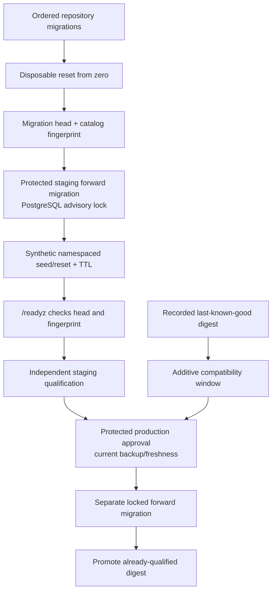

# Migration Release Gate

This runbook defines the database release contract introduced by `nutsnews#109`.
It applies to the application repository’s Supabase migrations, the isolated
staging database, and the protected production migration step. It does not
authorize direct production database changes or alter `nutsnews-infra`.

## Simple explanation

Every release first proves that a brand-new disposable database can apply every
repository migration in order. Staging then applies the same forward-only
migrations before it can pass `/readyz` or qualification. Staging test data is
deterministic synthetic data with a unique `nutsnews-test-*` namespace; it is
removed after the test or its TTL expires.

Production is different: it is a separately protected, human-approved step
with a current-backup check. There is no automatic “down migration” button.

## Intermediate explanation

`supabase/migrations/` is the schema source of truth. CI validates strict
14-digit ordered filenames, resets a disposable local Supabase database with
the complete migration set, and confirms the migration head. A new app digest
also asks the database for a catalog fingerprint. `/readyz` returns `503` if
the database head differs from the image’s compiled migration head or if the
current catalog fingerprint differs from the recorded post-migration value.

The original `release_readiness` marker remains unchanged during the current
expand phase. The recorded last-known-good app digest can therefore continue to
read its old marker after an additive schema expansion. CI runs its old-reader
snapshot against the expanded disposable schema. Do not change the legacy
marker or remove fields until that digest is no longer a rollback target.

## Expert explanation

The fixed-purpose migration command accepts only these targets:

| Target | Required purpose | Required preflight |
| --- | --- | --- |
| Staging | `staging-qualification` | Isolated staging credentials and runtime boundary |
| Production | `production-protected` | Explicit protected approval and a current backup |

Both require `NUTSNEWS_MIGRATION_DIRECTION=up`; reverse migrations are
rejected. The command holds PostgreSQL advisory lock
`hashtext('nutsnews:migration-workflow')` while `supabase db push` runs, then
records the migration head and public-catalog fingerprint. The disposable CI
database sends two simultaneous requests through that same lock key.

The catalog signature contains public relation kinds, columns/defaults,
constraints, indexes, and row-level-security state. It contains neither row
data nor credentials. A manual schema change therefore makes `/readyz` fail
closed as `schema_drift_detected` until an approved forward migration runs.



## Required application checks

Run these from `ramideltoro/nutsnews`; they use no production credentials:

```bash
node scripts/assert_migration_contract.mjs
cd web && npm run test:migrations
```

When Docker is available, exercise the complete disposable-database path:

```bash
supabase start -x studio,imgproxy,logflare,vector
supabase db reset --local
node scripts/verify_migration_schema.mjs --negative-drift
node scripts/verify_migration_lock.mjs
node scripts/verify_old_digest_compatibility.mjs
```

CI runs these checks in `Migration order, drift, fixtures, and compatibility`.
The required `Release candidate` check depends on that job. Do not add
`supabase db push`, `supabase db reset`, or the locked migration command to a
web-container startup command.

## Staging fixture procedure

Fixtures are valid only in the isolated staging runtime with sandbox writes.
They must never use a production dump, a production project, or a production
credential. The seed tool creates deterministic synthetic articles, two
translations, RSS feeds, a synthetic Auth user, and one controlled
`quota_usage_events` write.

Every record is tied to a unique `nutsnews-test-*` namespace and uses
`fixture.invalid`. The default TTL is one hour and is bounded to 1–120 minutes.
`exercise` always performs a scoped reset; the database also records expiration
and can clean expired runs. Cleanup failure is a failure requiring follow-up,
never a pass.

Use an explicit namespace when reproducing a staging test. Do not put
credentials in shell history or documentation:

```bash
cd ramideltoro/nutsnews/web
npm run fixtures:staging -- --namespace nutsnews-test-<unique-run-id>
node ../scripts/staging_fixtures.mjs reset --namespace nutsnews-test-<unique-run-id>
```

## Expand/contract and rollback rules

1. **Expand:** add nullable fields, tables, indexes, views, or compatible
   behavior first. Preserve old columns and the legacy readiness marker.
2. **Prove:** record the last-known-good immutable digest and run its
   compatibility reader against the expanded staging schema before qualification.
3. **Deploy:** migrate staging, qualify staging, then run the separately
   protected production forward migration after the backup/freshness preflight.
4. **Contract later:** remove old fields only in a later release after the
   recorded last-known-good digest has left the rollback set.

An application rollback is a digest rollback, not a database rollback. If a
production migration is non-reversible, include a separate reviewed recovery
procedure (for example restore to a temporary database, validate, then make a
controlled repair). Do not claim or attempt automatic reverse migrations.

## Required infrastructure follow-up

`nutsnews-infra` must implement these protected invocations; this application
change intentionally does not modify that repository:

1. Before `/readyz` or qualification, invoke
   `node scripts/locked_migration_workflow.mjs` with isolated staging database
   credentials, target `staging`, purpose `staging-qualification`, and
   direction `up`.
2. Add a separate protected production migration environment. It must use
   target `production`, purpose `production-protected`, direction `up`, an
   explicit approval signal, and a backup-completed timestamp that passes the
   freshness preflight. Never run it at container startup.
3. Store the immutable last-known-good digest with release attestation and run
   the real old-image smoke/compatibility test against staging before a
   contract migration. The application snapshot test is the fast regression.
4. Make staging migration success and `/readyz` schema-contract success
   prerequisites of `nutsnews-infra#122`; keep promotion separately protected
   under `nutsnews-infra#121` and `#124`.

## Incident notes

If `/readyz` returns `migration_head_mismatch` or `schema_drift_detected`, do
not qualify or promote. Compare the image migration head, migration workflow
evidence, and staging schema. If fixture cleanup fails, reset only its
namespace; do not clear shared staging data. For a production migration
incident, follow that migration’s explicit recovery procedure and the existing
[Supabase Restore Procedure](SUPABASE_RESTORE.md).
