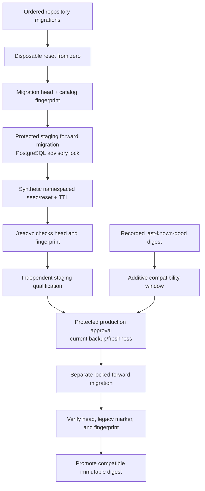
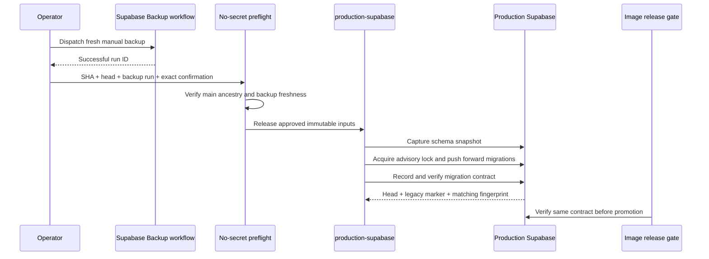

# Migration Release Gate

This runbook defines the database release contract introduced by `nutsnews#109`.
It applies to the application repository’s Supabase migrations, the isolated
staging database, and the protected production migration step. It does not
authorize direct production database changes or alter `nutsnews-infra`.

## Simple explanation

Every release first proves that a brand-new disposable database can apply every
repository migration in order. Staging then applies the same forward-only
migrations before it can pass `/readyz` or qualification. Staging test data is
deterministic synthetic data with a unique `nutsnews-test-*` namespace; it is
removed after the test or its TTL expires.

Production is different: it is a separately protected, explicitly confirmed
step with a fresh successful manual backup check. There is no automatic “down
migration” button.

## Intermediate explanation

`supabase/migrations/` is the schema source of truth. CI validates strict
14-digit ordered filenames, resets a disposable local Supabase database with
the complete migration set, and confirms the migration head. A new app digest
also asks the database for a catalog fingerprint. `/readyz` returns `503` if
the database head differs from the image’s compiled migration head or if the
current catalog fingerprint differs from the recorded post-migration value.

The original `release_readiness` marker remains unchanged during the current
expand phase. The recorded last-known-good app digest can therefore continue to
read its old marker after an additive schema expansion. CI runs its old-reader
snapshot against the expanded disposable schema. Do not change the legacy
marker or remove fields until that digest is no longer a rollback target.

The immutable image metadata now carries both `migration_head` and
`schema_version`. Promotion stops before the infrastructure handoff unless the
live production RPC reports those exact values and a matching catalog
fingerprint. The application gate also requires the reviewed production URL to
identify the same 20-character project reference. The infrastructure repository
records the verified schema pair and project reference in the reviewed
production manifest, compares that project with the Vercel-synchronized runtime
before materialization, and derives a unique production configuration
generation from the build ID and migration head.

## Expert explanation

The fixed-purpose migration command accepts only these targets:

| Target | Required purpose | Required preflight |
| --- | --- | --- |
| Staging | `staging-qualification` | Isolated staging credentials and runtime boundary |
| Production | `production-protected` | Explicit protected approval and a current backup |

Both require `NUTSNEWS_MIGRATION_DIRECTION=up`; reverse migrations are
rejected. The command holds PostgreSQL advisory lock
`hashtext('nutsnews:migration-workflow')` while `supabase db push` runs, then
records the migration head and public-catalog fingerprint. The disposable CI
database sends two simultaneous requests through that same lock key.

The catalog signature contains public relation kinds, columns/defaults,
constraints, indexes, policies, functions, and row-level-security state. It
contains neither row data nor credentials. A manual schema change therefore
makes `/readyz` fail closed as `schema_drift_detected` until an approved
forward migration runs.



## Required application checks

Run these from `ramideltoro/nutsnews`; they use no production credentials:

```bash
node scripts/assert_migration_contract.mjs
cd web && npm run test:migrations
```

When Docker is available, exercise the complete disposable-database path:

```bash
supabase start -x studio,imgproxy,logflare,vector
supabase db reset --local
node scripts/verify_migration_schema.mjs --negative-drift
node scripts/verify_migration_lock.mjs
node scripts/verify_old_digest_compatibility.mjs
```

CI runs these checks in `Migration order, drift, fixtures, and compatibility`.
The required `Release candidate` check depends on that job. Do not add
`supabase db push`, `supabase db reset`, or the locked migration command to a
web-container startup command.

## Protected production migration procedure

The application repository owns `Apply Verified NutsNews Production Supabase
Migrations`. Run it only from `main`, after its workflow revision has passed
review and a fresh manual `Supabase Backup` run has completed successfully.

The request contains exactly:

1. `source_commit`: a full lowercase SHA already reachable from `main`.
2. `migration_head`: the 14-digit head declared by that source.
3. `backup_run_id`: the successful manual `Supabase Backup` workflow run.
4. `confirmation`: `apply-production-supabase-migrations`.

The preflight job has no production database credential. It validates the
request, main ancestry, checked-out migration contract, backup workflow
identity, repository, branch, successful conclusion, and one-hour freshness.
Only then can the `production-supabase` job read its protected Supabase access
token and reviewed project reference.

The protected job links the approved project, obtains a short-lived database
connection without printing it, saves a pre-migration public-schema artifact,
and calls the same forward-only advisory-lock runner used by staging. It then
checks `nutsnews_migration_schema_contract()` directly with PostgreSQL. The job
fails unless the migration head, legacy-compatible marker, recorded
fingerprint, and current fingerprint all agree. Temporary connection material
is deleted on success or failure.



The `production-supabase` environment requires:

- secret `NUTSNEWS_PRODUCTION_SUPABASE_ACCESS_TOKEN`;
- variable `NUTSNEWS_PRODUCTION_SUPABASE_PROJECT_REF`.

Never store a database URL in the repository, paste one into workflow input,
or copy a connection value into an issue or runbook.

## Staging fixture procedure

Fixtures are valid only in the isolated staging runtime with sandbox writes.
They must never use a production dump, a production project, or a production
credential. The seed tool creates deterministic synthetic articles, two
translations, RSS feeds, a synthetic Auth user, and one controlled
`quota_usage_events` write.

Every record is tied to a unique `nutsnews-test-*` namespace and uses
`fixture.invalid`. The default TTL is one hour and is bounded to 1–120 minutes.
`exercise` always performs a scoped reset; the database also records expiration
and can clean expired runs. Cleanup failure is a failure requiring follow-up,
never a pass.

Use an explicit namespace when reproducing a staging test. Do not put
credentials in shell history or documentation:

```bash
cd ramideltoro/nutsnews/web
npm run fixtures:staging -- --namespace nutsnews-test-<unique-run-id>
node ../scripts/staging_fixtures.mjs reset --namespace nutsnews-test-<unique-run-id>
node ../scripts/staging_fixtures.mjs cleanup
```

## Expand/contract and rollback rules

1. **Expand:** add nullable fields, tables, indexes, views, or compatible
   behavior first. Preserve old columns and the legacy readiness marker.
2. **Prove:** record the last-known-good immutable digest and run its
   compatibility reader against the expanded staging schema before qualification.
3. **Deploy:** migrate staging, qualify staging, then run the separately
   protected production forward migration after the backup/freshness preflight.
4. **Contract later:** remove old fields only in a later release after the
   recorded last-known-good digest has left the rollback set.

An application rollback is a digest rollback, not a database rollback. If a
production migration is non-reversible, include a separate reviewed recovery
procedure (for example restore to a temporary database, validate, then make a
controlled repair). Do not claim or attempt automatic reverse migrations.

## Release promotion contract

The container build publishes immutable metadata containing the image digest,
source commit, build ID, `migration_head`, and rollback-compatible
`schema_version`. The app repository sends only the validated staging handoff to
`ramideltoro/nutsnews-infra`; it does not send a direct production release
dispatch.

Infra promotion derives the migration head and schema marker again from the
exact app source commit, then verifies the live production database contract
before it can create the production GitOps manifest PR. The check uses Vercel
Production runtime identity to confirm the production Supabase project and then
calls `nutsnews_migration_schema_contract`. If the production schema is behind,
promotion fails and points to the protected
`production-supabase-migration.yml` workflow. Promotion does not auto-migrate
production.

The generated GitOps pull request updates the digest and source identity
together with the migration head, schema marker, verified Supabase project
reference, and derived configuration generation. Protected Ansible Apply
verifies the complete release bundle against the merged manifest and rejects a
synchronized production runtime whose project differs from the reviewed release
project. Production and staging both receive the OCI attestation environment
fields; an enabled production render is rejected if its build, configuration
generation, migration head, or schema marker is missing or malformed.

An application rollback remains a digest rollback to the recorded
last-known-good image. The additive schema and unchanged legacy marker preserve
that rollback window; the automation never attempts a database down migration.

## Incident notes

If `/readyz` returns `migration_head_mismatch` or `schema_drift_detected`, do
not qualify or promote. Compare the image migration head, migration workflow
evidence, and staging schema. If fixture cleanup fails, reset only its
namespace; do not clear shared staging data. For a production migration
incident, follow that migration’s explicit recovery procedure and the existing
[Supabase Restore Procedure](SUPABASE_RESTORE.md).

If `/readyz` returns `supabase_dependency_failed`, compare the managed
production project reference used by backup/migration/release with the
name-only Vercel-to-VPS runtime identity. A successful database gate against a
different project is not production evidence. Correct the managed variables and
dedicated credentials without printing values, take a fresh backup, and rerun
the protected forward migration; never patch or restart the VPS manually.
