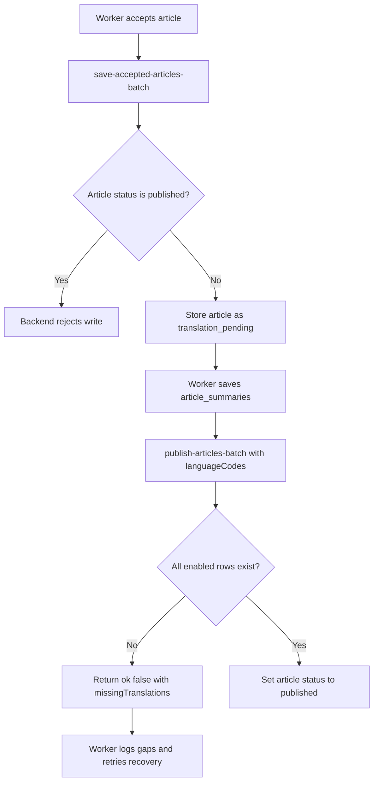
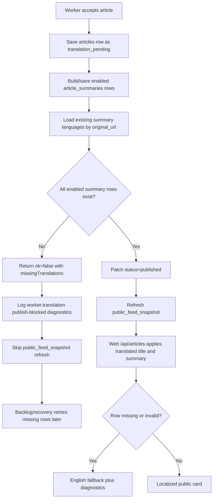

# Multilingual quality checks and fallback policy

Issue #99 adds production checks for translated NutsNews article cards. The goal is to keep multilingual cards useful without letting a missing or questionable translation break the reader feed.

## What is checked

The translation quality audit checks the latest public feed sample against every configured summary language:

| Check | Why it matters |
| --- | --- |
| Translation row exists | Shows coverage by language and identifies backfill gaps. |
| `language_code` matches the requested language | Prevents a French/Japanese/German/Greek row from being stored under the wrong code. |
| Title and summary are present | Prevents blank cards. |
| Summary length is in a safe range | Flags very short, truncated, or overly long summaries. |
| Japanese and Greek script presence | Catches English text accidentally stored as `ja` or `el`. |
| English-source duplicates | Catches translated rows that are actually the original English title or summary. |
| Likely-English Latin text | Flags suspicious French/German/Swiss German rows for review. |

The audit separates findings into three levels:

| Level | Meaning | Public feed behavior |
| --- | --- | --- |
| Missing | No row exists in `article_summaries` for the article/language pair. | Fall back to English. |
| Warning | The row exists but should be reviewed, such as a short summary or likely-English text. | Use the row unless it also has a critical issue. |
| Critical | The row is unsafe, such as a missing summary, wrong language code, missing required script, or exact English duplicate. | Fall back to English. |

## Public fallback behavior

The public feed must never fail because a translation row is missing or questionable.

When a reader selects a non-English language:

1. The API asks for the canonical article cards.
2. The API looks up matching rows in `public.article_summaries`.
3. If a matching row is present and passes critical quality checks, the localized title and summary are used.
4. If a row is missing or critically invalid, the card falls back to the canonical English title and summary.
5. The card keeps `requested_language_code` so the UI knows what the reader asked for, and `translation_available=false` when fallback happened.

This policy keeps new articles visible immediately while the Worker or a backfill catches up.

When the web app runs in `backend_postgres_primary`, `/api/articles` reads article
cards through `https://backend.nutsnews.com/api/app/db/*` instead of direct
Supabase PostgREST. The backend app operations `load-public-feed-snapshot` and
`load-home-feed-snapshot` must apply the same `public.article_summaries` lookup
for `requestedLanguageCode`; otherwise repaired Supabase rows can exist while
the live backend-primary feed still falls back to English.

## Regression coverage

Issue #279 pins the fallback policy in the public reader checks:

- `npm run test:e2e:offline` verifies localized edge snapshot fallback during a mocked Supabase outage and separately verifies an explicit missing-translation English fallback.
- `npm run test:e2e:public-smoke` verifies the deterministic French fixture title and translation metadata.
- `npm run test:e2e:preview` allows English fallback only when the live `/api/articles` payload marks the first article as `translation_available=false`, `language_code=en`, and `requested_language_code=<selected language>`.

Issue #280 makes translation effectiveness release-blocking:

- Simple: releases stop when the release-candidate translation fixture is missing rows, has critical bad rows, or falls below the required coverage.
- Intermediate: the app release candidate now runs public reader smoke, `test:translation-release-gate`, and strict `audit:translations`; the scheduled translation coverage workflow still uploads operations reports without failing by default.
- Expert: the strict audit mode is controlled by `TRANSLATION_QUALITY_FAIL_ON_CRITICAL`, `TRANSLATION_QUALITY_FAIL_ON_MISSING`, and `TRANSLATION_QUALITY_MIN_COVERAGE`. The release candidate uses `true`, `true`, and `100`; the scheduled report uses `false`, `false`, and `0`.

## Worker save policy

The Worker validates local-AI and OpenAI translation responses before saving them to `public.article_summaries`.

The Worker rejects and retries translations that have critical issues. Examples:

- Missing translated title or summary.
- Returned `language_code` does not match the requested language.
- Japanese result has no Japanese characters.
- Greek result has no Greek characters.
- Title or summary exactly matches the English source.

Warnings are logged but do not block saving. This avoids throwing away usable translations because a heuristic is uncertain.

## Backend publish guard

Issue `ramideltoro/nutsnews-backend#263` adds a backend compatibility API guard so backend-primary Worker writes cannot make newly accepted articles visible before the enabled summary-language rows exist.

Simple:

- Accepted articles must be saved as `translation_pending`.
- Publishing requires all enabled non-English summary rows in `public.article_summaries`.
- If a row is missing, the backend leaves the article hidden and returns the missing article/language pairs for Worker logging and recovery.

Intermediate:

- `save-accepted-articles-batch` rejects rows that arrive with `status=published`.
- `publish-articles-batch` requires `languageCodes` when `status=published`.
- Supported publish-gate languages are `fr`, `ja`, `de-CH`, `de`, and `el`.
- The backend checks every requested `original_url` and language pair before updating `public.articles.status`.
- `load-summary-translation-recovery-articles` reads both `published` and `translation_pending` rows so later Worker runs can recover budget overflows and provider failures.

Expert:

- Missing rows return a structured response with `ok=false`, `requestedCount`, `publishedCount=0`, `blockedCount`, and `missingTranslations`.
- Successful guarded publishes use `update public.articles set status = 'published' ... returning original_url`, so the response can report how many rows actually became visible.
- Worker callers must pass their enabled summary language list to `publish-articles-batch`, treat `ok=false` as recoverable, and emit `worker.translation.*` diagnostics that include the returned article URL and language gaps.



## 2026-07-20 public snapshot translation guard

### Simple Summary

NutsNews now waits until a story has the needed translated card text before letting a newly accepted story enter the public feed. If a translation is still missing, readers keep seeing safe English fallback for old rows, and operators get clearer logs showing which translation rows are missing.

### Intermediate Summary

The direct Supabase Worker path now enforces the same publish rule as the backend path: `publishArticlesBatch` checks `public.article_summaries` for every enabled language before patching `public.articles.status=published`. The Worker still saves accepted articles as `translation_pending`, the backlog still fills missing rows, and `public_feed_snapshot` refresh is skipped when the publish guard reports missing translations. The web API keeps English fallback for missing or invalid rows, but it now logs `articles.localized_summaries_missing` with counts and sample URLs so fallback is visible in diagnostics. Article detail pages remain static and language-neutral until a non-dynamic localization path is added.

### Expert Summary

The Worker Supabase client now loads existing `article_summaries` rows using the requested `original_url` set and the configured `ENABLED_SUMMARY_LANGUAGES`, computes publishable vs blocked URLs, and only patches publishable rows. Missing language pairs are returned as `missingTranslations` with `ok=false`, matching the backend-primary contract, so the higher-level Worker logger emits `worker.translation.publish_blocked_missing_summary_translation(s)` and avoids refreshing the public snapshot for incomplete publication batches. Generated Wrangler fallback deployments now default `HOLD_ARTICLES_FOR_TRANSLATIONS=true` even when `NUTSNEWS_ALLOW_OPENAI_FALLBACK_DEPLOYMENT=true`; `SUMMARY_TRANSLATION_LIMIT` can still be `0`, but that becomes a hidden backlog state rather than immediate public English-only exposure. The web app logs missing summary rows during `article_summaries` lookup and keeps `requested_language_code`, `language_code=en`, and `translation_available=false` for fallbacks.

Read-only production checks on July 20, 2026 found:

| Check | Result |
| --- | --- |
| `/api/articles?home=1&lang=fr` | Returned `requested_language_code=fr`, `language_code=en`, `translation_available=false` on visible first-page cards. |
| `public_feed_snapshot` URL count | 1,932 distinct URLs. |
| Missing `fr` rows | 10 of 1,932 snapshot URLs. |
| Missing `ja` rows | 12 of 1,932 snapshot URLs. |
| Missing `de-CH` rows | 960 of 1,932 snapshot URLs. |
| Missing `de` rows | 962 of 1,932 snapshot URLs. |
| Missing `el` rows | 1,007 of 1,932 snapshot URLs. |

No production data was changed during these checks.



### Risks, Mitigations, and Rollback

| Risk | Mitigation |
| --- | --- |
| New articles can remain hidden as `translation_pending` when translation providers fail or the translation task budget is `0`. | This is intentional safer behavior. Use `translate-backlog`, `scripts/backfill_article_summaries.mjs`, and Worker `worker.translation.*` logs to drain gaps before refreshing snapshots. |
| A partial publish batch can publish fully translated rows while blocking incomplete rows, delaying snapshot refresh until a clean publish or backlog run. | The visible-feed invariant is preserved; operators can rerun the backlog after missing rows are saved. |
| Existing already-published snapshot rows can still fall back until their missing `article_summaries` rows are backfilled. | The web API logs missing rows, and the existing audit/backfill scripts identify and fill historical gaps. |
| Detail pages must stay static to preserve the public route CPU/cache guardrails. | Server-rendered article detail pages do not read query parameters; future detail localization should use a client/API path or language-specific route that keeps the cached shell intact. |

Rollback is a normal revert of the Worker and web PRs. Reverting the Worker guard restores direct Supabase publish behavior that can expose newly accepted rows before all translation rows exist. Reverting the web change removes the missing-summary diagnostic log, but the public API keeps its older English fallback behavior. No database migration, secret rotation, or Cloudflare binding rollback is required.

## 2026-07-20 article detail static cache correction

### Simple Summary

NutsNews fixed a staging problem where opening a story page could fail. Story cards still change language in the feed, but individual story pages stay on the fast, saved version until a safer language-specific story-page design is added.

### Intermediate Summary

The first multilingual web fix passed language selection into `/articles/[id]` through query parameters. Next.js treats page `searchParams` as request-specific data, which changed the article detail route away from its static cached contract and caused the staging qualification route check to return HTTP 500 with `DYNAMIC_SERVER_USAGE`. The hotfix removes server-side query language handling from the article detail page, restores the existing `generateStaticParams` plus `revalidate=3600` behavior, and keeps multilingual article card titles/summaries on the feed/API path.

### Expert Summary

`web/app/articles/[id]/page.tsx` must remain an SSG/ISR route because public CPU and cache regressions assert `generateStaticParams`, `export const revalidate = 3600`, and no server `searchParams` usage. The failed staging qualification proved that passing `lang`, `languageCode`, or `language` into the server page conflicted with that route contract. The corrected path calls `getArticleById(id)` for both metadata and page render, derives the page `lang` and date locale from the returned article row, and leaves feed localization in `/api/articles` and `article_summaries` lookup. Future detail localization should use a client-side enhancement or a language-specific URL/API design that does not make the static article page request-specific.

```mermaid
flowchart TD
  A[Reader opens article card] --> B[/articles/id static page]
  B --> C[generateStaticParams + ISR cache]
  C --> D[getArticleById id]
  D --> E[Stable article detail render]
  A --> F[Feed/API language change]
  F --> G[/api/articles?lang=selected]
  G --> H[article_summaries localized card text]
  H --> I[Translated visible feed card]
```

### Risks, Mitigations, and Rollback

| Risk | Mitigation |
| --- | --- |
| Detail pages do not yet localize title and summary by selected UI language. | Feed cards localize through `/api/articles`; detail localization should be reintroduced only with a static-safe client/API or route design. |
| Reverting this hotfix can bring back staging/prod HTTP 500s on article details. | Keep `test:public-route-cpu-cache` in release checks; it rejects server `searchParams` on the article page. |

Rollback is to revert the article detail static-cache hotfix only if a replacement implementation preserves `generateStaticParams`, `revalidate=3600`, and the public route CPU/cache guard. No database, Worker, Vercel, Cloudflare, or secret rollback is required for this correction.

## Admin dashboard

Use:

```text
/admin/translations
```

The dashboard shows:

- Overall translation quality status.
- Expected vs available translation row coverage.
- Missing translation counts by language.
- Warning and critical issue counts by language.
- The latest missing rows and quality findings.
- The fallback policy used by the public feed.

## Daily report

The web repository has a scheduled translation coverage workflow. It writes both console output and a Markdown report artifact.

Manual run:

```bash
cd web
npm run audit:translations
```

Production-style report:

```bash
cd ..
LANGUAGE_CODES=fr,ja,de-CH,de,el \
AUDIT_LIMIT=100 \
AUDIT_SOURCE=public_feed_snapshot \
TRANSLATION_QUALITY_REPORT_PATH=reports/translations/translation-quality.md \
node scripts/audit_article_translations.mjs
```

The workflow is intentionally warning/report oriented by default. For release gates or protected qualification checks, set the strict flags explicitly:

```bash
TRANSLATION_QUALITY_FAIL_ON_CRITICAL=true
TRANSLATION_QUALITY_FAIL_ON_MISSING=true
TRANSLATION_QUALITY_MIN_COVERAGE=100
```

Leave the scheduled `translation-coverage.yml` workflow report-only unless operators intentionally want the daily report to page on production coverage drift.

## Backfill behavior

Use the regular backfill script for missing rows:

```bash
LANGUAGE_CODES=fr,ja,de-CH,de,el \
BACKFILL_SOURCE=public_feed_snapshot \
BACKFILL_LIMIT=25 \
node scripts/backfill_article_summaries.mjs
```

Run small batches first to control AI cost and avoid Worker/API rate pressure.

Issue #282 backfilled production article summary rows across the public feed and latest published article window. Final audits on 2026-07-20 reported:

- Public feed: 474/500 rows available, 95% coverage, 0 critical issues.
- Latest 500 published articles: 2455/2500 rows available, 98% coverage, 0 critical issues.
- Full 500-candidate articles dry scan: 0 non-cached rows selected after live batches.
- `translation_pending` articles with image and summary after final publish confirmation: 0.

The remaining recent rows are cached provider failures, not scan misses. Follow `ramideltoro/nutsnews#287` before retrying the saved failure cache with `RETRY_FAILED=1`. Follow `ramideltoro/nutsnews#289` for the older published-article backlog found outside the recent-content acceptance window.

## Troubleshooting

If the dashboard shows missing translations:

1. Confirm the article exists in the latest public feed sample.
2. Run the audit script with the same `LANGUAGE_CODES` and a larger `AUDIT_LIMIT`.
3. Run a small backfill batch for missing rows.
4. Search Worker logs for `worker.translation.*` events for provider failures or quality rejections.

If the dashboard shows critical quality issues:

1. Inspect the row in `public.article_summaries`.
2. Delete or overwrite the bad row with a backfill.
3. Search Worker logs for `quality_rejected` or provider fallback events.
4. Check the local AI `/translate` prompt if the issue comes from local AI.
