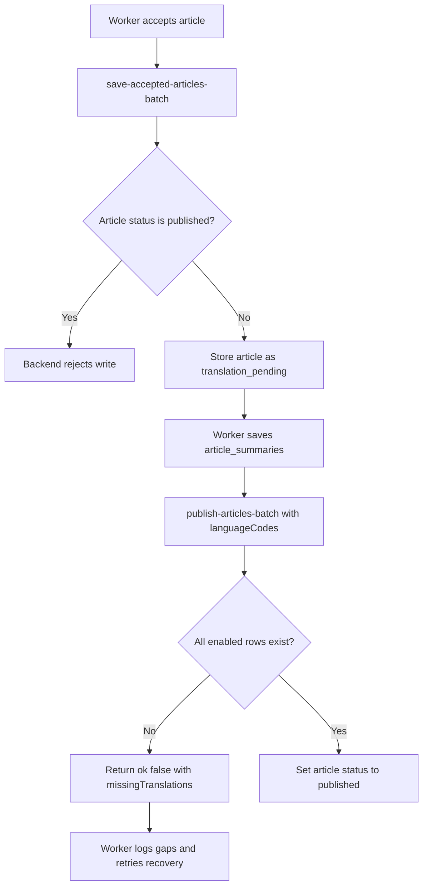

# Multilingual quality checks and fallback policy

Issue #99 adds production checks for translated NutsNews article cards. The goal is to keep multilingual cards useful without letting a missing or questionable translation break the reader feed.

## What is checked

The translation quality audit checks the latest public feed sample against every configured summary language:

| Check | Why it matters |
| --- | --- |
| Translation row exists | Shows coverage by language and identifies backfill gaps. |
| `language_code` matches the requested language | Prevents a French/Japanese/German/Greek row from being stored under the wrong code. |
| Title and summary are present | Prevents blank cards. |
| Summary length is in a safe range | Flags very short, truncated, or overly long summaries. |
| Japanese and Greek script presence | Catches English text accidentally stored as `ja` or `el`. |
| English-source duplicates | Catches translated rows that are actually the original English title or summary. |
| Likely-English Latin text | Flags suspicious French/German/Swiss German rows for review. |

The audit separates findings into three levels:

| Level | Meaning | Public feed behavior |
| --- | --- | --- |
| Missing | No row exists in `article_summaries` for the article/language pair. | Fall back to English. |
| Warning | The row exists but should be reviewed, such as a short summary or likely-English text. | Use the row unless it also has a critical issue. |
| Critical | The row is unsafe, such as a missing summary, wrong language code, missing required script, or exact English duplicate. | Fall back to English. |

## Public fallback behavior

The public feed must never fail because a translation row is missing or questionable.

When a reader selects a non-English language:

1. The API asks for the canonical article cards.
2. The API looks up matching rows in `public.article_summaries`.
3. If a matching row is present and passes critical quality checks, the localized title and summary are used.
4. If a row is missing or critically invalid, the card falls back to the canonical English title and summary.
5. The card keeps `requested_language_code` so the UI knows what the reader asked for, and `translation_available=false` when fallback happened.

This policy keeps new articles visible immediately while the Worker or a backfill catches up.

## Regression coverage

Issue #279 pins the fallback policy in the public reader checks:

- `npm run test:e2e:offline` verifies localized edge snapshot fallback during a mocked Supabase outage and separately verifies an explicit missing-translation English fallback.
- `npm run test:e2e:public-smoke` verifies the deterministic French fixture title and translation metadata.
- `npm run test:e2e:preview` allows English fallback only when the live `/api/articles` payload marks the first article as `translation_available=false`, `language_code=en`, and `requested_language_code=<selected language>`.

Issue #280 makes translation effectiveness release-blocking:

- Simple: releases stop when the release-candidate translation fixture is missing rows, has critical bad rows, or falls below the required coverage.
- Intermediate: the app release candidate now runs public reader smoke, `test:translation-release-gate`, and strict `audit:translations`; the scheduled translation coverage workflow still uploads operations reports without failing by default.
- Expert: the strict audit mode is controlled by `TRANSLATION_QUALITY_FAIL_ON_CRITICAL`, `TRANSLATION_QUALITY_FAIL_ON_MISSING`, and `TRANSLATION_QUALITY_MIN_COVERAGE`. The release candidate uses `true`, `true`, and `100`; the scheduled report uses `false`, `false`, and `0`.

## Worker save policy

The Worker validates local-AI and OpenAI translation responses before saving them to `public.article_summaries`.

The Worker rejects and retries translations that have critical issues. Examples:

- Missing translated title or summary.
- Returned `language_code` does not match the requested language.
- Japanese result has no Japanese characters.
- Greek result has no Greek characters.
- Title or summary exactly matches the English source.

Warnings are logged but do not block saving. This avoids throwing away usable translations because a heuristic is uncertain.

## Backend publish guard

Issue `ramideltoro/nutsnews-backend#263` adds a backend compatibility API guard so backend-primary Worker writes cannot make newly accepted articles visible before the enabled summary-language rows exist.

Simple:

- Accepted articles must be saved as `translation_pending`.
- Publishing requires all enabled non-English summary rows in `public.article_summaries`.
- If a row is missing, the backend leaves the article hidden and returns the missing article/language pairs for Worker logging and recovery.

Intermediate:

- `save-accepted-articles-batch` rejects rows that arrive with `status=published`.
- `publish-articles-batch` requires `languageCodes` when `status=published`.
- Supported publish-gate languages are `fr`, `ja`, `de-CH`, `de`, and `el`.
- The backend checks every requested `original_url` and language pair before updating `public.articles.status`.
- `load-summary-translation-recovery-articles` reads both `published` and `translation_pending` rows so later Worker runs can recover budget overflows and provider failures.

Expert:

- Missing rows return a structured response with `ok=false`, `requestedCount`, `publishedCount=0`, `blockedCount`, and `missingTranslations`.
- Successful guarded publishes use `update public.articles set status = 'published' ... returning original_url`, so the response can report how many rows actually became visible.
- Worker callers must pass their enabled summary language list to `publish-articles-batch`, treat `ok=false` as recoverable, and emit `worker.translation.*` diagnostics that include the returned article URL and language gaps.



## Admin dashboard

Use:

```text
/admin/translations
```

The dashboard shows:

- Overall translation quality status.
- Expected vs available translation row coverage.
- Missing translation counts by language.
- Warning and critical issue counts by language.
- The latest missing rows and quality findings.
- The fallback policy used by the public feed.

## Daily report

The web repository has a scheduled translation coverage workflow. It writes both console output and a Markdown report artifact.

Manual run:

```bash
cd web
npm run audit:translations
```

Production-style report:

```bash
cd ..
LANGUAGE_CODES=fr,ja,de-CH,de,el \
AUDIT_LIMIT=100 \
AUDIT_SOURCE=public_feed_snapshot \
TRANSLATION_QUALITY_REPORT_PATH=reports/translations/translation-quality.md \
node scripts/audit_article_translations.mjs
```

The workflow is intentionally warning/report oriented by default. For release gates or protected qualification checks, set the strict flags explicitly:

```bash
TRANSLATION_QUALITY_FAIL_ON_CRITICAL=true
TRANSLATION_QUALITY_FAIL_ON_MISSING=true
TRANSLATION_QUALITY_MIN_COVERAGE=100
```

Leave the scheduled `translation-coverage.yml` workflow report-only unless operators intentionally want the daily report to page on production coverage drift.

## Backfill behavior

Use the regular backfill script for missing rows:

```bash
LANGUAGE_CODES=fr,ja,de-CH,de,el \
BACKFILL_SOURCE=public_feed_snapshot \
BACKFILL_LIMIT=25 \
node scripts/backfill_article_summaries.mjs
```

Run small batches first to control AI cost and avoid Worker/API rate pressure.

## Troubleshooting

If the dashboard shows missing translations:

1. Confirm the article exists in the latest public feed sample.
2. Run the audit script with the same `LANGUAGE_CODES` and a larger `AUDIT_LIMIT`.
3. Run a small backfill batch for missing rows.
4. Search Worker logs for `worker.translation.*` events for provider failures or quality rejections.

If the dashboard shows critical quality issues:

1. Inspect the row in `public.article_summaries`.
2. Delete or overwrite the bad row with a backfill.
3. Search Worker logs for `quality_rejected` or provider fallback events.
4. Check the local AI `/translate` prompt if the issue comes from local AI.
