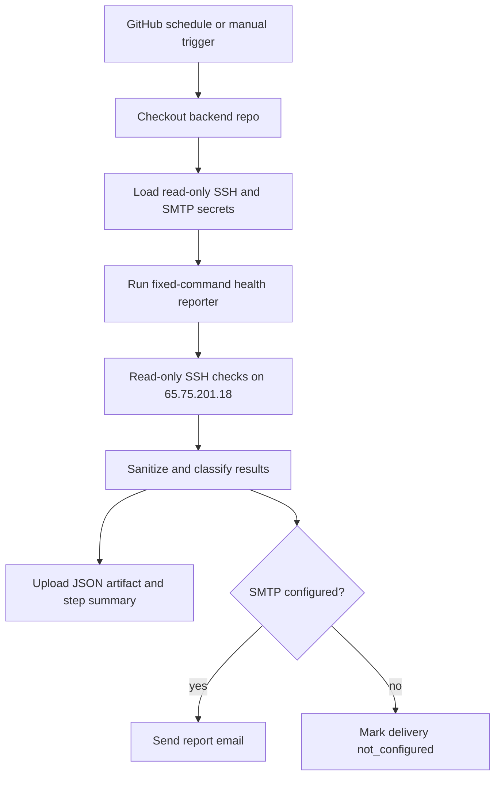

# NutsNews Backend Health Report

## Simple Summary

NutsNews now has a daily backend checkup. It looks at the backend server, writes down what looks healthy or needs attention, and can email the report without changing the server.

## Intermediate Summary

The `ramideltoro/nutsnews-backend` repository owns a scheduled GitHub Actions workflow named `Backend Health Report`. It uses read-only SSH to inspect `65.75.201.18`, generates a sanitized JSON report artifact, writes a GitHub run summary, and sends email when SMTP secrets are configured. It reports host resources, service state, backup tooling, update/reboot state, failed units, timers, listeners, and recent critical errors. The workflow is fixed-purpose and does not accept arbitrary commands or perform host mutation.

## Expert Summary

Backend issue `ramideltoro/nutsnews-backend#38` adds `scripts/backend_health_report.py`, `.github/workflows/backend-health-report.yml`, tests, and `runbooks/BACKEND_HEALTH_REPORT.md`. The reporter executes a closed set of read-only SSH commands, redacts common token/private-key/URL-password/email patterns, classifies checks as `healthy`, `warning`, `critical`, `unknown`, or `not_configured`, and records `last_report_run_at`, `next_report_run_at`, `last_report_success_at`, `last_error`, and delivery status in JSON. SMTP delivery uses repository secrets by name only and degrades to `not_configured` when optional reporting credentials are absent. The workflow does not use the protected Ansible apply path, does not call `sudo` except for the non-mutating `sudo -n true` readiness check, and does not restart, install, or edit anything on the backend host.

## Control Flow



## Report Contents

The generated report includes:

- run timing and next expected run;
- memory, root disk, root inode, load, uptime, kernel, and OS signals;
- reboot-required and package-update state;
- SSH, UFW, fail2ban, Docker, Caddy, PostgreSQL, Alloy, and sysstat service states;
- backup tool presence such as restic/rclone;
- RabbitMQ broker health, drift status, and last smoke status when probe
  evidence exists;
- RabbitMQ recovery evidence when
  `/var/lib/nutsnews/rabbitmq-recovery/last-*.json` files exist;
- cleanup last-run status when `/var/lib/nutsnews/cleanup/last-cleanup.json`
  exists;
- recovery last-run status when `/var/lib/nutsnews/recovery/last-recovery.json`
  exists;
- relevant timers and backend units;
- public listener inventory;
- recent critical journal entries visible to the read-only audit user;
- delivery status without recipient or credential values.

Backend services that are intentionally absent, such as Docker or PostgreSQL in
the current phase, appear as `not_configured` rather than failed production
services.

For the worker-uplift broker, RabbitMQ checks report broker health, drift
status, last smoke status, definition export, clean rebuild drill, and
stopped-volume restore drill freshness without exposing raw definitions,
password hashes, broker data, or credential files. The health report reads
existing RabbitMQ evidence; it does not run smoke probes or restart the broker.

## Required Secrets

Repository secrets in `ramideltoro/nutsnews-backend`:

| Secret | Purpose |
| --- | --- |
| `NUTSNEWS_BACKEND_SSH_PRIVATE_KEY` | Read-only SSH key for the backend audit session |
| `NUTSNEWS_BACKEND_KNOWN_HOSTS` | Verified known_hosts entry for `65.75.201.18` |
| `NUTSNEWS_REPORT_SMTP_HOST` | SMTP host for report delivery |
| `NUTSNEWS_REPORT_SMTP_USERNAME` | SMTP username |
| `NUTSNEWS_REPORT_SMTP_PASSWORD` | SMTP password or provider token |
| `NUTSNEWS_REPORT_EMAIL_FROM` | Sender address |
| `NUTSNEWS_REPORT_EMAIL_TO` | Recipient address list |

Optional variables:

| Variable | Default |
| --- | --- |
| `NUTSNEWS_BACKEND_HOST` | `65.75.201.18` |
| `NUTSNEWS_REPORT_SMTP_PORT` | `587` |
| `NUTSNEWS_REPORT_SMTP_STARTTLS` | `true` |
| `NUTSNEWS_REPORT_SUBJECT_PREFIX` | `[NutsNews backend]` |

## Operational Impact

The report improves visibility while the backend host is still in the early bootstrap phase. It shows known blockers such as package updates, missing fail2ban deployment, missing restic, and lack of noninteractive sudo without making any of those changes itself.

The workflow runs daily at `12:17 UTC`. Manual runs can disable email delivery for validation.

## Validation

Backend validation for the change:

```bash
python3 scripts/validate_no_secret_files.py
python3 scripts/validate_recovery_workflows.py
python3 scripts/validate_backend_credential_inventory.py
python3 scripts/validate_service_baseline.py
python3 scripts/validate_abuse_protection_decision.py
python3 scripts/validate_redis_valkey_decision.py
python3 scripts/validate_search_service_decision.py
python3 scripts/validate_postgres_replacement_plan.py
python3 -m unittest discover -s tests
actionlint .github/workflows/backend-health-report.yml .github/workflows/backend-checks.yml .github/workflows/backend-credential-readiness.yml .github/workflows/backend-drift-check.yml .github/workflows/protected-backend-ansible-apply.yml
/tmp/nutsnews-backend-ansible-venv/bin/ansible-playbook ansible/playbooks/bootstrap.yml --syntax-check -i ansible/inventories/production/hosts.yml
python3 scripts/backend_health_report.py --ssh-host 65.75.201.18 --ssh-user rami --ssh-key ~/.ssh/servercheap_65_75_201_18 --known-hosts ~/.ssh/known_hosts --output /tmp/backend-health-report-live.json
```

The live no-email report on July 16, 2026 showed `0` critical checks, `3` warnings, `5` not-configured checks, and `8` healthy checks. Warnings were package updates, inactive fail2ban, and lack of noninteractive sudo.

## Risks And Mitigations

| Risk | Mitigation |
| --- | --- |
| Report output could include sensitive data | Reporter redacts common token, private-key, URL-password, and email patterns before writing output |
| Email could become noisy | Manual runs can disable email, and future alert-deduplication work can add cooldown state |
| Scheduled workflow could fail if repository secrets are missing | Missing SSH secrets fail early by name only; missing SMTP secrets degrade to `not_configured` |
| A read-only report could be mistaken for remediation | Runbook states that no package, firewall, service, or Ansible apply mutation happens in this workflow |

## Rollback

Disable the `Backend Health Report` workflow or revert the backend PR if reports become noisy or delivery fails. Rotate SMTP or SSH credentials in GitHub secrets if credential exposure is suspected.
