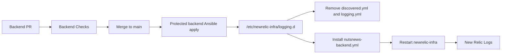

# NutsNews Backend Monitoring Baseline

This documents the initial monitoring, health check, and log-retention baseline for `ramideltoro/nutsnews-backend` and `65.75.201.18`.

## Host Baseline

Backend issue #7 adds repo-managed host observability through the backend Ansible baseline role.

Implementation shape:

- Install `logrotate` and `sysstat`.
- Create `/var/log/nutsnews`.
- Configure persistent journald with `SystemMaxUse=512M` and `MaxRetentionSec=14day`.
- Rotate `/var/log/nutsnews/*.log` daily with 14 compressed rotations.
- Enable sysstat collection.
- Install `/usr/local/sbin/nutsnews-backend-smoke`.

## Health Checks

Host smoke command after approved apply:

```bash
sudo /usr/local/sbin/nutsnews-backend-smoke
```

Read-only remote check:

```bash
ssh -i ~/.ssh/servercheap_65_75_201_18 rami@65.75.201.18 'hostname && systemctl --failed --no-pager && ss -tulpen 2>/dev/null || ss -tulpn'
```

Backend app health endpoint:

```text
/healthz
```

Until the backend app exists, application status is `not_deployed`.

## Initial Thresholds

| Signal | Warning | Critical |
| --- | --- | --- |
| Root disk used | 80% | 90% |
| Root inode used | 80% | 90% |
| Memory used | 80% | 90% |
| Load average per CPU | 1.5 | 2.5 |
| Failed systemd units | any failed unit | any failed unit after one recheck |
| Pending reboot | present after maintenance window | present after approved reboot window |
| Backend endpoint | one failed check | two consecutive failed checks |
| Backup freshness | workload-specific | beyond restore policy RPO |

## Cleanup Maintenance

Backend issue #41 adds `.github/workflows/backend-cleanup-maintenance.yml` in
`ramideltoro/nutsnews-backend`.

The workflow has `report`, `dry-run`, and protected `apply` actions. It is
allowlist-based and only targets stale temp files, apt package archives,
dangling Docker images, and Docker build cache older than 7 days. It protects
Caddy state, Docker volumes, backup state/repositories, database data, app
persistent data, ops dashboard files, and core host configuration.

Cleanup `apply` requires the `production-backend` Environment and
`confirm_apply=backend.nutsnews.com`. Reports and dry-runs upload
`backend-cleanup-maintenance-report.json` without deleting anything.

The backend health report exposes `cleanup_last_run`; it remains
`not_configured` until an approved cleanup apply writes the host state file.

## Recovery Workflows

Backend issue #42 adds `.github/workflows/backend-recovery.yml` in
`ramideltoro/nutsnews-backend`.

The workflow has `check` and protected `apply` modes. It accepts only fixed
actions: diagnostics, backup status, backup trigger, restore-drill trigger,
Caddy reload/restart, Alloy restart, fail2ban restart, metrics refresh, and
ops-dashboard status refresh. It does not accept arbitrary commands, service
names, shell scripts, Ansible tags, paths, or user supplied remote snippets.

Mutating `apply` runs require the `production-backend` Environment and
`confirm_target=backend.nutsnews.com`. Each action has action-specific
prechecks and postchecks. Approved mutating applies write
`/var/lib/nutsnews/recovery/last-recovery.json`, and the backend health report
exposes that state as `recovery_last_run`.

## Log Retention

- System journal: persistent, capped at 512 MiB, retained up to 14 days.
- Backend app logs: `/var/log/nutsnews/*.log`, daily rotation, 14 retained rotations, compressed.
- Logs must not contain secrets, tokens, private keys, database dumps, or full environment output.

## New Relic Host Log Guardrails

### Simple Summary

The backend now has a safer New Relic log setup plan. It sends only useful
problem and security logs, and it stops sending the noisy New Relic CLI log that
can contain secret-looking command output.

### Intermediate Summary

Backend issue
[`ramideltoro/nutsnews-backend#155`](https://github.com/ramideltoro/nutsnews-backend/issues/155)
is handled through a repo-managed host fallback because live New Relic
obfuscation and Pipeline Cloud drop-rule mutations are blocked by account RBAC.
When the protected backend apply workflow has a New Relic ingest key, it enables
`backend_newrelic_logs_enabled`, removes guided-install `discovered.yml` and
`logging.yml`, and installs
`/etc/newrelic-infra/logging.d/nutsnews-backend.yml`.

Forwarding is intentionally allowlisted:

- Caddy access logs only for 4xx/5xx responses, plus Caddy error logs.
- PostgreSQL warning/error/deadlock/checkpoint/autovacuum/duration signals.
- NutsNews app warning/error/correlation lines.
- `auth.log` and `fail2ban.log` security events.
- New Relic infrastructure warning/error lines.

The managed config does not forward `/root/.newrelic/newrelic-cli.log`,
`dpkg.log`, `cloud-init.log`, `alternatives.log`, or broad unfiltered syslog.
Rollback is to disable `backend_newrelic_logs_enabled` or revert the backend PR
and rerun protected backend apply; the New Relic infrastructure agent remains
installed but stops receiving the curated config.

### Expert Summary

The backend Ansible baseline owns the host-side New Relic log source list rather
than relying on New Relic account-side obfuscation/drop-rule APIs that currently
return `ACCESS_DENIED`. The control path is:



This change reduces free-tier ingest risk before data leaves the host. It is not
a replacement for New Relic account-level obfuscation; if the account later
allows custom obfuscation expressions or Pipeline Cloud rules, those can be
added as a second layer. Verification should check the protected apply diff, the
post-apply `newrelic-infra` service state, and New Relic NRQL counts for future
logs. Historical New Relic logs are not rewritten by this change.

## Grafana Cloud Logs

Backend issue #36 adds Grafana Cloud Loki log shipping through the backend
Grafana Alloy deployment in `ramideltoro/nutsnews-backend`.

Secret names in the GitHub `production-backend` environment:

- `GRAFANA_CLOUD_LOKI_URL`
- `GRAFANA_CLOUD_LOKI_USERNAME`
- `GRAFANA_CLOUD_LOKI_PASSWORD`

Collected sources:

- filtered systemd journal units for Caddy, Alloy, backup/restore verification,
  NutsNews timers, SSH, UFW, fail2ban, unattended-upgrades, and apt timers;
- `/var/log/auth.log` and `/var/log/fail2ban.log` through the host `adm` group;
- `/var/log/caddy/access.log`, `/var/log/caddy/error.log`, and
  `/var/log/nutsnews/*.log` when those files exist.

Alloy remains least-privilege: it runs as the package-managed `alloy` user and
is added only to `systemd-journal` and `adm` for log reads. Docker/Compose
container logs are intentionally excluded until backend app containers exist and
a reviewed socket-free or otherwise least-privilege collection path is added.

Before logs are shipped, Alloy drops private-key markers and oversized lines,
redacts authorization headers, cookies, token/password/API-key style values,
query strings, and email addresses, truncates long lines, and keeps only stable
labels:

```text
environment, host, source, service, unit, severity, filename, job
```

Grafana objects:

- Folder: `NutsNews Backend Ops` (`nutsnews-backend-ops`)
- Logs dashboard: `NutsNews Backend Logs` (`nutsnews-backend-logs`)
- Live logs datasource verified on 2026-07-17: `grafanacloud-kindcantaloupe2036-logs` (`grafanacloud-logs`)
- Managed fallback logs datasource if no Cloud Logs datasource exists: `grafanacloud-nutsnews-backend-loki` (`grafanacloud-loki`)
- Datasource type: Grafana Loki (`loki`)

The backend provisioner intentionally avoids Grafana's alert-state-history Loki
datasource because that stores alert history, not backend host logs.

## Grafana Alert Guardrails

Backend issue #25 adds a repo-managed Grafana alert group named
`NutsNews Backend Guardrails` in the `NutsNews Backend Ops` folder.

Initial alert rules cover:

- missing backend host metrics;
- unhealthy `/healthz` endpoint;
- failed systemd units;
- unhealthy backup, verification, or restore-drill stages;
- root disk warning above 80%;
- reboot-required warning after 24 hours;
- missing backend journal logs in Loki;
- backend log volume above the free-tier guardrail threshold.
- SSH authentication failure spikes;
- fail2ban SSH ban events.

The rules use the backend textfile metrics and explicit `noDataState` settings
so intentionally not-configured services do not page as failures. Notification
routing, deduplication, cooldowns, and recovery messages are managed by the
backend report artifacts described below.

The abuse-detection rules added for backend issue #40 are report-only. They do
not mutate UFW, Caddy, Cloudflare, fail2ban, or host firewall policy. Their Loki
queries are scoped to stable `security` labels and avoid IP, path, user, request
ID, and raw-message labels.

## Off-Box Synthetic Monitoring

Backend issue #30 adds `.github/workflows/backend-synthetic-monitor.yml` in
`ramideltoro/nutsnews-backend`.

The workflow runs hourly from GitHub-hosted runners and checks public endpoints
without authentication or production mutation:

- `https://www.nutsnews.com/`
- `https://nutsnews.com/` redirect behavior
- `https://backend.nutsnews.com/healthz`
- `https://backend.nutsnews.com/` expected current `404`
- Supabase public status API as the auth-provider availability signal

Each run uploads `backend-synthetic-report.json`, writes a GitHub step summary,
and sends email only on unsuppressed alert notifications through the existing
NutsNews reporting SMTP secret names. The report includes endpoint, HTTP status,
failure class, source provider/location, alerting summary, alert state, and last
successful check timestamp when a previous completed artifact is available.

## Alert Deduplication And Recovery

Backend issue #39 adds artifact-backed alert state to the recurring health
report and off-box synthetic monitor.

State storage:

- `backend-health-report.yml` downloads the previous completed
  `backend-health-report` artifact from `main`.
- `backend-synthetic-monitor.yml` downloads the previous completed
  `backend-synthetic-report` artifact from `main`.
- Each new report writes `alert_state.alerts` back into the next uploaded JSON
  artifact.

Fingerprint inputs:

- source;
- service/check name;
- severity;
- failure class;
- normalized message text with volatile timestamps, long hex IDs, and numbers
  replaced.

Cooldown policy:

- health report alerts: `24` hours;
- synthetic monitor alerts: `1` hour.

Visible fields in JSON artifacts and GitHub summaries:

- active alert count;
- notification count;
- suppressed count for the current run;
- cumulative suppressed count on each active alert record;
- recovered count;
- last sent timestamp;
- last error;
- notification list;
- suppressed list.

Alert severities are `warning`, `critical`, `unknown`, and `recovered`.
Healthy and intentionally `not_configured` health checks do not create alert
candidates. Recovery notifications are emitted when an active fingerprint from
the previous artifact is absent from the current run.

## Grafana Cloud Metrics

Backend issue #35 adds the repo-managed Grafana Cloud metrics path from
`ramideltoro/nutsnews-backend`.

Host deployment path:

- Protected Ansible apply installs Grafana Alloy from the Grafana apt repository.
- Alloy uses `/etc/alloy/config.alloy` and remote-writes to Grafana Cloud Prometheus.
- Remote-write credentials live only in the GitHub `production-backend` environment as:
  - `GRAFANA_CLOUD_PROMETHEUS_URL`
  - `GRAFANA_CLOUD_PROMETHEUS_USERNAME`
  - `GRAFANA_CLOUD_PROMETHEUS_PASSWORD`
- Alloy scrapes local exporter targets only. No Prometheus scrape port is exposed publicly.
- `/usr/local/bin/nutsnews-metrics-textfile` writes low-cardinality NutsNews metrics into `/var/lib/nutsnews/metrics/nutsnews.prom`.
- `nutsnews-metrics-textfile.timer` refreshes endpoint, service, update, backup, restore-drill, and quota-state metrics every minute.

Grafana provisioning path:

- Dashboard specs live in `grafana/backend-metrics/dashboards.json`.
- `Backend Grafana Metrics` validates, applies, and verifies the Grafana folder and dashboards with `scripts/provision_grafana_metrics.py`.
- The managed folder is `NutsNews Backend Ops` with UID `nutsnews-backend-ops`.
- Managed dashboards cover host resources, Docker/runtime state, Caddy/edge health, service health, backups, OS updates, metrics quota guardrails, and alert/synthetic health.

Operator verification:

```bash
gh workflow run protected-backend-ansible-apply.yml \
  --repo ramideltoro/nutsnews-backend \
  --ref main \
  -f run_mode=apply \
  -f confirm_apply=backend.nutsnews.com

gh workflow run backend-grafana-metrics.yml \
  --repo ramideltoro/nutsnews-backend \
  --ref main \
  -f action=apply \
  -f confirm_apply=backend.nutsnews.com

gh workflow run backend-grafana-metrics.yml \
  --repo ramideltoro/nutsnews-backend \
  --ref main \
  -f action=verify
```

Expected live evidence:

- `alloy` service is active.
- `id alloy` includes only narrow log-read groups such as `adm` and `systemd-journal`.
- `nutsnews-metrics-textfile.timer` is enabled and active.
- `ss -tuln` does not show public listeners on `9100`, `9090`, `9091`, or `12345`.
- Grafana verification returns data for:
  - `up{job="nutsnews-backend-host"}`
  - `nutsnews_backend_backup_stage_healthy{stage="backup"}`
  - `nutsnews_backend_public_endpoint_healthy`
  - `{host="backend.nutsnews.com",source="journal"}`

## New Relic Foundation

Backend issues #134, #135, #136, #137, and #139 establish the repo-managed
New Relic foundation without storing credentials in git.

The backend repo owns:

- `docs/newrelic-observability-taxonomy.json` for the canonical service name,
  tags, dashboard naming, entity grouping, and workload grouping;
- `docs/newrelic/dashboards/*.json` for versioned dashboard definitions;
- `scripts/provision_newrelic_dashboards.py` for NerdGraph dashboard
  create/update operations;
- `scripts/backend_newrelic_observability_check.py` for safe post-deploy or
  post-rotation reporting checks;
- `runbooks/NEW_RELIC_OBSERVABILITY.md` for API keys, rotation, validation,
  and source links.

Live New Relic provisioning requires `NEW_RELIC_USER_KEY`,
`NEW_RELIC_ACCOUNT_ID`, and `NEW_RELIC_REGION`. Agent ingest requires
`NEW_RELIC_LICENSE_KEY` and `NEW_RELIC_APP_NAME`. Without those values, the
backend validation commands run only in offline/check mode and must not pretend
that dashboards, APM, infrastructure, logs, or PostgreSQL integrations are
reporting.

### APM Dashboard Pack

Backend issues #138, #140, #141, and #142 add versioned New Relic dashboard
definitions for:

- backend error rate, exceptions, failing transactions, and trace context;
- transaction slow paths, database time, outbound time, and repeated slow
  endpoints;
- PHP APM throughput, latency percentiles, latency distribution, and Apdex;
- outbound dependency volume, latency, errors, host facets, and transaction
  contribution.

The dashboard definitions remain reviewable repo state until
`scripts/provision_newrelic_dashboards.py` is run with New Relic credentials.
The definitions use a 24 hour default window, bounded facets, and repo-managed
dashboard names under the `NutsNews Backend - ` prefix.

Backend issues #144, #146, #147, and #149 add runtime and host dashboard
definitions for:

- PHP-FPM worker capacity, listen queue pressure, max children, slow requests,
  process churn, and APM latency correlation;
- Caddy request volume by status code, redirects, 4xx/5xx trends, request
  latency, bounded parsed paths, and bounded user-agent facets;
- backend host CPU, load, memory, swap, disk, network, and top process resource
  use;
- systemd service state, restarts, failed/inactive units, critical process
  presence, and service-scoped logs.

This pack does not expose a PHP-FPM status endpoint or change Caddy routing.
Live dashboards expect low-cardinality PHP-FPM metrics, parsed Caddy log fields,
New Relic infrastructure samples, and systemd service state metrics or
equivalent service-health events.

Backend issues #151, #152, #153, and #154 add PostgreSQL dashboard definitions
for:

- database availability, connection capacity, transactions, cache behavior,
  deadlocks, checkpoints, and storage;
- APM-to-PostgreSQL correlation using transaction database time, datastore
  spans, wait events, and trace IDs;
- query performance using query IDs, statement types, execution count, elapsed
  time, disk reads/writes, and plan rows without showing raw SQL text;
- operations signals for blocking sessions, wait events, vacuum freshness,
  bloat, table/index storage, and optional replication lag.

These dashboards assume the New Relic on-host PostgreSQL integration. Table and
index metrics require read access to collected tables, and query diagnostics
require `pg_stat_statements` plus statistics-reader permissions for the New
Relic integration role.

Backend issues #155, #156, #157, and #158 add the repo-side log policy and log
dashboard definitions:

- `docs/newrelic-log-policy.json` defines required structured fields,
  excluded fields, redaction classes, retained log categories, drop-rule intent,
  and expected daily ingest volume;
- logs should be queryable by `request.id`, `trace.id`, `route`,
  `http.statusCode`, `duration.ms`, `deployment.version`, `exception.class`,
  and `message.safe`;
- the ingest dashboard uses `NrConsumption` and `NrMTDConsumption` to track
  monthly usage, 24 hour run rate, noisy usage groups, and noisy log sources;
- the logs diagnostics dashboard uses parsed fields for severity, route/status,
  host/unit, deployment, exception class, and trace/request pivots.

Live New Relic parsing, obfuscation, and drop-filter rules still require New
Relic account access and may depend on account features. Until then, the repo
policy is the intended implementation contract.

Backend issues #161, #166, #173, and #175 add service-quality and release
dashboard definitions plus `docs/newrelic-service-levels.json`:

- initial production SLOs cover availability, latency, error-free requests, and
  feed freshness over a 30 day period;
- the initial backend API Apdex target is 0.5 seconds, to be revisited after
  seven stable production days;
- golden metric views cover throughput, latency, error rate, host saturation,
  and PHP-FPM saturation;
- baseline views compare current throughput, latency, error rate, and log
  volume against last week;
- release-health views show `Deployment` markers, before/after health, new
  exception classes, log regressions, and rollback decision signals.

The backend New Relic runbook now doubles as the operator README for dashboard
selection and common triage flows. Live New Relic SLO, Apdex, anomaly-alert,
and change-tracking mutations still require New Relic account credentials and
permissions.

Backend issues #148, #169, and #171 add trace diagnostics and telemetry review
artifacts:

- `backend-trace-diagnostics` shows trace count, slow spans, error traces,
  database spans, outbound spans, service dependencies, and trace-to-log pivots;
- `scripts/backend_newrelic_observability_check.py --enforce` now checks PHP
  distributed tracing configuration;
- `docs/newrelic-cache-queue-decision.json` records that no backend-owned cache
  or queue dashboard should exist until a real workload is introduced;
- `docs/newrelic-telemetry-privacy-review.json` covers logs, APM attributes,
  custom events, query attributes, and synthetics with allowlist/denylist
  boundaries.

Real trace existence and live New Relic privacy/drop-filter behavior still
require account credentials and backend request traffic.

Backend issues #174 and #176 add operator-facing demo and dashboard UX
artifacts:

- `docs/newrelic-dashboard-ux.json` maps the dashboard pack to supported
  global filters, primary operator questions, drilldowns, and dependency
  signals;
- `runbooks/NEW_RELIC_OBSERVABILITY_DEMO.md` provides bounded walkthroughs for
  latency, error-rate, PostgreSQL, host, log, and release-health demo paths;
- the backend validator now checks that every repo-managed New Relic dashboard
  has UX coverage and that the demo runbook stays linked from the main
  observability runbook.

Backend issues #143, #145, #150, #159, #160, #163, #165, #167, #168, #170,
and #172 now have a repo-owned live configuration contract:

- `docs/newrelic-live-configuration.json` defines key transactions, custom
  attributes, custom metrics, background job telemetry, alert policies,
  notification workflow expectations, synthetics, deployment markers, workload
  grouping, and Errors Inbox triage;
- `scripts/newrelic_change_tracking.py` and
  `.github/workflows/backend-newrelic-change-tracking.yml` provide a fail-safe
  CI path for New Relic deployment markers once account credentials and the APM
  entity GUID are present;
- live New Relic provisioning and verification still require New Relic account
  credentials, entity access, configured destinations, and backend request
  traffic.

## Status

Issue #7 is complete. Issue #35 owns the Grafana Cloud metrics/dashboard layer, while issue #36 owns Loki log shipping and issue #25 ties metrics, logs, dashboards, and guardrails into the full observability baseline.
