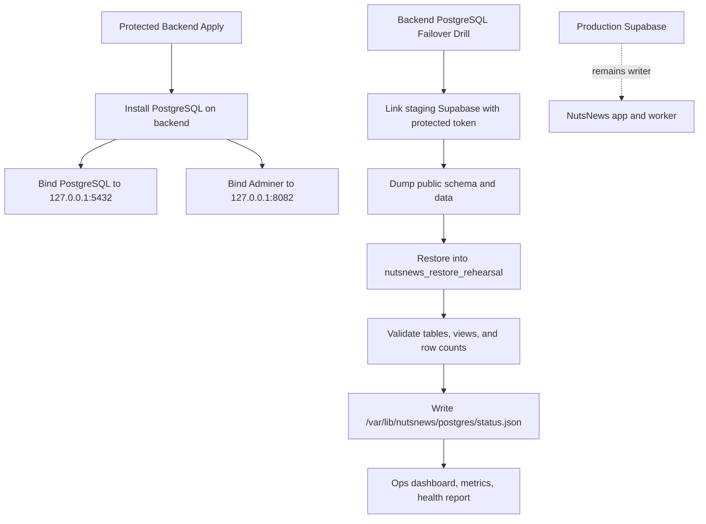
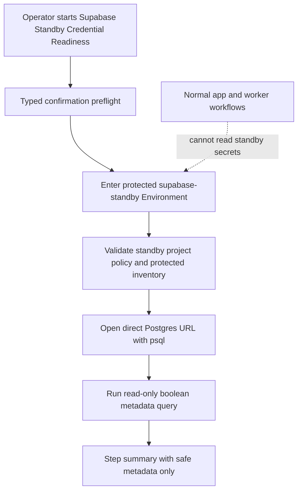
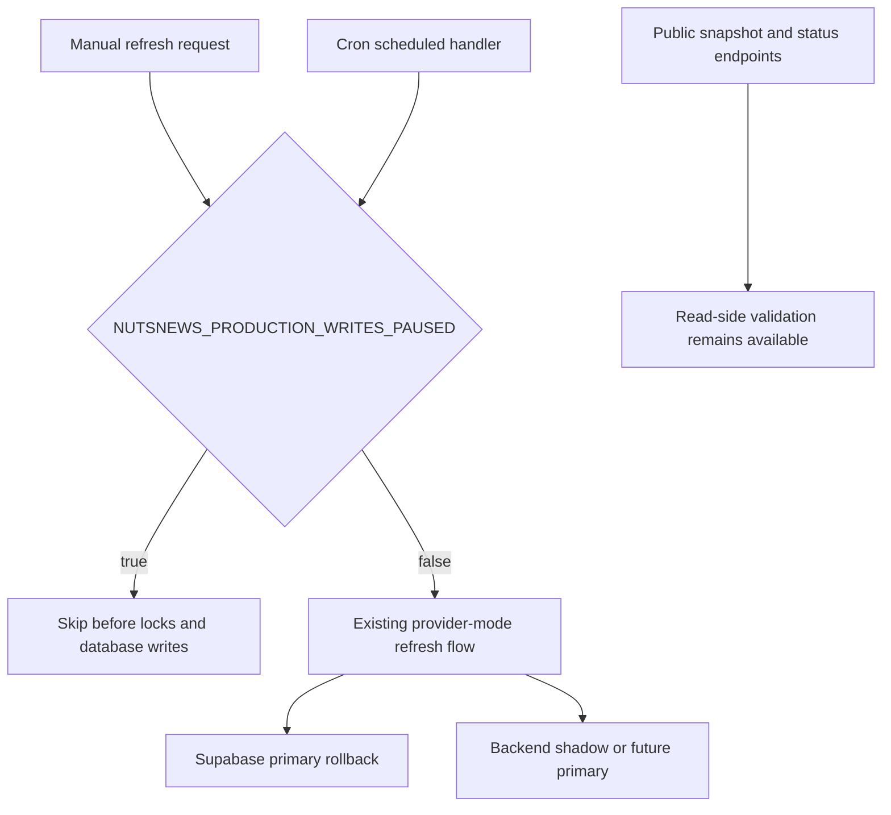
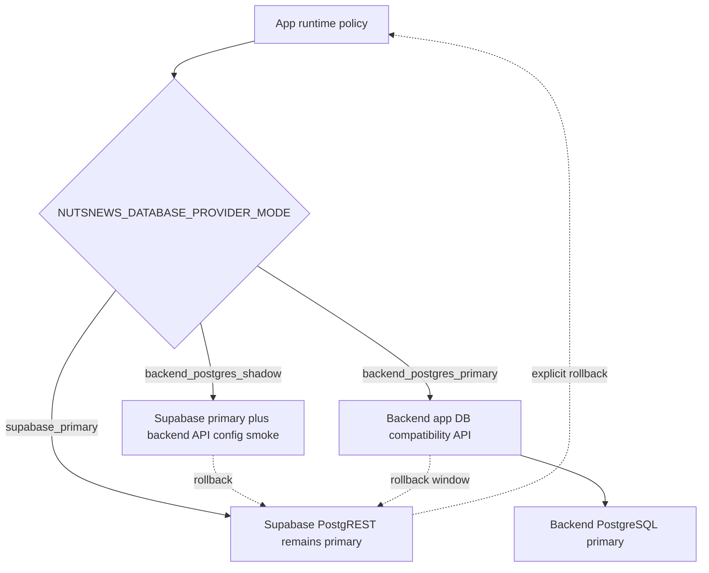
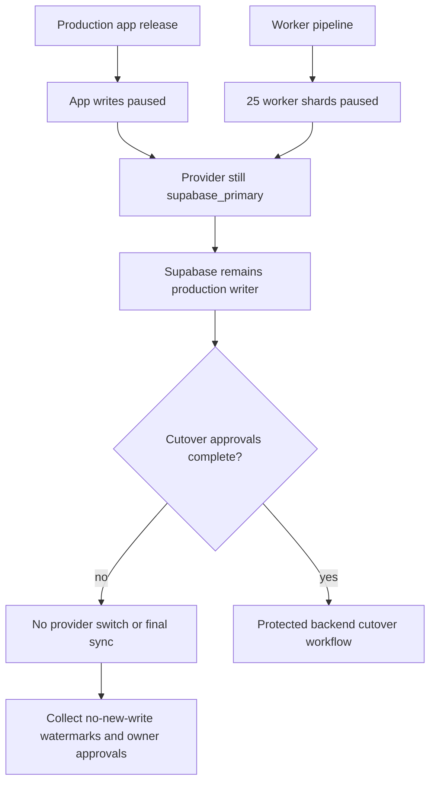

# NutsNews Backend PostgreSQL Failover Target

Architecture status: this backend PostgreSQL path is the approved shadow and
future-primary target, but Supabase remains the production writer until the
protected cutover workflow is explicitly approved and executed. Worker-uplift
target ownership and coexistence are summarized in
[Architecture](ARCHITECTURE.md).

## Simple Summary

NutsNews now has a private backup database place on the backend server. It is not used by the live app yet. It lets us practice restoring safe staging data before anyone tries a real production database move.

## Intermediate Summary

`ramideltoro/nutsnews-backend` provisions PostgreSQL on `backend.nutsnews.com` through the protected Ansible pipeline. PostgreSQL and Adminer are bound to `127.0.0.1` only, so operators must use an SSH tunnel. Supabase remains the production writer. Protected GitHub Actions drills restore staging and production-shadow data into backend PostgreSQL targets, attach one-way logical replication for the primary shadow, and publish readiness to the ops dashboard, metrics, and health report. Feature-flagged worker and app compatibility APIs expose bounded database operations for shadow validation before any primary cutover.

## Expert Summary

Backend issue #13 establishes a single-writer, restore-verified failover target, not active-active replication. The backend repo adds PostgreSQL 18-compatible Ubuntu package provisioning, SCRAM auth for local roles, loopback-only Adminer through Caddy/PHP-FPM, staging and production-shadow logical restore drills, one-way production logical replication into `nutsnews_primary_shadow`, PostgreSQL readiness metrics, worker and app compatibility routes, and an ADR that forbids production cutover until parity evidence and cutover approval exist. Sync-back to Supabase is not supported; failback remains a controlled forward-recovery procedure to avoid split-brain.

## Control Flow



## Operating Model

Supabase remains the only production writer. The backend PostgreSQL database is a private target for restore rehearsal and future controlled failover. It is not a public database endpoint and it does not receive production app traffic.

The first restore path is logical dump/restore from the staging Supabase project into:

```text
nutsnews_restore_rehearsal
```

The production database name reserved by the backend baseline is:

```text
nutsnews_failover
```

The future-primary shadow database used for production-shadow migration gates is:

```text
nutsnews_primary_shadow
```

## Supabase Hot Standby Target Readiness

Related issue: https://github.com/ramideltoro/nutsnews/issues/496
Related app PR: https://github.com/ramideltoro/nutsnews/pull/507

### Simple Summary

NutsNews is adding a second Supabase project as a locked backup place. The live app and worker do not use it yet. A protected GitHub button checks that the backup project's private keys and database doorway exist without showing the keys.

### Intermediate Summary

Issue #496 introduces the app-repo `Supabase Standby Credential Readiness` workflow. It is manual-only, requires the typed confirmation `verify-supabase-standby-readiness`, and enters the protected `supabase-standby` GitHub Environment before reading any standby values. The default policy is a fresh Supabase project, not the existing production project. The readiness check validates the standby project URL, project ref, direct Postgres URL, service-role key, and anon key, then uses `psql` in a read-only transaction to prove direct database connectivity. Normal production app and worker workflows still cannot read the standby service-role key or DB URL, so standby writes remain unavailable until a later approved relay or failover path exists.

### Expert Summary

The standby credential inventory is stored as `supabase-standby` Environment secrets in `ramideltoro/nutsnews`: `NUTSNEWS_STANDBY_SUPABASE_PROJECT_REF`, `NUTSNEWS_STANDBY_SUPABASE_URL`, `NUTSNEWS_STANDBY_SUPABASE_DB_URL`, `NUTSNEWS_STANDBY_SUPABASE_SERVICE_ROLE_KEY`, and `NUTSNEWS_STANDBY_SUPABASE_ANON_KEY`. The local validator rejects non-`fresh-project` policy, malformed project refs, a standby ref that equals `NUTSNEWS_PRODUCTION_SUPABASE_PROJECT_REF`, non-HTTPS project URLs, pooler DB URLs, DB URLs missing `sslmode=require`, missing DB credentials, and identical service-role/anon values. The workflow prints only shape metadata and boolean direct-DB connectivity output; raw URLs, database users, passwords, API keys, and row data are not printed. App-repo regression coverage also scans workflows so no workflow other than `supabase-standby-readiness.yml` reads standby write credentials before a protected failover path is implemented.



Required setup:

| Protected value | Scope | Purpose |
| --- | --- | --- |
| `NUTSNEWS_STANDBY_SUPABASE_PROJECT_REF` | `supabase-standby` Environment secret | Fresh standby Supabase project ref. Must be different from production. |
| `NUTSNEWS_STANDBY_SUPABASE_URL` | `supabase-standby` Environment secret | Standby HTTPS API URL for future failover and parity checks. |
| `NUTSNEWS_STANDBY_SUPABASE_DB_URL` | `supabase-standby` Environment secret | Direct Postgres URL for protected `psql` checks and future controlled sync/bootstrap work. |
| `NUTSNEWS_STANDBY_SUPABASE_SERVICE_ROLE_KEY` | `supabase-standby` Environment secret | Elevated standby API credential for later protected relay/failover work only. |
| `NUTSNEWS_STANDBY_SUPABASE_ANON_KEY` | `supabase-standby` Environment secret | Low-privilege standby API credential retained in the protected environment until failover approval. |

Operational notes:

- The standby project should be newly created for the hot-standby path. Reusing production or staging is rejected by policy.
- Direct database readiness uses the `db.<project-ref>.supabase.co:5432/postgres?sslmode=require` form, not Supavisor pooler URLs.
- The workflow is a readiness gate only. It does not migrate schema, copy data, install a sync relay, promote Supabase, or expose standby credentials to the production app or worker.
- If the workflow fails on missing secrets, populate the protected `supabase-standby` Environment and rerun it. Do not paste values into issues, PRs, docs, or chat.

Risks and mitigations:

| Risk | Mitigation |
| --- | --- |
| Standby credentials accidentally become app or worker runtime inputs before failover | The app-repo regression scans workflow secret usage and allows standby secret reads only in `supabase-standby-readiness.yml` for this phase. |
| A pooler URL passes as direct database readiness | The validator requires the direct `db.<project-ref>.supabase.co` host and TLS. |
| The standby project is actually the production project | The validator compares the standby ref against `NUTSNEWS_PRODUCTION_SUPABASE_PROJECT_REF` and rejects equality. |
| Readiness output leaks credentials | The workflow summary records only safe metadata and boolean DB connectivity results. |

Rollback:

- Revert the app PR that added `supabase-standby-readiness.yml` and its regression guard if the readiness path is incorrect.
- Leave the `supabase-standby` Environment and secrets in place unless the owner explicitly approves removal; issue #223 says Supabase standby credentials and sync resources must not be removed by cleanup work without a separate decision.
- If a standby credential is wrong or over-scoped, rotate it in Supabase, update the protected GitHub Environment secret, and rerun the readiness workflow.

## Worker Compatibility API

Backend issue `ramideltoro/nutsnews-backend#242` owns the backend worker
database compatibility route required by `ramideltoro/nutsnews-worker#27`.

The public route shape is:

```text
https://backend.nutsnews.com/api/worker/db/*
```

The route is disabled unless the protected backend apply receives:

```text
NUTSNEWS_BACKEND_WORKER_API_ENABLED=true
```

Requests authenticate with:

```text
Authorization: Bearer <NUTSNEWS_BACKEND_API_TOKEN>
```

Shadow mode must stay least-privilege and read-only: the backend API connects to
`nutsnews_primary_shadow` as `nutsnews_worker_api`, accepts only bounded
allow-listed worker operations, and rejects write operations before touching
PostgreSQL. The role has `BYPASSRLS` so restored Supabase RLS does not hide
shadow rows from the server-side compatibility API, but its grants are limited
to the Worker read objects used by the route: `articles`,
`article_ai_reviews`, `article_summaries`, `feed_health`,
`public_feed_snapshot`, `rss_feeds`, and `runtime_feature_flags`.
`nutsnews_readonly` remains the generic operator-inspection role, not the Worker
API runtime role.

Backend-primary writes require all of these conditions:

- worker provider mode is `backend_postgres_primary`;
- backend protected apply has `NUTSNEWS_BACKEND_WORKER_API_WRITES_ENABLED=true`;
- the protected backend baseline has granted `nutsnews_app` the same bounded
  Worker read objects plus focused Worker write tables, sequence usage, and
  `refresh_public_feed_snapshot()` execution;
- parity, smoke, rollback, and cutover evidence has been linked from the backend
  migration runbooks and issues.

When `NUTSNEWS_BACKEND_WORKER_API_WRITES_ENABLED=true`, the Worker compatibility
API intentionally connects as `nutsnews_app` instead of `nutsnews_worker_api`.
That app role must bypass restored Supabase RLS and be able to run the complete
Worker path: read feeds, dedupe/review state, existing summaries, feed health,
and edge snapshot rows; insert or update accepted articles, reviews, summaries,
health, AI usage, and worker run rows; update article publish status; and
refresh `public_feed_snapshot`. A write-enabled smoke that only checks empty
batch writes is insufficient; include at least one Worker read probe before
declaring the backend-primary Worker path healthy.

Keep `NUTSNEWS_BACKEND_WORKER_API_WRITES_ENABLED=false` during shadow
validation. Rollback before production cutover is explicit: set the worker back
to `supabase_primary`, or disable `NUTSNEWS_BACKEND_WORKER_API_ENABLED` and
rerun protected backend apply. Supabase remains the production primary until a
separate cutover approval says otherwise.

## App Compatibility Boundary

The web app now has issue `ramideltoro/nutsnews#255` as the app-side
provider-mode tracker. App runtime safety recognizes three modes:

| Mode | Production write owner | Expected use |
| --- | --- | --- |
| `supabase_primary` | Supabase | Default and explicit rollback mode. |
| `backend_postgres_shadow` | Supabase | App can prove backend API configuration while reads and writes still use Supabase. |
| `backend_postgres_primary` | Backend PostgreSQL compatibility API | Future cutover mode only, gated by explicit confirmation and backend app API parity. |

`backend_postgres_primary` must require
`NUTSNEWS_BACKEND_POSTGRES_PRIMARY_CONFIRMATION=enable-backend-postgres-primary`
and must fail closed if app code attempts direct Supabase primary access.
Non-production can exercise backend-primary runtime safety with a mock or
non-production backend API endpoint and without writing to Supabase.

The app compatibility API is separate from the worker operation allowlist but is
served by the same loopback backend database compatibility service. Backend
issue `ramideltoro/nutsnews-backend#247` commits the first app route:

```text
https://backend.nutsnews.com/api/app/db/*
```

That route has app-specific allow-listed operations for public feed snapshots,
article detail and sitemap reads, search, runtime feature flags, readiness
schema-contract replacement, bounded admin dashboard read snapshots, quota usage
writes, article engagement writes, and runtime feature flag writes. It is
enabled by the protected backend apply only when the loopback compatibility
service is enabled; backend-primary writes remain disabled unless the protected
apply explicitly sets the write guardrail on. No browser bundle may receive
backend API tokens or service-role credentials.

As of 2026-07-19, app-route provisioning and non-production smoke evidence is
available:

| Gate | Evidence | Result |
| --- | --- | --- |
| Backend app route PR | `ramideltoro/nutsnews-backend#248`, merge commit `7cdbdd79815009a3e1cfee6ab75820c78df1e902` | `/api/app/db/*` added beside `/api/worker/db/*` |
| Protected check | `protected-backend-ansible-apply` run `29693574619` | passed in `check` mode |
| Protected apply | `protected-backend-ansible-apply` run `29693776534` | passed in `apply` mode with deployment safety preflight and postcheck |
| Backend app-route smoke | `python3 scripts/backend_app_db_api_smoke.py` against `https://backend.nutsnews.com/api/app/db` | passed: smoke 200, snapshot rows 5, shadow write 409, primary guarded write 403 |
| App helper shadow smoke | `callBackendDatabaseOperation` from `ramideltoro/nutsnews` against `https://backend.nutsnews.com/api/app/db` | passed: provider `backend_postgres`, writes disabled, snapshot rows 3, no Supabase writes |
| Backend contract evidence | `ramideltoro/nutsnews-backend#249`, merge commit `e4704050e48704a9127c7d2c6366e05ba42d64b1` | machine-readable contract now records provisioned app route and smoke evidence |
| Cutover dry-run refresh | `backend-production-cutover` run `29694281117` | passed with `status=dry_run_ready` and `mutation_performed=false`; remaining blockers are writer pause, provider-switch owner approval, final go/no-go, and rollback owner coverage |

## Worker Writer-Pause Guard

The worker now has a deployable production writer-pause guard for the cutover
window, but the guard is not enabled by default. The normal deployed value is:

```text
NUTSNEWS_PRODUCTION_WRITES_PAUSED=false
```

When a separate cutover approval says to pause worker writes, set:

```text
NUTSNEWS_PRODUCTION_WRITES_PAUSED=true
```

and redeploy through the worker pipeline. Manual refresh requests then return
HTTP 423 before rate limits, Redis locks, database clients, feed fetching, AI
review, or Supabase/backend writes run. Scheduled refreshes exit before run
locks or database writes. Public snapshot and status endpoints stay available
for read-side cutover validation.

As of 2026-07-19, the worker pause capability has implementation and deployment
evidence:

| Gate | Evidence | Result |
| --- | --- | --- |
| Worker writer-pause PR | `ramideltoro/nutsnews-worker#32`, merge commit `5dfb14db5f4f119b1e3840e116306835f1a7fe83` | added `NUTSNEWS_PRODUCTION_WRITES_PAUSED` guard for manual and scheduled refresh paths |
| Worker PR checks | PR #32 head `09fa930455fa9c963aaf3aa3fad2114643c1f5f6` | passed worker pipeline, TypeScript, offline E2E, shadow target validation, workflow lint, secrets scan, dependency review, OSV, AI safety evals, and CodeQL |
| Worker main deploy | Worker Pipeline run `29694794130` | passed CI and deployed worker shards/controller to Cloudflare with the pause flag defaulting to `false` |
| Worker smoke coverage | `npm run test:db-provider-modes` in `ramideltoro/nutsnews-worker` | passed backend-primary without Supabase bindings, explicit Supabase rollback, manual 423 pause response, and scheduled pause no-op coverage |



## App Writer-Pause Guard

The app now has the same deployable production writer-pause control for app and
admin write paths. The normal deployed value is:

```text
NUTSNEWS_PRODUCTION_WRITES_PAUSED=false
```

When a separate cutover approval says to pause app writes, set:

```text
NUTSNEWS_PRODUCTION_WRITES_PAUSED=true
```

in the app runtime environment and redeploy through the normal app release
process. The pause is enforced in the central runtime safety layer, so app/admin
data mutations, isolated quota and article-engagement writes, contact/external
side effects, and telemetry delivery fail closed with
`production_writes_paused`. Public reads, `/readyz`, and `/api/runtime-config`
remain available. `/readyz` exposes both a JSON `productionWritesPaused`
boolean and `X-NutsNews-Production-Writes-Paused`; runtime public config exposes
only the same boolean and no backend tokens, service-role keys, project refs, or
database URLs beyond the existing public Supabase URL allowlist.

As of 2026-07-19, the app pause capability has implementation, merge, and
main-branch evidence:

| Gate | Evidence | Result |
| --- | --- | --- |
| App writer-pause PR | `ramideltoro/nutsnews#261`, head commit `48e8df7586cf80c167e849fab9144c8028a9e19a`, merge commit `936062eee2ed097817a81f881920faa9808c2fac` | adds `NUTSNEWS_PRODUCTION_WRITES_PAUSED` to app runtime safety, readiness, public config, and API contract allowlists |
| App PR checks | PR #261 check suite | passed Web CI, container image build/smoke, API compatibility, Vercel preview, public reader smoke, visual regression, accessibility, Lighthouse, CodeQL, Snyk, OSV, dependency review, and secret scan |
| App main checks | merge commit `936062eee2ed097817a81f881920faa9808c2fac` | passed Web CI, container image build/smoke, immutable image publish, API compatibility, public reader smoke, visual regression, accessibility, Lighthouse, CodeQL, Snyk, OSV, Gitleaks, SEO, cache, homepage budget, staging-release regression, and staging-candidate request |
| Local app smoke | `npm run test:runtime-safety`, `node scripts/api_contract_compatibility_regression.mjs`, `npm run test:routes`, `npm run test:components`, `npx tsc --noEmit`, `npm run lint`, and CI-style fixture `npm run build` | passed; bare local build without runtime env failed closed with existing `runtime_environment_invalid` |
| Cutover dry-run refresh | `backend-production-cutover` run `29695707354` | passed with `status=dry_run_ready`, `mutation_performed=false`, and `blockers=[]`; remaining external cutover items are coordinated maintenance window approval, actual app/worker writer-pause execution evidence, provider-switch owner approval, final go/no-go approval, and rollback owner coverage |

```mermaid
flowchart TD
    A[App/admin write or external side effect] --> B[Runtime safety policy]
    B --> C{NUTSNEWS_PRODUCTION_WRITES_PAUSED}
    C -->|true| D[Fail closed: production_writes_paused]
    C -->|false| E[Existing production behavior]
    F[Public reads and readiness] --> G[Remain available]
    G --> H[/readyz and runtime config expose boolean only]
    E --> I[Supabase primary rollback remains default]
```



The current production cutover blockers are Supabase no-new-write watermark
evidence after the live pause, provider switch owner approval, rollback owner
coverage, final production approval, and protected DB gate refresh approval.
Worker and app writer-pause execution evidence now exists, but this is not a
database provider switch. Do not set the production app to
`backend_postgres_primary` until the backend cutover issues link refreshed
parity evidence, watermark evidence, rollback coverage, and the protected
production cutover approval.
Rollback remains explicit: set the app provider mode back to
`supabase_primary`, remove or ignore backend API credentials, and keep Supabase
as the production primary.

## 2026-07-19 Live Pause Execution Evidence

The production app and worker pause controls have now been executed, but the
database provider has not been switched. Supabase remains the production writer.

| Gate | Evidence | Result |
| --- | --- | --- |
| App production release | `ramideltoro/nutsnews` run `29704129436`, source commit `936062eee2ed097817a81f881920faa9808c2fac` | promoted with `PRODUCTION_WRITES_PAUSED=true`, staged smoke `pass`, production aliases verified |
| App live readiness | `https://nutsnews.com/readyz` checked on 2026-07-19 | `productionWritesPaused=true`, `X-NutsNews-Production-Writes-Paused: true`, `databaseProviderMode=supabase_primary` |
| App runtime config | `https://nutsnews.com/api/runtime-config` checked on 2026-07-19 | exposes the pause boolean and no backend API token |
| Worker production deploy | `ramideltoro/nutsnews-worker` run `29703213882`, merge commit `352442e4be796114a64abb0cf135d387163bc072` | deployed all 25 worker shards with `NUTSNEWS_PRODUCTION_WRITES_PAUSED=true` |
| Backend provider shadow dry-run | `ramideltoro/nutsnews-backend` run `29705168086` | `dry_run_ready`, no mutation |
| Backend provider primary guard | `ramideltoro/nutsnews-backend` run `29705127819` | failed closed with `production_switch_requires_protected_cutover_workflow`, no mutation |
| Backend rollback/final catch-up guard | `ramideltoro/nutsnews-backend` run `29705128499` | failed closed with `requires_live_writer_pause_evidence`, no mutation |

The protected DB evidence refreshes are waiting for the `production-backend`
environment before any job steps execute:

- cutover dry-run: `29705124753`;
- production replication health: `29705125374`;
- production shadow parity: `29705126018`;
- primary-shadow backup proof status: `29705126517`.

Remaining before any protected production cutover mutation:

- coordinated maintenance window approval;
- Supabase no-new-write watermark evidence after the live pause timestamp;
- app and worker provider-switch owner approval;
- final go/no-go owner approval;
- rollback owner coverage through the rollback window;
- `production-backend` approval for refreshed DB gate evidence and the eventual
  protected cutover run.



## Access Boundary

PostgreSQL:

```text
127.0.0.1:5432
```

Adminer:

```text
127.0.0.1:8082
```

SSH tunnel:

```bash
ssh -i ~/.ssh/servercheap_65_75_201_18 \
  -L 8082:127.0.0.1:8082 \
  rami@65.75.201.18
```

Then open:

```text
http://127.0.0.1:8082/
```

No public `5432`, `8082`, or PHP-FPM port is approved.

## Protected Workflows

Provision:

```text
.github/workflows/protected-backend-ansible-apply.yml
```

Restore drill:

```text
.github/workflows/backend-postgres-failover-drill.yml
```

Primary-shadow migration gates:

```text
.github/workflows/backend-postgres-primary-shadow-restore.yml
.github/workflows/backend-postgres-logical-replication.yml
.github/workflows/backend-postgres-replication-health.yml
.github/workflows/backend-postgres-parity-validation.yml
.github/workflows/backend-postgres-backup-restore-proof.yml
```

Restore drill modes:

| Mode | Effect |
| --- | --- |
| `status` | Read current backend PostgreSQL readiness only. |
| `dry-run` | Inspect readiness and explain the fixed restore path without mutation. |
| `restore-staging` | Restore staging Supabase public schema/data into the backend rehearsal database. |

`restore-staging` requires:

```text
confirm_restore=restore-staging-to-backend-postgres
```

Each restore drops and recreates `nutsnews_restore_rehearsal`. After schema and
data replay, the restore runner reapplies rehearsal database grants for
`nutsnews_readonly`, `nutsnews_migration_validation`, and
`nutsnews_app_rehearsal` so parity, smoke, and benchmark validation can connect
with protected migration credentials. The validation role is allowed to bypass
restored RLS only for aggregate-only migration checks; production app access
remains blocked until a separate cutover approval.

## Primary Shadow Evidence

As of 2026-07-18, the backend primary-shadow gates have protected workflow
evidence for database-only readiness. Supabase remains the only production
writer.

| Gate | Evidence | Result |
| --- | --- | --- |
| Shadow restore | `backend-postgres-primary-shadow-restore` run `29660688547` | `nutsnews_primary_shadow`, snapshot `logical-29660688547-4d7ad3dc2062-e933ae07dd27`, RPO/RTO 3s |
| Logical replication | `backend-postgres-logical-replication` run `29660754171` | publication table count 11, slot count 1, subscription count 1, `copy_data=false` |
| Replication health | `backend-postgres-replication-health` run `29660804755` | `healthy`, blockers `[]`, max lag 24s |
| Object and behavior parity | `backend-postgres-parity-validation` run `29660835941` | object parity 18/18 pass, behavior parity 12/12 pass |
| Backup/restore proof | `backend-postgres-backup-restore-proof` run `29660905225` | isolated restore target `nutsnews_primary_shadow_backup_restore_proof`, RPO/RTO 7s |
| Monitoring fail-closed simulation | `backend-postgres-replication-health` run `29660962794` | expected failure with simulated replication blockers |

The parity validator uses exact aggregate equality for stable objects. For
explicitly marked append-style live tables, it records the source count at
validator start and passes only after the target reaches that aggregate
watermark without exceeding the current source count.

## Secret Names

The protected `production-backend` Environment owns these names:

```text
NUTSNEWS_BACKEND_POSTGRES_APP_PASSWORD
NUTSNEWS_BACKEND_POSTGRES_READONLY_PASSWORD
NUTSNEWS_BACKEND_POSTGRES_MIGRATION_RESTORE_PASSWORD
NUTSNEWS_BACKEND_POSTGRES_MIGRATION_VALIDATION_PASSWORD
NUTSNEWS_BACKEND_POSTGRES_MIGRATION_REPLICATION_PASSWORD
NUTSNEWS_BACKEND_POSTGRES_MIGRATION_APP_REHEARSAL_PASSWORD
NUTSNEWS_BACKEND_POSTGRES_WORKER_API_PASSWORD
NUTSNEWS_BACKEND_API_TOKEN
SUPABASE_ACCESS_TOKEN
NUTSNEWS_STAGING_SUPABASE_PROJECT_REF
```

Secret values must never appear in logs, screenshots, issues, PRs, docs, or workflow summaries.

## Observability

PostgreSQL readiness is visible in:

- `/var/lib/nutsnews/postgres/status.json`;
- the loopback ops dashboard;
- Grafana metrics:
  - `nutsnews_backend_postgres_failover_ready`;
  - `nutsnews_backend_postgres_restore_drill_healthy`;
  - `nutsnews_backend_postgres_replication_lag_configured`;
- backend health report check `postgres_restore_readiness`.

For the production shadow, replication health is configured by
`backend-postgres-replication-health.yml` and writes
`/var/lib/nutsnews/postgres/replication-health.json` plus
`/var/lib/nutsnews/metrics/backend-postgres-replication-health.prom`.
The ops dashboard exposes:

- `postgres.primary_shadow_database`;
- `postgres.replication.dashboard_status`;
- `postgres.replication.validation_status`;
- `postgres.replication.subscription_count`;
- `postgres.replication.slot_count`;
- `postgres.replication.max_lag_seconds`.

## RPO And RTO

Current tested RPO is the age of the latest approved logical dump. Current RTO target is 4 hours for controlled restore and app failover after drills pass.

Future RPO target is 15 minutes after PITR/WAL or reviewed continuous replication is implemented and tested.

## Production Cutover Boundary

Production cutover is not enabled by issue #13. Before production traffic can write to backend PostgreSQL, NutsNews needs:

- approved production Supabase dump or reviewed replication catch-up;
- paused writers;
- PostgREST-compatible API layer or app-owned database API change for the web
  app, with issue `ramideltoro/nutsnews#255` and the backend app API blocker
  closed or explicitly waived in the production cutover record;
- worker API shadow parity evidence for feeds, articles, summaries, reviews,
  run logging, quota logging, feed health, and public feed snapshot refresh;
- app/worker environment switch plan;
- smoke tests;
- rollback window;
- separate approval for production use.

## Failback

Sync-back to Supabase is not supported yet. Bidirectional writes remain forbidden because conflict handling and split-brain prevention are not proven.

The safest failback path is forward recovery: pause writers, compare evidence, choose one authoritative database, then restore or migrate once through a reviewed production procedure.

## Rollback

Before production cutover, rollback is simple: keep Supabase as writer and disable `NUTSNEWS_BACKEND_POSTGRES_ENABLED` before a protected apply if the local database should be removed from active management.

After a future production cutover, rollback must follow the approved cutover runbook and only happen inside the documented rollback window unless reverse replication has been separately proven.
