# NutsNews Backend PostgreSQL Failover Target

## Simple Summary

NutsNews now has a private backup database place on the backend server. It is not used by the live app yet. It lets us practice restoring safe staging data before anyone tries a real production database move.

## Intermediate Summary

`ramideltoro/nutsnews-backend` provisions PostgreSQL on `backend.nutsnews.com` through the protected Ansible pipeline. PostgreSQL and Adminer are bound to `127.0.0.1` only, so operators must use an SSH tunnel. Supabase remains the production writer. A protected GitHub Actions drill restores staging Supabase `public` schema/data into a backend rehearsal database and publishes readiness to the ops dashboard, metrics, and health report.

## Expert Summary

Backend issue #13 establishes a single-writer, restore-verified failover target, not active-active replication. The backend repo adds PostgreSQL 18-compatible Ubuntu package provisioning, SCRAM auth for local roles, loopback-only Adminer through Caddy/PHP-FPM, a staging Supabase logical dump/restore drill, PostgreSQL readiness metrics, and an ADR that forbids production cutover until a separate app/API compatibility and cutover approval exists. Sync-back to Supabase is not supported; failback remains a controlled forward-recovery procedure to avoid split-brain.

## Control Flow

```mermaid
flowchart TD
    A[Protected Backend Apply] --> B[Install PostgreSQL on backend]
    B --> C[Bind PostgreSQL to 127.0.0.1:5432]
    B --> D[Bind Adminer to 127.0.0.1:8082]
    E[Backend PostgreSQL Failover Drill] --> F[Link staging Supabase with protected token]
    F --> G[Dump public schema and data]
    G --> H[Restore into nutsnews_restore_rehearsal]
    H --> I[Validate tables, views, and row counts]
    I --> J[Write /var/lib/nutsnews/postgres/status.json]
    J --> K[Ops dashboard, metrics, health report]
    L[Production Supabase] -. remains writer .-> M[NutsNews app and worker]
```



## Operating Model

Supabase remains the only production writer. The backend PostgreSQL database is a private target for restore rehearsal and future controlled failover. It is not a public database endpoint and it does not receive production app traffic.

The first restore path is logical dump/restore from the staging Supabase project into:

```text
nutsnews_restore_rehearsal
```

The production database name reserved by the backend baseline is:

```text
nutsnews_failover
```

## Access Boundary

PostgreSQL:

```text
127.0.0.1:5432
```

Adminer:

```text
127.0.0.1:8082
```

SSH tunnel:

```bash
ssh -i ~/.ssh/servercheap_65_75_201_18 \
  -L 8082:127.0.0.1:8082 \
  rami@65.75.201.18
```

Then open:

```text
http://127.0.0.1:8082/
```

No public `5432`, `8082`, or PHP-FPM port is approved.

## Protected Workflows

Provision:

```text
.github/workflows/protected-backend-ansible-apply.yml
```

Restore drill:

```text
.github/workflows/backend-postgres-failover-drill.yml
```

Restore drill modes:

| Mode | Effect |
| --- | --- |
| `status` | Read current backend PostgreSQL readiness only. |
| `dry-run` | Inspect readiness and explain the fixed restore path without mutation. |
| `restore-staging` | Restore staging Supabase public schema/data into the backend rehearsal database. |

`restore-staging` requires:

```text
confirm_restore=restore-staging-to-backend-postgres
```

## Secret Names

The protected `production-backend` Environment owns these names:

```text
NUTSNEWS_BACKEND_POSTGRES_APP_PASSWORD
NUTSNEWS_BACKEND_POSTGRES_READONLY_PASSWORD
SUPABASE_ACCESS_TOKEN
NUTSNEWS_STAGING_SUPABASE_PROJECT_REF
```

Secret values must never appear in logs, screenshots, issues, PRs, docs, or workflow summaries.

## Observability

PostgreSQL readiness is visible in:

- `/var/lib/nutsnews/postgres/status.json`;
- the loopback ops dashboard;
- Grafana metrics:
  - `nutsnews_backend_postgres_failover_ready`;
  - `nutsnews_backend_postgres_restore_drill_healthy`;
  - `nutsnews_backend_postgres_replication_lag_configured`;
- backend health report check `postgres_restore_readiness`.

Replication lag is intentionally `not_configured` in this release because continuous replication is not enabled.

## RPO And RTO

Current tested RPO is the age of the latest approved logical dump. Current RTO target is 4 hours for controlled restore and app failover after drills pass.

Future RPO target is 15 minutes after PITR/WAL or reviewed continuous replication is implemented and tested.

## Production Cutover Boundary

Production cutover is not enabled by issue #13. Before production traffic can write to backend PostgreSQL, NutsNews needs:

- approved production Supabase dump or reviewed replication catch-up;
- paused writers;
- PostgREST-compatible API layer or app-owned database API change;
- app/worker environment switch plan;
- smoke tests;
- rollback window;
- separate approval for production use.

## Failback

Sync-back to Supabase is not supported yet. Bidirectional writes remain forbidden because conflict handling and split-brain prevention are not proven.

The safest failback path is forward recovery: pause writers, compare evidence, choose one authoritative database, then restore or migrate once through a reviewed production procedure.

## Rollback

Before production cutover, rollback is simple: keep Supabase as writer and disable `NUTSNEWS_BACKEND_POSTGRES_ENABLED` before a protected apply if the local database should be removed from active management.

After a future production cutover, rollback must follow the approved cutover runbook and only happen inside the documented rollback window unless reverse replication has been separately proven.
