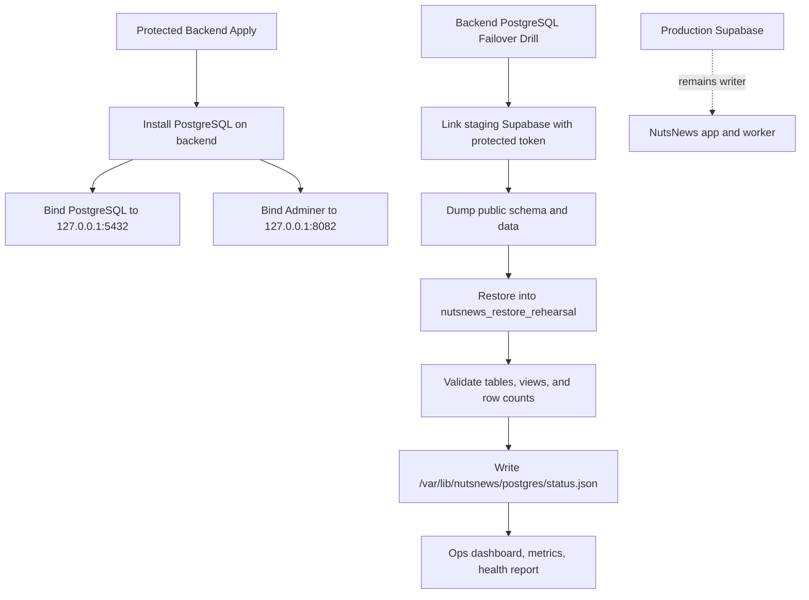
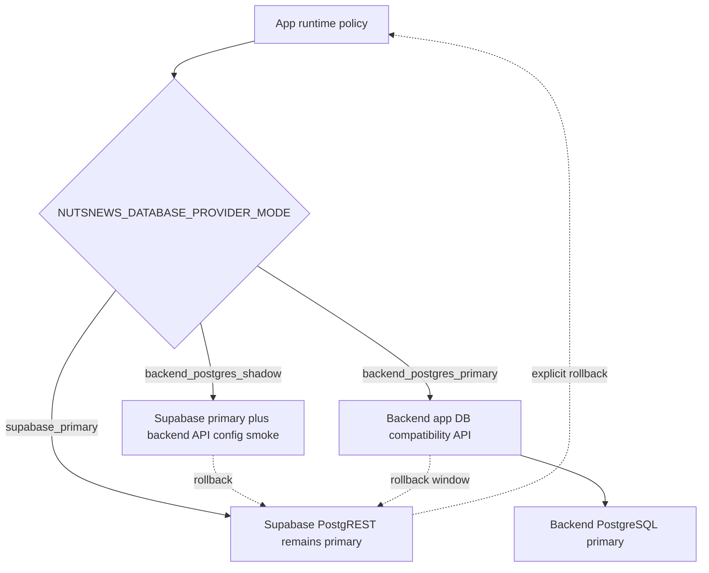

# NutsNews Backend PostgreSQL Failover Target

## Simple Summary

NutsNews now has a private backup database place on the backend server. It is not used by the live app yet. It lets us practice restoring safe staging data before anyone tries a real production database move.

## Intermediate Summary

`ramideltoro/nutsnews-backend` provisions PostgreSQL on `backend.nutsnews.com` through the protected Ansible pipeline. PostgreSQL and Adminer are bound to `127.0.0.1` only, so operators must use an SSH tunnel. Supabase remains the production writer. Protected GitHub Actions drills restore staging and production-shadow data into backend PostgreSQL targets, attach one-way logical replication for the primary shadow, and publish readiness to the ops dashboard, metrics, and health report. Feature-flagged worker and app compatibility APIs expose bounded database operations for shadow validation before any primary cutover.

## Expert Summary

Backend issue #13 establishes a single-writer, restore-verified failover target, not active-active replication. The backend repo adds PostgreSQL 18-compatible Ubuntu package provisioning, SCRAM auth for local roles, loopback-only Adminer through Caddy/PHP-FPM, staging and production-shadow logical restore drills, one-way production logical replication into `nutsnews_primary_shadow`, PostgreSQL readiness metrics, worker and app compatibility routes, and an ADR that forbids production cutover until parity evidence and cutover approval exist. Sync-back to Supabase is not supported; failback remains a controlled forward-recovery procedure to avoid split-brain.

## Control Flow



## Operating Model

Supabase remains the only production writer. The backend PostgreSQL database is a private target for restore rehearsal and future controlled failover. It is not a public database endpoint and it does not receive production app traffic.

The first restore path is logical dump/restore from the staging Supabase project into:

```text
nutsnews_restore_rehearsal
```

The production database name reserved by the backend baseline is:

```text
nutsnews_failover
```

The future-primary shadow database used for production-shadow migration gates is:

```text
nutsnews_primary_shadow
```

## Worker Compatibility API

Backend issue `ramideltoro/nutsnews-backend#242` owns the backend worker
database compatibility route required by `ramideltoro/nutsnews-worker#27`.

The public route shape is:

```text
https://backend.nutsnews.com/api/worker/db/*
```

The route is disabled unless the protected backend apply receives:

```text
NUTSNEWS_BACKEND_WORKER_API_ENABLED=true
```

Requests authenticate with:

```text
Authorization: Bearer <NUTSNEWS_BACKEND_API_TOKEN>
```

Shadow mode must stay least-privilege and read-only: the backend API connects to
`nutsnews_primary_shadow` as `nutsnews_worker_api`, accepts only bounded
allow-listed worker operations, and rejects write operations before touching
PostgreSQL. The role has `BYPASSRLS` so restored Supabase RLS does not hide
shadow rows from the server-side compatibility API, but its grants are limited
to the Worker read objects used by the route: `articles`,
`article_ai_reviews`, `article_summaries`, `feed_health`,
`public_feed_snapshot`, `rss_feeds`, and `runtime_feature_flags`.
`nutsnews_readonly` remains the generic operator-inspection role, not the Worker
API runtime role.

Backend-primary writes require all of these conditions:

- worker provider mode is `backend_postgres_primary`;
- backend protected apply has `NUTSNEWS_BACKEND_WORKER_API_WRITES_ENABLED=true`;
- parity, smoke, rollback, and cutover evidence has been linked from the backend
  migration runbooks and issues.

Keep `NUTSNEWS_BACKEND_WORKER_API_WRITES_ENABLED=false` during shadow
validation. Rollback before production cutover is explicit: set the worker back
to `supabase_primary`, or disable `NUTSNEWS_BACKEND_WORKER_API_ENABLED` and
rerun protected backend apply. Supabase remains the production primary until a
separate cutover approval says otherwise.

## App Compatibility Boundary

The web app now has issue `ramideltoro/nutsnews#255` as the app-side
provider-mode tracker. App runtime safety recognizes three modes:

| Mode | Production write owner | Expected use |
| --- | --- | --- |
| `supabase_primary` | Supabase | Default and explicit rollback mode. |
| `backend_postgres_shadow` | Supabase | App can prove backend API configuration while reads and writes still use Supabase. |
| `backend_postgres_primary` | Backend PostgreSQL compatibility API | Future cutover mode only, gated by explicit confirmation and backend app API parity. |

`backend_postgres_primary` must require
`NUTSNEWS_BACKEND_POSTGRES_PRIMARY_CONFIRMATION=enable-backend-postgres-primary`
and must fail closed if app code attempts direct Supabase primary access.
Non-production can exercise backend-primary runtime safety with a mock or
non-production backend API endpoint and without writing to Supabase.

The app compatibility API is separate from the worker operation allowlist but is
served by the same loopback backend database compatibility service. Backend
issue `ramideltoro/nutsnews-backend#247` commits the first app route:

```text
https://backend.nutsnews.com/api/app/db/*
```

That route has app-specific allow-listed operations for public feed snapshots,
article detail and sitemap reads, search, runtime feature flags, readiness
schema-contract replacement, bounded admin dashboard read snapshots, quota usage
writes, article engagement writes, and runtime feature flag writes. It is
enabled by the protected backend apply only when the loopback compatibility
service is enabled; backend-primary writes remain disabled unless the protected
apply explicitly sets the write guardrail on. No browser bundle may receive
backend API tokens or service-role credentials.

As of 2026-07-19, app-route provisioning and non-production smoke evidence is
available:

| Gate | Evidence | Result |
| --- | --- | --- |
| Backend app route PR | `ramideltoro/nutsnews-backend#248`, merge commit `7cdbdd79815009a3e1cfee6ab75820c78df1e902` | `/api/app/db/*` added beside `/api/worker/db/*` |
| Protected check | `protected-backend-ansible-apply` run `29693574619` | passed in `check` mode |
| Protected apply | `protected-backend-ansible-apply` run `29693776534` | passed in `apply` mode with deployment safety preflight and postcheck |
| Backend app-route smoke | `python3 scripts/backend_app_db_api_smoke.py` against `https://backend.nutsnews.com/api/app/db` | passed: smoke 200, snapshot rows 5, shadow write 409, primary guarded write 403 |
| App helper shadow smoke | `callBackendDatabaseOperation` from `ramideltoro/nutsnews` against `https://backend.nutsnews.com/api/app/db` | passed: provider `backend_postgres`, writes disabled, snapshot rows 3, no Supabase writes |



The current production cutover blocker is app shadow parity plus final
production approval. Do not set the production app to `backend_postgres_primary`
until the backend cutover issues link current parity evidence, writer-pause
evidence, rollback coverage, and the protected production cutover approval.
Rollback remains explicit: set the app provider mode back to
`supabase_primary`, remove or ignore backend API credentials, and keep Supabase
as the production primary.

## Access Boundary

PostgreSQL:

```text
127.0.0.1:5432
```

Adminer:

```text
127.0.0.1:8082
```

SSH tunnel:

```bash
ssh -i ~/.ssh/servercheap_65_75_201_18 \
  -L 8082:127.0.0.1:8082 \
  rami@65.75.201.18
```

Then open:

```text
http://127.0.0.1:8082/
```

No public `5432`, `8082`, or PHP-FPM port is approved.

## Protected Workflows

Provision:

```text
.github/workflows/protected-backend-ansible-apply.yml
```

Restore drill:

```text
.github/workflows/backend-postgres-failover-drill.yml
```

Primary-shadow migration gates:

```text
.github/workflows/backend-postgres-primary-shadow-restore.yml
.github/workflows/backend-postgres-logical-replication.yml
.github/workflows/backend-postgres-replication-health.yml
.github/workflows/backend-postgres-parity-validation.yml
.github/workflows/backend-postgres-backup-restore-proof.yml
```

Restore drill modes:

| Mode | Effect |
| --- | --- |
| `status` | Read current backend PostgreSQL readiness only. |
| `dry-run` | Inspect readiness and explain the fixed restore path without mutation. |
| `restore-staging` | Restore staging Supabase public schema/data into the backend rehearsal database. |

`restore-staging` requires:

```text
confirm_restore=restore-staging-to-backend-postgres
```

Each restore drops and recreates `nutsnews_restore_rehearsal`. After schema and
data replay, the restore runner reapplies rehearsal database grants for
`nutsnews_readonly`, `nutsnews_migration_validation`, and
`nutsnews_app_rehearsal` so parity, smoke, and benchmark validation can connect
with protected migration credentials. The validation role is allowed to bypass
restored RLS only for aggregate-only migration checks; production app access
remains blocked until a separate cutover approval.

## Primary Shadow Evidence

As of 2026-07-18, the backend primary-shadow gates have protected workflow
evidence for database-only readiness. Supabase remains the only production
writer.

| Gate | Evidence | Result |
| --- | --- | --- |
| Shadow restore | `backend-postgres-primary-shadow-restore` run `29660688547` | `nutsnews_primary_shadow`, snapshot `logical-29660688547-4d7ad3dc2062-e933ae07dd27`, RPO/RTO 3s |
| Logical replication | `backend-postgres-logical-replication` run `29660754171` | publication table count 11, slot count 1, subscription count 1, `copy_data=false` |
| Replication health | `backend-postgres-replication-health` run `29660804755` | `healthy`, blockers `[]`, max lag 24s |
| Object and behavior parity | `backend-postgres-parity-validation` run `29660835941` | object parity 18/18 pass, behavior parity 12/12 pass |
| Backup/restore proof | `backend-postgres-backup-restore-proof` run `29660905225` | isolated restore target `nutsnews_primary_shadow_backup_restore_proof`, RPO/RTO 7s |
| Monitoring fail-closed simulation | `backend-postgres-replication-health` run `29660962794` | expected failure with simulated replication blockers |

The parity validator uses exact aggregate equality for stable objects. For
explicitly marked append-style live tables, it records the source count at
validator start and passes only after the target reaches that aggregate
watermark without exceeding the current source count.

## Secret Names

The protected `production-backend` Environment owns these names:

```text
NUTSNEWS_BACKEND_POSTGRES_APP_PASSWORD
NUTSNEWS_BACKEND_POSTGRES_READONLY_PASSWORD
NUTSNEWS_BACKEND_POSTGRES_MIGRATION_RESTORE_PASSWORD
NUTSNEWS_BACKEND_POSTGRES_MIGRATION_VALIDATION_PASSWORD
NUTSNEWS_BACKEND_POSTGRES_MIGRATION_REPLICATION_PASSWORD
NUTSNEWS_BACKEND_POSTGRES_MIGRATION_APP_REHEARSAL_PASSWORD
NUTSNEWS_BACKEND_POSTGRES_WORKER_API_PASSWORD
NUTSNEWS_BACKEND_API_TOKEN
SUPABASE_ACCESS_TOKEN
NUTSNEWS_STAGING_SUPABASE_PROJECT_REF
```

Secret values must never appear in logs, screenshots, issues, PRs, docs, or workflow summaries.

## Observability

PostgreSQL readiness is visible in:

- `/var/lib/nutsnews/postgres/status.json`;
- the loopback ops dashboard;
- Grafana metrics:
  - `nutsnews_backend_postgres_failover_ready`;
  - `nutsnews_backend_postgres_restore_drill_healthy`;
  - `nutsnews_backend_postgres_replication_lag_configured`;
- backend health report check `postgres_restore_readiness`.

For the production shadow, replication health is configured by
`backend-postgres-replication-health.yml` and writes
`/var/lib/nutsnews/postgres/replication-health.json` plus
`/var/lib/nutsnews/metrics/backend-postgres-replication-health.prom`.
The ops dashboard exposes:

- `postgres.primary_shadow_database`;
- `postgres.replication.dashboard_status`;
- `postgres.replication.validation_status`;
- `postgres.replication.subscription_count`;
- `postgres.replication.slot_count`;
- `postgres.replication.max_lag_seconds`.

## RPO And RTO

Current tested RPO is the age of the latest approved logical dump. Current RTO target is 4 hours for controlled restore and app failover after drills pass.

Future RPO target is 15 minutes after PITR/WAL or reviewed continuous replication is implemented and tested.

## Production Cutover Boundary

Production cutover is not enabled by issue #13. Before production traffic can write to backend PostgreSQL, NutsNews needs:

- approved production Supabase dump or reviewed replication catch-up;
- paused writers;
- PostgREST-compatible API layer or app-owned database API change for the web
  app, with issue `ramideltoro/nutsnews#255` and the backend app API blocker
  closed or explicitly waived in the production cutover record;
- worker API shadow parity evidence for feeds, articles, summaries, reviews,
  run logging, quota logging, feed health, and public feed snapshot refresh;
- app/worker environment switch plan;
- smoke tests;
- rollback window;
- separate approval for production use.

## Failback

Sync-back to Supabase is not supported yet. Bidirectional writes remain forbidden because conflict handling and split-brain prevention are not proven.

The safest failback path is forward recovery: pause writers, compare evidence, choose one authoritative database, then restore or migrate once through a reviewed production procedure.

## Rollback

Before production cutover, rollback is simple: keep Supabase as writer and disable `NUTSNEWS_BACKEND_POSTGRES_ENABLED` before a protected apply if the local database should be removed from active management.

After a future production cutover, rollback must follow the approved cutover runbook and only happen inside the documented rollback window unless reverse replication has been separately proven.
