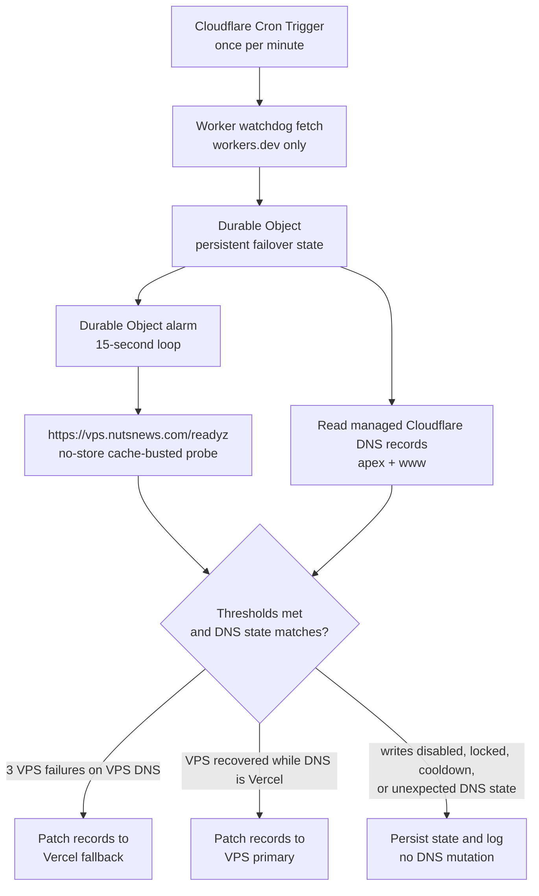
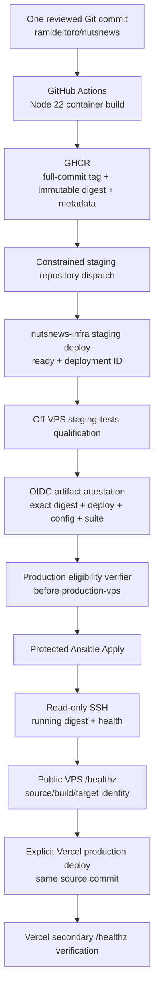
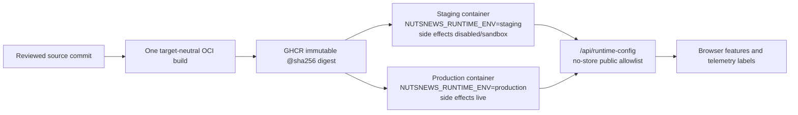
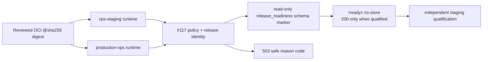
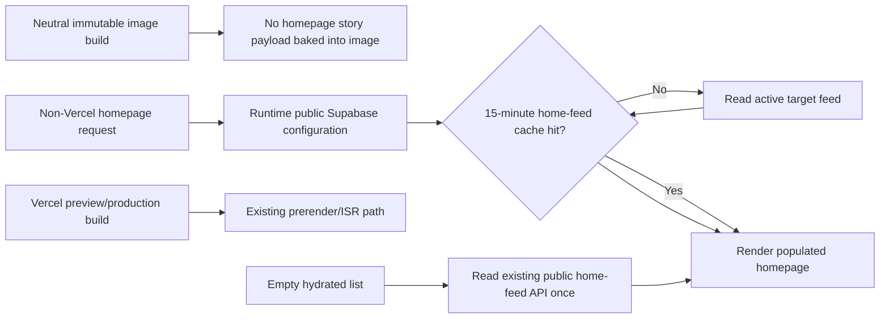
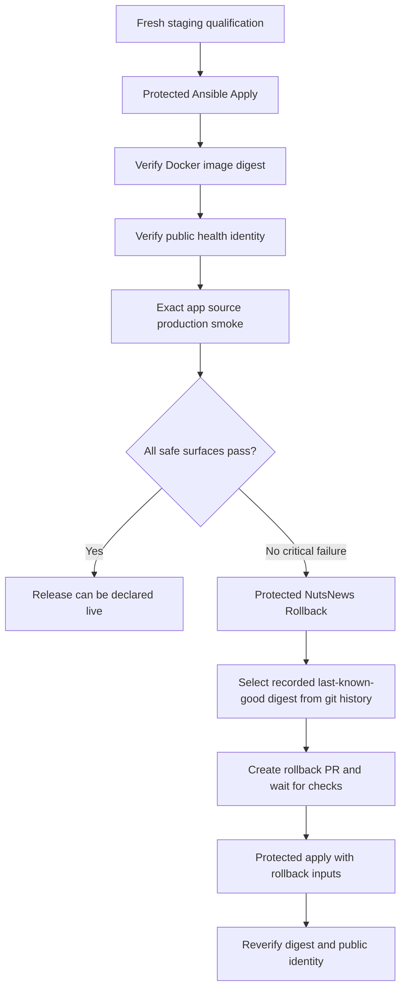

# NutsNews Dual-Target Web Deployment

This guide defines how one reviewed commit from `ramideltoro/nutsnews` is
delivered to Vercel and to an immutable, GitOps-managed VPS rollout.

Issue: [nutsnews-infra #67](https://github.com/ramideltoro/nutsnews-infra/issues/67)

Status: Cloudflare routes `nutsnews.com` and `www.nutsnews.com` to the VPS as
the primary production server, and Vercel remains the secondary production
target for controlled fallback. Production deployment is coupled: Vercel
`main` Git auto-deploys are disabled, the app repository may request only an
immutable staging candidate, and `ramideltoro/nutsnews-infra` deploys Vercel
production only after the matching VPS production apply and verification pass.

## Simple Summary

NutsNews has one website codebase. After a reviewed change reaches `main`,
GitHub builds a matching container for the VPS and the release goes through
staging, qualification, VPS production apply, and only then Vercel production.
The app repository can ask infra to stage that exact digest, but it cannot move
either production target by itself.

After the #396 cutover, `www.nutsnews.com` is the normal VPS production smoke
target, apex redirects to `www`, and `vps.nutsnews.com` remains the direct VPS
origin/debug target. Vercel is validated through a separate secondary target
or controlled failover alias check, not by assuming apex or `www` normally
serve Vercel.

## Intermediate Summary

`ramideltoro/nutsnews` owns the Next.js source, explicit Vercel production
workflow, production OCI image, portable health endpoint, smoke checks, and
build identity. A pull request may build the image for validation but never
publishes it. Every push to `main` builds and publishes an immutable
full-commit image and records its registry digest as a small, safe artifact.

The staging release workflow consumes only the trusted `Container Image`
metadata artifact for the same `main` workflow run. It sends a strict staging
candidate containing the source commit, image repository, immutable digest,
build ID, source workflow run ID, migration head, schema marker, and production
Supabase project reference to `ramideltoro/nutsnews-infra`.

`ramideltoro/nutsnews-infra` owns staging deploy, independent qualification,
production eligibility, the GitOps release PR, protected apply, VPS
verification, final Vercel production dispatch, and rollback. Runtime secrets
remain only in the protected infrastructure Environments, and the app handoff
token is not a VPS credential or production release token.

Vercel does not consume the GHCR image. Vercel and the VPS produce different
platform artifacts from the same source commit, and both production targets
must verify that commit in one promotion chain.

## VPS-Primary Release Check Topology

Issue [nutsnews #394](https://github.com/ramideltoro/nutsnews/issues/394)
updates the app-side release checks for the VPS-primary migration while keeping
Vercel available as the secondary production server.

Normal production validation uses these targets:

| Purpose | Configuration | Default |
| --- | --- | --- |
| VPS-primary public smoke | `NUTSNEWS_VPS_PRODUCTION_URL`, then `NUTSNEWS_PRIMARY_PRODUCTION_URL` | `https://www.nutsnews.com/` |
| VPS direct-origin checks | `NUTSNEWS_VPS_PRODUCTION_DIRECT_URL` | `https://vps.nutsnews.com/` |
| Vercel secondary production smoke | `NUTSNEWS_VERCEL_SECONDARY_PRODUCTION_URLS`, otherwise the generated Vercel deployment URL | Generated `*.vercel.app` deployment URL |
| Vercel controlled DNS failover check | `NUTSNEWS_VERIFY_VERCEL_FAILOVER_ALIASES=true` plus `NUTSNEWS_VERCEL_FAILOVER_PRODUCTION_ALIASES` | `https://www.nutsnews.com/,https://nutsnews.com/` only when the flag is true |
| Cloudflare cache observability | `NUTSNEWS_CACHE_OBSERVABILITY_URL`, then `NUTSNEWS_PRIMARY_PRODUCTION_URL` | `https://www.nutsnews.com` |

Do not put `https://www.nutsnews.com/` or `https://nutsnews.com/` in
`NUTSNEWS_VERCEL_SECONDARY_PRODUCTION_URLS`. Those hostnames are the primary
VPS production entrypoints after cutover. Vercel may verify them only during a
deliberate DNS failover drill where Cloudflare currently points apex and `www`
to the Vercel fallback records.

The failover controller contract is:

| Setting | Value |
| --- | --- |
| `NUTSNEWS_FAILOVER_HEALTH_CHECK_INTERVAL_SECONDS` | `15` |
| `NUTSNEWS_FAILOVER_CONSECUTIVE_VPS_FAILURES` | `3` |
| `NUTSNEWS_FAILBACK_DNS_STATE_GATE` | `current_dns_state_is_vercel_fallback_and_vps_ready` |

Failover checks should probe the direct VPS readiness endpoint with no-store
and a cache-busting query. Failback is allowed only when the current Cloudflare
DNS records still match the Vercel fallback state and the direct VPS readiness
probe is healthy.

## Cloudflare DNS Failover Controller

Issue [nutsnews #395](https://github.com/ramideltoro/nutsnews/issues/395)
adds the infra-side Cloudflare DNS failover controller that will support the
VPS-primary cutover without paid Cloudflare Load Balancing and without putting
normal visitor traffic through a Worker.

Simple Summary: Cloudflare DNS remains the production traffic switch. A
scheduled Worker wakes a Durable Object every minute, and the Durable Object
keeps a 15-second alarm loop that checks the direct VPS readiness endpoint.
After three consecutive VPS readiness failures, the controller can update the
managed apex and `www` DNS records to the Vercel fallback. When VPS readiness
recovers and DNS is still on Vercel, the controller can fail back to the VPS.

Intermediate Summary: The controller is deployed from
`ramideltoro/nutsnews-infra` under `cloudflare/dns-failover/`. Its Worker uses
`workers.dev` admin endpoints only; it has no route for `nutsnews.com/*` or
`www.nutsnews.com/*`, so reader requests do not execute Worker code. The
minute Cron Trigger is only a watchdog. The 15-second loop is owned by the
Durable Object alarm and persists state in Durable Object storage:

- active DNS target;
- consecutive failure count;
- consecutive recovery count;
- last check timestamp;
- last DNS update timestamp;
- manual lock state and reason;
- last health status, DNS action, and sanitized error summary.

Expert Summary: The controller reads the current managed Cloudflare DNS record
state before every automatic decision. It writes DNS only when the observed
apex and `www` records are fully on the expected source state, the failure or
recovery threshold is satisfied, the manual lock is off, the DNS-update
cooldown has elapsed, and `AUTOMATIC_DNS_WRITES_ENABLED=true` has been set by
the protected workflow. The #396 cutover enabled automatic writes and changed
the production apex/www routing to VPS primary.



The protected infra workflow is
`.github/workflows/cloudflare-dns-failover-apply.yml` in
`ramideltoro/nutsnews-infra`. It runs only from infra `main`, uses the
`cloudflare-admin` GitHub Environment, and requires explicit confirmation
phrases before apply or before enabling automatic DNS writes.

Required protected secrets:

| Secret | Purpose |
| --- | --- |
| `NUTSNEWS_DNS_FAILOVER_DEPLOY_API_TOKEN` | Deploy the Worker script and Durable Object binding. |
| `NUTSNEWS_DNS_FAILOVER_DNS_API_TOKEN` | Runtime Cloudflare DNS edit token scoped to the `nutsnews.com` zone. |
| `NUTSNEWS_DNS_FAILOVER_ZONE_ID` | Zone ID for the `nutsnews.com` Cloudflare zone. |
| `NUTSNEWS_DNS_FAILOVER_RECORDS_JSON` | JSON array containing only the managed apex and `www` record IDs, names, and type. |
| `NUTSNEWS_DNS_FAILOVER_ADMIN_TOKEN` | Bearer token for protected workers.dev status and manual-control endpoints. |
| `NUTSNEWS_CLOUDFLARE_ACCOUNT_ID` | Account ID used by Wrangler deploy. |

Do not store these values in source control, logs, release notes, or issue
comments. The source-controlled config intentionally stores only public
hostnames, thresholds, TTL intent, and workflow wiring.

Operator controls live behind the workers.dev admin token:

| Endpoint | Use |
| --- | --- |
| `GET /status` | Inspect state, thresholds, write gate, managed names, and next alarm. |
| `POST /watchdog` | Re-arm the Durable Object alarm from the Cron watchdog path. |
| `POST /check-now` | Run an immediate health and DNS-state check. |
| `POST /manual-lock` | Enable or clear the manual lock that suppresses automatic DNS writes. |
| `POST /manual-failover` | Manually move managed DNS records to the Vercel fallback. |
| `POST /manual-failback` | Manually move managed DNS records back to the VPS primary. |

The infra runbook is
`ramideltoro/nutsnews-infra/runbooks/CLOUDFLARE_DNS_FAILOVER.md`. It is the
source of truth for plan/apply commands, confirmation phrases, endpoint
examples, propagation expectations, and manual failover/failback steps.

### VPS-Primary Cutover Evidence

Issue [nutsnews #396](https://github.com/ramideltoro/nutsnews/issues/396)
completed the production cutover on July 22, 2026 UTC.

Cloudflare now manages the public production hostnames as proxied Auto-TTL
CNAME records:

| Hostname | Type | Content | Proxy |
| --- | --- | --- | --- |
| `nutsnews.com` | `CNAME` | `vps.nutsnews.com` | Proxied |
| `www.nutsnews.com` | `CNAME` | `vps.nutsnews.com` | Proxied |

The deployed controller instance is `nutsnews-production-vps-primary`. After
the protected apply from infra `main`, its status showed:

| Field | Value |
| --- | --- |
| `dnsWritesEnabled` | `true` |
| `activeDnsTarget` | `vps` |
| `lastDnsAction` | `none:vps_already_primary` |
| `lastHealthStatus` | `healthy` |
| `manualLock` | `false` |
| `checkIntervalSeconds` | `15` |
| `failureThreshold` | `3` |

Public verification used cache-busted, no-store probes because the Cloudflare
cache purge attempt returned HTTP `401`. The probes verified:

- `https://nutsnews.com/healthz` redirects to `https://www.nutsnews.com/healthz`;
- `https://www.nutsnews.com/healthz` returns HTTP `200` through Caddy with
  `x-nutsnews-deployment-target: production-vps`;
- `/readyz` reports `runtimeEnv: production` and
  `databaseProviderMode: backend_postgres_primary`;
- root, representative public API routes, article detail, `robots.txt`,
  `sitemap.xml`, static pages, and the expected auth/contact status codes all
  returned healthy production responses;
- a one-minute monitor saw stable `200` health/API responses and ready status.

The verified application identity was source commit
`036f911da20f40cef933cff1177d703d02d41e48` and build
`29862078817-1`. Better Stack reported no incidents during the cutover window.
Sentry showed one `/sitemap.xml` dynamic-server warning generated by smoke
probes; the endpoint still returned HTTP `200` and did not indicate a traffic
availability failure.

Rollback remains available through the failover controller, with Vercel
fallback content configured as `cname.vercel-dns.com`. If emergency manual
Cloudflare rollback is unavoidable, the previous direct DNS shape was apex
proxied `A 76.76.21.21` and `www` proxied CNAME
`cname.vercel-dns-0.com`. Do not publish record IDs in tickets, docs, logs, or
runbooks.

### Limits And Rollback

Cloudflare proxied records use Auto TTL, currently 300 seconds. A DNS patch is
therefore not an instant reader-visible failover; client, resolver, and
Cloudflare edge behavior can take longer to converge. Operators should verify
both direct-origin readiness and normal public hostname behavior before
declaring failover or failback complete.

Rollback options are ordered from least invasive to most invasive:

1. Enable the manual lock through `/manual-lock` to stop automatic DNS changes.
2. Use `/manual-failover` or `/manual-failback` when the controller is healthy
   and the operator wants a controlled DNS move.
3. Run the protected workflow again with `dns_writes_enabled=false` to keep the
   Worker deployed but suppress automatic mutations.
4. Revert the reviewed infra PR and redeploy the Worker config from infra
   `main` if the controller implementation itself is bad.

Do not hand-edit production DNS during normal operations. If emergency manual
Cloudflare changes are unavoidable, document the record content before and
after, enable the controller manual lock, and reconcile the infra runbook and
state before re-enabling automatic writes.

## Expert Summary

The application repository enables Next.js standalone output and builds a
non-root Node 22 runtime image containing only the standalone server,
`public`, and `.next/static` runtime material. The image binds on
`0.0.0.0:3000`, exposes portable build identity through `/healthz`, and keeps
the required Next.js cache location writable without making the whole
container filesystem writable. Its health check uses a probe that is actually
present in the final image and fails closed; missing `curl` or `wget` can never
be interpreted as healthy.

The publishing workflow separates unprivileged pull-request builds from the
`packages: write` publishing job. Production references use
`ghcr.io/ramideltoro/nutsnews@sha256:<digest>`; mutable tags, including
`latest`, are invalid when the VPS application is enabled. Application secrets
are runtime-only values from the protected `production-vps` Environment and
are rendered by Ansible with `no_log`. They are never Docker build arguments,
OCI labels, image layers, artifacts, status JSON, promotion payloads, or portal
fields.

The automation uses a short-lived, fine-grained GitHub token stored only as the
app repository secret `NUTSNEWS_INFRA_STAGING_TOKEN`. It may dispatch only the
staging candidate event to `ramideltoro/nutsnews-infra`; it is not a VPS
credential, production apply credential, infra release token, or substitute for
the scoped `GITHUB_TOKEN`.

## Ownership And Invariants

| Repository | Owns | Must not own |
| --- | --- | --- |
| `ramideltoro/nutsnews` | Next.js source, explicit Vercel production deployment workflow, Dockerfile, GHCR publishing, portable health/build identity, target-neutral smoke checks | VPS SSH deployment, Ansible, Compose promotion, production route toggles, independent Vercel `main` production deploys |
| `ramideltoro/nutsnews-infra` | Immutable digest promotion, Ansible, Compose, Caddy, protected rollout, Ops Portal status, Vercel production dispatch after VPS apply, rollback digest | A copy, fork, or vendored bundle of the Next.js source |
| `ramideltoro/nutsnews-docs` | Canonical deployment, environment, rollout, rollback, and troubleshooting guidance | Runtime configuration or secrets |
| `ramideltoro/nutsnews-worker` | Scheduled ingestion and background automation | Web image publishing or VPS web rollout |

Required invariants:

- One application codebase exists in `ramideltoro/nutsnews`.
- Vercel and the published OCI image identify the same Git commit.
- Vercel continues to build a native Vercel artifact from `nutsnews/web`.
- The VPS pulls an immutable digest; it never deploys `latest`.
- Only `nutsnews-infra` may promote an image or change VPS routing.
- A VPS production promotion starts only after infra verifies a fresh staging
  qualification attestation for the exact digest, source, build, staging
  deployment, config generation, and test-suite revision.
- Vercel Production deploys only after the protected VPS apply verifies the
  same source commit.
- A production release is incomplete if either VPS production or Vercel
  production fails verification.
- Every automated release produces a normal infra PR, passing promotion checks,
  a merge, a protected apply, and runtime identity verification.
- Database migrations are single-flight, explicit, and auditable. Neither
  target runs migrations at container startup.

## Build And Promotion Flow



There is deliberately no arrow from GHCR to Vercel. The shared identity is the
source commit, not a shared runtime artifact.

## Build Identity Contract

Every target must expose a secret-free identity that operators can compare:

| Field | Vercel | VPS image and Ops Portal |
| --- | --- | --- |
| Source commit | Exact commit checked out by the post-VPS Vercel workflow | Full Git commit recorded at image build and promotion |
| Build ID | Portable application build identifier | Same identifier in `/healthz`, image labels, and portal status |
| Image digest | Not applicable | Registry-resolved `sha256` digest and actual running digest |
| Health deployment target | `vercel-production` | Shared VPS image build target `vps` on `/healthz` |
| Runtime deployment target | `vercel-production` | Reviewed runtime target `production-vps` on `/readyz` and production smoke |
| Last-known-good digest | Not applicable; use Vercel deployment rollback | Reviewed prior VPS digest |

OCI labels may include the public repository URL and source revision. They must
not include credentials, environment values, callback secrets, or provider
tokens.

## Immutable Image And Runtime Public Configuration

Issue: [nutsnews #174](https://github.com/ramideltoro/nutsnews/issues/174)

### Simple explanation

Build the web image once. Start that exact digest in each target with that
target's browser-safe configuration. The image does not contain a production
Supabase URL, analytics ID, telemetry DSN, or Turnstile key.

### Intermediate explanation

The running web process exposes `GET /api/runtime-config`. It returns only an
allowlisted public configuration object and is always `no-store`. Browser code
fetches it after startup instead of relying on `NEXT_PUBLIC_*` values compiled
into JavaScript. The response includes runtime environment, side-effects mode,
public Supabase URL and anon key, Turnstile site key, optional Sentry DSN and
analytics ID, source commit, build ID, deployment target, expected image
digest, configuration generation, and whether telemetry is enabled.

The endpoint must never contain a service-role key, email/provider token,
OAuth secret, authorization token, complete private connection string, or any
other server credential. A missing or malformed value disables its feature;
clients must fail closed rather than guess a production value.

### Digest fixture validation

#### Simple Summary

The app is built once, then the exact same sealed image is started once with
safe staging settings and once with safe production-like settings. Each run
shows the right public settings without rebuilding the app.

#### Intermediate Summary

The Container Image workflow uses a temporary local registry to record one
`repository@sha256:` reference. It starts that reference with distinct
synthetic staging and production-like Supabase endpoints, Turnstile keys,
Sentry DSNs, analytics IDs, side-effect modes, and runtime environment names.
The smoke check verifies each no-store runtime-config response and rejects any
production-only fixture marker from the staging response. It also scans the
generated `public` and `.next/static` output for the production-only synthetic
Supabase, telemetry, and analytics markers.

#### Expert Summary

This is application-release verification only; it neither changes Vercel
settings nor publishes a test image. `NUTSNEWS_EXPECTED_IMAGE_DIGEST` is set
from the local registry's recorded manifest digest for both fixture processes.
The browser endpoint remains an explicit allowlist, so server credentials are
not an input to the browser contract or test output. This protects the staging
qualification path from an image whose browser code was compiled with a
production endpoint or telemetry identifier. If the check fails, reject the
candidate and rebuild only after correcting source; do not rebuild merely to
substitute a target's runtime configuration.

### Expert explanation



The image build receives only target-neutral build identity (`NUTSNEWS_SOURCE_COMMIT`,
`NUTSNEWS_BUILD_ID`, and `NUTSNEWS_DEPLOYMENT_TARGET`) plus local neutral
fixtures required by Next.js compilation. It must receive no deployment public
configuration or credential as a Docker build argument. The container image
workflow launches the same image identity with a valid staging fixture and
with a deliberately rejected staging configuration that claims the known
production data identity. The rejected container must become unhealthy through
`/readyz`, and neither readiness output nor static browser assets may contain a
credential fixture.

For the VPS, Ansible derives `NUTSNEWS_SOURCE_COMMIT`, `NUTSNEWS_BUILD_ID`,
`NUTSNEWS_DEPLOYMENT_TARGET`, and `NUTSNEWS_EXPECTED_IMAGE_DIGEST` directly
from the reviewed release manifest after synchronized environment values have
been rendered. Those manifest-derived values take precedence over synchronized
values, so an environment sync cannot claim a different digest.

### Operating and rollback rules

1. Set `NUTSNEWS_RUNTIME_ENV` and `NUTSNEWS_SIDE_EFFECTS_MODE` explicitly for
   every target. Staging must be `staging` with `disabled` or `sandbox`;
   production telemetry requires `production` with `live`.
2. Set `NUTSNEWS_DATA_ENVIRONMENT`,
   `NUTSNEWS_SUPABASE_CREDENTIALS_ENV`,
   `NUTSNEWS_SUPABASE_PROJECT_REF`, and
   `NUTSNEWS_PRODUCTION_SUPABASE_PROJECT_REF` explicitly for every target.
   Runtime, data, and credential environments must agree. Staging uses its
   own project reference and credentials; production uses the known production
   reference for both project-reference variables.
3. Every configured Supabase URL must resolve to the declared project
   reference. A staging target that names or resolves to the production
   reference is refused. Do not work around this with a writable production
   schema, a production service-role key, or a copied production URL.
4. Configure browser-safe fields with the `NUTSNEWS_PUBLIC_*` runtime names.
   The VPS sync maps legacy Vercel `NEXT_PUBLIC_*` sources into these runtime
   names during migration; it does not render the legacy public names on the
   VPS.
5. Verify `GET /api/runtime-config` has `Cache-Control: no-store` and contains
   the expected non-secret runtime identity. Verify `/healthz` for source,
   build, and deployment target as before.
6. To roll back a public configuration error, restore the prior reviewed
   production environment value, run Protected Ansible Apply in check mode,
   then apply through the approval gate. To roll back code, promote the
   recorded last-known-good image digest. Do not rebuild an image merely to
   change runtime public configuration.

Legacy `NEXT_PUBLIC_*` values are temporary server-side compatibility inputs
for Vercel only. New runtime code and deployment wiring must use
`NUTSNEWS_PUBLIC_*`; direct `NEXT_PUBLIC_*` references in browser entry points
or Docker build arguments are a release-blocking regression.

### Staging data and side-effect safety

Issue: [nutsnews #117](https://github.com/ramideltoro/nutsnews/issues/117)

`/healthz` remains a cacheable liveness and build-identity endpoint. `/readyz`
is the uncached runtime-safety readiness endpoint used by container health
checks and deployment verification. It returns only `ok`, runtime environment,
side-effect mode, and a sanitized refusal code. It must never return a
project reference, connection string, token, service-role key, or provider
credential.

| Runtime | Side effects | Allowed behavior |
| --- | --- | --- |
| Staging | `disabled` | Validated read-only application behavior only. Contact delivery, OAuth callbacks, telemetry delivery, ingestion triggers, quota writes, feed mutations, AI/backfills, analytics, and indexing are refused. |
| Staging | `sandbox` | Only isolated local or `.test` provider endpoints and uniquely namespaced synthetic fixtures are allowed. A deployed staging target should normally remain `disabled`. |
| Production | `live` | Production behavior is permitted only when all runtime/data/credential/project-reference checks agree. |
| Any invalid or contradictory configuration | any | `/readyz` returns `503`; guarded operations fail closed. |

The Web container does not own a Worker/controller schedule. Worker-owned
ingestion remains in `ramideltoro/nutsnews-worker`; web post-deploy and Worker
smoke commands are production-live guarded.

To run the opt-in staging fixture integration after deployment, use staging
credentials only and set `RUN_STAGING_FIXTURE_INTEGRATION=1`. The test creates
one `nutsnews-test-...` namespaced quota event with a one-hour TTL and deletes
it by returned identifier. A cleanup failure is reported separately and fails
the test; it never converts a failed test into a pass.

## Uncached Qualification Readiness

Issue: [nutsnews #172](https://github.com/ramideltoro/nutsnews/issues/172)

### Simple Summary

`/healthz` only says the app process is alive. `/readyz` is the separate
answer to “is this exact staged release safe to test?” It refuses a candidate
until its runtime settings, identity, database marker, and one small database
read all agree.

### Intermediate Summary

`GET /readyz` is dynamic and `no-store`, so a request with a cache-busting
query can never receive a previous deployment’s identity. It is the container
health and staging-qualification gate for image targets. A successful response
has `ok: true` and stable code `ready`; every failure is HTTP `503` with only a
stable sanitized code. It never returns Supabase URLs, project references,
database errors, connection data, service-role keys, tokens, or stack traces.

The response always carries these safe headers: `X-NutsNews-Source-Commit`,
`X-NutsNews-Build-Id`, `X-NutsNews-Deployment-Target`,
`X-NutsNews-Runtime-Environment`, `X-NutsNews-Config-Generation`, and
`X-NutsNews-Expected-Image-Digest`. `/healthz` stays the inexpensive,
cacheable build/liveness endpoint and is not a qualification gate. Its static
build identity can differ from `/readyz`’s runtime deployment target without
indicating a digest change.

### Expert Summary

The app first reuses the #117 runtime/data/side-effect policy. For an OCI
target it then requires matching source commit, build ID, expected and deployed
digest, configuration generation, and expected schema version. It enforces
`vps-staging` with runtime environment `staging` and `production-vps` with
runtime environment `production`. Finally it performs exactly one anonymous,
read-only Supabase query against the singleton `public.release_readiness` row
and compares `schema_version` with `NUTSNEWS_EXPECTED_SCHEMA_VERSION`. The
query is bounded by `NUTSNEWS_READYZ_TIMEOUT_MS`; a missing row, query error,
timeout, or mismatch is not ready.

Migration `20260712170000_create_release_readiness.sql` creates that row with
schema version `20260712170000`. A later app-compatible migration must update
the marker in the same reviewed migration and infra must set the matching
expected value before deploying the candidate. This is a small bridge to the
full migration/drift workflow tracked by [nutsnews #109](https://github.com/ramideltoro/nutsnews/issues/109); containers never run migrations on startup.



### Infra Runtime Contract

For every OCI deployment, `nutsnews-infra` must supply the table’s image-target
variables from the reviewed release manifest and reviewed environment state.
The `NUTSNEWS_EXPECTED_*` source/build/digest values must match the runtime
source/build/deployed-digest values exactly. The deployed digest must be the
same `repository@sha256:` reference independently verified by Compose/Docker;
the app’s environment comparison is a fail-closed consistency check, not a
substitute for that host-level digest verification.

Staging and production intentionally receive different `NUTSNEWS_DEPLOYMENT_TARGET`
and `NUTSNEWS_CONFIG_GENERATION` values while using the same image digest.
They may also have different browser-safe public configuration through
`/api/runtime-config`. Do not set production Supabase, analytics, telemetry,
or secret values in the staging environment or image build.

Vercel remains outside this OCI qualification contract. Its existing #117
runtime-safety readiness behavior is preserved and it does not need image-only
digest, schema-marker, or configuration-generation values. No Vercel setting
or deployment workflow change is required for this issue.

### Failure and rollback rules

`/readyz` uses only these public reason families: the existing #117 policy
codes, `runtime_identity_invalid`, `deployment_target_environment_mismatch`,
`deployment_target_invalid`, `release_identity_mismatch`, `schema_version_mismatch`,
`supabase_dependency_failed`, and `supabase_dependency_timeout`. Treat every
`503` as a failed candidate: keep production unchanged, correct the reviewed
runtime or migration state, and deploy the same digest only when the corrected
configuration is what needs changing. If code is at fault, promote the
recorded last-known-good digest instead of modifying a running container.

### Homepage runtime feed cache

Related issue: [nutsnews #174](https://github.com/ramideltoro/nutsnews/issues/174)

#### Simple Summary

The homepage gets its stories after the container starts, so an image built
with safe empty fixtures never publishes an empty story list.

#### Intermediate Summary

The page shell is rendered on demand, while the initial home-feed result is
cached on the server for 15 minutes. This keeps staging and production content
separate at runtime without causing every homepage visit to query Supabase.
The public home-feed API retains its existing CDN policy. If a deployment ever
hydrates an empty initial list, the browser safely retries that existing
read-only public API once.

#### Expert Summary

`web/app/page.tsx` calls Next.js `connection()` only outside Vercel. That
prevents the neutral container build from including fixture data in the route's
static HTML/RSC payload, while preserving Vercel's established prerender/ISR
behavior for its preview and production deployments. Its
`getHomeFeedDataWithEdgeFallback` call is wrapped in `unstable_cache` with the
stable `homepage-initial-feed` key and `revalidate: 900`. The container route
therefore uses the active target's runtime public Supabase configuration on its
first request, then reuses the server-side data cache until revalidation.
`ArticleFeed` preserves the normal no-refetch path for populated English data;
an empty initial list (or a non-English selection) invokes the existing
localized home-feed read. It does not introduce a mutation or a new data
source.



Risk: the first request after cache expiry can be slower while it refreshes.
Mitigation: only the shared data query is refreshed; the public API/CDN policy
is unchanged. Roll back by reverting the homepage runtime-cache commit and
promoting the prior immutable image through the normal GitOps path.

## Environment Parity Matrix

The matrix lists names only. Never paste values into documentation, pull
requests, issues, workflow output, image history, or the Ops Portal.

`NUTSNEWS_PUBLIC_*` values are browser-safe runtime configuration. They are
read by the running process, delivered through `/api/runtime-config`, and must
not be passed as Docker build arguments or embedded in browser assets. Private
server variables are runtime-only. Legacy `NEXT_PUBLIC_*` names remain
server-side transition inputs only and are not a deployment contract for a new
target.

| Variable name | Required / optional | Public / secret | Build / runtime | Vercel source | VPS source | Approved difference |
| --- | --- | --- | --- | --- | --- | --- |
| `NUTSNEWS_RUNTIME_ENV` | Required | Public | Runtime | Vercel Production environment | Reviewed VPS environment | `production` for production; staging must never claim production |
| `NUTSNEWS_SIDE_EFFECTS_MODE` | Required | Public | Runtime | Vercel Production environment | Reviewed VPS environment | `live` only for production; staging is disabled or sandbox |
| `NUTSNEWS_DATA_ENVIRONMENT` | Required | Public | Runtime | Vercel target environment | Reviewed VPS environment | Must equal the declared runtime environment |
| `NUTSNEWS_SUPABASE_CREDENTIALS_ENV` | Required | Public | Runtime | Vercel target environment | Reviewed VPS environment | Must equal the declared data environment |
| `NUTSNEWS_SUPABASE_PROJECT_REF` | Required | Public non-secret identity | Runtime | Vercel target environment | Reviewed VPS environment | Must identify that target's Supabase project and match every configured Supabase URL |
| `NUTSNEWS_PRODUCTION_SUPABASE_PROJECT_REF` | Required | Public non-secret identity | Runtime | Vercel target environment | Reviewed VPS environment | Known production project reference; staging must differ and production must match |
| `NUTSNEWS_PUBLIC_SUPABASE_URL` | Required | Public | Runtime | Vercel Production environment | Synced into VPS app environment | Target-specific project; never embed production URL in a staging image |
| `NUTSNEWS_PUBLIC_SUPABASE_ANON_KEY` | Required | Public | Runtime | Vercel Production environment | Synced into VPS app environment | Target-specific public browser key |
| `NUTSNEWS_PUBLIC_TURNSTILE_SITE_KEY` | Required when contact is enabled | Public | Runtime | Vercel Production environment | Synced into VPS app environment | Hostname allowlist must include only reviewed hosts |
| `NUTSNEWS_PUBLIC_SENTRY_DSN` | Optional | Public | Runtime | Vercel Production environment | Synced into VPS app environment | Runtime label governs delivery; staging must not send production-labeled telemetry |
| `NUTSNEWS_PUBLIC_GA_ID` | Optional | Public | Runtime | Vercel Production environment | Synced into VPS app environment | Enabled only when production side effects are live |
| `NUTSNEWS_PUBLIC_IOS_APP_STORE_URL` | Optional | Public | Runtime | Vercel Production environment | Synced into VPS app environment | Normally identical |
| `NUTSNEWS_SOURCE_COMMIT` | Required | Public | Runtime/image metadata | Derived from the explicit Vercel production workflow checkout | Derived from reviewed release manifest | Must identify the same source commit |
| `NUTSNEWS_BUILD_ID` | Required | Public | Runtime/image metadata | Derived from Vercel/GitHub build metadata | Derived from reviewed release manifest | Must match the portable build identity |
| `NUTSNEWS_DEPLOYMENT_TARGET` | Required | Public | Runtime | Vercel deployment metadata | Derived from reviewed release manifest | Image qualification uses `vps-staging` for staging and `production-vps` for production; `/healthz` remains build identity while `/readyz` reports this runtime target |
| `NUTSNEWS_EXPECTED_IMAGE_DIGEST` | Required on image targets | Public | Runtime | Not applicable | Derived from reviewed release manifest | Must equal the promoted `sha256` digest |
| `NUTSNEWS_DEPLOYED_IMAGE_DIGEST` | Required on image targets | Public | Runtime | Not applicable | Derived from the exact Compose image reference | Must equal `NUTSNEWS_EXPECTED_IMAGE_DIGEST`; infra also verifies the actual container digest outside the process |
| `NUTSNEWS_EXPECTED_SOURCE_COMMIT` | Required on image targets | Public | Runtime | Not applicable | Derived from reviewed release manifest | Must equal `NUTSNEWS_SOURCE_COMMIT` |
| `NUTSNEWS_EXPECTED_BUILD_ID` | Required on image targets | Public | Runtime | Not applicable | Derived from reviewed release manifest | Must equal `NUTSNEWS_BUILD_ID` |
| `NUTSNEWS_CONFIG_GENERATION` | Required on image targets | Public non-secret identity | Runtime | Not required for the OCI gate | Reviewed infra configuration generation | Changes when the reviewed target configuration changes; never contains a URL, project reference, or secret |
| `NUTSNEWS_EXPECTED_SCHEMA_VERSION` | Required on image targets | Public non-secret identity | Runtime | Not required for the OCI gate | Reviewed migration head | Must equal the read-only `release_readiness.schema_version` marker after migration |
| `NUTSNEWS_READYZ_TIMEOUT_MS` | Optional | Public | Runtime | Not required | Reviewed infra configuration | Bounded integer from 25 through 5000 milliseconds; the default is 2000 |
| `VERCEL_GIT_COMMIT_SHA` | Vercel-provided | Public | Runtime metadata | Vercel system metadata | Not set | Vercel-only fallback for portable source identity |
| `AUTH_SECRET` | Required for admin auth | Secret | Runtime | Vercel Production environment | `NUTSNEWS_APP_ENVS_JSON` in `production-vps` | Different target-specific secret is allowed |
| `NODE_ENV` | Required | Public | Runtime | Vercel-managed | Set to `production` in the final image | Equivalent production mode |
| `HOSTNAME` | Platform-managed | Public | Runtime | Vercel-managed | Set to `0.0.0.0` in the final image | VPS must accept Caddy/container-network traffic |
| `PORT` | Platform-managed | Public | Runtime | Vercel-managed | Set to `3000` in the final image | Port ownership is platform-specific |
| `AUTH_GOOGLE_ID` | Required for admin auth | Public | Runtime | Vercel Production environment | `NUTSNEWS_APP_ENVS_JSON` in `production-vps` | A separate OAuth client is allowed |
| `AUTH_GOOGLE_SECRET` | Required for admin auth | Secret | Runtime | Vercel Production environment | `NUTSNEWS_APP_ENVS_JSON` in `production-vps` | Must match the selected target's OAuth client |
| `AUTH_URL` | Target-dependent | Public | Runtime | Vercel project URL behavior | `NUTSNEWS_APP_ENVS_JSON` in `production-vps` | Must match the reviewed external target URL |
| `AUTH_TRUST_HOST` | Target-dependent | Public | Runtime | Vercel is trusted by platform integration | `NUTSNEWS_APP_ENVS_JSON` in `production-vps` | VPS may enable it only because Caddy is the reviewed proxy |
| `ADMIN_EMAILS` | Required for admin access | Secret | Runtime | Vercel Production environment | `NUTSNEWS_APP_ENVS_JSON` in `production-vps` | Normally identical allowlist |
| `SUPABASE_URL` | Required for privileged admin reads | Public | Runtime | Vercel Production environment | `NUTSNEWS_APP_ENVS_JSON` in `production-vps` | Same production endpoint |
| `SUPABASE_SERVICE_ROLE_KEY` | Required for privileged admin features | Secret | Runtime | Vercel Production environment | `NUTSNEWS_APP_ENVS_JSON` in `production-vps` | Same role, independently stored |
| `NUTSNEWS_SANDBOX_CONTACT` | Test-only optional | Public | Runtime | Local/isolated test environment only | Not set in deployed VPS | Enables contact fixture UI only for sandbox with local or `.test` provider endpoints |
| `BETTER_STACK_SOURCE_TOKEN` | Optional | Secret | Runtime | Vercel Production environment | `NUTSNEWS_APP_ENVS_JSON` in `production-vps` | Separate source token is preferred for target attribution |
| `BETTER_STACK_INGESTING_HOST` | Optional | Public | Runtime | Vercel Production environment | `NUTSNEWS_APP_ENVS_JSON` in `production-vps` | Normally identical |
| `BETTER_STACK_INFO_SAMPLE_RATE` | Optional | Public | Runtime | Vercel Production environment | `NUTSNEWS_APP_ENVS_JSON` in `production-vps` | Target-specific sampling is allowed |
| `TURNSTILE_SECRET_KEY` | Required when contact is enabled | Secret | Runtime | Vercel Production environment | `NUTSNEWS_APP_ENVS_JSON` in `production-vps` | Same widget or reviewed target-specific widget |
| `TURNSTILE_VERIFY_URL` | Optional | Public | Runtime | Code default or Vercel environment | Code default or `NUTSNEWS_APP_ENVS_JSON` | Normally identical |
| `RESEND_API_KEY` | Required when contact email is enabled | Secret | Runtime | Vercel Production environment | `NUTSNEWS_APP_ENVS_JSON` in `production-vps` | Independently stored; never built into image |
| `RESEND_EMAILS_URL` | Optional | Public | Runtime | Code default or Vercel environment | Code default or `NUTSNEWS_APP_ENVS_JSON` | Normally identical |
| `CONTACT_TO_EMAIL` | Required when contact email is enabled | Secret | Runtime | Vercel Production environment | `NUTSNEWS_APP_ENVS_JSON` in `production-vps` | Normally identical destination |
| `CONTACT_FROM_EMAIL` | Required when contact email is enabled | Public | Runtime | Vercel Production environment | `NUTSNEWS_APP_ENVS_JSON` in `production-vps` | Must remain authorized by the email provider |
| `NUTSNEWS_ALLOWED_CONTACT_ORIGINS` | Required for each public target | Public | Runtime | Vercel Production environment | `NUTSNEWS_APP_ENVS_JSON` in `production-vps` | Target-specific reviewed origin list |
| `ACTIONS_READ_TOKEN` | Optional admin status integration | Secret | Runtime | Vercel Production environment | `NUTSNEWS_APP_ENVS_JSON` in `production-vps` | Same least-privilege scope, independently stored |
| `HOME_SERVER_STATS_URL` | Optional admin integration | Secret | Runtime | Vercel Production environment | `NUTSNEWS_APP_ENVS_JSON` in `production-vps` | May remain unavailable from the VPS |
| `HOME_SERVER_STATS_API_KEY` | Optional admin integration | Secret | Runtime | Vercel Production environment | `NUTSNEWS_APP_ENVS_JSON` in `production-vps` | Independently stored |
| `LOCAL_AI_API_KEY` | Optional fallback for home-server stats | Secret | Runtime | Vercel Production environment | `NUTSNEWS_APP_ENVS_JSON` in `production-vps` | May be omitted when integration is disabled |
| `ADMIN_SHARD_COUNT` | Optional | Public | Runtime | Vercel Production environment | `NUTSNEWS_APP_ENVS_JSON` in `production-vps` | Normally identical |
| `ADMIN_SHARD_STALE_MINUTES` | Optional | Public | Runtime | Vercel Production environment | `NUTSNEWS_APP_ENVS_JSON` in `production-vps` | Normally identical |
| `ADMIN_SHARD_SLOW_RUN_MS` | Optional | Public | Runtime | Vercel Production environment | `NUTSNEWS_APP_ENVS_JSON` in `production-vps` | Normally identical |
| `ADMIN_TIME_ZONE` | Optional | Public | Runtime | Vercel Production environment | `NUTSNEWS_APP_ENVS_JSON` in `production-vps` | Normally identical |
| `SENTRY_ORG` | Required only for source-map upload | Public | Build workflow only | Vercel build environment | Image publishing environment | Normally identical |
| `SENTRY_PROJECT` | Required only for source-map upload | Public | Build workflow only | Vercel build environment | Image publishing environment | Normally identical |
| `SENTRY_AUTH_TOKEN` | Required only for source-map upload | Secret | Build workflow only | Vercel build secret | GitHub publishing secret | May differ; must never enter a layer or final image |
| `SENTRY_ENABLE_SOURCE_MAP_UPLOAD` | Optional | Public | Build workflow only | Vercel build environment | Image publishing environment | Upload may be independently enabled per target build |

CI-only values such as `VERCEL_AUTOMATION_BYPASS_SECRET`,
`VERCEL_PROTECTION_BYPASS_SECRET`, `PLAYWRIGHT_BASE_URL`, and audit/report
settings remain in their existing workflow scopes. They are not VPS
application runtime variables.

The infra control plane stores non-secret release state in
`ansible/inventories/production/host_vars/vps.nutsnews.com.yml`. Its reviewed
Ansible variables are:

- `vps_service_foundation_nutsnews_app_enabled`
- `vps_service_foundation_nutsnews_app_staged_route_enabled`
- `vps_service_foundation_nutsnews_app_public_route_enabled`
- `vps_service_foundation_nutsnews_app_image_repo`
- `vps_service_foundation_nutsnews_app_image_digest`
- `vps_service_foundation_nutsnews_app_source_commit`
- `vps_service_foundation_nutsnews_app_build_id`
- `vps_service_foundation_nutsnews_app_deployment_target`
- `vps_service_foundation_nutsnews_app_last_known_good_digest`

Ansible renders the corresponding safe status names
`NUTSNEWS_APP_ENABLED`, `NUTSNEWS_APP_STAGED_ROUTE_ENABLED`,
`NUTSNEWS_APP_PUBLIC_ROUTE_ENABLED`, `NUTSNEWS_APP_IMAGE_REPO`,
`NUTSNEWS_APP_IMAGE_DIGEST`, `NUTSNEWS_APP_SOURCE_COMMIT`,
`NUTSNEWS_APP_BUILD_ID`, `NUTSNEWS_APP_DEPLOYMENT_TARGET`, and
`NUTSNEWS_APP_LAST_KNOWN_GOOD_DIGEST`. The secret/required key-name lists are
also reviewed non-secret state. Only the named application values belong in
`NUTSNEWS_APP_ENVS_JSON` in the protected `production-vps` Environment.
That secret is parsed as a JSON object and rendered by Ansible as a root-only
env file with `no_log`; it must not be a list, string, or shell-style
`KEY=value` blob.

## Image Publishing

Pull requests must:

1. Build and test the production image from the pull-request commit.
2. Run the container with production-shaped, non-production test inputs.
3. Wait for `/healthz`, then smoke `/`, a representative public API route, and
   build identity.
4. Confirm the runtime UID is not root.
5. Inspect image configuration and history for private inputs.
6. Never push an image.

The implementation lives at `web/Dockerfile`, `web/.dockerignore`,
`.github/workflows/container-image.yml`, and
`scripts/dual_target_web_smoke.mjs` in `ramideltoro/nutsnews`.

Pushes to `main` must:

1. Build from every merged commit with required production public build inputs;
   this workflow deliberately has no path filter or cancellation of earlier
   `main` releases.
2. Publish an immutable full-commit tag.
3. Resolve the registry digest after publication.
4. Expose the source commit, build ID, and digest in a safe workflow artifact.

The selected image architecture must match the read-only verified production
VPS architecture. Use a multi-platform build only when a reviewed requirement
justifies its extra build time and complexity.

A tag is a lookup aid. Promotion always records and deploys the digest.

## Automated Main Staging Handoff Setup

This setup is required before enabling the automation in a new repository or
after rotating its staging dispatch credential:

1. Keep Vercel preview integration connected as needed, but keep Vercel
   production Git auto-deploys for `main` disabled in `web/vercel.json`.
   Production Vercel deploys must come from `Deploy Vercel Production Release`
   after infra reports a successful protected VPS apply.
2. Create a **fine-grained** GitHub personal access token owned by the release
   operator. Limit repository access to `ramideltoro/nutsnews-infra` only, give
   it `Contents: read and write` only because GitHub's repository dispatch API
   requires that permission to create `nutsnews-staging-release`, and give it a
   short expiry with a rotation owner.
3. Store the token as the app repository secret
   `NUTSNEWS_INFRA_STAGING_TOKEN`. Do not store a production release token,
   deploy SSH key, production app secret, or `production-vps` Environment
   material in `ramideltoro/nutsnews`.
4. Store `VERCEL_TOKEN`, `VERCEL_ORG_ID`, and `VERCEL_PROJECT_ID` in the app
   repository for the explicit Vercel production workflow.
5. Store `NUTSNEWS_APP_RELEASE_TOKEN` in infra so promotion can dispatch and
   watch the app repository's Vercel production workflow.
6. Merge the reviewed infra staging receiver, off-VPS qualifier, production
   eligibility gate, protected apply, production promotion, and rollback
   workflows first.
7. Merge the reviewed application staging handoff and Vercel production
   workflow. Its next `main` release is the first automatic proof of build,
   stage, qualify, exact-digest production gate, VPS verification, Vercel
   production deploy, and Vercel alias verification.

If the staging token is absent, expired, or too broad/narrow, the handoff fails
before staging mutates. Do not replace it with a broad personal token, an infra
release token, production SSH material, or a production secret.

## Digest Promotion And Protected Rollout

No digest may be invented. For every successful `main` release, the automated
path is:

1. The app workflow validates its immutable image metadata from the exact
   trusted `Container Image` run and dispatches only `nutsnews-staging-release`.
2. The infra receiver validates the GitHub handoff, confirms the source commit
   is reachable from `nutsnews` `main`, verifies OCI provenance, and deploys
   staging through the protected staging path.
3. The off-VPS qualifier reads staging health/readiness identity, actual
   deployment and digest evidence, runs the exact app test-suite revision, and
   repeats the identity check to catch redeploy drift.
4. On full success only, infra writes and attests `staging-qualification.json`
   for the exact digest, source workflow run, staging deployment ID, infra
   commit/config generation, and test-suite commit.
5. `Protected Ansible Apply` verifies that attestation before any job can
   access `production-vps`, production SSH, deploy secrets, or production app
   secrets.
6. The apply checks the exact container digest over read-only SSH, requires
   public `https://vps.nutsnews.com/healthz` to match source/build and the
   shared VPS image target `vps`, and requires safe production smoke evidence
   to match the reviewed runtime target `production-vps`.

A failed Vercel deployment, staging dispatch, staging deployment,
qualification, attestation check, production apply, SSH check, health check, or
smoke check is release-blocking and does not count as a promoted deployment.

## Staged Validation

The first route gate is health-only:

```text
http://127.0.0.1:8080/app-stage/healthz
```

Required staged evidence after an approved apply:

- the container is healthy and runs the expected immutable digest;
- `/healthz` returns HTTP `200` with the expected source/build identity;
- `/`, one representative public API route, and security headers pass through
  a target-neutral smoke path;
- Caddy preserves host, protocol, and forwarded headers;
- container logs show no startup loop or secret output;
- the Ops Portal reports expected and actual identity without environment data.

Do not claim full prefix support from the health-only route. Full pages, static
assets, navigation, redirects, APIs, and Auth.js callbacks require root-host
testing on the eventual public host.

## VPS Public Route And Canonical Traffic

The public app route at `www.nutsnews.com` is the canonical VPS-backed
production hostname, apex redirects to `www`, and `vps.nutsnews.com` remains
the direct VPS origin/debug hostname. A normal automated release updates the
reviewed VPS route and then deploys the same source commit to Vercel
production as the secondary target; it does not alter DNS, canonical URLs, or
traffic ownership.

The public route must continue to:

- keep `https://vps.nutsnews.com/health` owned by infrastructure;
- preserve WebSocket/streaming behavior and proxy `Host`, scheme, and forwarded
  headers;
- pass through the application's security and cache headers;
- avoid applying the placeholder `default-src 'none'` CSP to app responses;
- leave DNS and `nutsnews.com` traffic ownership unchanged during normal app
  releases;
- rely only on the reviewed Cloudflare DNS failover controller for automatic
  fallback; do not add traffic splitting or load balancing to app release
  automation.

## Application Parity Review

Before public activation, verify each boundary explicitly:

| Boundary | Required review |
| --- | --- |
| Auth.js | Register the exact Google callback for the VPS host, use the matching OAuth client, verify `AUTH_URL`, and trust only the reviewed Caddy proxy/host path. Test sign-in, sign-out, denied-user, callback, and secure-cookie behavior. |
| Turnstile and contact | Add only the reviewed VPS hostname to Turnstile, set the exact contact origin allowlist, and test allowed, rejected-origin, failed-challenge, and provider-failure paths without exposing keys. |
| Canonical URL | Keep `nutsnews.com` as the canonical production site while VPS is primary. Staging, direct VPS-origin, or Vercel-secondary requests must not silently change SEO canonicals. |
| Cookies, CSRF, and CORS | Preserve HTTPS, forwarded host/protocol, secure cookie scope, same-site behavior, Auth.js CSRF protection, and the contact route's explicit origin check. Do not add a broad CORS wildcard. |
| Sentry | Use the portable build ID/source commit as release identity. Keep the source-map token in build workflow scope and runtime DSN behavior equivalent. |
| Image optimization | Confirm remote image hosts, optimizer output, cache writes, and failure fallbacks in the standalone runtime. |
| Cache and revalidation | Expect platform cache implementations to differ. Verify response policy and revalidation behavior; do not assume Vercel and VPS share cache state. |
| Writable filesystem | Keep the final image immutable except for the explicitly mounted Next.js cache/runtime paths. Do not rely on durable writes elsewhere in the container. |
| Vercel assumptions | Audit Vercel system variables, preview protection, deployment-status cache purge, and platform-only services. Provide a portable equivalent or document the approved target difference. |

The production Vercel callback remains
`https://www.nutsnews.com/api/auth/callback/google`. The VPS callback is
`https://vps.nutsnews.com/api/auth/callback/google`; a successful health check
does not prove OAuth callback parity, so its client, redirect registration,
cookies, and sign-in behavior remain an explicit operational check.

## Migration Ownership

Neither Vercel nor the VPS container runs database migrations at startup. A
schema change must have one named migration owner and one auditable execution
path. Complete and verify the migration before allowing both application
targets to serve code that depends on it.

## Ops Portal Status

The portal remains read-only. It may show:

- application enabled state;
- staged and public route states;
- expected image repository and digest;
- actual running image digest;
- source commit and build ID;
- container and route health;
- last deployment result;
- last-known-good rollback digest.

It must not show environment values, credentials, tokens, callback secrets, or
a mutation/restart control.

## Post-Production Verification And Rollback (`nutsnews#90`, `nutsnews-infra#124`)

Implemented by [nutsnews PR #208](https://github.com/ramideltoro/nutsnews/pull/208)
and [nutsnews-infra PR #199](https://github.com/ramideltoro/nutsnews-infra/pull/199).

### Simple Summary

After the VPS gets a new app image, we do not call it good just because the
apply button finished. The workflow checks that the exact image is running,
that the public site says the same source and build, and that safe public
surfaces still work. If the release is critically broken, the rollback workflow
can restore only the recorded last-known-good image.

### Intermediate Summary

`Protected Ansible Apply` now performs post-production release checks after an
app release apply. It verifies the Docker container image reference, public
`/healthz` identity, and the app-owned safe production smoke suite from the
exact release source commit. The smoke suite checks readiness, public runtime
config, homepage, public articles API shape, a Next.js static asset, bounded
cache/security headers, a non-mutating invalid contact request, and the auth
session endpoint. It does not print secrets, cookies, CSRF tokens, credentials,
or full sensitive response bodies.

`Protected NutsNews Rollback` is the fixed-purpose emergency path. It accepts
the current failed digest, a sanitized reason, and the confirmation phrase
`rollback-recorded-last-known-good`. It reads the reviewed production manifest,
selects only that manifest's recorded last-known-good digest, resolves the
restored release identity from git history, opens and merges a normal rollback
PR after checks, then dispatches `Protected Ansible Apply` with rollback inputs.

### Expert Summary

Normal release apply still requires the staging qualification gate. Rollback is
the deliberate exception: it does not require the broken production candidate to
obtain a new staging pass, but it is limited to the digest already recorded as
last-known-good before the failed change. The protected apply rollback verifier
compares the previous manifest's failed digest, previous manifest's
last-known-good digest, restored manifest identity, source workflow run derived
from the restored build ID, sanitized reason, and reviewed manifest history.

The rollback evidence records the reason, workflow actor/run context, failed
digest, restored digest, restored source/build/schema/project identity, and
protected apply run. It never creates a general SSH runner, never accepts a
manual restored digest, never uses `latest`, never rebuilds an old commit, and
never attempts a database down migration. Schema compatibility still follows
the expand/contract rules in [Migration Release Gate](MIGRATION_RELEASE_GATE.md).



## Rollback

Vercel rollback uses the existing Vercel deployment rollback path.

VPS rollback is a fixed-purpose GitOps restore of the recorded last-known-good
immutable digest:

1. Start `Protected NutsNews Rollback`.
2. Enter the current failed digest, a sanitized reason, and
   `rollback-recorded-last-known-good`.
3. Let the workflow select the recorded last-known-good digest from reviewed
   manifest history and create the rollback PR.
4. Let checks pass, merge the rollback PR, and dispatch protected apply.
5. Verify the running digest, `/healthz`, staged/public route state, security
   headers, safe production smoke result, rollback evidence, and Ops Portal
   deployment result.

Do not rebuild an old commit and call the new image a rollback. Do not retag
`latest`. Do not enter a replacement digest by hand. Disable the public route
first through GitOps if that reduces user impact.

## Troubleshooting

| Symptom | Likely cause | Safe response |
| --- | --- | --- |
| Image workflow builds on a PR but no package appears | PR jobs are correctly push-disabled | Merge only after review; publishing occurs from `main` |
| Publishing fails before build | A required public production build input is missing | Add/fix the approved GitHub publishing environment input; do not use a production secret as a placeholder |
| Staging handoff does not start | `NUTSNEWS_INFRA_STAGING_TOKEN` is absent/invalid, the metadata artifact is missing, or the trusted image run does not match the candidate | Fix the staging dispatch credential or image workflow, then rerun the trusted main release; do not dispatch an arbitrary image manually |
| Production gate rejects a candidate | The staging attestation is missing, expired, superseded, tampered, or bound to another digest/source/build/deployment/config/test revision | Restage and requalify the exact candidate through infra; do not bypass `production-vps` gating |
| Promotion PR does not merge | A promotion check failed, checks have not registered, or `main` moved during the release | Fix or rebase the generated PR through normal GitOps; do not bypass checks or direct-push the manifest |
| Infra rejects the image | Reference is mutable, digest is malformed, or source metadata does not match | Resolve the real GHCR digest and correct the reviewed promotion |
| Container is unhealthy | Missing runtime config, wrong health path, non-writable cache, or startup failure | Inspect sanitized container state/logs over read-only SSH; fix Ansible, Compose, or app source through PR |
| `/app-stage/healthz` fails | App is disabled, route is disabled, Caddy cannot resolve the app, or health identity mismatches | Keep public routing disabled and fix the GitOps source of truth |
| `/app-stage/healthz` passes but pages fail | The staged route proves health only, not prefix compatibility | Test the eventual root host before any public activation |
| Google callback fails | OAuth redirect, `AUTH_URL`, trusted host, or forwarded headers do not match | Correct provider and runtime config through protected sources; do not weaken host validation |
| Contact form rejects VPS requests | Origin or Turnstile hostname is not approved | Add only the exact reviewed origin/hostname and retest |
| Assets or images return errors | Standalone files are incomplete, remote host policy differs, or cache path is not writable | Fix the image contents/config or explicit writable cache mount and rebuild |
| Ops Portal expected and actual digests differ | Drift, incomplete pull, or wrong Compose reference | Keep routes disabled, inspect read-only state, and reconcile through Ansible |

## Current Release State

Today, Vercel production and the VPS application route are live; the latter
reports its own source/build identity at `/healthz`. `nutsnews.com` remains on
Vercel and the infrastructure-owned `/health` endpoint remains separate.

The app repository's automated authority ends at the staging candidate
dispatch. No one should emulate production promotion with a direct server
change, an unreviewed digest, `latest`, copied SSH material, a production
secret in the app repository, or a restored direct `nutsnews-production-release`
dispatch.

## Related Work

- Issue: [ramideltoro/nutsnews-infra#67](https://github.com/ramideltoro/nutsnews-infra/issues/67)
- Container foundation PR: https://github.com/ramideltoro/nutsnews/pull/167
- Staging-first application handoff issue: https://github.com/ramideltoro/nutsnews/issues/176
- Immutable-promotion foundation PR: https://github.com/ramideltoro/nutsnews-infra/pull/88
- Current infrastructure automation PR: https://github.com/ramideltoro/nutsnews-infra/pull/97
- [Deployment Checklist](DEPLOYMENT_CHECKLIST.md)
- [Operations](OPERATIONS.md)
- [VPS Service Foundation](NUTSNEWS_VPS_SERVICE_FOUNDATION.md)
- [Protected Ansible Apply](NUTSNEWS_PROTECTED_ANSIBLE_APPLY.md)
- [Operations Portal v1](NUTSNEWS_OPERATIONS_PORTAL_V1.md)
