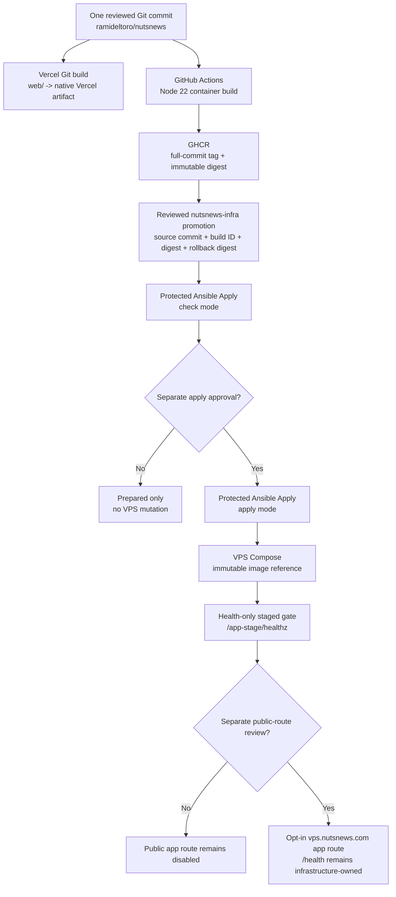

# NutsNews Dual-Target Web Deployment

This guide defines how one reviewed commit from `ramideltoro/nutsnews` is
delivered to Vercel and prepared for an immutable, GitOps-managed VPS rollout.

Issue: [nutsnews-infra #67](https://github.com/ramideltoro/nutsnews-infra/issues/67)

Status: **prepared, not deployed**. Vercel remains the production host for
`nutsnews.com`. The VPS application, staged route, and public application route
remain disabled until a later approved promotion and protected rollout.

## Simple Summary

NutsNews has one website codebase. Vercel builds that code in its normal way,
and GitHub Actions builds a container from the same commit for the VPS. The VPS
does not receive a copy of the source code. It receives a reviewed image digest
through the infrastructure repository.

Preparing the container path does not move traffic. `nutsnews.com` stays on
Vercel, and both VPS application routes stay off.

## Intermediate Summary

`ramideltoro/nutsnews` owns the Next.js source, Vercel build, production OCI
image, portable health endpoint, smoke checks, and build identity. A pull
request may build the image for validation, but it must not publish it. A push
to `main` publishes an immutable full-commit tag to
`ghcr.io/ramideltoro/nutsnews` and records the registry digest.

`ramideltoro/nutsnews-infra` owns promotion. It records the exact source
commit, build ID, immutable image digest, deployment target, and last-known-good
rollback digest. Ansible renders root-only runtime configuration, Compose runs
the image, and Caddy provides a health-only staged gate before any public route
can be considered.

Vercel does not consume the GHCR image. Vercel and the VPS produce different
platform artifacts from the same source commit, which is the required parity
invariant.

## Expert Summary

The application repository enables Next.js standalone output and builds a
non-root Node 22 runtime image containing only the standalone server,
`public`, and `.next/static` runtime material. The image binds on
`0.0.0.0:3000`, exposes portable build identity through `/healthz`, and keeps
the required Next.js cache location writable without making the whole
container filesystem writable. Its health check uses a probe that is actually
present in the final image and fails closed; missing `curl` or `wget` can never
be interpreted as healthy.

The publishing workflow separates unprivileged pull-request builds from the
`packages: write` publishing job. Production references use
`ghcr.io/ramideltoro/nutsnews@sha256:<digest>`; mutable tags, including
`latest`, are invalid when the VPS application is enabled. Application secrets
are runtime-only values from the protected `production-vps` Environment and
are rendered by Ansible with `no_log`. They are never Docker build arguments,
OCI labels, image layers, artifacts, status JSON, or portal fields.

The staged route is intentionally a health-only gate at
`http://127.0.0.1:8080/app-stage/healthz`. It does not prove that pages,
assets, navigation, redirects, or APIs work under `/app-stage`. Public routing
on `vps.nutsnews.com` is a separate opt-in state and must preserve the existing
infrastructure `/health` endpoint.

## Ownership And Invariants

| Repository | Owns | Must not own |
| --- | --- | --- |
| `ramideltoro/nutsnews` | Next.js source, Vercel deployment, Dockerfile, GHCR publishing, portable health/build identity, target-neutral smoke checks | VPS SSH deployment, Ansible, Compose promotion, production route toggles |
| `ramideltoro/nutsnews-infra` | Immutable digest promotion, Ansible, Compose, Caddy, protected rollout, Ops Portal status, rollback digest | A copy, fork, or vendored bundle of the Next.js source |
| `ramideltoro/nutsnews-docs` | Canonical deployment, environment, rollout, rollback, and troubleshooting guidance | Runtime configuration or secrets |
| `ramideltoro/nutsnews-worker` | Scheduled ingestion and background automation | Web image publishing or VPS web rollout |

Required invariants:

- One application codebase exists in `ramideltoro/nutsnews`.
- Vercel and the published OCI image identify the same Git commit.
- Vercel continues to build a native Vercel artifact from `nutsnews/web`.
- The VPS pulls an immutable digest; it never deploys `latest`.
- Only `nutsnews-infra` may promote an image or change VPS routing.
- Database migrations are single-flight, explicit, and auditable. Neither
  target runs migrations at container startup.

## Build And Promotion Flow



There is deliberately no arrow from GHCR to Vercel. The shared identity is the
source commit, not a shared runtime artifact.

## Build Identity Contract

Every target must expose a secret-free identity that operators can compare:

| Field | Vercel | VPS image and Ops Portal |
| --- | --- | --- |
| Source commit | Vercel Git metadata normalized into the portable build ID | Full Git commit recorded at image build and promotion |
| Build ID | Portable application build identifier | Same identifier in `/healthz`, image labels, and portal status |
| Image digest | Not applicable | Registry-resolved `sha256` digest and actual running digest |
| Deployment target | `vercel` | `production-vps` |
| Last-known-good digest | Not applicable; use Vercel deployment rollback | Reviewed prior VPS digest |

OCI labels may include the public repository URL and source revision. They must
not include credentials, environment values, callback secrets, or provider
tokens.

## Environment Parity Matrix

The matrix lists names only. Never paste values into documentation, pull
requests, issues, workflow output, image history, or the Ops Portal.

`NEXT_PUBLIC_*` values are embedded during `next build`. The publishing job
must fail clearly when a required production public build input is absent.
Private server variables are injected at runtime only.

| Variable name | Required / optional | Public / secret | Build / runtime | Vercel source | VPS source | Approved difference |
| --- | --- | --- | --- | --- | --- | --- |
| `NEXT_PUBLIC_SUPABASE_URL` | Required | Public | Build | Vercel Production environment | App image publishing environment | Same production endpoint |
| `NEXT_PUBLIC_SUPABASE_ANON_KEY` | Required | Public | Build | Vercel Production environment | App image publishing environment | Same public browser key |
| `NEXT_PUBLIC_APP_ENV` | Optional | Public | Build | Vercel Production environment | App image publishing environment | Target label may identify Vercel or VPS |
| `NEXT_PUBLIC_NUTSNEWS_SOURCE_COMMIT` | Required | Public | Build | Derived from Vercel Git commit metadata | Derived from the GitHub source commit | Must identify the same source commit |
| `NEXT_PUBLIC_NUTSNEWS_BUILD_ID` | Required | Public | Build | Derived from Vercel Git commit metadata | Derived from the GitHub source commit | Representation must resolve to the same commit |
| `NEXT_PUBLIC_VERCEL_GIT_COMMIT_SHA` | Vercel-provided | Public | Build | Vercel system metadata | Not set | Vercel-only input; portable identity uses `NEXT_PUBLIC_NUTSNEWS_BUILD_ID` |
| `VERCEL_GIT_COMMIT_SHA` | Vercel-provided | Public | Build/runtime metadata | Vercel system metadata | Not set | Vercel-only input normalized into portable identity |
| `NEXT_PUBLIC_GA_ID` | Optional | Public | Build | Vercel Production environment | App image publishing environment | May be omitted on the non-primary VPS endpoint |
| `NEXT_PUBLIC_SENTRY_DSN` | Optional | Public | Build | Vercel Production environment | App image publishing environment | Same project or reviewed target-specific project |
| `NEXT_PUBLIC_TURNSTILE_SITE_KEY` | Required when contact is enabled | Public | Build | Vercel Production environment | App image publishing environment | Hostname allowlist must include only reviewed hosts |
| `NEXT_PUBLIC_NUTSNEWS_IOS_APP_STORE_URL` | Optional | Public | Build | Vercel Production environment | App image publishing environment | Normally identical |
| `AUTH_SECRET` | Required for admin auth | Secret | Runtime | Vercel Production environment | `NUTSNEWS_APP_ENVS_JSON` in `production-vps` | Different target-specific secret is allowed |
| `NUTSNEWS_SOURCE_COMMIT` | Required | Public | Runtime/image metadata | Derived from Vercel Git metadata | Baked as secret-free image metadata | Must identify the same source commit |
| `NUTSNEWS_BUILD_ID` | Required | Public | Runtime/image metadata | Derived from Vercel Git metadata | Baked as secret-free image metadata | Must match the portable build identity |
| `NUTSNEWS_DEPLOYMENT_TARGET` | Required | Public | Runtime | `vercel` deployment metadata | Image/runtime metadata | Target name is intentionally different |
| `NODE_ENV` | Required | Public | Runtime | Vercel-managed | Set to `production` in the final image | Equivalent production mode |
| `HOSTNAME` | Platform-managed | Public | Runtime | Vercel-managed | Set to `0.0.0.0` in the final image | VPS must accept Caddy/container-network traffic |
| `PORT` | Platform-managed | Public | Runtime | Vercel-managed | Set to `3000` in the final image | Port ownership is platform-specific |
| `AUTH_GOOGLE_ID` | Required for admin auth | Public | Runtime | Vercel Production environment | `NUTSNEWS_APP_ENVS_JSON` in `production-vps` | A separate OAuth client is allowed |
| `AUTH_GOOGLE_SECRET` | Required for admin auth | Secret | Runtime | Vercel Production environment | `NUTSNEWS_APP_ENVS_JSON` in `production-vps` | Must match the selected target's OAuth client |
| `AUTH_URL` | Target-dependent | Public | Runtime | Vercel project URL behavior | `NUTSNEWS_APP_ENVS_JSON` in `production-vps` | Must match the reviewed external target URL |
| `AUTH_TRUST_HOST` | Target-dependent | Public | Runtime | Vercel is trusted by platform integration | `NUTSNEWS_APP_ENVS_JSON` in `production-vps` | VPS may enable it only because Caddy is the reviewed proxy |
| `ADMIN_EMAILS` | Required for admin access | Secret | Runtime | Vercel Production environment | `NUTSNEWS_APP_ENVS_JSON` in `production-vps` | Normally identical allowlist |
| `SUPABASE_URL` | Required for privileged admin reads | Public | Runtime | Vercel Production environment | `NUTSNEWS_APP_ENVS_JSON` in `production-vps` | Same production endpoint |
| `SUPABASE_SERVICE_ROLE_KEY` | Required for privileged admin features | Secret | Runtime | Vercel Production environment | `NUTSNEWS_APP_ENVS_JSON` in `production-vps` | Same role, independently stored |
| `BETTER_STACK_SOURCE_TOKEN` | Optional | Secret | Runtime | Vercel Production environment | `NUTSNEWS_APP_ENVS_JSON` in `production-vps` | Separate source token is preferred for target attribution |
| `BETTER_STACK_INGESTING_HOST` | Optional | Public | Runtime | Vercel Production environment | `NUTSNEWS_APP_ENVS_JSON` in `production-vps` | Normally identical |
| `BETTER_STACK_INFO_SAMPLE_RATE` | Optional | Public | Runtime | Vercel Production environment | `NUTSNEWS_APP_ENVS_JSON` in `production-vps` | Target-specific sampling is allowed |
| `TURNSTILE_SECRET_KEY` | Required when contact is enabled | Secret | Runtime | Vercel Production environment | `NUTSNEWS_APP_ENVS_JSON` in `production-vps` | Same widget or reviewed target-specific widget |
| `TURNSTILE_VERIFY_URL` | Optional | Public | Runtime | Code default or Vercel environment | Code default or `NUTSNEWS_APP_ENVS_JSON` | Normally identical |
| `RESEND_API_KEY` | Required when contact email is enabled | Secret | Runtime | Vercel Production environment | `NUTSNEWS_APP_ENVS_JSON` in `production-vps` | Independently stored; never built into image |
| `RESEND_EMAILS_URL` | Optional | Public | Runtime | Code default or Vercel environment | Code default or `NUTSNEWS_APP_ENVS_JSON` | Normally identical |
| `CONTACT_TO_EMAIL` | Required when contact email is enabled | Secret | Runtime | Vercel Production environment | `NUTSNEWS_APP_ENVS_JSON` in `production-vps` | Normally identical destination |
| `CONTACT_FROM_EMAIL` | Required when contact email is enabled | Public | Runtime | Vercel Production environment | `NUTSNEWS_APP_ENVS_JSON` in `production-vps` | Must remain authorized by the email provider |
| `NUTSNEWS_ALLOWED_CONTACT_ORIGINS` | Required for each public target | Public | Runtime | Vercel Production environment | `NUTSNEWS_APP_ENVS_JSON` in `production-vps` | Target-specific reviewed origin list |
| `ACTIONS_READ_TOKEN` | Optional admin status integration | Secret | Runtime | Vercel Production environment | `NUTSNEWS_APP_ENVS_JSON` in `production-vps` | Same least-privilege scope, independently stored |
| `HOME_SERVER_STATS_URL` | Optional admin integration | Secret | Runtime | Vercel Production environment | `NUTSNEWS_APP_ENVS_JSON` in `production-vps` | May remain unavailable from the VPS |
| `HOME_SERVER_STATS_API_KEY` | Optional admin integration | Secret | Runtime | Vercel Production environment | `NUTSNEWS_APP_ENVS_JSON` in `production-vps` | Independently stored |
| `LOCAL_AI_API_KEY` | Optional fallback for home-server stats | Secret | Runtime | Vercel Production environment | `NUTSNEWS_APP_ENVS_JSON` in `production-vps` | May be omitted when integration is disabled |
| `ADMIN_SHARD_COUNT` | Optional | Public | Runtime | Vercel Production environment | `NUTSNEWS_APP_ENVS_JSON` in `production-vps` | Normally identical |
| `ADMIN_SHARD_STALE_MINUTES` | Optional | Public | Runtime | Vercel Production environment | `NUTSNEWS_APP_ENVS_JSON` in `production-vps` | Normally identical |
| `ADMIN_SHARD_SLOW_RUN_MS` | Optional | Public | Runtime | Vercel Production environment | `NUTSNEWS_APP_ENVS_JSON` in `production-vps` | Normally identical |
| `ADMIN_TIME_ZONE` | Optional | Public | Runtime | Vercel Production environment | `NUTSNEWS_APP_ENVS_JSON` in `production-vps` | Normally identical |
| `SENTRY_ORG` | Required only for source-map upload | Public | Build workflow only | Vercel build environment | Image publishing environment | Normally identical |
| `SENTRY_PROJECT` | Required only for source-map upload | Public | Build workflow only | Vercel build environment | Image publishing environment | Normally identical |
| `SENTRY_AUTH_TOKEN` | Required only for source-map upload | Secret | Build workflow only | Vercel build secret | GitHub publishing secret | May differ; must never enter a layer or final image |
| `SENTRY_ENABLE_SOURCE_MAP_UPLOAD` | Optional | Public | Build workflow only | Vercel build environment | Image publishing environment | Upload may be independently enabled per target build |

CI-only values such as `VERCEL_AUTOMATION_BYPASS_SECRET`,
`VERCEL_PROTECTION_BYPASS_SECRET`, `PLAYWRIGHT_BASE_URL`, and audit/report
settings remain in their existing workflow scopes. They are not VPS
application runtime variables.

The infra control plane stores non-secret release state in
`ansible/inventories/production/host_vars/vps.nutsnews.com.yml`. Its reviewed
Ansible variables are:

- `vps_service_foundation_nutsnews_app_enabled`
- `vps_service_foundation_nutsnews_app_staged_route_enabled`
- `vps_service_foundation_nutsnews_app_public_route_enabled`
- `vps_service_foundation_nutsnews_app_image_repo`
- `vps_service_foundation_nutsnews_app_image_digest`
- `vps_service_foundation_nutsnews_app_source_commit`
- `vps_service_foundation_nutsnews_app_build_id`
- `vps_service_foundation_nutsnews_app_deployment_target`
- `vps_service_foundation_nutsnews_app_last_known_good_digest`

Ansible renders the corresponding safe status names
`NUTSNEWS_APP_ENABLED`, `NUTSNEWS_APP_STAGED_ROUTE_ENABLED`,
`NUTSNEWS_APP_PUBLIC_ROUTE_ENABLED`, `NUTSNEWS_APP_IMAGE_REPO`,
`NUTSNEWS_APP_IMAGE_DIGEST`, `NUTSNEWS_APP_SOURCE_COMMIT`,
`NUTSNEWS_APP_BUILD_ID`, `NUTSNEWS_APP_DEPLOYMENT_TARGET`, and
`NUTSNEWS_APP_LAST_KNOWN_GOOD_DIGEST`. The secret/required key-name lists are
also reviewed non-secret state. Only the named application values belong in
`NUTSNEWS_APP_ENVS_JSON` in the protected `production-vps` Environment.

## Image Publishing

Pull requests must:

1. Build and test the production image from the pull-request commit.
2. Run the container with production-shaped, non-production test inputs.
3. Wait for `/healthz`, then smoke `/`, a representative public API route, and
   build identity.
4. Confirm the runtime UID is not root.
5. Inspect image configuration and history for private inputs.
6. Never push an image.

The implementation lives at `web/Dockerfile`, `web/.dockerignore`,
`.github/workflows/container-image.yml`, and
`scripts/dual_target_web_smoke.mjs` in `ramideltoro/nutsnews`.

Pushes to `main` must:

1. Build from the merged commit with required production public build inputs.
2. Publish an immutable full-commit tag.
3. Resolve the registry digest after publication.
4. Expose the source commit, build ID, and digest in safe workflow output.

The selected image architecture must match the read-only verified production
VPS architecture. Use a multi-platform build only when a reviewed requirement
justifies its extra build time and complexity.

A tag is a lookup aid. Promotion always records and deploys the digest.

## Digest Promotion And Protected Rollout

No digest may be invented. If the app PR has not merged and published, the
infra application, staged route, and public route remain disabled.

After a real image exists, use a separate reviewed infra promotion:

1. Verify the GHCR digest belongs to the expected full-commit tag.
2. Record source commit, build ID, immutable digest, target, and current
   last-known-good digest in the infra source of truth.
3. Run `Protected Ansible Apply` in check mode.
4. Review the exact recap and planned image/config changes.
5. Obtain separate approval before apply mode.
6. Apply through Ansible; do not run `docker compose up` manually.
7. Re-verify over read-only SSH, local Caddy, external TLS, and the Ops Portal.

## Staged Validation

The first route gate is health-only:

```text
http://127.0.0.1:8080/app-stage/healthz
```

Required staged evidence after an approved apply:

- the container is healthy and runs the expected immutable digest;
- `/healthz` returns HTTP `200` with the expected source/build identity;
- `/`, one representative public API route, and security headers pass through
  a target-neutral smoke path;
- Caddy preserves host, protocol, and forwarded headers;
- container logs show no startup loop or secret output;
- the Ops Portal reports expected and actual identity without environment data.

Do not claim full prefix support from the health-only route. Full pages, static
assets, navigation, redirects, APIs, and Auth.js callbacks require root-host
testing on the eventual public host.

## Eventual Public Route Activation

Public activation is out of scope for the prepared change. A later reviewed
change may opt in the app route on `vps.nutsnews.com` only after staged parity
and rollback evidence are complete.

The public route must:

- keep `https://vps.nutsnews.com/health` owned by infrastructure;
- preserve WebSocket/streaming behavior and proxy `Host`, scheme, and forwarded
  headers;
- pass through the application's security and cache headers;
- avoid applying the placeholder `default-src 'none'` CSP to app responses;
- leave DNS and `nutsnews.com` traffic unchanged until a separate cutover;
- never introduce traffic splitting, load balancing, or automatic failover as
  part of issue #67.

## Application Parity Review

Before public activation, verify each boundary explicitly:

| Boundary | Required review |
| --- | --- |
| Auth.js | Register the exact Google callback for the VPS host, use the matching OAuth client, verify `AUTH_URL`, and trust only the reviewed Caddy proxy/host path. Test sign-in, sign-out, denied-user, callback, and secure-cookie behavior. |
| Turnstile and contact | Add only the reviewed VPS hostname to Turnstile, set the exact contact origin allowlist, and test allowed, rejected-origin, failed-challenge, and provider-failure paths without exposing keys. |
| Canonical URL | Keep `nutsnews.com` as the canonical production site while Vercel is primary. A staging or VPS request must not silently change SEO canonicals. |
| Cookies, CSRF, and CORS | Preserve HTTPS, forwarded host/protocol, secure cookie scope, same-site behavior, Auth.js CSRF protection, and the contact route's explicit origin check. Do not add a broad CORS wildcard. |
| Sentry | Use the portable build ID/source commit as release identity. Keep the source-map token in build workflow scope and runtime DSN behavior equivalent. |
| Image optimization | Confirm remote image hosts, optimizer output, cache writes, and failure fallbacks in the standalone runtime. |
| Cache and revalidation | Expect platform cache implementations to differ. Verify response policy and revalidation behavior; do not assume Vercel and VPS share cache state. |
| Writable filesystem | Keep the final image immutable except for the explicitly mounted Next.js cache/runtime paths. Do not rely on durable writes elsewhere in the container. |
| Vercel assumptions | Audit Vercel system variables, preview protection, deployment-status cache purge, and platform-only services. Provide a portable equivalent or document the approved target difference. |

The production Vercel callback remains
`https://www.nutsnews.com/api/auth/callback/google`. The future VPS callback is
`https://vps.nutsnews.com/api/auth/callback/google` and must not be treated as
accepted until the matching Google OAuth client and public route are reviewed.
Health-only `/app-stage` validation does not exercise this callback.

## Migration Ownership

Neither Vercel nor the VPS container runs database migrations at startup. A
schema change must have one named migration owner and one auditable execution
path. Complete and verify the migration before allowing both application
targets to serve code that depends on it.

## Ops Portal Status

The portal remains read-only. It may show:

- application enabled state;
- staged and public route states;
- expected image repository and digest;
- actual running image digest;
- source commit and build ID;
- container and route health;
- last deployment result;
- last-known-good rollback digest.

It must not show environment values, credentials, tokens, callback secrets, or
a mutation/restart control.

## Rollback

Vercel rollback uses the existing Vercel deployment rollback path.

VPS rollback is a GitOps promotion of the recorded last-known-good immutable
digest:

1. Open a focused infra change that moves the expected digest back to the
   recorded last-known-good digest.
2. Run protected check mode and review the recap.
3. Obtain separate approval and run apply mode.
4. Verify the running digest, `/healthz`, staged/public route state, security
   headers, and Ops Portal deployment result.

Do not rebuild an old commit and call the new image a rollback. Do not retag
`latest`. Disable the public route first if that reduces user impact.

## Troubleshooting

| Symptom | Likely cause | Safe response |
| --- | --- | --- |
| Image workflow builds on a PR but no package appears | PR jobs are correctly push-disabled | Merge only after review; publishing occurs from `main` |
| Publishing fails before build | A required public production build input is missing | Add/fix the approved GitHub publishing environment input; do not use a production secret as a placeholder |
| Infra rejects the image | Reference is mutable, digest is malformed, or source metadata does not match | Resolve the real GHCR digest and correct the reviewed promotion |
| Container is unhealthy | Missing runtime config, wrong health path, non-writable cache, or startup failure | Inspect sanitized container state/logs over read-only SSH; fix Ansible, Compose, or app source through PR |
| `/app-stage/healthz` fails | App is disabled, route is disabled, Caddy cannot resolve the app, or health identity mismatches | Keep public routing disabled and fix the GitOps source of truth |
| `/app-stage/healthz` passes but pages fail | The staged route proves health only, not prefix compatibility | Test the eventual root host before any public activation |
| Google callback fails | OAuth redirect, `AUTH_URL`, trusted host, or forwarded headers do not match | Correct provider and runtime config through protected sources; do not weaken host validation |
| Contact form rejects VPS requests | Origin or Turnstile hostname is not approved | Add only the exact reviewed origin/hostname and retest |
| Assets or images return errors | Standalone files are incomplete, remote host policy differs, or cache path is not writable | Fix the image contents/config or explicit writable cache mount and rebuild |
| Ops Portal expected and actual digests differ | Drift, incomplete pull, or wrong Compose reference | Keep routes disabled, inspect read-only state, and reconcile through Ansible |

## Current Safe Stop

At the issue #67 review stop:

- Vercel production and preview behavior remain active;
- the application and infrastructure pull requests are unmerged;
- a real digest may not exist until the app PR merges;
- no `production-vps` Environment secret is changed;
- no Protected Ansible Apply is run;
- the VPS application, staged route, and public route are disabled;
- DNS and `nutsnews.com` traffic are unchanged;
- runtime acceptance criteria remain unverified.

## Related Work

- Issue: [ramideltoro/nutsnews-infra#67](https://github.com/ramideltoro/nutsnews-infra/issues/67)
- Application PR: https://github.com/ramideltoro/nutsnews/pull/167
- Infrastructure PR: https://github.com/ramideltoro/nutsnews-infra/pull/88
- [Deployment Checklist](DEPLOYMENT_CHECKLIST.md)
- [Operations](OPERATIONS.md)
- [VPS Service Foundation](NUTSNEWS_VPS_SERVICE_FOUNDATION.md)
- [Protected Ansible Apply](NUTSNEWS_PROTECTED_ANSIBLE_APPLY.md)
- [Operations Portal v1](NUTSNEWS_OPERATIONS_PORTAL_V1.md)
