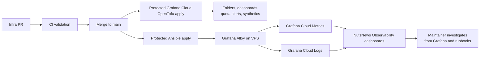
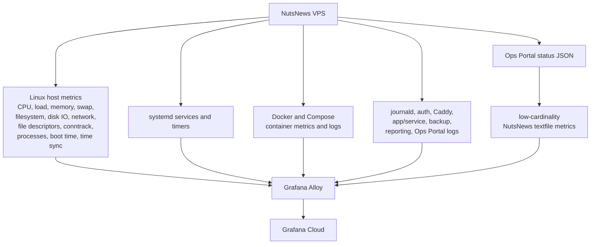

# NutsNews Grafana Cloud Observability

This explains the Grafana Cloud observability layer for the NutsNews VPS: Alloy on the host, Grafana-managed dashboards and alerts, low-frequency Synthetic Monitoring, and free-tier guardrails.

## Easy Summary

The VPS now has a planned Grafana Cloud observability path that stays GitOps-managed.

There are two halves:

1. `ramideltoro/nutsnews-infra` installs and configures Grafana Alloy on the VPS through the protected Ansible workflow.
2. The same infra repo manages Grafana Cloud folders, dashboards, quota alerts, and optional Synthetic Monitoring checks through OpenTofu.

The VPS side is read-only. Alloy collects host metrics, Docker/container metrics when Docker exists, selected service logs, auth/security logs with redaction, backup/reporting logs, Ops Portal logs, and a small set of NutsNews status metrics derived from the existing read-only Ops Portal JSON.

This does not add a shell button, restart button, package installer, portal mutation path, or broad workflow command runner. Production changes still go through commits, PRs, checks, merge, and protected apply.

## Intermediate Summary

The rollout has separate credentials for separate jobs:

| Credential type | Used by | Purpose |
| --- | --- | --- |
| Grafana Cloud Access Policy token | Ansible-managed Alloy on the VPS | Write telemetry to Grafana Cloud metrics and logs |
| Grafana service account token | OpenTofu in GitHub Actions | Manage folders, dashboards, alert rules, and Synthetic Monitoring checks |

Do not reuse the service account token for telemetry writes. Do not commit Grafana URLs, usernames, tokens, tenant IDs, backend config, Synthetic Monitoring targets, or tfvars.

The high-level flow:



## Expert Summary

The infra implementation keeps observability useful without making Grafana Cloud a cost surprise:

- Alloy scrape interval defaults to 60 seconds.
- Host metrics come from Alloy's Unix exporter.
- Container metrics come from cAdvisor only when Docker is present.
- Docker labels are allowlisted to Compose project/service labels.
- High-cardinality labels such as container IDs, image IDs, request IDs, user IDs, raw IPs, and full dynamic paths are dropped or avoided.
- Logs are redacted, size-limited, and rate-limited before leaving the VPS.
- Debug and trace logs are intentionally dropped.
- Rotated compressed logs and stale logs are ignored.
- Synthetic Monitoring checks are disabled until protected variables provide target URLs and probe IDs.
- Synthetic checks must run every 15 minutes or slower.
- OpenTofu blocks apply if configured API checks exceed 70% of the current free API execution assumption.
- Browser Synthetic Monitoring and Grafana Cloud k6 execution are not enabled by default.

Grafana's current public free-tier assumptions used by the docs and module are:

| Area | Current assumption |
| --- | ---: |
| Metrics | 10,000 active series per month |
| Logs | 50 GB ingested per month |
| Synthetic API tests | 100,000 executions per month |
| Synthetic browser tests | 10,000 executions per month |
| k6 | 500 virtual user hours per month |

Always verify the live Grafana pricing page before adding more telemetry: https://grafana.com/pricing/

Grafana Cloud usage and limit metrics are queried through the `grafanacloud-usage` datasource. Grafana documents the `grafanacloud_instance_metrics_limits`, `grafanacloud_logs_instance_limits`, and related usage metrics here: https://grafana.com/docs/grafana-cloud/cost-management-and-billing/manage-invoices/understand-your-invoice/usage-limits/

## What Alloy Collects



The custom NutsNews textfile metrics cover state that already exists locally:

- Ops Portal status feed availability and age.
- Alert counts by severity.
- Backup enabled/configured state, latest snapshot age, stale threshold, last backup/prune/verify result, missing paths, and missing configuration.
- Email reporting enabled/configured state, pending/suppressed alert counts, recipient count, and last report timestamps.
- App enablement, route enablement, container running/healthy state, and route readiness.
- Selected systemd service active/enabled state.
- Docker container running/health/restart count with low-cardinality labels.
- Snapshot resource percentages and recent failed-login counters.

## Logs And Redaction

Log collection is intentionally selective:

| Source | Treatment |
| --- | --- |
| journald priorities 0-4 | Collected with rate limiting |
| auth/security logs | Collected with secret and IP redaction |
| Caddy logs | Collected from `/opt/nutsnews/logs` |
| app/service logs | Collected from managed NutsNews log directories |
| backup/reporting logs | Collected for operations visibility |
| Ops Portal logs | Collected for collector/reporting diagnosis |
| Docker logs | Collected when Docker is present, with debug/trace drops |

Intentionally excluded:

- debug and trace noise
- very large log lines
- old compressed rotations
- raw IP addresses
- request IDs, user IDs, container IDs, image IDs, and full dynamic paths as labels
- secrets, authorization headers, tokens, passwords, API keys, and credentials

This is a practical observability feed, not a copy of every byte the server has ever muttered.

## Grafana Assets Managed As Code

OpenTofu manages a `NutsNews Observability` folder and these dashboards:

- NutsNews VPS Overview
- NutsNews CPU Load Processes
- NutsNews Memory Swap
- NutsNews Disk Filesystem IO
- NutsNews Network Caddy Edge
- NutsNews Docker Compose Containers
- NutsNews Systemd Services Timers
- NutsNews Logs Security Auth
- NutsNews Backups Restore Verification
- NutsNews Ops Portal Reporting
- NutsNews Application Service Health
- NutsNews Synthetic Uptime API Checks
- NutsNews Grafana Cloud Usage Quota

OpenTofu also manages quota alert rules at roughly 70%, 85%, and 95% for configured Grafana Cloud usage guardrails. Contact points are not created in code because they often contain secrets. Instead, alert labels can route into existing Grafana notification policies.

## Synthetic Monitoring

Synthetic Monitoring is optional and configured through protected variables, not committed target URLs.

Recommended first checks:

| Check type | What to verify |
| --- | --- |
| public homepage | public reader surface answers successfully |
| public health route | VPS infrastructure health answers successfully |
| public read-only API route | safe API read returns expected status |
| Ops Portal availability | auth-safe availability signal only, not private data |
| admin-safe status route | only if the route is read-only and safe to hit repeatedly |

Do not check refresh-triggering, ingestion-triggering, admin mutation, OAuth callback, controller, or Worker routes. Monitoring should observe production, not poke it into doing work.

Grafana's monthly Synthetic Monitoring formula is:

```text
probes x tests x rounded-duration-minutes x (43200 / frequency-minutes)
```

Example safe shape:

```text
1 probe x 4 checks x 1 minute x (43200 / 30 minutes) = 5,760 executions/month
```

That is comfortably under the current 100,000 API execution free assumption. Adding more probes, more checks, browser checks, or faster intervals changes the math and must be reviewed before apply.

## k6 Policy

Grafana Cloud k6 is not enabled by default.

If a future smoke or performance test is added, use manual or low-frequency scheduling and calculate virtual user hours first:

```text
(maximum VUs x test duration minutes) / 60 = VUh
```

Grafana states that the free tier and trial are limited to 500 VUh per month. Keep any initial test far below that and stop for approval before enabling a cloud run that could consume paid quota.

## Rollout Procedure

1. Add Grafana Cloud OpenTofu state backend config to the protected `production-vps` Environment.
2. Add the Grafana service account token and datasource UIDs to the same protected Environment.
3. Run `Grafana Cloud Plan`.
4. Merge the infra PR after checks pass.
5. Run `Grafana Cloud Apply` from `main` with `confirm_apply=grafana-cloud`.
6. Add Alloy telemetry write secrets to `production-vps`.
7. Run `Protected Ansible Apply` in check mode with `enable_grafana_alloy=true`.
8. Review the package, config, systemd, and Alloy validation diff.
9. Run apply mode with `confirm_apply=vps.nutsnews.com` and `enable_grafana_alloy=true`.
10. Verify metrics, logs, dashboards, alerts, and usage/quota panels in Grafana Cloud.

## Required Environment Secrets

All of these live in `ramideltoro/nutsnews-infra` under Settings -> Environments -> `production-vps`.

Telemetry write secrets:

| Secret | Purpose |
| --- | --- |
| `NUTSNEWS_GRAFANA_CLOUD_METRICS_URL` | Grafana Cloud metrics remote write endpoint |
| `NUTSNEWS_GRAFANA_CLOUD_METRICS_USERNAME` | Grafana Cloud metrics username |
| `NUTSNEWS_GRAFANA_CLOUD_LOGS_URL` | Grafana Cloud logs push endpoint |
| `NUTSNEWS_GRAFANA_CLOUD_LOGS_USERNAME` | Grafana Cloud logs username |
| `NUTSNEWS_GRAFANA_CLOUD_ACCESS_POLICY_TOKEN` | Access Policy token for telemetry writes |

OpenTofu automation secrets:

| Secret | Purpose |
| --- | --- |
| `NUTSNEWS_GRAFANA_CLOUD_TOFU_BACKEND_CONFIG` | Remote state backend config |
| `NUTSNEWS_GRAFANA_CLOUD_URL` | Grafana Cloud stack URL |
| `NUTSNEWS_GRAFANA_CLOUD_SERVICE_ACCOUNT_TOKEN` | Grafana service account token for IaC |
| `NUTSNEWS_GRAFANA_CLOUD_PROMETHEUS_DATASOURCE_UID` | Metrics datasource UID |
| `NUTSNEWS_GRAFANA_CLOUD_LOKI_DATASOURCE_UID` | Logs datasource UID |
| `NUTSNEWS_GRAFANA_CLOUD_USAGE_DATASOURCE_UID` | Usage datasource UID |

Optional Synthetic Monitoring secrets:

| Secret | Purpose |
| --- | --- |
| `NUTSNEWS_GRAFANA_SYNTHETIC_PROBE_IDS_JSON` | JSON array of probe IDs |
| `NUTSNEWS_GRAFANA_SYNTHETIC_HTTP_CHECKS_JSON` | JSON object of safe HTTP checks |

Do not paste these values into chat, issues, PR bodies, docs, or committed files.

## Verification Queries

Metrics:

```promql
up{service_namespace="nutsnews"}
node_load1{service_namespace="nutsnews"}
node_memory_MemAvailable_bytes{service_namespace="nutsnews"}
node_filesystem_avail_bytes{service_namespace="nutsnews"}
nutsnews_ops_portal_status_available{service_namespace="nutsnews"}
nutsnews_backup_last_success{service_namespace="nutsnews"}
nutsnews_app_container_healthy{service_namespace="nutsnews"}
```

Logs:

```logql
{service_namespace="nutsnews"}
{service_namespace="nutsnews", log_source="auth"}
{service_namespace="nutsnews", log_source="journal"}
{service_namespace="nutsnews", log_source="docker"}
```

Synthetics when configured:

```promql
probe_success{service_namespace="nutsnews"}
probe_duration_seconds{service_namespace="nutsnews"}
```

Quota:

```promql
grafanacloud_instance_metrics_limits
grafanacloud_logs_instance_limits
```

## App Observability Follow-Up

This infra change can observe container health, deployment state, service logs, Caddy routing, and the existing Ops Portal status feed. Deeper application telemetry belongs in the app or Worker repos.

Follow-up prompt for `ramideltoro/nutsnews`:

```text
Add low-cardinality application metrics and structured health telemetry for the deployed NutsNews web service. Keep labels bounded, avoid request/user IDs, and document Grafana queries in nutsnews-docs.
```

Follow-up prompt for `ramideltoro/nutsnews-worker`:

```text
Add low-cardinality Worker metrics for ingestion freshness, queue pressure, AI review counts, translation work, failures, and cost guardrails. Keep labels bounded and avoid raw feed URLs or article IDs.
```

## What This Does Not Do

This layer does not:

- create paid Grafana Cloud features
- enable browser Synthetic Monitoring
- enable Grafana Cloud k6 runs
- add application-code instrumentation
- expose the Ops Portal publicly
- add portal mutation controls
- add arbitrary SSH or workflow command execution
- store Terraform state in Git
- commit Grafana Cloud secrets, URLs, usernames, tenant IDs, targets, or tokens

## Related Docs

- [Observability](OBSERVABILITY.md)
- [Free-Tier Guardrails](FREE_TIER_GUARDRAILS.md)
- [NutsNews Infra Operations Platform](NUTSNEWS_INFRA_OPERATIONS_PLATFORM.md)
- [NutsNews Protected Ansible Apply Workflow](NUTSNEWS_PROTECTED_ANSIBLE_APPLY.md)
- [NutsNews Operations Portal v1](NUTSNEWS_OPERATIONS_PORTAL_V1.md)
- [NutsNews VPS Backups](NUTSNEWS_VPS_BACKUPS.md)
