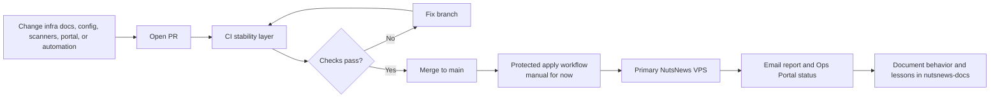
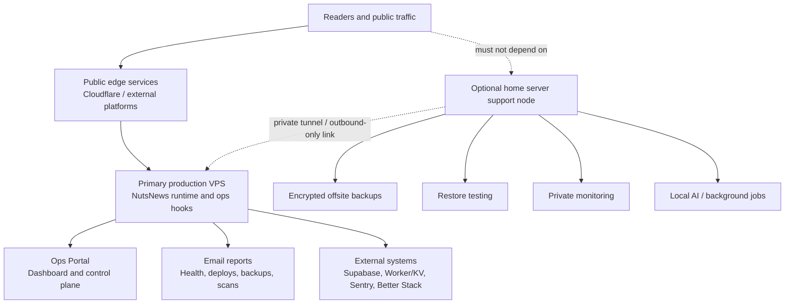
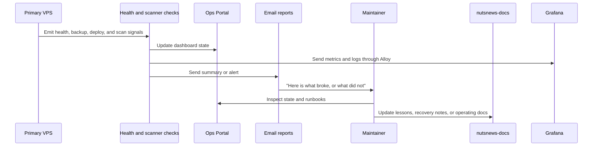
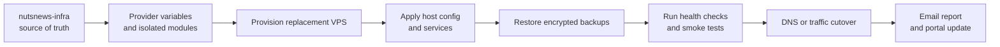

# NutsNews Infra Operations Platform

This explains how the NutsNews infrastructure repo is supposed to make one small VPS behave like a boringly reliable production platform, which is the dream. Boring infrastructure is beautiful. Exciting infrastructure usually texts you at 2:14 a.m.

## Easy Summary

NutsNews has one primary production VPS. The infra repo is the remote control for that VPS, but changes do not go straight to the server like a mystery shell script with root access and a suspicious amount of confidence. They go through a pull request, scanners, review, merge, and then a future automated apply step.

The Ops Portal now has a v1 foundation: a read-only static dashboard, local status collector, and public Caddy route at `https://ops.nutsnews.com` protected by Google OAuth. The loopback listener remains available for private health checks and SSH tunnel fallback.

The VPS backup layer now uses restic and rclone to store encrypted snapshots in OneDrive through the dedicated `nutsnews-onedrive` remote. OneDrive gets ciphertext only. The backup workflows are fixed systemd triggers, not a general-purpose SSH remote-control slot machine.

The Grafana Cloud observability layer adds Alloy on the VPS plus OpenTofu-managed Grafana folders, dashboards, quota alerts, and optional Synthetic Monitoring. It is still read-only on the server side: no portal mutation buttons, no arbitrary remote shell, and no broad workflow command runner.

The home server is optional support gear: good for encrypted backups, restore tests, private monitoring, scheduled reports, and background jobs. It is not allowed to become the secret load-bearing shoebox that keeps the public website online.

## Intermediate Summary

The platform model is strict GitOps:

1. Change code or config in `ramideltoro/nutsnews-infra`.
2. Open a normal pull request.
3. Let CI scanners check repo hygiene, workflows, secrets, supply chain risk, infrastructure-as-code, runtime config, and portal code.
4. Merge only after the required gates pass.
5. Use protected apply workflows for production changes. The first Ansible baseline workflow is manual-only and defaults to check mode.

The VPS remains provider-agnostic. Terraform/OpenTofu and Ansible should isolate provider details so moving from one VPS provider to another is annoying but survivable, not a multi-week archeological dig through shell history.

## Expert Summary

`ramideltoro/nutsnews-infra` is the intended source of truth for the VPS platform state. The stability layer keeps pull requests scanner-heavy and secret-free. The first production mutation path is the protected manual Ansible baseline workflow, which runs through the `production-vps` Environment and defaults to check mode.

The platform is designed around these boundaries:

- Pull request validation must not require production secrets.
- Apply workflows must be restricted to trusted branches or protected environments.
- Container services should land under `/opt/nutsnews` through Ansible and Compose before public routing is exposed.
- Manual SSH is break-glass only and must be documented after the fact.
- Home-server automation is optional support infrastructure, never a public-serving dependency.
- Documentation for infra changes lives here in `ramideltoro/nutsnews-docs`; infra repo docs should stay short and operational.
- Documentation-only changes in this docs repo are pushed directly to `main` and should not trigger app, Worker, VPS, or deployment workflows.
- VPS backups must stay encrypted before leaving the server, and restore tests must be treated as part of the backup system rather than an optional motivational poster.
- Observability must stay useful without becoming a cost leak: separate write and automation tokens, keep targets and tenant-specific values out of Git, and check free-tier guardrails before enabling more telemetry.

## What This Is Trying To Achieve

The goal is a cheap, solo-maintained VPS that still behaves like an adult system:

- Secure enough that default internet nonsense does not immediately win.
- Stable enough that routine maintenance is boring.
- Observable enough that failures explain themselves before coffee is required.
- Recoverable enough that provider migration or rebuild is planned, not improvised.
- Lightweight enough that we do not accidentally reinvent a cloud platform in the broom closet.

## GitOps Flow

What can go wrong:

- A workflow is too powerful and can mutate production from a pull request. That is how you summon a paperwork-shaped outage.
- A manual server change fixes today and breaks tomorrow because the repo no longer matches reality.
- A scanner needs a secret on pull requests. It should not. PR validation should be boring and read-only.

Recovery pattern:

1. Stop making manual changes unless this is break-glass.
2. Capture what changed and why.
3. Reconcile the repo so the next apply will reproduce the intended state.
4. Update the docs here so the next person does not have to decode the smoke signals.

## CI Stability Layer

The infra repo has a first-pass GitHub Actions stability layer. It is intentionally scanner-heavy and deployment-empty.

| Area | What it protects |
| --- | --- |
| Repository Hygiene | Required folders, PR template, CODEOWNERS, and naming rules |
| Workflow Safety | GitHub Actions syntax, workflow security scanning, and blocked restricted triggers |
| Secrets Scan | Gitleaks on PRs, main pushes, manual runs, and nightly schedule |
| Supply Chain | Dependency Review and OSV-Scanner |
| Infrastructure Checks | YAML linting, OpenTofu formatting/validation, TFLint, Checkov, and Ansible lint when files exist |
| Runtime Checks | Compose validation, Hadolint, and Trivy filesystem/config scans |
| Portal Checks | Static portal validation now, plus install/lint/test/build when `portal/package.json` exists later |
| Nightly Audit | Deeper scheduled workflow, dependency, and configuration scans |

The workflows are scaffold-safe. If Terraform, Ansible, Compose, Dockerfile, or portal app files do not exist yet, the related jobs skip cleanly. That is not laziness; that is avoiding fake failures from folders that are still wearing name tags.

## VPS And Home Server Topology

Rules that matter:

- The VPS is production. The home server is support.
- Public website availability must not depend on the home server.
- Use private networking, outbound-only tunnels, or provider-supported private links.
- Do not expose broad inbound ports from the home server.
- Self-hosted GitHub Actions runners on the home server may run only trusted workflows unless explicitly approved later.

## Ops Portal Goal

The Ops Portal should become the place to answer:

- Is the VPS healthy?
- Which services are running, stale, failing, or suspiciously quiet?
- What changed recently?
- Which deploys succeeded or failed?
- Are backups fresh?
- Did restore testing pass?
- Which checks are failing?
- Which alerts need action?
- Which runbook should I follow?
- Did email reporting send, or did it silently wander into the swamp?

Portal actions must respect GitOps. The portal should not become a sneaky manual admin console that mutates production without a commit trail. If it changes infrastructure or service state, it should create or trigger auditable repo-backed workflows.

The v1 implementation is intentionally read-only. It surfaces local host, Docker, service, log, security, backup, alert, GitOps, and runbook state from a sanitized JSON file. It does not expose a shell, Docker socket, package installer, restart button, or any other "what could possibly go wrong?" shortcut.

## Alert And Reporting Flow

Expected report categories:

- Daily platform health summary
- Deploy and rollback summary
- Backup and restore-test status
- Security scanner summary
- Capacity and performance trend summary
- Incident and alert digest
- Weekly maintenance summary

Good reports are short, specific, and useful. Bad reports say "something failed" and then leave you to play production detective with a flashlight and resentment.

## Provider-Agnostic Migration Strategy

Moving VPS providers should be straightforward because the platform keeps provider details isolated.

Migration checklist, at a high level:

1. Provision the replacement VPS from repo-managed definitions.
2. Apply host configuration from repo-managed automation.
3. Restore data from encrypted backups.
4. Run health checks, security checks, and smoke tests.
5. Cut over traffic only after validation passes.
6. Keep the old VPS available until rollback risk is low.
7. Document the migration and any provider-specific surprises here.

If a provider-specific detail cannot be avoided, isolate it and document the escape hatch. Future-you will not remember why a random firewall rule exists. Future-you has other hobbies.

## How Recovery Should Work

For normal failures:

1. Check the Ops Portal.
2. Read the alert email.
3. Follow the linked runbook.
4. Fix through PR and automated apply.
5. Confirm the report turns green.

For break-glass failures:

1. Use manual SSH only if the public service or recovery path needs immediate intervention.
2. Record what was changed.
3. Restore service.
4. Reconcile the repository as soon as practical.
5. Add or update docs and runbooks so the next recovery is less dramatic.

Manual SSH without follow-up documentation is not "ops." It is folklore with a terminal prompt.

## Related Docs

- [Operations](OPERATIONS.md)
- [VPS Ansible Bootstrap](NUTSNEWS_VPS_ANSIBLE_BOOTSTRAP.md)
- [Protected Ansible Apply](NUTSNEWS_PROTECTED_ANSIBLE_APPLY.md)
- [VPS Service Foundation](NUTSNEWS_VPS_SERVICE_FOUNDATION.md)
- [Operations Portal v1](NUTSNEWS_OPERATIONS_PORTAL_V1.md)
- [VPS Backups](NUTSNEWS_VPS_BACKUPS.md)
- [VPS Restore](NUTSNEWS_VPS_RESTORE.md)
- [VPS Disaster Recovery](NUTSNEWS_VPS_DISASTER_RECOVERY.md)
- [Grafana Cloud Observability](NUTSNEWS_GRAFANA_CLOUD_OBSERVABILITY.md)
- [Observability](OBSERVABILITY.md)
- [Security CI Scans](SECURITY_CI_SCANS.md)
- [Dependency Updates](DEPENDENCY_UPDATES.md)
- [Free-Tier Guardrails](FREE_TIER_GUARDRAILS.md)
- [Home Server Dashboard](HOME_SERVER_DASHBOARD.md)
- [Home Server Local AI](HOME_SERVER_LOCAL_AI.md)
