# NutsNews Operations Portal v1

This explains the first real Ops Portal layer for the NutsNews VPS: a read-only amber dashboard, a local status collector, opt-in email alerts/reports, encrypted backup status, managed Docker cleanup status, normalized free-tier and usage-limited service visibility, on-demand report and backup workflows, deeper resource visibility, and a Caddy-managed public route protected by Google OAuth.

## Easy Summary

The VPS has a polished amber dashboard for boring-but-important server facts: overall health, email reporting, remaining free usage, resource pressure, processes, disk, network, services, logs, security posture, bounded firewall deny visibility, encrypted restic backup status, GitOps state, and runbook links.

This update makes the portal easier to scan when the server starts smelling weird. It adds gauges for health score, CPU, RAM, disk, swap, and inodes; temperature-style hot spots for memory pressure, disk pressure, service health, and alert level; compact stats where the data supports them; and an email/reporting block that makes enabled/configured/next run/last run/last success/last error hard to miss.

Swap is reported as a real host state, not a fake number. The status feed distinguishes enabled, disabled, unavailable, unused, minor, non-trivial, warning, and critical swap states. It also records recent kernel OOM evidence from `journalctl -k` so memory pressure, fallback swap use, and actual OOM kills can be read together.

The Free Tier Usage section now groups quota rows by service for the VPS host, Docker storage, backup storage, Vercel, Sentry, Cloudflare, Better Stack, Supabase, Grafana Cloud, and GitHub Actions. Each service group shows current usage, free limit, percent used, remaining amount, period/window, reset date if known, source state, risk state, and per-metric measurement state. Metrics without safe live usage stay visible as `missing credential`, `unavailable`, `unsupported`, or `unknown` instead of pretending to be measured. The section is still read-only; it never upgrades plans, writes provider settings, or calls mutating provider APIs.

There is also a manual `Send VPS Health Report` workflow. It uses the same protected `production-vps` Environment and SSH secret pattern, connects as `nutsnews_ops`, and starts only the existing health report service. No random remote command box. No "type your shell script here." Production does not need karaoke night.

There are also manual `Run VPS Backup` and `Verify VPS Backup` workflows plus a scheduled `nutsnews-restic-verify.timer`. They use the same protected environment pattern and start only fixed systemd units. The portal then shows backup freshness, whether the latest snapshot has a recent successful verification, last backup, last prune, retention, next backup run, next verify run, and protected path coverage.

Docker cleanup status is also visible as read-only operational evidence. The
portal can show the latest cleanup result, timer/service names, cadence, prune
filters, Docker storage summary, prune return codes, and protected-image counts
without exposing the Docker socket or publishing protected image refs.

The important part: it is read-only. No restart button. No "install this one tiny thing" button. No secret shell wearing a dashboard costume. If something needs to change production, it still goes through the civilized path:

```text
commit -> PR -> checks -> merge -> protected apply
```

Issue [nutsnews-infra #67](https://github.com/ramideltoro/nutsnews-infra/issues/67)
extends that read-only model with application deployment status: enabled state,
staged/public route states, expected and actual immutable digest, source commit,
build ID, container/route health, last deployment result, and last-known-good
digest. The prepared change does not enable the app or either route.

For v1, Caddy serves the portal publicly at `https://ops.nutsnews.com` with automatic HTTPS, and every dashboard route is behind a Google OAuth gateway. The protected apply workflow updates the `ops.nutsnews.com` Cloudflare A record immediately when DDNS is enabled, then leaves the DDNS timer enabled for future VPS public IPv4 changes. The only allowed Google account is `rami.deltoro@gmail.com`. Access can still use the narrow SSH tunnel path to `127.0.0.1:8080`, but a browser must complete Google sign-in before the dashboard or `/data/*` status endpoints are served.

## Intermediate Summary

The infra repo now has these pieces:

1. A static portal under `portal/`
2. An Ansible-installed collector at `/usr/local/bin/nutsnews-ops-portal-collector`
3. A systemd timer named `nutsnews-ops-portal-collector.timer`
4. An Ansible-installed reporter at `/usr/local/bin/nutsnews-ops-portal-reporter`
5. Alert and daily report timers named `nutsnews-ops-alert-check.timer` and `nutsnews-ops-health-report.timer`
6. A Google OAuth gateway that serves `/api/auth/signin/google`, `/api/auth/callback/google`, and all authenticated portal files
7. A manual GitHub Actions workflow named `Send VPS Health Report`
8. Manual backup workflows named `Run VPS Backup` and `Verify VPS Backup`
9. A scheduled latest-backup verification timer named `nutsnews-restic-verify.timer`
10. A read-only free-tier usage collector module at `/usr/local/bin/ops_free_tier_usage.py`
11. Root-only free-tier collector configuration at `/etc/nutsnews/free-tier-usage.env`
12. Local usage-limited service entries for VPS resources, Docker storage, and backup storage/freshness
13. Managed Docker cleanup status from `/opt/nutsnews/portal-assets/data/docker-cleanup-status.json`
14. CI guardrails that validate the portal fixture, Google OAuth allowlist, callback route, secret redaction, read-only surface, backup status, Docker cleanup status, free-tier fallback states, and the no-arbitrary-command shape of the manual report and backup workflows
15. A read-only application deployment block that compares reviewed release state with the running container without exposing runtime values

The collector runs locally on the VPS, reads host state, redacts obvious sensitive log patterns, and writes JSON here:

```text
/opt/nutsnews/portal-assets/data/status.json
```

Caddy serves the static portal and the JSON feed from:

```text
https://ops.nutsnews.com/
https://ops.nutsnews.com/data/status.json
```

Unauthenticated requests to dashboard routes or `/data/status.json` are redirected to `/api/auth/signin/google`. The Google OAuth callback path is fixed at:

```text
/api/auth/callback/google
```

The Google OAuth authorized redirect URI must use a concrete dashboard host:

```text
https://<dashboard-domain>/api/auth/callback/google
```

Configured callback URLs:

- Production: `https://ops.nutsnews.com/api/auth/callback/google`
- Staging: `https://staging.ops.nutsnews.com/api/auth/callback/google`
- Dev: `https://dev.ops.nutsnews.com/api/auth/callback/google`

The hostless shorthand `https:///api/auth/callback/google` documents the required path shape only; runtime config must use one of the concrete URLs above.

The portal does not mount the Docker socket into a public-facing app. Docker state is collected by the local systemd service, flattened into JSON, and handed to the browser like a report card. Much safer than giving the web UI a chainsaw and hoping it only trims hedges.

Docker cleanup follows the same boundary. The root-run cleanup oneshot talks to
Docker locally and writes a bounded status file. The collector publishes only a
compact `docker_cleanup` summary in `status.json`.

Firewall deny visibility is intentionally aggregated. UFW packet logging is disabled by the baseline to keep repetitive denied internet scans out of warning-priority journal output. The collector filters any retained UFW packet lines out of the raw journal warning panel, exposes a bounded deny summary with redacted packet samples, and reads aggregate UFW chain counters so operators can still see whether denied traffic is occurring.

The reporter reads that same JSON feed and can send two kinds of email:

- warning/critical alert emails with a duplicate-alert cooldown
- scheduled daily health reports
- on-demand health reports when GitHub Actions starts the fixed systemd report unit

SMTP values live in the protected `production-vps` GitHub Environment and are rendered by Ansible into `/etc/nutsnews/ops-reporter.env` with mode `0600`. If email is disabled or missing required settings, the reporter exits successfully, writes that state for the portal, and does not improvise. Infrastructure improv is for jazz bands and outages.

Free-tier quota values live in Ansible configuration under `vps_service_foundation_free_tier_quotas`. Local VPS, Docker, and backup entries come from live read-only status collection instead of a static provider quota. Each service entry records the provider name, plan, source URL or local source description, last verification date where applicable, metrics, units, free limits, warning/critical/over-limit thresholds, optional read-only live collection settings, and whether the specific metric is measured, missing credentials, unavailable, unsupported, or unknown. Usage data can come from a safe live collector, a normalized snapshot, or a local cache. If no safe source exists, that provider shows `not configured`, `unavailable`, or `unknown` instead of failing the whole portal.

## OS Update Visibility

### Simple Summary

The Ops Portal now separates ordinary package updates from security updates.
It also shows whether `apt-daily-upgrade.timer` is active and whether the last
`apt-daily-upgrade.service` run succeeded.

If security updates sit around too long, the portal raises a warning. That is a
signal to use the reviewed maintenance path, not a reason to run package
upgrades manually over SSH.

### Intermediate Summary

The collector reads `apt list --upgradable`, counts all pending packages, and
separately counts lines that come from security pockets. The security section
publishes:

- total pending package count
- informational pending package count
- pending security package count
- bounded package samples
- bounded security package samples
- stale-security-update threshold, default `30h`
- package-update policy status
- `apt-daily-upgrade.timer` active/enabled state
- `apt-daily-upgrade.service` last result, exit code, and timestamps

The alert layer emits a warning only when pending security updates are stale or
the unattended-upgrades timer is unexpectedly inactive. Non-security updates
remain visible but informational until a maintenance workflow handles them.

### Expert Summary

This change is visibility, not package mutation. The collector runs read-only
commands and systemd introspection from the existing root-run local status
collector. It does not add an arbitrary command channel, an SSH maintenance
shortcut, or a direct `apt upgrade` workflow.

The stale policy is GitOps-configured by
`vps_service_foundation_security_update_stale_after_hours`, passed to the
collector as `NUTSNEWS_SECURITY_UPDATE_STALE_AFTER_HOURS`. The default is 30
hours, giving the daily unattended-upgrades timer time to run while still making
stuck security updates obvious in reports and alerts.

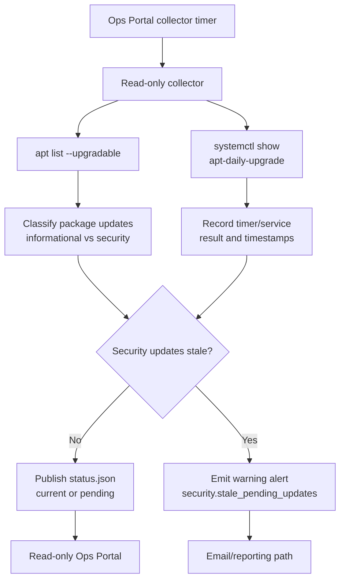

Operational response:

1. Check the portal security section and `apt-daily-upgrade.service` result.
2. Confirm whether security updates are pending because the daily timer has not
   run yet, because unattended-upgrades failed, or because a reboot or non-auto
   package path is needed.
3. Use the protected GitOps maintenance path once available. Until then, track
   the maintenance follow-through in the infra issue rather than making routine
   manual package changes.

## Expert Summary

Ops Portal v1 is intentionally simple:

- Static HTML, CSS, and JavaScript
- No package manager
- No database
- No app server
- No authenticated public route yet
- No mutating endpoints
- No direct Docker socket mount in the served portal
- No production secrets
- No automatic apply on merge
- No arbitrary remote command input in the manual health-report workflow
- No provider mutations or paid-plan assumptions in the free-tier collector

The collector runs as root because it needs to read system logs, systemd state, Docker state, UFW output, open ports, and backup directory metadata. That sounds spicy, so the blast radius is kept small:

- It is a local oneshot systemd service, not a web service.
- It exposes no HTTP listener.
- It writes only the portal JSON snapshot.
- The systemd unit uses hardening such as `NoNewPrivileges`, `ProtectSystem=strict`, private temp, and constrained writable paths.
- The browser receives already-sanitized JSON, not a command API.

The protected Ansible apply workflow now passes non-secret GitHub run metadata into Ansible. After the role verifies Caddy and the portal JSON endpoint, it can stamp the deployed infra commit and last successful apply marker for the dashboard.

The same workflow can also pass optional SMTP values from protected Environment secrets into Ansible extra vars. The secret-bearing reporter env file task is `no_log`, so apply diffs do not print the SMTP password into Actions logs. This is basic hygiene, but basic hygiene is also why the kitchen has soap.

The protected workflow can also pass optional free-tier usage values and read-only provider tokens into Ansible extra vars. Ansible renders them into `/etc/nutsnews/free-tier-usage.env` with mode `0600`, and the collector writes only sanitized usage numbers, source status, risk status, remaining amount, and timestamps into portal JSON. Tokens are never copied into `status.json`.

Protected apply refreshes the status snapshot through an orderly systemd path:
it pauses `nutsnews-ops-portal-collector.timer`, waits for any active
collector one-shot to finish, starts `nutsnews-ops-portal-collector.service`,
and always resumes the timer afterward. That keeps intentional apply refreshes
out of the service-failure history while preserving failures for real collector
errors or timeouts. The collector also falls back to
`/etc/nutsnews/free-tier-usage.env` when process env is missing free-tier
settings, so external providers such as Vercel stay visible instead of
disappearing from the generated snapshot.

## Collector Refresh During Protected Apply

Simple: protected apply no longer kills the portal collector to refresh the
dashboard. It waits its turn, runs one clean refresh, and turns the timer back
on.

Intermediate: the one-minute timer can already have a collector one-shot
running when Ansible wants a fresh snapshot. Ansible now stops the timer first,
waits for any active one-shot to become inactive, starts the managed collector
service, and resumes the timer in an `always` block. A real collector failure
still fails protected apply.

Expert: the refresh task intentionally avoids `systemctl restart` for the
`Type=oneshot` collector because restart terminates an active process with
SIGTERM and leaves noisy `status=15/TERM` / `Failed with result 'signal'`
history. The bounded wait uses `systemctl show ActiveState` and preserves the
unit result semantics: timeout, failed start, or collector exit failure remain
visible and stop the deployment path.

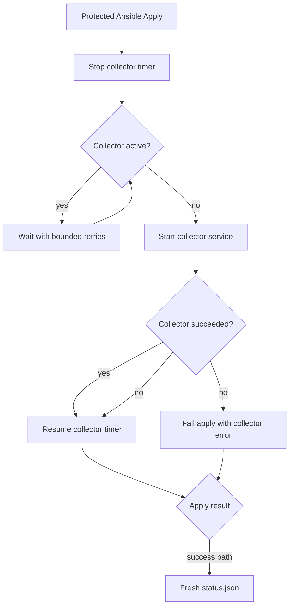

Application release metadata comes from the reviewed infra source of truth and
sanitized local Docker inspection. Expected repository/digest, source commit,
build ID, deployment target, route flags, last result, and rollback digest are
safe status. Actual image identity comes from the running container. The
collector must never copy `NUTSNEWS_APP_ENVS_JSON`, environment values, OAuth
credentials, provider keys, or secret-bearing Docker inspection fields into
`status.json`.

The App Layer now includes a read-only release-gate panel. It reports candidate
digest/source/build, staging deployment ID, staging health/ready state,
qualification state/run/expiry, config and test revisions, promotion run/time,
previous digest, and rollback state when those values are available from the
reviewed manifest and last apply marker. It does not query GitHub or staging
with secrets from the VPS. Unknown data is labeled `unknown`; absent setup is
`not configured`; stale evidence is `expired`; superseded candidates are
reported as `superseded` when the retained gate metadata proves that state.

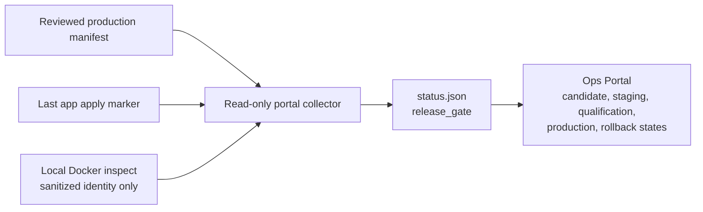

The manual `Verify Ops Portal Status` workflow can be used after deploy when local SSH is unavailable or the browser session is not authenticated. It uses the protected `production-vps` SSH key, reads only `/opt/nutsnews/portal-assets/data/status.json`, prints sanitized Vercel free-tier status fields plus metric states, checks masked `/etc/nutsnews/free-tier-usage.env` key presence and collector timer/journal state, and probes the configured Vercel Billing Charges endpoint for sanitized response shape and aggregate diagnostics. It fails if Vercel disappears, falls back to cached placeholders, emits zero-like display values for null usage, or renders a known unavailable/unsupported Vercel row as generic `unknown`.

Free-tier pressure now feeds the same alert list used by email reporting. Warning, critical, and over-limit provider states can produce alert emails and appear in the daily health report. Unknown or not-configured providers stay visible in the portal summary but do not pretend to be live data.

Resource visibility stays cheap-VPS friendly:

- process rankings come from `/proc`
- CPU percent is a best-effort lifetime average, not a live flame graph
- swap total, used, usage state, sustained/non-trivial warnings, and recent OOM evidence come from local kernel and journal data
- UFW deny volume comes from bounded summaries and aggregate firewall counters, not unbounded packet log lines in the raw warning panel
- disk hot spots use `du` with a cache so the collector does not rescan heavy folders every minute
- host network counters come from standard Linux interface stats
- per-process network byte totals are explicitly marked unavailable unless we approve extra telemetry later
- the UI is static HTML/CSS/JS, not a frontend framework doing jazz hands on a tiny VPS

## Collector Cadences

### Simple

The Ops Portal still refreshes every minute. Fast health data stays fresh, while slower scans reuse a short local cache so the tiny VPS is not spending a large slice of a CPU core rebuilding the same status every minute.

### Intermediate

The collector writes slow-section cache data to `/opt/nutsnews/portal-assets/data/collector-slow-cache.json`. Docker inspect/image metadata, Docker Compose listings, process rankings, log excerpts, security/update scans, backup filesystem metadata, local free-tier storage rows, OOM journal evidence, and Alloy visibility each have their own TTL. The public `status.json` includes `collector.runtime_seconds`, `collector.slow_sections`, and per-section `_collector_cache` metadata with `live`, `fresh_cache`, `stale_cache`, or `unavailable` state.

`stale_cache` means the collector kept the last sanitized section after a refresh failure. That is intentional: it preserves useful portal context while making the failure visible. Critical host state such as CPU, memory, root disk, network counters, important systemd services, and basic Docker container presence still updates on the minute timer.

### Expert

The GitOps-managed TTL defaults are five minutes for Docker enrichment, Compose listings, process tables, logs, backups, and Alloy visibility; fifteen minutes for security/update scans, local free-tier storage rows, and OOM journal evidence; and one hour for the existing disk hotspot `du` scan. The timer cadence remains one minute so alerts can still evaluate fresh critical state. Tune these values through the Ansible role defaults and protected apply, not by editing files on the VPS.

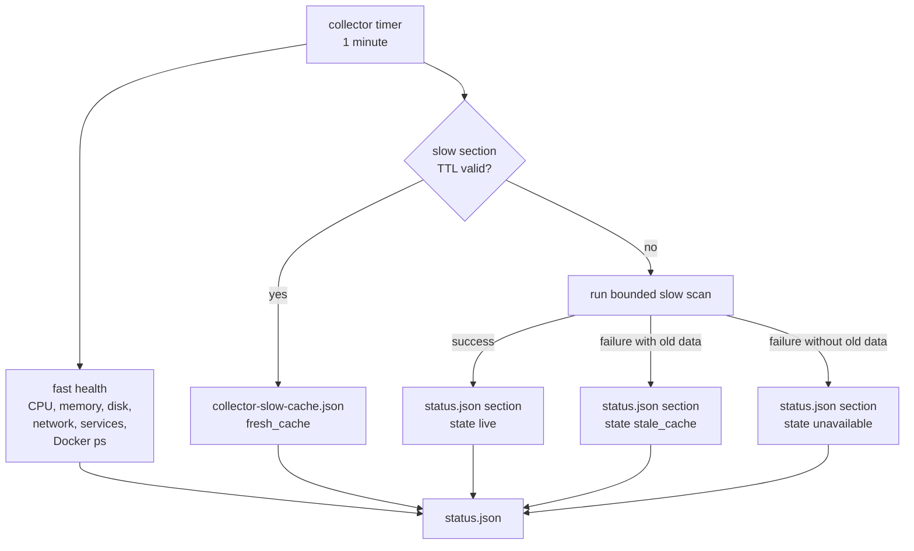

## Portal Architecture

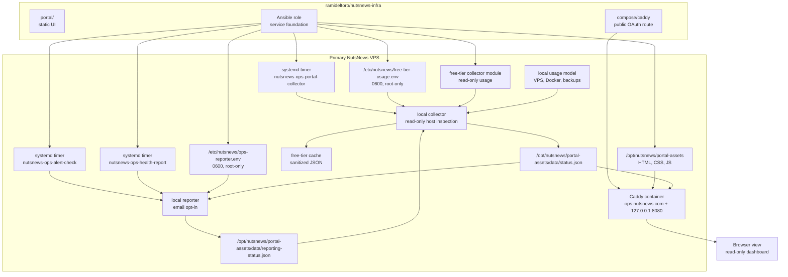

The key design choice is separation: the collector can inspect the host, the reporter can send email when explicitly configured, but the served portal only reads JSON. The dashboard is a window, not a screwdriver drawer.

## GitOps Apply Flow

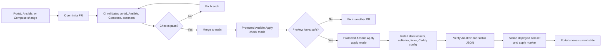

Check mode still deserves suspicion. It is useful, but it can lie like a resume: "expert in Docker service management" while Docker is not actually installed yet. The role keeps check mode safe by skipping runtime-dependent tasks until real apply mode creates real services.

## Data Collection Flow

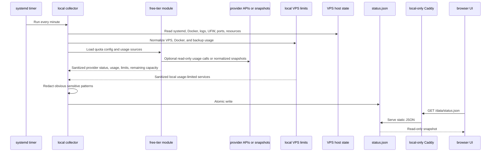

The portal is not a live shell. It is a snapshot reader. That makes it less magical, which is great, because magical production systems usually require candles and apologies.

## Free Tier Usage Flow

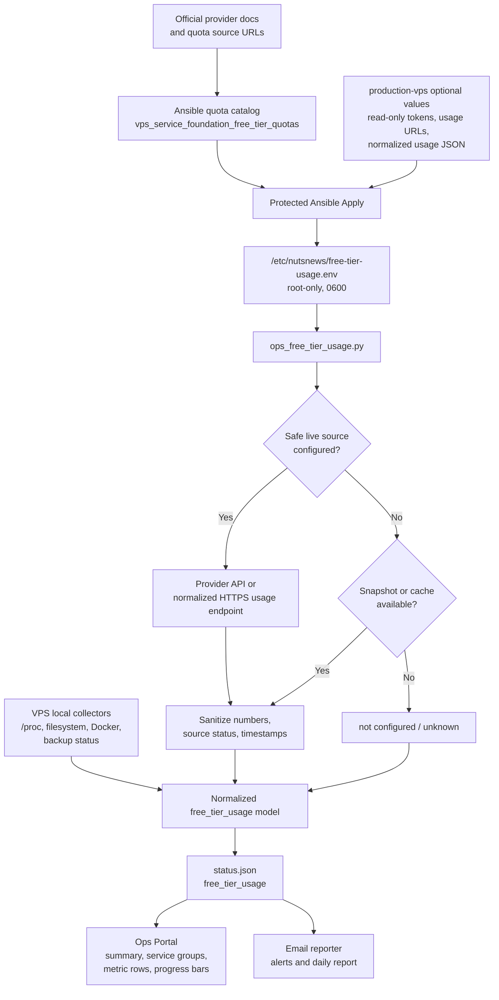

The live path is deliberately conservative. Vercel uses the official Billing Charges FOCUS endpoint and does not use generic snapshot/cache fallback, because placeholder zeroes are unsafe for billing usage. Sentry uses the official organization stats endpoint when an `org:read` token and org slug are configured. Grafana Cloud usage can be read through the existing `grafanacloud-usage` datasource using the Grafana Cloud URL, service account token, and usage datasource UID. Other providers use optional normalized HTTPS usage endpoints or snapshot JSON until a specific official read-only API integration is reviewed. Missing, malformed, or stale inputs become visible provider states; they do not abort the portal collector. Local VPS entries are always read from the host snapshot and are never browser-side API calls.

Normalized service fields:

| Field | Meaning |
| --- | --- |
| `key`, `platform`, `plan` | Stable service ID, display name, and free/current plan context |
| `metrics[]` | Used, limit, remaining, percent used, percent remaining, unit, period/window, and reset date if known |
| `source_status` | `live`, `cached`, `not configured`, `unavailable`, or `unknown` |
| `metrics[].measurement_status` | `measured`, `missing credential`, `unavailable`, `unsupported`, or `unknown` |
| `metrics[].measurement_detail` | Sanitized reason for the metric state; never includes tokens or provider secrets |
| `risk_status` | `safe`, `warning`, `critical`, `over_limit`, `unknown`, or `not_configured` |
| `last_checked_at`, `stale` | Freshness metadata for the last usage source |
| `quota_source`, `quota_last_verified` | Official provider source and verification date, or a local source description for VPS-derived limits |

Quota config fields:

| Field | Meaning |
| --- | --- |
| `key` / `platform` | Stable provider key and display name |
| `quota_source` / `quota_last_verified` | Official source URL and last human verification date |
| `notes` | Operational context for the provider quota |
| `live` | Optional read-only collector definition, token env names, URL env names, metric paths, and provider-specific settings |
| `metrics[].key` / `metrics[].label` | Stable metric key and display label |
| `metrics[].unit` / `metrics[].period` | Display unit and billing or measurement window |
| `metrics[].limit` | Free-tier quota value |
| `metrics[].quota_source` / `metrics[].usage_source` | Optional metric-specific source URL and collection note when a provider has multiple products or an unsupported usage source |
| `metrics[].warning_used_percent` / `metrics[].critical_used_percent` | Optional warning and critical thresholds |

Current service coverage:

| Service | Quotas covered | Current usage source |
| --- | --- | --- |
| VPS Host | CPU sample, RAM, root disk, swap total/used/state, recent kernel OOM evidence | Local collector |
| Docker Storage | Docker data directory footprint | Local collector |
| Backup Local Cache | Local backup cache GiB only; snapshot age stays in backup health | Local collector and backup status |
| Vercel | Hobby usage summary plus relevant deployment/build limits | Billing Charges FOCUS JSONL where configured; unsupported rows stay visible |
| Sentry | Developer Free errors, logs, app metrics, spans, replays, uptime/cron/metric monitors, attachments | Stats v2 for supported categories; snapshots or future collectors for the rest |
| Cloudflare | Workers, Workers KV, Pages, and R2 free limits | Workers GraphQL for requests; snapshots or future collectors for KV, Pages, and R2 |
| Better Stack | Monitors/heartbeats, status pages/subscribers, exceptions, logs, traces, metrics, web events, session replays | Normalized HTTPS usage endpoint |
| Supabase | Egress, database size, auth MAU, third-party MAU, storage, Edge Functions, Realtime messages, Realtime peak connections | Normalized HTTPS usage endpoint or snapshot |
| Grafana Cloud | Metrics, logs, traces, profiles, Synthetic Monitoring API/browser executions, Frontend Observability sessions | `grafanacloud-usage` datasource for wired queries; snapshots or future collectors for the rest |
| GitHub Actions | Hosted-runner minutes, artifact storage, cache storage, REST API primary rate limit | Repository REST endpoints and optional token; billing minutes need a billing-scoped endpoint |

Optional protected Environment values:

| Value | Purpose |
| --- | --- |
| `NUTSNEWS_FREE_TIER_USAGE_JSON` | Provider-keyed normalized usage snapshot for providers without live collection |
| `NUTSNEWS_VERCEL_API_TOKEN`, `NUTSNEWS_VERCEL_USAGE_API_URL` | Optional Vercel read-only usage source |
| `NUTSNEWS_SENTRY_AUTH_TOKEN`, `NUTSNEWS_SENTRY_ORG`, `NUTSNEWS_SENTRY_BASE_URL` | Optional Sentry Stats v2 usage source; token should be limited to read scope |
| `NUTSNEWS_CLOUDFLARE_USAGE_API_TOKEN`, `NUTSNEWS_CLOUDFLARE_USAGE_API_URL`, `NUTSNEWS_CLOUDFLARE_ACCOUNT_ID` | Optional Cloudflare read-only usage source |
| `NUTSNEWS_BETTER_STACK_API_TOKEN`, `NUTSNEWS_BETTER_STACK_USAGE_API_URL` | Optional Better Stack read-only usage source |
| `NUTSNEWS_SUPABASE_ACCESS_TOKEN`, `NUTSNEWS_SUPABASE_USAGE_API_URL` | Optional Supabase read-only usage source |
| `NUTSNEWS_GRAFANA_CLOUD_URL`, `NUTSNEWS_GRAFANA_CLOUD_SERVICE_ACCOUNT_TOKEN`, `NUTSNEWS_GRAFANA_CLOUD_USAGE_DATASOURCE_UID` | Optional Grafana Cloud usage datasource source for active-series and logs ingestion usage |
| `NUTSNEWS_GRAFANA_CLOUD_USAGE_API_TOKEN`, `NUTSNEWS_GRAFANA_CLOUD_USAGE_API_URL` | Legacy optional Grafana Cloud billed-usage source; keep only as fallback diagnostics unless the billing API path is deliberately restored |
| `NUTSNEWS_GITHUB_USAGE_API_TOKEN`, `NUTSNEWS_GITHUB_ACTIONS_USAGE_API_URL` | Optional GitHub Actions and REST API usage source |

`NUTSNEWS_FREE_TIER_USAGE_JSON` must be a JSON object for providers without a live collector. A minimal provider snapshot looks like:

```json
{
  "better_stack": {
    "last_checked_at": "2026-07-05T00:00:00+00:00",
    "usage": {
      "logs_gb": 1.2,
      "monitors_heartbeats": 3
    }
  }
}
```

The collector also accepts `providers.vercel.metrics`, `providers.vercel.usage`, top-level provider metric values, and metric-list entries such as `{"key":"fast_data_transfer_gb","usage":32}`. Snapshot data is only a fallback when the live read-only collector is missing or unavailable.

Generic `*_USAGE_API_URL` values must be HTTPS GET endpoints and return normalized read-only JSON such as:

```json
{
  "usage": {
    "logs_gb": 1.2
  }
}
```

Do not use paid-only APIs, mutating endpoints, write/admin tokens, global API keys, automatic upgrade flows, or screenshots/logs that expose provider secrets.

Provider-specific live usage notes:

- Vercel uses `NUTSNEWS_VERCEL_API_TOKEN` and `NUTSNEWS_VERCEL_USAGE_API_URL`. Configure the URL as the HTTPS Billing Charges endpoint, including `teamId` or `slug` when the Vercel account is team-owned. The collector adds ISO 8601 `from` and `to` query parameters, parses the FOCUS JSONL response, and aggregates documented quantity fields into the configured Hobby quota metrics by service/unit matchers. Deployment count, concurrent deployment, build-time, and static-upload limits are shown as unsupported until a read-only deployment/build collector is added. Vercel does not use generic snapshot/cache fallback; if the live API fails or omits a metric, the portal shows `unavailable` with the safe backend reason instead of generic `unknown` or placeholder zeroes. `Costs not found` means the protected team ID or slug, account billing visibility, token role, or billing endpoint is not exposing the requested usage data. Monthly Vercel rows expose the next UTC month boundary as `reset_at`.
- Sentry uses Stats v2 with `NUTSNEWS_SENTRY_AUTH_TOKEN`, `NUTSNEWS_SENTRY_ORG`, and `NUTSNEWS_SENTRY_BASE_URL`. The base URL may be `https://sentry.io` or `https://sentry.io/api/0`; `401 Invalid token` means the token must be replaced with one that can read org stats.
- Cloudflare Workers request usage is read with a POST to the GraphQL Analytics API using `NUTSNEWS_CLOUDFLARE_ACCOUNT_ID`. Workers CPU/configuration limits, Workers KV usage, Pages usage, and R2 quota metrics still need a normalized snapshot or dedicated read-only collectors.
- Better Stack monitor count can be read from a normalized provider endpoint by counting the returned `data` list. Logs, traces, metrics, RUM/web events, session replays, status page subscribers, and exception volume still need normalized usage fields or a dedicated read-only usage endpoint.
- Supabase analytics endpoints can return metric-specific `result` rows, not the normalized storage, egress, auth, edge function, and realtime quota fields the portal displays. Do not map unrelated API-request counts into those quota fields.
- Grafana Cloud usage is read from the existing `grafanacloud-usage` Prometheus datasource through the Grafana datasource proxy. The collector uses read-only GET queries for `max(grafanacloud_instance_metrics_usage)` and `max(grafanacloud_logs_instance_usage)`. A `403` on this path means `NUTSNEWS_GRAFANA_CLOUD_SERVICE_ACCOUNT_TOKEN` cannot query the configured usage datasource or `NUTSNEWS_GRAFANA_CLOUD_USAGE_DATASOURCE_UID` points at the wrong datasource. The older billed-usage API token and URL can still explain billing API failures, but the portal live path should prefer the usage datasource.
- GitHub Actions can read public repository cache and artifact usage without a token when `NUTSNEWS_GITHUB_ACTIONS_USAGE_API_URL` points at a public repository API URL. Use `NUTSNEWS_GITHUB_USAGE_API_TOKEN` only for private repository access or authenticated REST rate-limit telemetry. If configured, use a fine-grained read-only token for repository Actions metadata. Do not create custom secrets whose names start with `GITHUB_`. Hosted-runner billing minutes require a separate billing-scoped endpoint and should remain unknown until that is explicitly wired.

## Email Alert And Report Flow

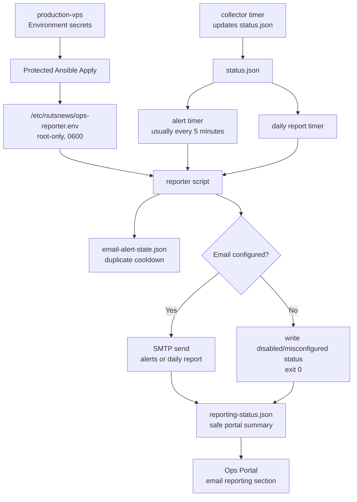

The reporter is deliberately boring. It does not restart services. It does not patch configs. It does not turn an alert into a shell command wearing a fake mustache. It reads the status JSON, applies cooldown rules, sends email only when configured, and writes a sanitized status file for the portal.

Alert emails only send for warning and critical conditions. Stable machine-readable identities and severity drive cooldown decisions; changing values remain useful in the email body without making the condition look new. A warning-to-critical escalation can notify immediately, cleared conditions are removed from active state, and active state is capped. See the shared [VPS Alert Email Policy](VPS_ALERT_EMAIL_POLICY.md).

## Manual Health Report Workflow

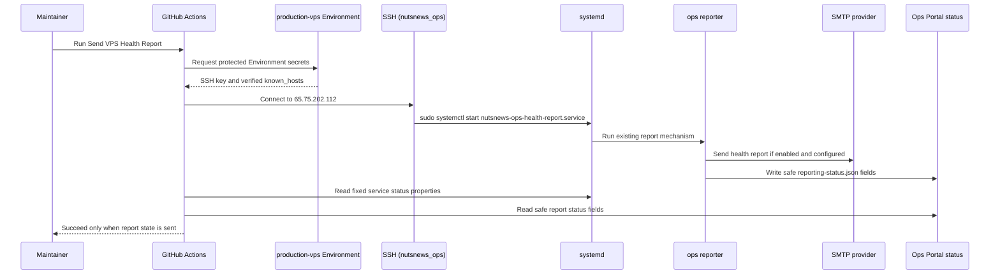

This workflow is intentionally less flexible than a vending machine that only sells one sandwich. It has no dispatch inputs, no remote command parameter, no streamed shell script, and no install/restart/reconfigure controls. It starts the existing `nutsnews-ops-health-report.service` unit and then prints safe status fields: enabled, configured, SMTP host configured, recipients count, mode, status, last run, last success, and last error.

If SMTP is disabled or misconfigured, the workflow fails clearly instead of pretending an email went out. That is the correct level of dramatic honesty.

## Resource Visibility Flow

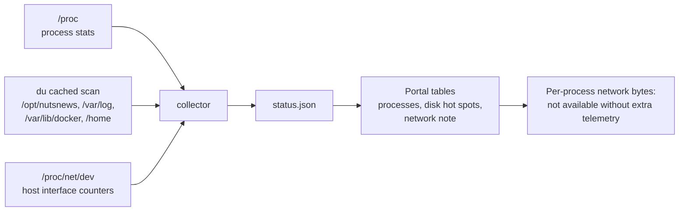

The CPU table is useful, not omniscient. It shows a lifetime average normalized across CPU cores, which is enough to spot "why is this thing always eating the box?" It is not a replacement for a profiler, and that is fine. The VPS is running a news platform, not auditioning for a cloud bill.

## What The Portal Shows

| Section | What it shows |
| --- | --- |
| Overall Health | Health score gauge, hostname, uptime, public IPs, OS, kernel, deployed infra commit, last apply marker |
| Application Deployment | App enabled state; staged/public route states; expected image repository/digest; actual running digest; source commit; build ID; deployment target; container and route health; last deployment result; last-known-good digest |
| Alerts and Email Reporting | Email enabled/configured state, SMTP configured flag, next report run, last run, last success, last error, pending alerts, timer state |
| Free Tier Usage | Service-grouped VPS host, Docker storage, measurable backup local-cache GiB, Vercel, Sentry, Cloudflare, Better Stack, Supabase, Grafana Cloud, and GitHub Actions quota rows with usage, free limits, remaining amount, percent used, period/window, reset date if known, source status, measurement status, and risk status |
| Resources | Gauges for CPU, RAM, root disk, swap, and root inode usage; swap state; recent kernel OOM evidence; load stats; network counters; NutsNews disk usage |
| Hot Spots | Temperature-style memory pressure, disk pressure, service health, and alert level |
| Processes | Top memory and CPU apps with client-side filtering, PID, user, memory, CPU estimate, thread count, CPU time, elapsed time, idle time |
| Disk | Cached top folder sizes across approved local roots, scan cache status, largest scanned entry |
| Network | Host send/receive counters, interface counters, and an honest note that per-process byte totals need extra telemetry |
| Telemetry | Grafana Alloy service/readiness state, container metrics strategy, textfile metrics files, and recent `containerd.sock: connect: permission denied` exporter-error counts |
| Services | `ssh`, `docker`, unattended upgrades, UFW, fail2ban or CrowdSec if present, portal collector/reporting timers |
| Docker and Compose | Containers, health, restart count, image names, ports, compose project |
| Logs | Recent Caddy logs, journal warnings, auth/security logs, with basic redaction |
| Security | Firewall status, open ports, SSH hardening, pending updates, last reboot, failed login summary |
| Backups and Snapshots | Restic/rclone backup status, latest snapshot freshness, latest snapshot verification, backup/verify timer state, protected path counts |
| GitOps | Workflow links, deployed commit marker, last apply marker, drift warning |
| Runbooks and Docs | Links back to the docs repo |

The backup section now reports the restic/rclone VPS backup layer: enabled/configured state, repository path, latest snapshot age, backup/prune state, latest-snapshot verification state, backup and verify timer state, and protected path counts. Raw backup path lists and restore targets stay in root-only config, not public status JSON.

Top-level `last_error` is only the active unresolved backup error. When a later backup plus prune succeeds, or when a later latest-snapshot verification succeeds, the runner clears `last_error` and records the old value in bounded `resolved_errors` history with occurrence and resolution timestamps. The individual run records still keep their own failure evidence on `last_backup.error`, `last_prune.error`, or `last_check.error`.

The application block is status-only. A digest mismatch, unhealthy container,
or failed route is visible evidence to stop rollout and fix the GitOps source
of truth. It does not create pull/restart/rollback buttons.

The latest-snapshot verification state is computed by comparing the last check's snapshot ID/time with the newest restic snapshot ID/time. It distinguishes `success`, `failed`, `stale`, `latest_unverified`, `disabled`, and `misconfigured`. A newer daily snapshot inside the 192-hour verification policy is shown as pending status without email. Backup failures, stale snapshots, prune failures, verification failures, overdue or stale verification, and inactive backup/verify timers flow into the same warning/critical alert list used by email reporting.

Routine verification is not a restore drill. The scheduled timer checks repository readability and latest-snapshot coverage; the full restore drill tracked in infra issue #24 still restores to staging and validates the files.

The email section is still intentionally humble. It reports local VPS warnings, scheduled health summaries, and backup problems from the portal status feed. Future deploy, security scan, and incident reporting can build on the same pattern instead of each workflow inventing a new inbox ritual with its own little hat.

## Security Model

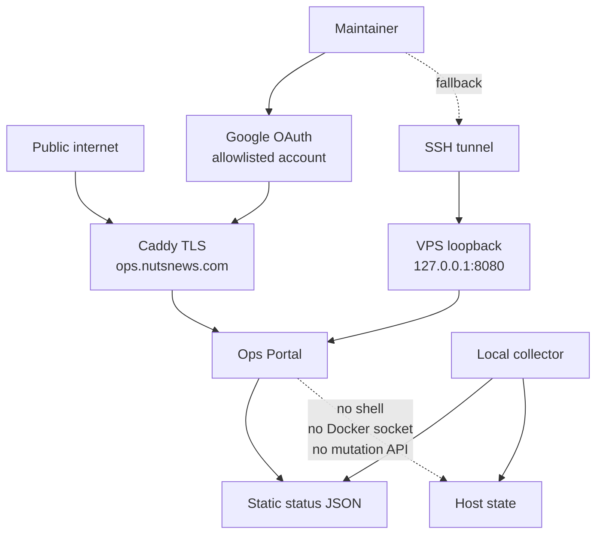

The current access rule is simple: the portal is public only through `https://ops.nutsnews.com`, Caddy TLS, and the Google OAuth gateway. Direct `/data/*` access is not public; unauthenticated browsers are sent to sign in first.

SSH access still uses a narrow tunnel exception for `nutsnews_ops` as a fallback. The global SSH baseline denies remote forwarding, gateway exposure, stream-local forwarding, tunnel devices, and broad forwarding. The admin/operator user can create only local TCP forwards to `127.0.0.1:8080` or `localhost:8080`.

The first tunnel fix kept `AllowTcpForwarding no` and `PermitOpen none` in the global SSH baseline while trying to override them later. That was admirably cautious and also too shy to actually tunnel. The policy now lives in explicit `Match` blocks: `nutsnews_ops` gets local-only access to the portal targets, and everyone else gets `AllowTcpForwarding no` plus `PermitOpen none`.

Use:

```bash
ssh -N -L 8080:127.0.0.1:8080 nutsnews_ops@vps.nutsnews.com
```

Then open:

```text
http://127.0.0.1:8080/
```

Future public access should add:

- TLS
- reviewed authentication
- no-store headers where needed
- rate limiting or access policy if appropriate
- explicit rollback notes
- CI validation for the route

## What Can Go Wrong

| Failure | Likely cause | Recovery |
| --- | --- | --- |
| Portal does not load on the VPS | Caddy container is down, Caddyfile is invalid, or the assets mount is wrong | Check `docker compose ps`, `docker logs nutsnews-caddy`, and rerun protected apply after a PR fix |
| `/data/status.json` returns 404 | Collector did not create the status file or Caddy is not serving the portal assets directory | Check `systemctl status nutsnews-ops-portal-collector.timer` and the Caddy mount |
| Status data is stale | Timer is disabled, failed, or blocked by systemd hardening | Check `systemctl list-timers` and `journalctl -u nutsnews-ops-portal-collector.service` |
| Free-tier provider is missing after apply | The collector did not load `/etc/nutsnews/free-tier-usage.env`, or the env file lacks the quota JSON | Check the collector journal and fix the env rendering or loader through PR |
| Free-tier provider says `not configured` | No optional token, usage URL, or usage snapshot is configured for that provider | Add the provider-specific protected Environment secret named in `source_detail`, or accept the unknown state |
| Free-tier provider says `unavailable` | Provider response was malformed, unreachable, unauthorized, or missing expected metric paths | Read the sanitized `source_detail` for HTTP status, provider message, response shape, and missing metric names; do not print tokens in logs or screenshots |
| Free-tier provider says `cached` and stale | Live usage failed and the local sanitized cache is older than the configured TTL | Recheck provider availability and rerun the collector; the dashboard is intentionally preserving the last safe numbers |
| Free-tier usage exceeds 100% | The configured free-tier allowance is exhausted or the quota value is stale | Verify the provider docs, reduce usage, or make an explicit budget/plan decision outside the portal |
| Swap state is `non_trivial`, `warning`, or `critical` | A deploy, backup, package task, app process, or leak is leaning on the zram fallback | Check top memory processes, Docker health, recent apply/deploy activity, and kernel OOM evidence before changing zram size |
| Recent kernel OOM evidence appears | The kernel killed or attempted to kill a process under memory pressure | Treat as an incident signal: identify the killed process, review recent workload changes, and keep any durable fix in `nutsnews-infra` |
| Docker section is empty | Docker is not installed, Docker service is down, or the collector cannot reach the local Docker socket | Check Docker service state; fix collector permissions through PR if needed |
| Process tables are empty | `/proc` changed, permissions are unexpectedly restricted, or the collector failed mid-run | Check `journalctl -u nutsnews-ops-portal-collector.service`; fix the collector through PR |
| Disk hot spots look stale | The cache is still valid or the scan failed and reused old data | Check `disk_usage.scanned_at`, `disk_usage.errors`, and the collector journal |
| Per-process network table is missing | This is expected; standard Linux does not expose reliable per-process byte totals without extra telemetry | Use host-level counters for now; propose a lightweight telemetry agent later if the value beats the complexity |
| Email reporting says disabled | `NUTSNEWS_EMAIL_ENABLED` is not set to `true` in the `production-vps` Environment | Add the optional SMTP secrets and rerun protected apply |
| Email reporting says misconfigured | SMTP host, sender, recipient, or password-for-username is missing | Fix Environment secrets, rerun check mode, then apply |
| Alert emails do not repeat | Duplicate-alert cooldown is suppressing the same warning | Check `suppressed_alerts` and `cooldown_seconds`; this is usually a feature, not a conspiracy |
| Daily report does not arrive | Timer not running, SMTP transport failed, or provider rejected the message | Check `systemctl list-timers nutsnews-ops-health-report.timer` and `journalctl -u nutsnews-ops-health-report.service` |
| Manual report workflow fails before SSH | Missing `production-vps` SSH key or known-hosts secret | Add/fix `NUTSNEWS_VPS_SSH_PRIVATE_KEY` and `NUTSNEWS_VPS_KNOWN_HOSTS`, then rerun |
| Manual report workflow connects but fails | `nutsnews_ops` cannot sudo the fixed service, the service failed, or reporting status did not become `sent` | Read the service result and safe reporting snapshot printed by the workflow; fix through PR/protected apply |
| Manual report workflow cannot run a custom command | This is by design, and also a nice little safety blanket | Add a reviewed workflow for any new operation instead of widening this one |
| Logs show `[redacted]` | The collector saw a sensitive-looking pattern and hid it | Good. Annoying, but good. Secrets in dashboards are how incident reports get extra chapters |
| A real secret appears in status JSON | Redaction missed something | Treat it as an incident, rotate affected credentials, remove exposure if any exists, and fix the collector through PR |
| SSH tunnel fails with `administratively prohibited` | SSH hardening is blocking TCP forwarding or the target does not match the allowed portal destinations | Apply the baseline update that allows `nutsnews_ops` local forwarding only to `127.0.0.1:8080` or `localhost:8080`, then use the documented `ssh -L` command |
| Browser cannot reach the portal after the tunnel connects | Local port conflict, wrong left-side port, or Caddy is not answering on the VPS loopback listener | Use another local port like `18080:127.0.0.1:8080`, then verify Caddy with the VPS-side health checks |
| Someone wants a restart button | Natural human impatience | Add a GitHub Actions-backed workflow later; do not add arbitrary shell buttons |
| Expected and actual app digests differ | Host drift, incomplete pull, or wrong Compose reference | Keep routes disabled, inspect read-only Docker state, and reconcile through a reviewed infra change plus Protected Ansible Apply |
| App status says prepared/disabled | Issue #67 plumbing exists but no approved promotion/apply has occurred | This is the expected safe-stop state; do not start the container manually |
| App health is good but the public route is disabled | Staged health was not followed by a separate public-route review | Keep it disabled until full-host parity, security headers, Auth/contact behavior, and rollback are verified |

## Verification

After the PR is merged, run the protected Ansible workflow in check mode first. If the preview is sane, run apply mode.

On the VPS, verify:

```bash
curl -fsS http://127.0.0.1:8080/healthz
curl -fsS http://127.0.0.1:8080/data/status.json
systemctl status nutsnews-ops-portal-collector.timer
systemctl status nutsnews-ops-alert-check.timer
systemctl status nutsnews-ops-health-report.timer
sudo /usr/local/bin/nutsnews-ops-portal-reporter --mode report --dry-run
sudo docker compose -f /opt/nutsnews/apps/caddy/compose.yml ps
```

Expected health output:

```text
ok
```

Expected status JSON behavior:

- contains `generated_at`
- contains `portal.mode` set to `read-only`
- contains host, resource, process, disk, network, Docker, service, security, backup, alert, email reporting, GitOps, and runbook sections
- contains `free_tier_usage` with all six configured providers and a source status for each
- contains no committed secrets
- reports email as disabled or misconfigured if SMTP secrets are not configured
- keeps per-process network byte totals labeled unavailable unless a later PR adds approved telemetry
- contains safe application release/status fields without environment values
- reports the app, staged route, and public route disabled in the prepared issue #67 state
- exposes expected/actual digest and source/build identity only after a real reviewed promotion exists

For the manual health report workflow, verify:

- workflow name is `Send VPS Health Report`
- trigger is `workflow_dispatch` only
- there are no dispatch inputs
- job environment is `production-vps`
- SSH user is `nutsnews_ops`
- remote action is fixed to `systemctl start nutsnews-ops-health-report.service`
- the workflow prints fixed service status and safe reporting fields
- the workflow fails if the reporting state is not enabled, configured, `mode=report`, and `status=sent`

In normal terms: the workflow can ring the report bell, read the "did it ring?" note, and then leave. It cannot wander around the server touching things because it felt inspired.

## Provider-Agnostic Impact

This portal does not care which VPS provider hosts the box. It reads local Linux, Docker, Caddy, and `/opt/nutsnews` state. If the VPS moves providers, the dashboard should move with the Ansible role and Compose files.

Provider-specific bits should stay outside the portal unless they are optional fields. The portal can show "provider snapshot status" later, but it should not become hardwired to one vendor's API like a tattoo of a temporary relationship.

## What This Does Not Do Yet

This v1 layer does not:

- expose a public authenticated route
- run backups
- restore backups
- mutate Docker, systemd, Caddy, firewall, or packages
- install a database
- add a heavy observability stack
- add true per-process network byte telemetry
- replace Sentry, Better Stack, Supabase, or Cloudflare
- make the home server required for production
- mutate, restart, promote, or roll back the NutsNews application
- expose application environment values or credentials

It creates the dashboard foundation. The useful buttons can come later, but they need GitOps guardrails, not vibes.

## Related Docs

- [Infra Operations Platform](NUTSNEWS_INFRA_OPERATIONS_PLATFORM.md)
- [Dual-Target Web Deployment](NUTSNEWS_DUAL_TARGET_WEB_DEPLOYMENT.md)
- [VPS Service Foundation](NUTSNEWS_VPS_SERVICE_FOUNDATION.md)
- [Protected Ansible Apply](NUTSNEWS_PROTECTED_ANSIBLE_APPLY.md)
- [VPS Ansible Bootstrap](NUTSNEWS_VPS_ANSIBLE_BOOTSTRAP.md)
- [Operations](OPERATIONS.md)
- [Troubleshooting](TROUBLESHOOTING.md)
