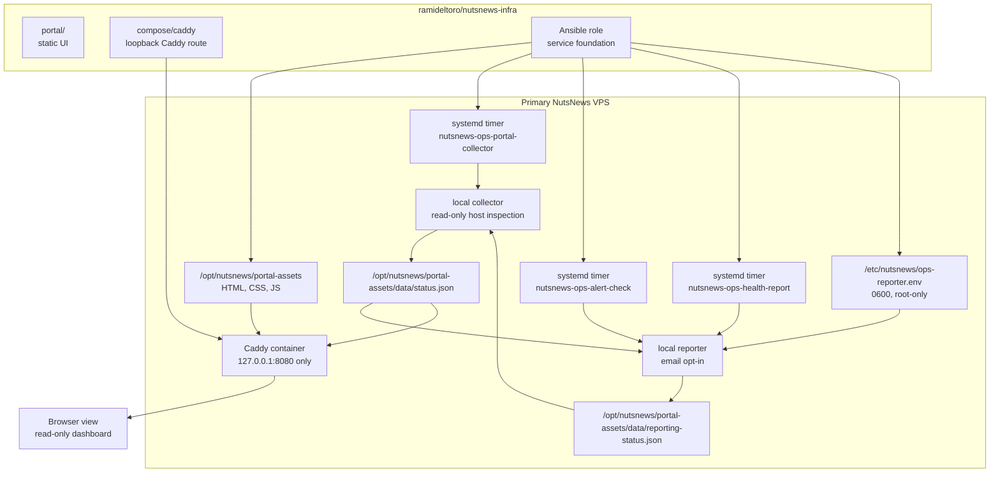
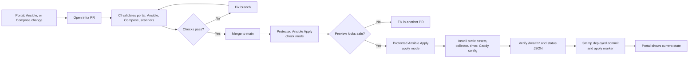
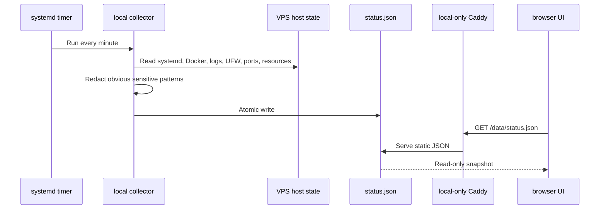
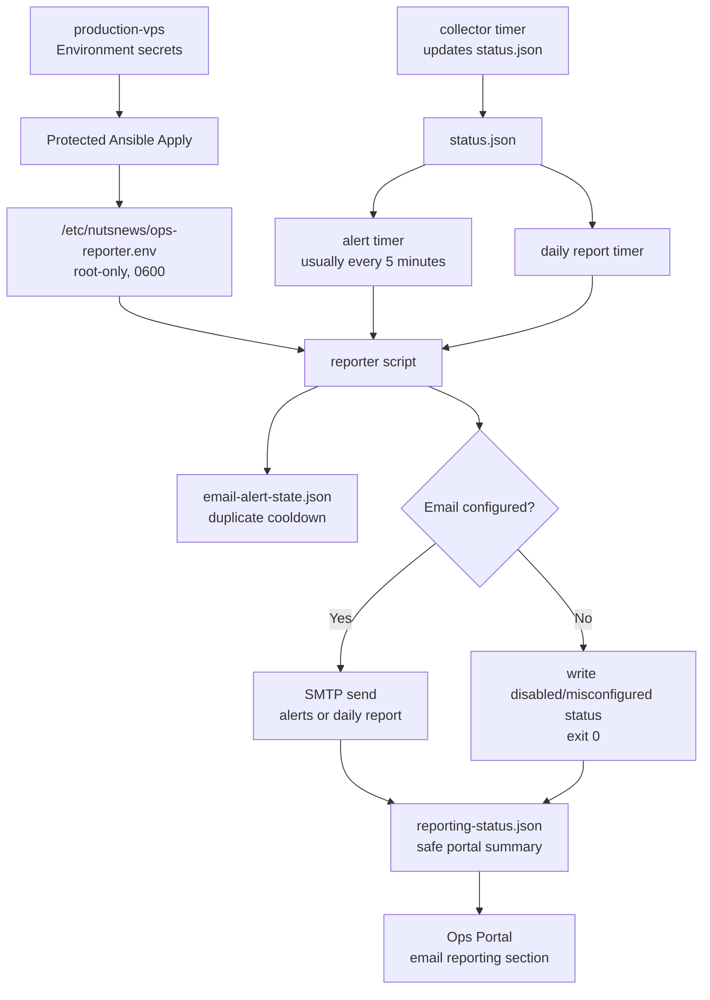
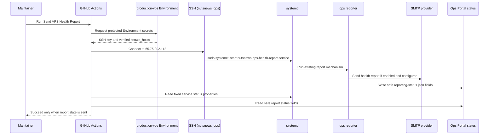
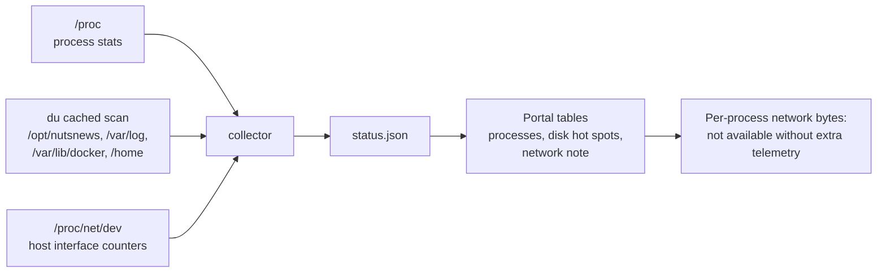
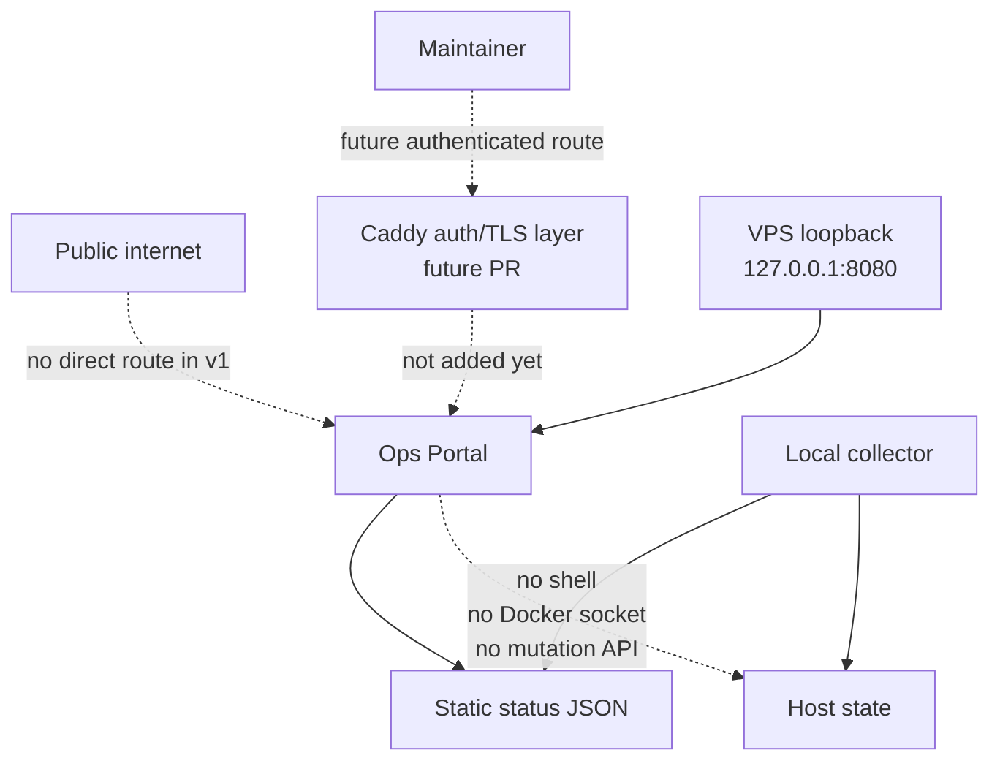

# NutsNews Operations Portal v1

This explains the first real Ops Portal layer for the NutsNews VPS: a read-only amber dashboard, a local status collector, opt-in email alerts/reports, encrypted backup status, on-demand report and backup workflows, deeper resource visibility, and a Caddy route that stays on loopback until we add reviewed authentication.

## Easy Summary

The VPS has a polished amber dashboard for boring-but-important server facts: overall health, email reporting, resource pressure, processes, disk, network, services, logs, security posture, encrypted restic backup status, GitOps state, and runbook links.

This update makes the portal easier to scan when the server starts smelling weird. It adds gauges for health score, CPU, RAM, disk, swap, and inodes; temperature-style hot spots for memory pressure, disk pressure, service health, and alert level; compact stats where the data supports them; and an email/reporting block that makes enabled/configured/next run/last run/last success/last error hard to miss.

There is also a manual `Send VPS Health Report` workflow. It uses the same protected `production-vps` Environment and SSH secret pattern, connects as `nutsnews_ops`, and starts only the existing health report service. No random remote command box. No "type your shell script here." Production does not need karaoke night.

There are also manual `Run VPS Backup` and `Verify VPS Backup` workflows. They use the same protected environment pattern and start only fixed systemd units. The portal then shows backup freshness, last backup, last prune, last verify, retention, and protected path coverage.

The important part: it is read-only. No restart button. No "install this one tiny thing" button. No secret shell wearing a dashboard costume. If something needs to change production, it still goes through the civilized path:

```text
commit -> PR -> checks -> merge -> protected apply
```

For v1, Caddy serves the portal only on `127.0.0.1:8080` on the VPS. That means there is no unauthenticated public dashboard waving at the internet like a free buffet. Access uses the narrow SSH tunnel path. Public access waits for a later PR with reviewed auth and TLS.

## Intermediate Summary

The infra repo now has these pieces:

1. A static portal under `portal/`
2. An Ansible-installed collector at `/usr/local/bin/nutsnews-ops-portal-collector`
3. A systemd timer named `nutsnews-ops-portal-collector.timer`
4. An Ansible-installed reporter at `/usr/local/bin/nutsnews-ops-portal-reporter`
5. Alert and daily report timers named `nutsnews-ops-alert-check.timer` and `nutsnews-ops-health-report.timer`
6. A manual GitHub Actions workflow named `Send VPS Health Report`
7. Manual backup workflows named `Run VPS Backup` and `Verify VPS Backup`
8. CI guardrails that validate the portal fixture, secret redaction, read-only surface, backup status, and the no-arbitrary-command shape of the manual report and backup workflows

The collector runs locally on the VPS, reads host state, redacts obvious sensitive log patterns, and writes JSON here:

```text
/opt/nutsnews/portal-assets/data/status.json
```

Caddy serves the static portal and the JSON feed from:

```text
http://127.0.0.1:8080/
http://127.0.0.1:8080/data/status.json
```

The portal does not mount the Docker socket into a public-facing app. Docker state is collected by the local systemd service, flattened into JSON, and handed to the browser like a report card. Much safer than giving the web UI a chainsaw and hoping it only trims hedges.

The reporter reads that same JSON feed and can send two kinds of email:

- warning/critical alert emails with a duplicate-alert cooldown
- scheduled daily health reports
- on-demand health reports when GitHub Actions starts the fixed systemd report unit

SMTP values live in the protected `production-vps` GitHub Environment and are rendered by Ansible into `/etc/nutsnews/ops-reporter.env` with mode `0600`. If email is disabled or missing required settings, the reporter exits successfully, writes that state for the portal, and does not improvise. Infrastructure improv is for jazz bands and outages.

## Expert Summary

Ops Portal v1 is intentionally simple:

- Static HTML, CSS, and JavaScript
- No package manager
- No database
- No app server
- No authenticated public route yet
- No mutating endpoints
- No direct Docker socket mount in the served portal
- No production secrets
- No automatic apply on merge
- No arbitrary remote command input in the manual health-report workflow

The collector runs as root because it needs to read system logs, systemd state, Docker state, UFW output, open ports, and backup directory metadata. That sounds spicy, so the blast radius is kept small:

- It is a local oneshot systemd service, not a web service.
- It exposes no HTTP listener.
- It writes only the portal JSON snapshot.
- The systemd unit uses hardening such as `NoNewPrivileges`, `ProtectSystem=strict`, private temp, and constrained writable paths.
- The browser receives already-sanitized JSON, not a command API.

The protected Ansible apply workflow now passes non-secret GitHub run metadata into Ansible. After the role verifies Caddy and the portal JSON endpoint, it can stamp the deployed infra commit and last successful apply marker for the dashboard.

The same workflow can also pass optional SMTP values from protected Environment secrets into Ansible extra vars. The secret-bearing reporter env file task is `no_log`, so apply diffs do not print the SMTP password into Actions logs. This is basic hygiene, but basic hygiene is also why the kitchen has soap.

Resource visibility stays cheap-VPS friendly:

- process rankings come from `/proc`
- CPU percent is a best-effort lifetime average, not a live flame graph
- disk hot spots use `du` with a cache so the collector does not rescan heavy folders every minute
- host network counters come from standard Linux interface stats
- per-process network byte totals are explicitly marked unavailable unless we approve extra telemetry later
- the UI is static HTML/CSS/JS, not a frontend framework doing jazz hands on a tiny VPS

## Portal Architecture



The key design choice is separation: the collector can inspect the host, the reporter can send email when explicitly configured, but the served portal only reads JSON. The dashboard is a window, not a screwdriver drawer.

## GitOps Apply Flow



Check mode still deserves suspicion. It is useful, but it can lie like a resume: "expert in Docker service management" while Docker is not actually installed yet. The role keeps check mode safe by skipping runtime-dependent tasks until real apply mode creates real services.

## Data Collection Flow



The portal is not a live shell. It is a snapshot reader. That makes it less magical, which is great, because magical production systems usually require candles and apologies.

## Email Alert And Report Flow



The reporter is deliberately boring. It does not restart services. It does not patch configs. It does not turn an alert into a shell command wearing a fake mustache. It reads the status JSON, applies cooldown rules, sends email only when configured, and writes a sanitized status file for the portal.

Alert emails only send for warning and critical conditions. Repeated copies of the same alert are suppressed during the cooldown window, because "disk still 90%" every five minutes is not observability, it is inbox cardio.

## Manual Health Report Workflow



This workflow is intentionally less flexible than a vending machine that only sells one sandwich. It has no dispatch inputs, no remote command parameter, no streamed shell script, and no install/restart/reconfigure controls. It starts the existing `nutsnews-ops-health-report.service` unit and then prints safe status fields: enabled, configured, SMTP host configured, recipients count, mode, status, last run, last success, and last error.

If SMTP is disabled or misconfigured, the workflow fails clearly instead of pretending an email went out. That is the correct level of dramatic honesty.

## Resource Visibility Flow



The CPU table is useful, not omniscient. It shows a lifetime average normalized across CPU cores, which is enough to spot "why is this thing always eating the box?" It is not a replacement for a profiler, and that is fine. The VPS is running a news platform, not auditioning for a cloud bill.

## What The Portal Shows

| Section | What it shows |
| --- | --- |
| Overall Health | Health score gauge, hostname, uptime, public IPs, OS, kernel, deployed infra commit, last apply marker |
| Alerts and Email Reporting | Email enabled/configured state, SMTP configured flag, next report run, last run, last success, last error, pending alerts, timer state |
| Resources | Gauges for CPU, RAM, root disk, swap, and root inode usage; load stats; network counters; NutsNews disk usage |
| Hot Spots | Temperature-style memory pressure, disk pressure, service health, and alert level |
| Processes | Top memory and CPU apps with client-side filtering, PID, user, memory, CPU estimate, thread count, CPU time, elapsed time, idle time |
| Disk | Cached top folder sizes across approved local roots, scan cache status, largest scanned entry |
| Network | Host send/receive counters, interface counters, and an honest note that per-process byte totals need extra telemetry |
| Services | `ssh`, `docker`, unattended upgrades, UFW, fail2ban or CrowdSec if present, portal collector/reporting timers |
| Docker and Compose | Containers, health, restart count, image names, ports, compose project |
| Logs | Recent Caddy logs, journal warnings, auth/security logs, with basic redaction |
| Security | Firewall status, open ports, SSH hardening, pending updates, last reboot, failed login summary |
| Backups and Snapshots | Backup directory usage, latest local backup placeholder, snapshot reminders |
| GitOps | Workflow links, deployed commit marker, last apply marker, drift warning |
| Runbooks and Docs | Links back to the docs repo |

The backup section now reports the restic/rclone VPS backup layer: enabled/configured state, repository path, latest snapshot age, backup/prune/verify state, timer state, and protected paths. Backup failures and stale snapshots flow into the same warning/critical alert list used by email reporting.

The email section is still intentionally humble. It reports local VPS warnings, scheduled health summaries, and backup problems from the portal status feed. Future deploy, security scan, and incident reporting can build on the same pattern instead of each workflow inventing a new inbox ritual with its own little hat.

## Security Model



The current access rule is simple: the portal exists on the VPS, but it is not publicly exposed. That is less convenient than a shiny public dashboard, but also less likely to become the first page indexed by "please hack me dot com."

SSH access uses a narrow tunnel exception for `nutsnews_ops`. The global SSH baseline still denies TCP forwarding, remote forwarding, gateway exposure, stream-local forwarding, and tunnel devices. The admin/operator user can create only local TCP forwards to `127.0.0.1:8080` or `localhost:8080`, which is just enough rope to view the portal and not enough rope to knit a surprise proxy farm. We locked the portal behind a tunnel, then locked the tunnel too. Very secure. Very invisible.

The first tunnel fix kept `AllowTcpForwarding no` and `PermitOpen none` in the global SSH baseline while trying to override them later. That was admirably cautious and also too shy to actually tunnel. The policy now lives in explicit `Match` blocks: `nutsnews_ops` gets local-only access to the portal targets, and everyone else gets `AllowTcpForwarding no` plus `PermitOpen none`.

Use:

```bash
ssh -N -L 8080:127.0.0.1:8080 nutsnews_ops@vps.nutsnews.com
```

Then open:

```text
http://127.0.0.1:8080/
```

Future public access should add:

- TLS
- reviewed authentication
- no-store headers where needed
- rate limiting or access policy if appropriate
- explicit rollback notes
- CI validation for the route

## What Can Go Wrong

| Failure | Likely cause | Recovery |
| --- | --- | --- |
| Portal does not load on the VPS | Caddy container is down, Caddyfile is invalid, or the assets mount is wrong | Check `docker compose ps`, `docker logs nutsnews-caddy`, and rerun protected apply after a PR fix |
| `/data/status.json` returns 404 | Collector did not create the status file or Caddy is not serving the portal assets directory | Check `systemctl status nutsnews-ops-portal-collector.timer` and the Caddy mount |
| Status data is stale | Timer is disabled, failed, or blocked by systemd hardening | Check `systemctl list-timers` and `journalctl -u nutsnews-ops-portal-collector.service` |
| Docker section is empty | Docker is not installed, Docker service is down, or the collector cannot reach the local Docker socket | Check Docker service state; fix collector permissions through PR if needed |
| Process tables are empty | `/proc` changed, permissions are unexpectedly restricted, or the collector failed mid-run | Check `journalctl -u nutsnews-ops-portal-collector.service`; fix the collector through PR |
| Disk hot spots look stale | The cache is still valid or the scan failed and reused old data | Check `disk_usage.scanned_at`, `disk_usage.errors`, and the collector journal |
| Per-process network table is missing | This is expected; standard Linux does not expose reliable per-process byte totals without extra telemetry | Use host-level counters for now; propose a lightweight telemetry agent later if the value beats the complexity |
| Email reporting says disabled | `NUTSNEWS_EMAIL_ENABLED` is not set to `true` in the `production-vps` Environment | Add the optional SMTP secrets and rerun protected apply |
| Email reporting says misconfigured | SMTP host, sender, recipient, or password-for-username is missing | Fix Environment secrets, rerun check mode, then apply |
| Alert emails do not repeat | Duplicate-alert cooldown is suppressing the same warning | Check `suppressed_alerts` and `cooldown_seconds`; this is usually a feature, not a conspiracy |
| Daily report does not arrive | Timer not running, SMTP transport failed, or provider rejected the message | Check `systemctl list-timers nutsnews-ops-health-report.timer` and `journalctl -u nutsnews-ops-health-report.service` |
| Manual report workflow fails before SSH | Missing `production-vps` SSH key or known-hosts secret | Add/fix `NUTSNEWS_VPS_SSH_PRIVATE_KEY` and `NUTSNEWS_VPS_KNOWN_HOSTS`, then rerun |
| Manual report workflow connects but fails | `nutsnews_ops` cannot sudo the fixed service, the service failed, or reporting status did not become `sent` | Read the service result and safe reporting snapshot printed by the workflow; fix through PR/protected apply |
| Manual report workflow cannot run a custom command | This is by design, and also a nice little safety blanket | Add a reviewed workflow for any new operation instead of widening this one |
| Logs show `[redacted]` | The collector saw a sensitive-looking pattern and hid it | Good. Annoying, but good. Secrets in dashboards are how incident reports get extra chapters |
| A real secret appears in status JSON | Redaction missed something | Treat it as an incident, rotate affected credentials, remove exposure if any exists, and fix the collector through PR |
| SSH tunnel fails with `administratively prohibited` | SSH hardening is blocking TCP forwarding or the target does not match the allowed portal destinations | Apply the baseline update that allows `nutsnews_ops` local forwarding only to `127.0.0.1:8080` or `localhost:8080`, then use the documented `ssh -L` command |
| Browser cannot reach the portal after the tunnel connects | Local port conflict, wrong left-side port, or Caddy is not answering on the VPS loopback listener | Use another local port like `18080:127.0.0.1:8080`, then verify Caddy with the VPS-side health checks |
| Someone wants a restart button | Natural human impatience | Add a GitHub Actions-backed workflow later; do not add arbitrary shell buttons |

## Verification

After the PR is merged, run the protected Ansible workflow in check mode first. If the preview is sane, run apply mode.

On the VPS, verify:

```bash
curl -fsS http://127.0.0.1:8080/healthz
curl -fsS http://127.0.0.1:8080/data/status.json
systemctl status nutsnews-ops-portal-collector.timer
systemctl status nutsnews-ops-alert-check.timer
systemctl status nutsnews-ops-health-report.timer
sudo /usr/local/bin/nutsnews-ops-portal-reporter --mode report --dry-run
sudo docker compose -f /opt/nutsnews/apps/caddy/compose.yml ps
```

Expected health output:

```text
ok
```

Expected status JSON behavior:

- contains `generated_at`
- contains `portal.mode` set to `read-only`
- contains host, resource, process, disk, network, Docker, service, security, backup, alert, email reporting, GitOps, and runbook sections
- contains no committed secrets
- reports email as disabled or misconfigured if SMTP secrets are not configured
- keeps per-process network byte totals labeled unavailable unless a later PR adds approved telemetry

For the manual health report workflow, verify:

- workflow name is `Send VPS Health Report`
- trigger is `workflow_dispatch` only
- there are no dispatch inputs
- job environment is `production-vps`
- SSH user is `nutsnews_ops`
- remote action is fixed to `systemctl start nutsnews-ops-health-report.service`
- the workflow prints fixed service status and safe reporting fields
- the workflow fails if the reporting state is not enabled, configured, `mode=report`, and `status=sent`

In normal terms: the workflow can ring the report bell, read the "did it ring?" note, and then leave. It cannot wander around the server touching things because it felt inspired.

## Provider-Agnostic Impact

This portal does not care which VPS provider hosts the box. It reads local Linux, Docker, Caddy, and `/opt/nutsnews` state. If the VPS moves providers, the dashboard should move with the Ansible role and Compose files.

Provider-specific bits should stay outside the portal unless they are optional fields. The portal can show "provider snapshot status" later, but it should not become hardwired to one vendor's API like a tattoo of a temporary relationship.

## What This Does Not Do Yet

This v1 layer does not:

- expose a public authenticated route
- run backups
- restore backups
- mutate Docker, systemd, Caddy, firewall, or packages
- install a database
- add a heavy observability stack
- add true per-process network byte telemetry
- replace Sentry, Better Stack, Supabase, or Cloudflare
- make the home server required for production

It creates the dashboard foundation. The useful buttons can come later, but they need GitOps guardrails, not vibes.

## Related Docs

- [Infra Operations Platform](NUTSNEWS_INFRA_OPERATIONS_PLATFORM.md)
- [VPS Service Foundation](NUTSNEWS_VPS_SERVICE_FOUNDATION.md)
- [Protected Ansible Apply](NUTSNEWS_PROTECTED_ANSIBLE_APPLY.md)
- [VPS Ansible Bootstrap](NUTSNEWS_VPS_ANSIBLE_BOOTSTRAP.md)
- [Operations](OPERATIONS.md)
- [Troubleshooting](TROUBLESHOOTING.md)
