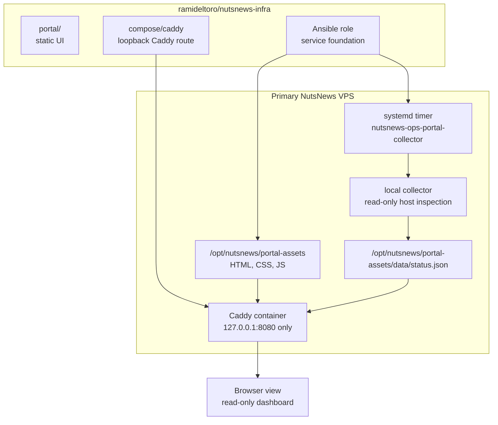
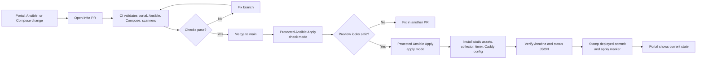
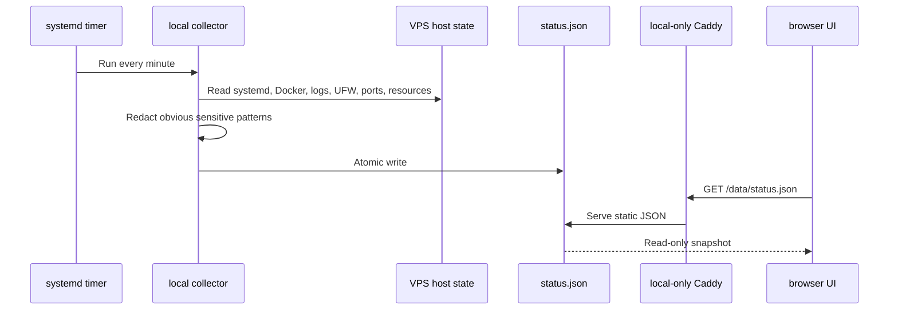
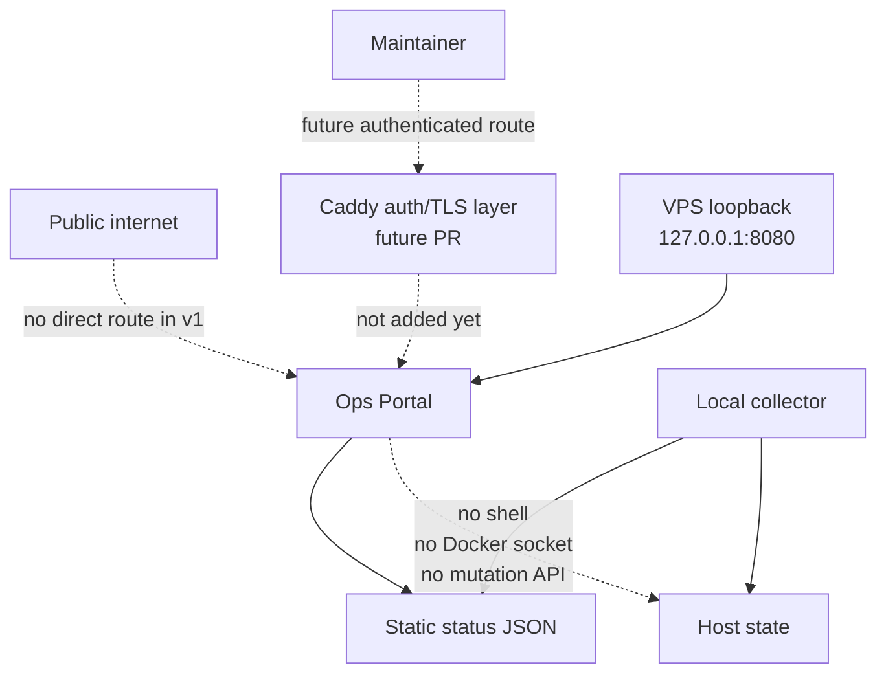

# NutsNews Operations Portal v1

This explains the first real Ops Portal layer for the NutsNews VPS: a read-only dashboard, a local status collector, and a Caddy route that stays on loopback until we add reviewed authentication.

## Easy Summary

The VPS is getting a visual dashboard for boring-but-important server facts: uptime, resource usage, containers, services, logs, security posture, backups, alerts, GitOps state, and runbook links.

The important part: it is read-only. No restart button. No "install this one tiny thing" button. No secret shell wearing a dashboard costume. If something needs to change production, it still goes through the civilized path:

```text
commit -> PR -> checks -> merge -> protected apply
```

For v1, Caddy serves the portal only on `127.0.0.1:8080` on the VPS. That means there is no unauthenticated public dashboard waving at the internet like a free buffet. Public access waits for a later PR with reviewed auth and TLS.

## Intermediate Summary

The infra repo now adds three pieces:

1. A static portal under `portal/`
2. An Ansible-installed collector at `/usr/local/bin/nutsnews-ops-portal-collector`
3. A systemd timer named `nutsnews-ops-portal-collector.timer`

The collector runs locally on the VPS, reads host state, redacts obvious sensitive log patterns, and writes JSON here:

```text
/opt/nutsnews/portal-assets/data/status.json
```

Caddy serves the static portal and the JSON feed from:

```text
http://127.0.0.1:8080/
http://127.0.0.1:8080/data/status.json
```

The portal does not mount the Docker socket into a public-facing app. Docker state is collected by the local systemd service, flattened into JSON, and handed to the browser like a report card. Much safer than giving the web UI a chainsaw and hoping it only trims hedges.

## Expert Summary

Ops Portal v1 is intentionally simple:

- Static HTML, CSS, and JavaScript
- No package manager
- No database
- No app server
- No authenticated public route yet
- No mutating endpoints
- No direct Docker socket mount in the served portal
- No production secrets
- No automatic apply on merge

The collector runs as root because it needs to read system logs, systemd state, Docker state, UFW output, open ports, and backup directory metadata. That sounds spicy, so the blast radius is kept small:

- It is a local oneshot systemd service, not a web service.
- It exposes no HTTP listener.
- It writes only the portal JSON snapshot.
- The systemd unit uses hardening such as `NoNewPrivileges`, `ProtectSystem=strict`, private temp, and constrained writable paths.
- The browser receives already-sanitized JSON, not a command API.

The protected Ansible apply workflow now passes non-secret GitHub run metadata into Ansible. After the role verifies Caddy and the portal JSON endpoint, it can stamp the deployed infra commit and last successful apply marker for the dashboard.

## Portal Architecture



The key design choice is separation: the collector can inspect the host, but the served portal only reads JSON. The dashboard is a window, not a screwdriver drawer.

## GitOps Apply Flow



Check mode still deserves suspicion. It is useful, but it can lie like a resume: "expert in Docker service management" while Docker is not actually installed yet. The role keeps check mode safe by skipping runtime-dependent tasks until real apply mode creates real services.

## Data Collection Flow



The portal is not a live shell. It is a snapshot reader. That makes it less magical, which is great, because magical production systems usually require candles and apologies.

## What The Portal Shows

| Section | What it shows |
| --- | --- |
| Overview | Hostname, uptime, public IPs, OS, kernel, deployed infra commit, last apply marker |
| Resources | CPU sample, RAM, swap, disk, inode usage, load average, network counters |
| Docker and Compose | Containers, health, restart count, image names, ports, compose project |
| Linux Services | `ssh`, `docker`, unattended upgrades, UFW, fail2ban or CrowdSec if present, portal collector timer |
| Logs | Recent Caddy logs, journal warnings, auth/security logs, with basic redaction |
| Security | Firewall status, open ports, SSH hardening, pending updates, last reboot, failed login summary |
| Backups and Snapshots | Backup directory usage, latest local backup placeholder, snapshot reminders |
| Alerts | Local threshold warnings and email-alert placeholder |
| GitOps | Workflow links, deployed commit marker, last apply marker, drift warning |
| Runbooks and Docs | Links back to the docs repo |

The email alert section is a placeholder in v1. The platform plan still wants regular email reports for deploys, health, backups, security scans, and incidents. The dashboard is now giving those future reports a sensible home instead of forcing them to live in somebody's inbox like cryptic fortune cookies.

## Security Model



The current access rule is simple: the portal exists on the VPS, but it is not publicly exposed. That is less convenient than a shiny public dashboard, but also less likely to become the first page indexed by "please hack me dot com."

SSH access uses a narrow tunnel exception for `nutsnews_ops`. The global SSH baseline still denies TCP forwarding, remote forwarding, gateway exposure, stream-local forwarding, and tunnel devices. The admin/operator user can create only local TCP forwards to `127.0.0.1:8080` or `localhost:8080`, which is just enough rope to view the portal and not enough rope to knit a surprise proxy farm. We locked the portal behind a tunnel, then locked the tunnel too. Very secure. Very invisible.

Use:

```bash
ssh -N -L 8080:127.0.0.1:8080 nutsnews_ops@vps.nutsnews.com
```

Then open:

```text
http://127.0.0.1:8080/
```

Future public access should add:

- TLS
- reviewed authentication
- no-store headers where needed
- rate limiting or access policy if appropriate
- explicit rollback notes
- CI validation for the route

## What Can Go Wrong

| Failure | Likely cause | Recovery |
| --- | --- | --- |
| Portal does not load on the VPS | Caddy container is down, Caddyfile is invalid, or the assets mount is wrong | Check `docker compose ps`, `docker logs nutsnews-caddy`, and rerun protected apply after a PR fix |
| `/data/status.json` returns 404 | Collector did not create the status file or Caddy is not serving the portal assets directory | Check `systemctl status nutsnews-ops-portal-collector.timer` and the Caddy mount |
| Status data is stale | Timer is disabled, failed, or blocked by systemd hardening | Check `systemctl list-timers` and `journalctl -u nutsnews-ops-portal-collector.service` |
| Docker section is empty | Docker is not installed, Docker service is down, or the collector cannot reach the local Docker socket | Check Docker service state; fix collector permissions through PR if needed |
| Logs show `[redacted]` | The collector saw a sensitive-looking pattern and hid it | Good. Annoying, but good. Secrets in dashboards are how incident reports get extra chapters |
| A real secret appears in status JSON | Redaction missed something | Treat it as an incident, rotate affected credentials, remove exposure if any exists, and fix the collector through PR |
| SSH tunnel fails with `administratively prohibited` | SSH hardening is blocking TCP forwarding or the target does not match the allowed portal destinations | Apply the baseline update that allows `nutsnews_ops` local forwarding only to `127.0.0.1:8080` or `localhost:8080`, then use the documented `ssh -L` command |
| Browser cannot reach the portal after the tunnel connects | Local port conflict, wrong left-side port, or Caddy is not answering on the VPS loopback listener | Use another local port like `18080:127.0.0.1:8080`, then verify Caddy with the VPS-side health checks |
| Someone wants a restart button | Natural human impatience | Add a GitHub Actions-backed workflow later; do not add arbitrary shell buttons |

## Verification

After the PR is merged, run the protected Ansible workflow in check mode first. If the preview is sane, run apply mode.

On the VPS, verify:

```bash
curl -fsS http://127.0.0.1:8080/healthz
curl -fsS http://127.0.0.1:8080/data/status.json
systemctl status nutsnews-ops-portal-collector.timer
sudo docker compose -f /opt/nutsnews/apps/caddy/compose.yml ps
```

Expected health output:

```text
ok
```

Expected status JSON behavior:

- contains `generated_at`
- contains `portal.mode` set to `read-only`
- contains host, resource, Docker, service, security, backup, alert, GitOps, and runbook sections
- contains no committed secrets

## Provider-Agnostic Impact

This portal does not care which VPS provider hosts the box. It reads local Linux, Docker, Caddy, and `/opt/nutsnews` state. If the VPS moves providers, the dashboard should move with the Ansible role and Compose files.

Provider-specific bits should stay outside the portal unless they are optional fields. The portal can show "provider snapshot status" later, but it should not become hardwired to one vendor's API like a tattoo of a temporary relationship.

## What This Does Not Do Yet

This v1 layer does not:

- expose a public authenticated route
- send email reports
- run backups
- restore backups
- mutate Docker, systemd, Caddy, firewall, or packages
- install a database
- add a heavy observability stack
- replace Sentry, Better Stack, Supabase, or Cloudflare
- make the home server required for production

It creates the dashboard foundation. The useful buttons can come later, but they need GitOps guardrails, not vibes.

## Related Docs

- [Infra Operations Platform](NUTSNEWS_INFRA_OPERATIONS_PLATFORM.md)
- [VPS Service Foundation](NUTSNEWS_VPS_SERVICE_FOUNDATION.md)
- [Protected Ansible Apply](NUTSNEWS_PROTECTED_ANSIBLE_APPLY.md)
- [VPS Ansible Bootstrap](NUTSNEWS_VPS_ANSIBLE_BOOTSTRAP.md)
- [Operations](OPERATIONS.md)
- [Troubleshooting](TROUBLESHOOTING.md)
