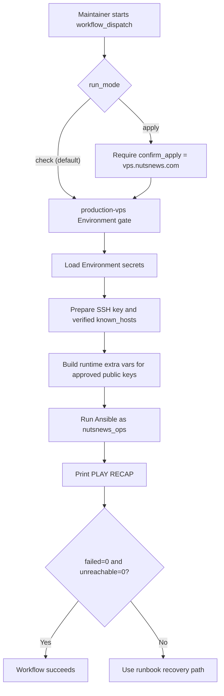
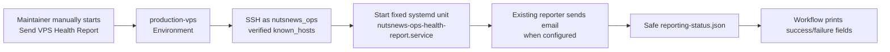

# NutsNews Protected Ansible Apply Workflow

This explains the first protected GitHub Actions workflow that can run the Ansible VPS baseline against `vps.nutsnews.com`. It is a production mutation path, so it wears a seatbelt, uses the `production-vps` Environment, and defaults to check mode because infrastructure should ask before touching the expensive-looking buttons.

## Easy Summary

The VPS bootstrap is no longer just a local operator ritual. We now have a manual GitHub Actions workflow that can run the Ansible baseline through the protected `production-vps` Environment.

The safe default is check mode. Check mode connects to the VPS as `nutsnews_ops`, shows what Ansible would change, prints the recap, and exits without applying remote changes. Apply mode is available, but it requires an explicit `apply` selection, the confirmation text `vps.nutsnews.com`, and Environment approval.

Root SSH was only for first bootstrap. From here on, root access is break-glass only: useful when things are genuinely broken, terrible as a lifestyle.

## Intermediate Summary

The workflow lives in `ramideltoro/nutsnews-infra` as `.github/workflows/protected-ansible-apply.yml`.

It has one trigger:

```text
workflow_dispatch
```

That means no automatic apply on PR, push, or merge. A human starts it from GitHub Actions. GitHub then applies the `production-vps` Environment rules before the job receives Environment secrets.

Add the required secrets in GitHub under `ramideltoro/nutsnews-infra` -> Settings -> Environments -> `production-vps` -> Environment secrets. Keep the Environment protection rules enabled; the whole point is that production changes pass through a door with a lock, not a bead curtain.

Required Environment secrets:

| Secret | Purpose |
| --- | --- |
| `NUTSNEWS_VPS_SSH_PRIVATE_KEY` | Private key used by GitHub Actions to connect as `nutsnews_ops` |
| `NUTSNEWS_VPS_KNOWN_HOSTS` | Verified host key entry for `65.75.202.112` |
| `NUTSNEWS_VPS_ADMIN_AUTHORIZED_KEYS_JSON` | JSON array of approved public keys that should remain installed for `nutsnews_ops` |

The public key list is stored as a secret even though public keys are not secret in the dramatic spy-movie sense. The point is simpler: keep operator-specific runtime material out of the repo so git does not become a junk drawer with commit history.

Optional email reporting Environment secrets:

| Secret | Purpose |
| --- | --- |
| `NUTSNEWS_EMAIL_ENABLED` | Set to `true` to enable alert/report email sending |
| `NUTSNEWS_SMTP_HOST` | SMTP server hostname |
| `NUTSNEWS_SMTP_PORT` | SMTP port, usually `587` |
| `NUTSNEWS_SMTP_USERNAME` | SMTP username if the provider requires auth |
| `NUTSNEWS_SMTP_PASSWORD` | SMTP password or app password if the provider requires auth |
| `NUTSNEWS_SMTP_STARTTLS` | `true` unless the provider explicitly says otherwise |
| `NUTSNEWS_EMAIL_FROM` | Sender address |
| `NUTSNEWS_EMAIL_TO` | Comma-separated recipient list |
| `NUTSNEWS_ALERT_COOLDOWN_SECONDS` | Duplicate alert cooldown, default `21600` |
| `NUTSNEWS_REPORT_SUBJECT_PREFIX` | Optional subject prefix, default `NutsNews VPS` |

If these are absent, the VPS still applies safely and the portal reports email as disabled. That is intentional. A server that sends mail before being asked is not observability; it is a newsletter with root privileges.

Optional encrypted VPS backup Environment secrets:

| Secret | Purpose |
| --- | --- |
| `NUTSNEWS_BACKUP_ENABLED` | Set to `true` to enable scheduled restic backups |
| `NUTSNEWS_BACKUP_RESTIC_PASSWORD` | Restic repository password |
| `NUTSNEWS_BACKUP_RCLONE_CONFIG` | Complete rclone config for the dedicated `nutsnews-onedrive` OneDrive remote |
| `NUTSNEWS_BACKUP_REPOSITORY` | Optional override, default `rclone:nutsnews-onedrive:nutsnews-backups/vps` |
| `NUTSNEWS_BACKUP_STALE_AFTER_HOURS` | Optional stale threshold, default `30` |
| `NUTSNEWS_BACKUP_CHECK_READ_DATA_SUBSET` | Optional verify sample, default `5%` |
| `NUTSNEWS_BACKUP_KEEP_DAILY` | Optional daily retention, default `14` |
| `NUTSNEWS_BACKUP_KEEP_WEEKLY` | Optional weekly retention, default `8` |
| `NUTSNEWS_BACKUP_KEEP_MONTHLY` | Optional monthly retention, default `12` |
| `NUTSNEWS_BACKUP_KEEP_YEARLY` | Optional yearly retention, default `2` |

If `NUTSNEWS_BACKUP_ENABLED` is true, the workflow rejects missing restic/rclone secrets and rejects repositories that do not use the dedicated `nutsnews-onedrive` rclone remote. This is the right kind of annoying.

Optional Grafana Alloy Environment secrets:

| Secret | Purpose |
| --- | --- |
| `NUTSNEWS_GRAFANA_CLOUD_METRICS_URL` | Grafana Cloud metrics remote write endpoint |
| `NUTSNEWS_GRAFANA_CLOUD_METRICS_USERNAME` | Grafana Cloud metrics username |
| `NUTSNEWS_GRAFANA_CLOUD_LOGS_URL` | Grafana Cloud logs push endpoint |
| `NUTSNEWS_GRAFANA_CLOUD_LOGS_USERNAME` | Grafana Cloud logs username |
| `NUTSNEWS_GRAFANA_CLOUD_ACCESS_POLICY_TOKEN` | Access Policy token for telemetry writes |
| `NUTSNEWS_GRAFANA_CLOUD_URL` | Grafana Cloud stack URL used by the Ops Portal free-tier usage collector |
| `NUTSNEWS_GRAFANA_CLOUD_SERVICE_ACCOUNT_TOKEN` | Grafana service account token used by the Ops Portal to query the read-only usage datasource |
| `NUTSNEWS_GRAFANA_CLOUD_USAGE_DATASOURCE_UID` | UID of the Grafana Cloud `grafanacloud-usage` datasource queried by the Ops Portal |

The telemetry write values are required only when the workflow input `enable_grafana_alloy` is `true`. The URL, service account token, and usage datasource UID are optional for Alloy itself, but they let the Ops Portal free-tier collector read Grafana active-series and logs-ingestion usage from the existing usage datasource after protected apply renders the root-only collector environment.

## Expert Summary

The workflow is intentionally narrow:

- permissions are `contents: read`
- concurrency prevents overlapping baseline runs against the same VPS
- timeout is 30 minutes
- job environment is `production-vps`
- SSH user is hardcoded to `nutsnews_ops`
- host key checking is enabled
- the workflow validates required secrets before connecting
- authorized keys are passed through a temporary ignored runtime extra-vars file
- Ansible output is captured with `tee`
- the workflow repeats the `PLAY RECAP`
- Ansible's exit code controls workflow success or failure

The playbook still manages privileged host state through sudo, but SSH does not log in as root. That distinction matters: `nutsnews_ops` is the automation door; root is the emergency hatch behind glass with a tiny hammer and a lot of paperwork.

The same protected workflow now also applies the service foundation role after the host baseline: Docker Engine, Docker Compose, the `/opt/nutsnews` layout, and a local-only Caddy placeholder. Check mode remains the first stop. Apply mode is still the button with consequences.

The workflow can also pass optional SMTP settings into Ansible extra vars for the Ops Portal reporter. Those values are never committed, and the Ansible task that writes `/etc/nutsnews/ops-reporter.env` is hidden with `no_log` so the workflow does not proudly print the password like a broken receipt printer.

When `enable_grafana_alloy` is true, the workflow passes Grafana Cloud telemetry write inputs into the service foundation role. Ansible renders a root-only environment file, writes the Alloy config, validates it with `alloy validate` on the VPS, installs a textfile metrics timer, and starts the Alloy service only after those steps succeed.

There is also a separate manual workflow named `Send VPS Health Report`. It uses the same `production-vps` Environment and SSH material, but it is not an apply workflow. It connects as `nutsnews_ops`, starts only `nutsnews-ops-health-report.service`, prints fixed service/reporting status, and refuses to accept arbitrary remote commands. It is the doorbell for a report, not the keys to the building.

The manual backup workflows follow the same pattern: `Run VPS Backup` starts only `nutsnews-restic-backup.service`, and `Verify VPS Backup` starts only `nutsnews-restic-verify.service`. They have no command input and no arbitrary remote shell mode.

## Protected Apply Flow



## On-Demand Report Flow



This workflow deliberately has no command input. If a future operation needs a button, it should get its own reviewed workflow with its own tiny seatbelt, not a general-purpose SSH slot machine.

## How To Run Check Mode

Use check mode first every time. Yes, even when the change looks tiny. Especially then. Tiny changes love wearing a fake mustache.

1. Open the `ramideltoro/nutsnews-infra` repository.
2. Go to Actions.
3. Choose `Protected Ansible Apply`.
4. Click `Run workflow`.
5. Keep `run_mode` as `check`.
6. Set `enable_grafana_alloy` to `true` only when testing the Grafana Alloy rollout.
7. Leave `confirm_apply` blank.
8. Approve the `production-vps` Environment gate if GitHub asks.
9. Read the diff and final recap.

Expected healthy recap:

```text
unreachable=0 failed=0
```

`changed=1` can be normal when the only changed item is the local server facts snapshot. That snapshot is useful audit confetti, but it should not be mistaken for remote drift.

## How To Run Apply Mode

Apply mode is for after check mode looks safe.

1. Run check mode and review the output.
2. Start `Protected Ansible Apply` again.
3. Set `run_mode` to `apply`.
4. Set `confirm_apply` to `vps.nutsnews.com`.
5. Set `enable_grafana_alloy` to `true` only after check mode validates the Alloy diff.
6. Approve the `production-vps` Environment gate.
7. Watch the final `PLAY RECAP`.

If Ansible exits non-zero, the workflow fails. Do not retry apply mode repeatedly as a coping mechanism. Read the failing task, fix the source of truth, and rerun check mode.

## What Can Go Wrong

| Failure | Likely cause | Recovery |
| --- | --- | --- |
| Missing secret error | One of the required Environment secrets is absent or empty | Add the secret to `production-vps`, then rerun check mode |
| Host key check fails | `NUTSNEWS_VPS_KNOWN_HOSTS` does not match `65.75.202.112` | Verify the host key through a trusted path and update the Environment secret |
| SSH authentication fails | Private key does not match an authorized key for `nutsnews_ops` | Confirm the key pair and the `NUTSNEWS_VPS_ADMIN_AUTHORIZED_KEYS_JSON` public key list |
| Sudo fails | `nutsnews_ops` lost passwordless sudo or group membership | Use break-glass access, restore the minimal sudo config, document it, rerun check mode |
| Ansible reports failed tasks | The desired baseline no longer matches the host state or package behavior | Fix the Ansible role or recovery state through PR, then rerun |
| `unreachable` is non-zero | Network, firewall, DNS, SSH, or host key problem | Check VPS reachability and use break-glass only if needed |

## How We Avoid Lockout

The workflow avoids the classic "secure the server so well nobody can use it" routine by keeping the first production apply path constrained:

- It connects as the already-tested non-root user `nutsnews_ops`.
- It requires verified `known_hosts` data instead of disabling host key checks.
- It keeps SSH on port `22`.
- It uses the same approved public key list every run so the automation user does not slowly drift into mystery.
- It runs through a protected GitHub Environment before secrets are available.
- It defaults to check mode and requires explicit confirmation for apply mode.
- It prints the Ansible recap so failure and reachability are obvious.

If `nutsnews_ops` access breaks, root SSH or provider console access is break-glass only. Use it to restore access, not to improvise long-term configuration. Then update the repo and docs, because undocumented manual fixes are just production folklore with better fonts.

## What This Does Not Do

This workflow does not:

- deploy the NutsNews app
- run automatically on merge
- provision a new VPS
- manage production application secrets
- use root SSH
- loosen the existing CI gates
- replace provider console recovery

It is one careful step: take the already-bootstrapped host baseline and let GitHub run it manually through the protected environment.

## Related Docs

- [NutsNews VPS Ansible Bootstrap](NUTSNEWS_VPS_ANSIBLE_BOOTSTRAP.md)
- [NutsNews VPS Service Foundation](NUTSNEWS_VPS_SERVICE_FOUNDATION.md)
- [NutsNews Grafana Cloud Observability](NUTSNEWS_GRAFANA_CLOUD_OBSERVABILITY.md)
- [NutsNews Infra Operations Platform](NUTSNEWS_INFRA_OPERATIONS_PLATFORM.md)
- [Operations](OPERATIONS.md)
- [Troubleshooting](TROUBLESHOOTING.md)
- [Security CI Scans](SECURITY_CI_SCANS.md)
