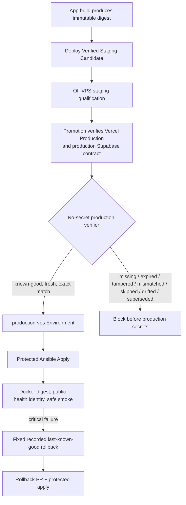
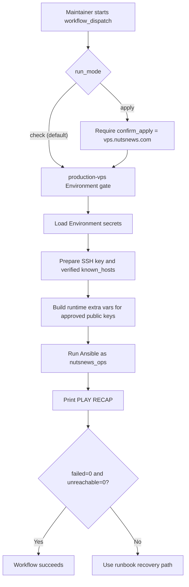
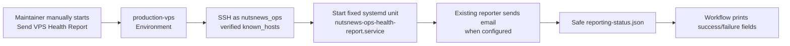
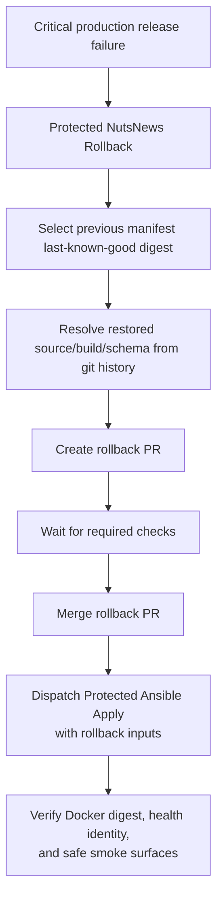

# NutsNews Protected Ansible Apply Workflow

This explains the first protected GitHub Actions workflow that can run the Ansible VPS baseline against `vps.nutsnews.com`. It is a production mutation path, so it wears a seatbelt, uses the `production-vps` Environment, and defaults to check mode because infrastructure should ask before touching the expensive-looking buttons.

The `enable_staging_access` input is opt-in and defaults to `false`. Leave it
disabled for ordinary production work. Enabling it requires the separate
Cloudflare Access/provider onboarding, a successful check-mode review, and
explicit apply approval documented in
[VPS Staging Access And Credential Boundary](NUTSNEWS_VPS_STAGING_ACCESS_BOUNDARY.md).

## Easy Summary

The VPS bootstrap is no longer just a local operator ritual. We now have a manual GitHub Actions workflow that can run the Ansible baseline through the protected `production-vps` Environment.

The safe default is check mode. Check mode connects to the VPS as `nutsnews_ops`, shows what Ansible would change, prints the recap, and exits without applying remote changes. Apply mode is available, but it requires an explicit `apply` selection, the confirmation text `vps.nutsnews.com`, and Environment approval.

Before the workflow can use the `production-vps` Environment, it now runs a
no-secret production eligibility verifier. Baseline-only changes can continue
when the reviewed production release identity is unchanged. A production app
release change must match a current staging qualification attestation for the
exact digest, source, build, staging deployment, config, and test-suite
revision.

The workflow is also the only approved VPS application rollout path. It does
not build or publish the image; it consumes reviewed immutable release state
from `nutsnews-infra`. Issue
[nutsnews-infra #67](https://github.com/ramideltoro/nutsnews-infra/issues/67)
prepares that plumbing but does not run this workflow or enable the app.

Root SSH was only for first bootstrap. From here on, root access is break-glass only: useful when things are genuinely broken, terrible as a lifestyle.

## Intermediate Summary

The workflow lives in `ramideltoro/nutsnews-infra` as `.github/workflows/protected-ansible-apply.yml`.

It has one trigger:

```text
workflow_dispatch
```

That means no automatic apply on PR, push, or merge. A human starts it from GitHub Actions. GitHub then applies the `production-vps` Environment rules before the job receives Environment secrets.

Add the required secrets in GitHub under `ramideltoro/nutsnews-infra` -> Settings -> Environments -> `production-vps` -> Environment secrets. Keep the Environment protection rules enabled; the whole point is that production changes pass through a door with a lock, not a bead curtain.

Required Environment secrets:

| Secret | Purpose |
| --- | --- |
| `NUTSNEWS_VPS_SSH_PRIVATE_KEY` | Private key used by GitHub Actions to connect as `nutsnews_ops` |
| `NUTSNEWS_VPS_KNOWN_HOSTS` | Verified host key entry for `65.75.202.112` |
| `NUTSNEWS_VPS_ADMIN_AUTHORIZED_KEYS_JSON` | JSON array of approved public keys that should remain installed for `nutsnews_ops` |

The public key list is stored as a secret even though public keys are not secret in the dramatic spy-movie sense. The point is simpler: keep operator-specific runtime material out of the repo so git does not become a junk drawer with commit history.

Optional email reporting Environment secrets:

| Secret | Purpose |
| --- | --- |
| `NUTSNEWS_EMAIL_ENABLED` | Set to `true` to enable alert/report email sending |
| `NUTSNEWS_SMTP_HOST` | SMTP server hostname |
| `NUTSNEWS_SMTP_PORT` | SMTP port, usually `587` |
| `NUTSNEWS_SMTP_USERNAME` | SMTP username if the provider requires auth |
| `NUTSNEWS_SMTP_PASSWORD` | SMTP password or app password if the provider requires auth |
| `NUTSNEWS_SMTP_STARTTLS` | `true` unless the provider explicitly says otherwise |
| `NUTSNEWS_EMAIL_FROM` | Sender address |
| `NUTSNEWS_EMAIL_TO` | Comma-separated recipient list |
| `NUTSNEWS_ALERT_COOLDOWN_SECONDS` | Duplicate alert cooldown, default `21600` |
| `NUTSNEWS_REPORT_SUBJECT_PREFIX` | Optional subject prefix, default `NutsNews VPS` |

If these are absent, the VPS still applies safely and the portal reports email as disabled. That is intentional. A server that sends mail before being asked is not observability; it is a newsletter with root privileges.

Optional encrypted VPS backup Environment secrets:

| Secret | Purpose |
| --- | --- |
| `NUTSNEWS_BACKUP_ENABLED` | Set to `true` to enable scheduled restic backups |
| `NUTSNEWS_BACKUP_RESTIC_PASSWORD` | Restic repository password |
| `NUTSNEWS_BACKUP_RCLONE_CONFIG` | Complete rclone config for the dedicated `nutsnews-onedrive` OneDrive remote |
| `NUTSNEWS_BACKUP_REPOSITORY` | Optional override, default `rclone:nutsnews-onedrive:nutsnews-backups/vps` |
| `NUTSNEWS_BACKUP_STALE_AFTER_HOURS` | Optional stale threshold, default `30` |
| `NUTSNEWS_BACKUP_VERIFY_STALE_AFTER_HOURS` | Optional latest-verification stale threshold, default `192` |
| `NUTSNEWS_BACKUP_CHECK_READ_DATA_SUBSET` | Optional verify sample, default `5%` |
| `NUTSNEWS_BACKUP_KEEP_DAILY` | Optional daily retention, default `14` |
| `NUTSNEWS_BACKUP_KEEP_WEEKLY` | Optional weekly retention, default `8` |
| `NUTSNEWS_BACKUP_KEEP_MONTHLY` | Optional monthly retention, default `12` |
| `NUTSNEWS_BACKUP_KEEP_YEARLY` | Optional yearly retention, default `2` |

If `NUTSNEWS_BACKUP_ENABLED` is true, the workflow rejects missing restic/rclone secrets and rejects repositories that do not use the dedicated `nutsnews-onedrive` rclone remote. The Ansible role then enables both `nutsnews-restic-backup.timer` and the weekly `nutsnews-restic-verify.timer`. This is the right kind of annoying.

Optional Grafana Alloy Environment secrets:

| Secret | Purpose |
| --- | --- |
| `NUTSNEWS_GRAFANA_CLOUD_METRICS_URL` | Grafana Cloud metrics remote write endpoint |
| `NUTSNEWS_GRAFANA_CLOUD_METRICS_USERNAME` | Grafana Cloud metrics username |
| `NUTSNEWS_GRAFANA_CLOUD_LOGS_URL` | Grafana Cloud logs push endpoint |
| `NUTSNEWS_GRAFANA_CLOUD_LOGS_USERNAME` | Grafana Cloud logs username |
| `NUTSNEWS_GRAFANA_CLOUD_ACCESS_POLICY_TOKEN` | Access Policy token for telemetry writes |
| `NUTSNEWS_GRAFANA_CLOUD_URL` | Grafana Cloud stack URL used by the Ops Portal free-tier usage collector |
| `NUTSNEWS_GRAFANA_CLOUD_SERVICE_ACCOUNT_TOKEN` | Grafana service account token used by the Ops Portal to query the read-only usage datasource |
| `NUTSNEWS_GRAFANA_CLOUD_USAGE_DATASOURCE_UID` | UID of the Grafana Cloud `grafanacloud-usage` datasource queried by the Ops Portal |

The telemetry write values are required only when the workflow input `enable_grafana_alloy` is `true`. The URL, service account token, and usage datasource UID are optional for Alloy itself, but they let the Ops Portal free-tier collector read Grafana active-series and logs-ingestion usage from the existing usage datasource after protected apply renders the root-only collector environment.

Prepared application release state is not a secret. The reviewed source of
truth is
`ansible/inventories/production/host_vars/vps.nutsnews.com.yml`, which records:

- application, staged-route, and public-route enabled states;
- image repository and immutable `sha256` digest;
- source commit, build ID, and deployment target;
- last-known-good rollback digest;
- the names of allowed/required runtime secret keys.

Only the corresponding application values are secret. They stay in
`NUTSNEWS_APP_ENVS_JSON` in the protected `production-vps` Environment and are
rendered through the root-only Ansible path with `no_log`. The workflow and
portal must never print values. Mutable image references are rejected whenever
the application is enabled.

The protected workflow selects only the production app runtime. Staging has a
separate runtime identity but remains disabled pending the measured capacity
decision; it has no Caddy route, credentials, TLS/access boundary, or deployment
workflow in this phase. See [VPS Runtime Environment Isolation](NUTSNEWS_VPS_RUNTIME_ENVIRONMENT_ISOLATION.md).

For an app release check or apply, the workflow requires the complete release
identity bundle:

- `release_source_commit`
- `release_image_digest`
- `release_build_id`
- `release_source_workflow_run_id`
- `release_migration_head`
- `release_schema_version`
- `release_supabase_project_ref`

The verifier rejects missing, expired, tampered, stale, superseded, skipped, or
mismatched staging qualification evidence before production SSH keys, deploy
secrets, production app secrets, or the protected Environment are available.

New app releases should enter through `nutsnews-release-promotion.yml`, not by
manual Protected Ansible Apply dispatch. That promotion workflow starts from a
successful staging qualification run, verifies the same source commit has
already reached Vercel Production, verifies the production Supabase schema
contract, creates or reuses the reviewed GitOps manifest PR, waits for checks,
merges it, and then dispatches this workflow with the complete release identity
bundle. The old direct `nutsnews-production-release` dispatch is not a valid
entry point.

Routine host package maintenance and reboots use a separate fixed-purpose
workflow, `Protected VPS Maintenance`. It still attaches to the protected
`production-vps` Environment, but it does not run Ansible baseline apply and it
does not accept arbitrary SSH commands. See
[VPS Maintenance](NUTSNEWS_VPS_MAINTENANCE.md).

## Gate Rehearsal And Bypass Inventory

### Simple Summary

The staging gate is now tested as a set of rehearsed outcomes, not just a happy
path. A good candidate can become eligible, but missing attestations, failing or
skipped suites, expired evidence, digest/source/build mismatches, staging drift,
superseded candidates, and rollback selection mistakes must stop before the
workflow reaches production secrets or deploy authority.

Normal direct routes from `built` to production are closed. Mutable tags are
rejected, the old app repository production dispatch is not accepted, and the
only production app mutation paths are the staging-qualified promotion into
`Protected Ansible Apply` and the fixed recorded last-known-good rollback path.

### Intermediate Summary

Issue
[nutsnews-infra #123](https://github.com/ramideltoro/nutsnews-infra/issues/123)
adds an explicit rehearsal validator in
`ansible/tests/validate_gate_rehearsal.py`. It checks that the already-covered
negative cases remain present, that `production-vps` is not attached before the
eligibility job, that direct `nutsnews-production-release` dispatch is absent,
that the promotion workflow verifies Vercel Production, production Supabase,
and current staging qualification before GitOps PR creation, and that no other
workflow can mutate the production app digest.

The validator also inventories allowed `production-vps` workflows. Backups,
health reports, Grafana workflows, portal status verification, protected apply,
and fixed rollback may use that Environment for their fixed purpose. They must
not accept arbitrary commands or app image tags. App digest promotion still goes
through the protected apply gate only.

The `ramideltoro/nutsnews` app `main` branch protection and staging handoff are
separate from production VPS mutation. The app can request only staging; infra
promotion is responsible for proving staging qualification, Vercel Production
same-source deployment, production Supabase compatibility, reviewed manifest
state, and protected apply eligibility.

### Expert Summary

The rehearsal suite is intentionally offline for the trust-boundary logic. It
does not need production SSH, production app secrets, deploy SSH, or the
`production-vps` Environment to prove that the verifier rejects replay, stale,
tampered, expired, skipped, cancelled, timed-out, drifted, superseded, and
mismatched candidates. Live staging and production applies remain separately
approved workflow runs, followed by sanitized SSH/HTTPS verification.

The production rollback exception is not a bypass. It is a fixed-purpose path
that selects only the current manifest's recorded last-known-good digest as
found in reviewed git history, creates a normal rollback PR, and then dispatches
`Protected Ansible Apply` with rollback inputs. It does not accept an arbitrary
restored digest, mutable tag, manual SSH command, Docker Compose command, or
database down migration.



Operationally, treat any `unknown`, `not configured`, `failed`, `expired`, or
`superseded` gate state as not eligible for production. Retry by producing a new
staging candidate and qualification; do not edit the VPS manually to force a
candidate through.

Optional app layer Environment values:

| Secret / Input | Purpose |
| --- | --- |
| `NUTSNEWS_APP_ENABLED` | Set `true` to configure app compose and env rendering |
| `NUTSNEWS_APP_ROUTE_ENABLED` | Set `true` to enable staged routing checks; requires `NUTSNEWS_APP_ENABLED=true` |
| `NUTSNEWS_APP_ROUTE_PATH` | Route path, default `/app-stage` |
| `NUTSNEWS_APP_CONTAINER_NAME` | App container name for compose and health checks |
| `NUTSNEWS_APP_CONTAINER_PORT` | Container port to probe, default `3000` |
| `NUTSNEWS_APP_HEALTH_PATH` | App health path, default `/healthz` |
| `NUTSNEWS_APP_IMAGE_REPO` | Optional image repository override |
| `NUTSNEWS_APP_IMAGE_TAG` | Optional image tag override |
| `NUTSNEWS_APP_SECRET_ENV_KEYS` | Comma-separated list of env keys treated as secret values |
| `NUTSNEWS_APP_REQUIRED_SECRETS` | Comma-separated required secret keys; must be in `NUTSNEWS_APP_SECRET_ENV_KEYS` |
| `NUTSNEWS_APP_ENVS_JSON` | JSON map of app env vars; required keys in `NUTSNEWS_APP_REQUIRED_SECRETS` must be present and non-empty |

## Expert Summary

The workflow is intentionally narrow:

- permissions are `contents: read`
- concurrency prevents overlapping baseline runs against the same VPS
- timeout is 30 minutes
- the first job has no production Environment and checks eligibility
- production jobs depend on that eligibility result before using
  `production-vps`
- SSH user is hardcoded to `nutsnews_ops`
- host key checking is enabled
- the workflow validates required secrets before connecting
- authorized keys are passed through a temporary ignored runtime extra-vars file
- Ansible output is captured with `tee`
- the workflow repeats the `PLAY RECAP`
- Ansible's exit code controls workflow success or failure

The playbook still manages privileged host state through sudo, but SSH does not log in as root. That distinction matters: `nutsnews_ops` is the automation door; root is the emergency hatch behind glass with a tiny hammer and a lot of paperwork.

The same protected workflow now also applies the service foundation role after the host baseline: Docker Engine, Docker Compose, the `/opt/nutsnews` layout, and a local-only Caddy placeholder. Check mode remains the first stop. Apply mode is still the button with consequences.

For a future app promotion, the same role may pull and reconcile only the
reviewed immutable digest, render the root-only runtime environment, and update
the health-only staged route. Public app routing is a separate opt-in flag and
must remain disabled until parity and rollback are reviewed. The existing
`/health` infrastructure route is never handed to the application.

The workflow can also pass optional SMTP settings into Ansible extra vars for the Ops Portal reporter. Those values are never committed, and the Ansible task that writes `/etc/nutsnews/ops-reporter.env` is hidden with `no_log` so the workflow does not proudly print the password like a broken receipt printer.

When `enable_grafana_alloy` is true, the workflow passes Grafana Cloud telemetry write inputs into the service foundation role. Ansible renders a root-only environment file, writes the Alloy config, validates it with `alloy validate` on the VPS, installs a textfile metrics timer, and starts the Alloy service only after those steps succeed.

There is also a separate manual workflow named `Send VPS Health Report`. It uses the same `production-vps` Environment and SSH material, but it is not an apply workflow. It connects as `nutsnews_ops`, starts only `nutsnews-ops-health-report.service`, prints fixed service/reporting status, and refuses to accept arbitrary remote commands. It is the doorbell for a report, not the keys to the building.

The manual backup workflows follow the same pattern: `Run VPS Backup` starts only `nutsnews-restic-backup.service`, and `Verify VPS Backup` starts only `nutsnews-restic-verify.service`. The scheduled verify path is a GitOps-managed systemd timer for that same fixed service. They have no command input and no arbitrary remote shell mode.

## Protected Apply Flow



## On-Demand Report Flow



This workflow deliberately has no command input. If a future operation needs a button, it should get its own reviewed workflow with its own tiny seatbelt, not a general-purpose SSH slot machine.

## NutsNews app rollout path

Staged app deployment and route cutover are split into two explicit steps:

1. Configure `NUTSNEWS_APP_*` values and secret metadata, keep `NUTSNEWS_APP_ROUTE_ENABLED` disabled, and run protected check/apply.
2. When app health and collector state are stable, enable `NUTSNEWS_APP_ROUTE_ENABLED=true` in a follow-up PR.

The apply command always validates:

- app container starts and reports valid Docker state when enabled
- app route health endpoint responds `200` with an `ok` body when route is enabled
- Caddy and portal status health checks continue to pass

## How To Run Check Mode

Use check mode first every time. Yes, even when the change looks tiny. Especially then. Tiny changes love wearing a fake mustache.

1. Open the `ramideltoro/nutsnews-infra` repository.
2. Go to Actions.
3. Choose `Protected Ansible Apply`.
4. Click `Run workflow`.
5. Keep `run_mode` as `check`.
6. Set `enable_grafana_alloy` to `true` only when testing the Grafana Alloy rollout.
7. Leave `confirm_apply` blank.
8. Approve the `production-vps` Environment gate if GitHub asks.
9. Read the diff and final recap.

For an app promotion, confirm the recap references the expected source commit,
build ID, immutable digest, and route states. Stop if it shows `latest`, an
unexpected digest, a public-route change, secret output, or unrelated host
mutation.

Expected healthy recap:

```text
unreachable=0 failed=0
```

`changed=1` can be normal when the only changed item is the local server facts snapshot. That snapshot is useful audit confetti, but it should not be mistaken for remote drift.

## How To Run Apply Mode

Apply mode is for after check mode looks safe.

1. Run check mode and review the output.
2. Start `Protected Ansible Apply` again.
3. Set `run_mode` to `apply`.
4. Set `confirm_apply` to `vps.nutsnews.com`.
5. Set `enable_grafana_alloy` to `true` only after check mode validates the Alloy diff.
6. Approve the `production-vps` Environment gate.
7. Watch the final `PLAY RECAP`.

Application apply mode requires the same separate approval. After it finishes,
read-only SSH verification is required: prove the running image digest,
container health, non-root runtime, `/healthz` identity, staged route, UFW/Caddy
posture, application security headers, sanitized logs, and Ops Portal status.
Do not report runtime success from the Ansible recap alone.

For app releases, the workflow also checks out the exact app source commit and
runs the app-owned safe production smoke script against `https://vps.nutsnews.com/`.
That script verifies readiness, public runtime identity, homepage rendering,
public article API shape, static asset delivery, cache/security headers,
contact validation failure without submitting a real message, and auth session
reachability.

## Fixed Rollback Flow

### Simple Summary

Rollback is a small protected button, not a free-form server shell. It can put
the VPS app back on the last recorded good image and then runs the same
protected apply and verification path.

### Intermediate Summary

Use `Protected NutsNews Rollback` only when the current production app digest is
critically bad. The workflow requires the failed digest, a sanitized reason, and
the confirmation phrase `rollback-recorded-last-known-good`. It selects only
the current manifest's recorded last-known-good digest, finds that release's
source/build/schema metadata in reviewed git history, opens a normal rollback
PR, waits for checks, merges it, and dispatches `Protected Ansible Apply` with
rollback inputs.

### Expert Summary

The rollback verifier in `Protected Ansible Apply` bypasses the staging
attestation only for this exact rollback shape: previous manifest digest equals
the declared failed digest, previous manifest last-known-good equals the
restored digest, restored manifest metadata matches git history, source
workflow run matches the restored build ID, and the fixed confirmation phrase
is present. The workflow does not accept arbitrary SSH commands, mutable tags,
manual replacement digests, or database down migrations.



The rollback step now evaluates only required checks on the rollback PR, and it no longer treats skipped checks as hard failures. That prevents false negatives when non-required checks are intentionally skipped by path filters or optional pipeline branches.

If Ansible exits non-zero, the workflow fails. Do not retry apply mode repeatedly as a coping mechanism. Read the failing task, fix the source of truth, and rerun check mode.

## What Can Go Wrong

| Failure | Likely cause | Recovery |
| --- | --- | --- |
| Missing secret error | One of the required Environment secrets is absent or empty | Add the secret to `production-vps` without printing it, then rerun check mode |
| App promotion is rejected before SSH | Image digest is blank/mutable, metadata is incomplete, or a required secret key is absent | Keep all app routes disabled, fix reviewed release state or protected Environment values, then rerun check mode |
| App check proposes public routing | Public route flag changed before staged parity/rollback approval | Stop, set the public route back to disabled in Git, and review through PR |
| Host key check fails | `NUTSNEWS_VPS_KNOWN_HOSTS` does not match `65.75.202.112` | Verify the host key through a trusted path and update the Environment secret |
| SSH authentication fails | Private key does not match an authorized key for `nutsnews_ops` | Confirm the key pair and the `NUTSNEWS_VPS_ADMIN_AUTHORIZED_KEYS_JSON` public key list |
| Sudo fails | `nutsnews_ops` lost passwordless sudo or group membership | Use break-glass access, restore the minimal sudo config, document it, rerun check mode |
| Ansible reports failed tasks | The desired baseline no longer matches the host state or package behavior | Fix the Ansible role or recovery state through PR, then rerun |
| `unreachable` is non-zero | Network, firewall, DNS, SSH, or host key problem | Check VPS reachability and use break-glass only if needed |

## How We Avoid Lockout

The workflow avoids the classic "secure the server so well nobody can use it" routine by keeping the first production apply path constrained:

- It connects as the already-tested non-root user `nutsnews_ops`.
- It requires verified `known_hosts` data instead of disabling host key checks.
- It keeps SSH on port `22`.
- It uses the same approved public key list every run so the automation user does not slowly drift into mystery.
- It runs through a protected GitHub Environment before secrets are available.
- It defaults to check mode and requires explicit confirmation for apply mode.
- It prints the Ansible recap so failure and reachability are obvious.

If `nutsnews_ops` access breaks, root SSH or provider console access is break-glass only. Use it to restore access, not to improvise long-term configuration. Then update the repo and docs, because undocumented manual fixes are just production folklore with better fonts.

## What This Does Not Do

This workflow does not:

- build or publish the NutsNews app image
- deploy an image that has not been promoted by immutable digest in Git
- run automatically on merge
- provision a new VPS
- create application secret values or store them in Git
- use root SSH
- loosen the existing CI gates
- replace provider console recovery
- change DNS, move `nutsnews.com`, or automatically enable staged/public app routing

It is one careful step: take the already-bootstrapped host baseline and let GitHub run it manually through the protected environment.

## Related Docs

- [NutsNews VPS Ansible Bootstrap](NUTSNEWS_VPS_ANSIBLE_BOOTSTRAP.md)
- [NutsNews Dual-Target Web Deployment](NUTSNEWS_DUAL_TARGET_WEB_DEPLOYMENT.md)
- [NutsNews VPS Service Foundation](NUTSNEWS_VPS_SERVICE_FOUNDATION.md)
- [NutsNews Grafana Cloud Observability](NUTSNEWS_GRAFANA_CLOUD_OBSERVABILITY.md)
- [NutsNews Infra Operations Platform](NUTSNEWS_INFRA_OPERATIONS_PLATFORM.md)
- [Operations](OPERATIONS.md)
- [Troubleshooting](TROUBLESHOOTING.md)
- [Security CI Scans](SECURITY_CI_SCANS.md)
