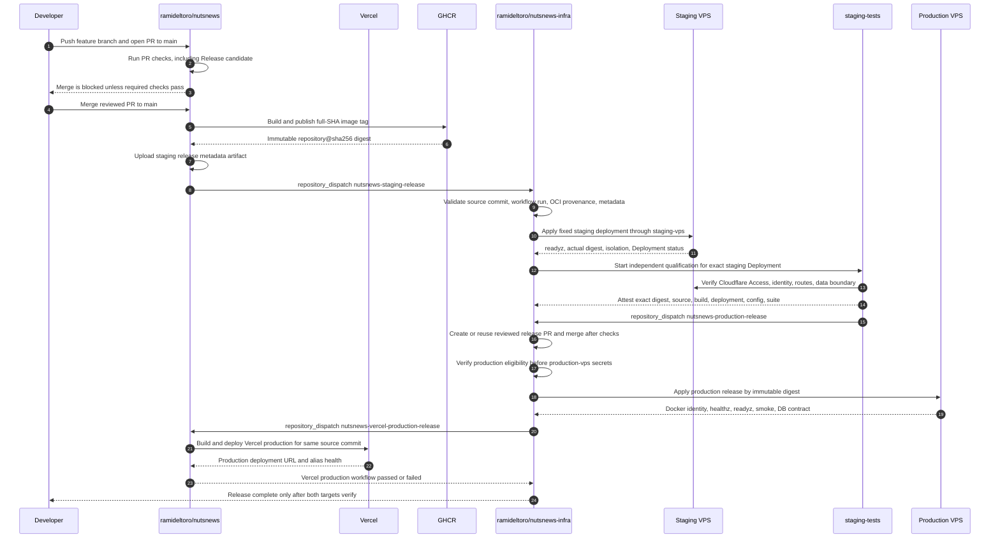

# NutsNews Release Pipeline

Current as of July 17, 2026.

This document maps the current deployment and release pipeline across:

- `ramideltoro/nutsnews` at inspected `origin/main` commit `49110fa`
- `ramideltoro/nutsnews-infra` at inspected `origin/main` commit `e18b59d`
- `ramideltoro/nutsnews-docs` at base `main` commit `6fd821d`

It describes repository-owned behavior and read-only GitHub state. It does not
document any secret values, and it does not require a deploy, restart, protected
apply, secret rotation, or GitHub settings change.

## Current Pipeline Summary

NutsNews has one web application codebase in `ramideltoro/nutsnews`. A feature
branch becomes releaseable only through a pull request to `main`. The app
repository's active `main` ruleset requires the `Release candidate` check, which
depends on the container build and migration gate.

After a reviewed change reaches app `main`, production deployment is a single
coupled release chain:

- The app repository disables Vercel Git auto-deploys for `main` in
  `web/vercel.json`. Preview deployments may still use Vercel's GitHub
  integration, but production Vercel deploys no longer happen independently.
- `Container Image` builds and publishes an immutable GHCR image for the exact
  app commit, records digest metadata, and includes the migration head, schema
  marker, and production Supabase project reference.
- `Request Verified Staging Release` asks `ramideltoro/nutsnews-infra` to
  deploy that exact digest to isolated staging.
- Independent off-VPS staging qualification attests the exact candidate and
  dispatches `nutsnews-production-release` in infra.
- Infra promotion creates or reuses the reviewed GitOps VPS release PR, waits
  for checks, merges it, runs Protected Ansible Apply, verifies VPS production,
  then dispatches the app repository's `Deploy Vercel Production Release`
  workflow for the same source commit and waits for it to pass.

The release is complete only when both VPS production and Vercel production
verify the same source identity inside that chain. If either target fails, the
workflow fails and the release is not considered complete.

## Repository Ownership

| Deployment part | Owning repository or system | Current responsibility |
| --- | --- | --- |
| Web source, route code, runtime safety, readiness, web checks | `ramideltoro/nutsnews` | Next.js source, app CI, route tests, migration checks, image build, Vercel preview smoke workflows, explicit production Vercel workflow, runtime identity and readiness contracts |
| Vercel deploy artifact | `ramideltoro/nutsnews` workflow plus Vercel project | `web/vercel.json` disables `main` Git auto-deploys; `.github/workflows/vercel-production-release.yml` builds and deploys production only after infra dispatches the post-VPS release event |
| Immutable VPS image artifact | `ramideltoro/nutsnews` | `Container Image` publishes `ghcr.io/ramideltoro/nutsnews:<source-sha>` and records `repository@sha256:<digest>` metadata |
| Staging deploy and verification on VPS | `ramideltoro/nutsnews-infra` | Validates app candidate, applies only the fixed staging Ansible path, creates GitHub Deployment evidence, verifies isolation and digest identity |
| Independent qualification | `ramideltoro/nutsnews-infra` using exact app source | Runs off-VPS staging tests against the exact staged digest, then writes and verifies an attestation |
| Production migration gate | `ramideltoro/nutsnews` | Manual protected Supabase migration workflow, fresh backup requirement, forward-only locked migration, schema contract verification |
| Coupled production promotion and deploy | `ramideltoro/nutsnews-infra` plus app Vercel workflow | Production eligibility, reviewed manifest, Protected Ansible Apply, Compose/Caddy/env rendering, VPS verification, Vercel production dispatch, Vercel verification, rollback |
| Release documentation | `ramideltoro/nutsnews-docs` | Canonical docs-only description of the release path |

## Level 0 Overview


## Level 1 Production Pipeline Chain

```mermaid
flowchart TD
  Branch["Feature branch commit"] --> PullRequest["Open or update PR to app main"]
  PullRequest --> AppChecks["App PR workflows\nweb-ci and Container Image"]
  AppChecks --> RequiredCheck{"Release candidate passed?"}
  RequiredCheck -- "No" --> BlockMerge["Block app main merge"]
  RequiredCheck -- "Yes" --> Merge["Merge to app main"]

  Merge --> BuildImage["Container Image publish job\nbuild and push GHCR image"]
  BuildImage --> Metadata["nutsnews-staging-release artifact\nsource, build, digest, migration, schema, Supabase ref"]
  Metadata --> Handoff["Request Verified Staging Release\nvalidate artifact and dispatch infra"]

  Handoff --> InfraPreflight["Infra staging preflight\nno staging secrets, source and OCI provenance"]
  InfraPreflight --> PreflightGate{"Candidate exact and trusted?"}
  PreflightGate -- "No" --> StopBeforeStaging["Stop before staging-vps"]
  PreflightGate -- "Yes" --> StagingEnv["staging-vps environment\nfixed deploy path only"]
  StagingEnv --> StageApply["Ansible deploy-staging\nisolated Compose project and network"]
  StageApply --> StageVerify["Staging verification\nreadyz, actual digest, boundary checks, Deployment status"]

  StageVerify --> Qualify["staging-tests qualification\nCloudflare Access, live routes, synthetic staging data"]
  Qualify --> Attestation["Exact-candidate attestation\nimage digest, source, build, deployment, config, suite"]
  Attestation --> ProdDispatch["Dispatch nutsnews-production-release\nqualified candidate only"]
  ProdDispatch --> QualGate{"Fresh, current, exact attestation?"}
  QualGate -- "No" --> NoProduction["Not production eligible"]
  QualGate -- "Yes" --> Manifest["Reviewed infra release PR\nproduction manifest"]

  Manifest --> MigrationGate{"Production DB contract ready?"}
  MigrationGate -- "No" --> ProdMigration["Manual production-supabase migration\nfresh backup, approval, forward-only lock"]
  ProdMigration --> MigrationGate
  MigrationGate -- "Yes" --> Eligibility["Protected Ansible Apply\nno-secret production eligibility verifier"]
  Eligibility --> Eligible{"Manifest and attestation match?"}
  Eligible -- "No" --> StopBeforeSecrets["Stop before production-vps secrets"]
  Eligible -- "Yes" --> ProdEnv["production-vps environment\ncheck/apply approval and secrets"]
  ProdEnv --> Ansible["Ansible baseline and app release\nrender env, Compose up by digest, Caddy routes"]
  Ansible --> PostVerify["Post-deploy verification\nDocker identity, healthz, readyz, app smoke, DB contract"]
  PostVerify --> VercelDeploy["Dispatch app Vercel production workflow\nsame source commit"]
  VercelDeploy --> VercelCheck["Vercel build, deploy, and alias health verification"]
  VercelCheck --> Done{"Both targets verified?"}
  Done -- "Yes" --> ReleaseComplete["Production release complete"]
  Done -- "No" --> Rollback["Stop and use protected rollback\nrecorded last-known-good only"]
```



## Sequence Diagram



## What Happens At Each Stage

### Feature Branch Commit

A feature branch by itself does not publish a GHCR image, trigger the VPS
staging deploy, or mutate production. The release-relevant app workflows run
when the branch is opened or updated as a pull request to `main`. Vercel may
create a preview deployment through its external GitHub integration; the repo
then reacts to a successful Vercel preview `deployment_status` with the
preview smoke workflow.

### PR Creation Or Update

`ramideltoro/nutsnews` has an active `main` ruleset named
`Require PRs and Release candidate on main`. The required status check is
`Release candidate` from GitHub Actions, with strict required checks enabled.
That check depends on the PR-side `Container Image` workflow jobs:

- `build-test` builds and smoke-tests the production image locally, runs
  staging and production fixture containers, verifies dual-target runtime
  config neutrality, verifies no embedded runtime secrets, and checks the
  non-root runtime.
- `migration-gate` validates ordered migrations, disposable database reset,
  schema drift detection, migration lock behavior, old-digest compatibility,
  and staging fixtures.
- `release-candidate` verifies PR head identity, production release workflow
  regression behavior, the release candidate guard, app `main` ruleset audit,
  immutable all-tests guard, actionlint, typecheck, lint, security headers, and
  web build.

`web-ci.yml` also runs for web changes and executes TypeScript, runtime safety
regression, component tests, i18n tests, route tests, lint, security headers,
and build.

### Merge To Main

On merge to app `main`, Vercel production does not deploy from the Vercel
GitHub integration. `web/vercel.json` disables Vercel Git auto-deploys for
`main`, so the production website cannot move ahead of the VPS release chain.
Preview deployments may still use the Vercel integration and the existing
preview smoke workflow.

The production path starts with GitHub Actions and infra. `Container Image`
publishes `ghcr.io/ramideltoro/nutsnews:<full-source-sha>` and records the
registry digest, source commit, source workflow run ID, build ID, deployment
target, migration head, schema version, and production Supabase project
reference in the `nutsnews-staging-release` artifact. `Request Verified Staging
Release` consumes only that artifact from the same successful `Container Image`
push run and dispatches `nutsnews-staging-release` to
`ramideltoro/nutsnews-infra` using `NUTSNEWS_INFRA_STAGING_TOKEN`.

### Vercel Versus VPS

Vercel and the VPS use the same source commit but not the same deployment
configuration or artifact. Vercel builds a native Vercel artifact. The VPS
pulls a GHCR image by immutable digest. They are coupled by workflow order and
identity, not by a shared binary artifact: Vercel production deploys only after
the protected VPS release has applied and verified.

Runtime readiness explicitly keeps Vercel outside the OCI staging-promotion
gate because Vercel does not run the GHCR image. The Vercel production workflow
therefore verifies `/healthz` on the Vercel deployment URL, `www.nutsnews.com`,
and `nutsnews.com` for the same source commit and `vercel-production` target.
VPS readiness remains the stronger digest and database-contract gate.

The VPS targets require stronger identity:

- `vps-staging` must run with staging runtime identity.
- `production-vps` must run with production runtime identity.
- `NUTSNEWS_SOURCE_COMMIT`, `NUTSNEWS_BUILD_ID`,
  `NUTSNEWS_DEPLOYMENT_TARGET`, `NUTSNEWS_EXPECTED_IMAGE_DIGEST`,
  `NUTSNEWS_DEPLOYED_IMAGE_DIGEST`, config generation, migration head, and
  schema version must match the reviewed release state.

### Immutable Image And Deployment Artifact

The app image is built from `web/Dockerfile`. The runner image includes OCI
labels and runtime environment variables for source repository, source commit,
build ID, and deployment target. It runs as the `node` user and has a container
health check for `/readyz`.

The deployable VPS artifact is the digest-bound image reference:

```text
ghcr.io/ramideltoro/nutsnews@sha256:<digest>
```

Mutable tags, including `latest`, are not accepted for enabled VPS app
deployments. The current infra production manifest records production release
state in `ansible/inventories/production/host_vars/vps.nutsnews.com.yml`,
including the reviewed digest, source commit, build ID, deployment target,
migration head, schema version, Supabase project reference, and last-known-good
rollback digest.

### Staging Deploy And Verification

`ramideltoro/nutsnews-infra` receives only the strict staging candidate payload.
Its preflight job has no staging environment, staging secret, or SSH access.
It verifies:

- exact candidate schema and immutable digest format;
- successful app `Container Image` push workflow for the same source commit and
  run attempt;
- source commit reachability from app `main`;
- GHCR OCI index, linux/amd64 manifest, and SLSA provenance binding source,
  build, target, and run identity.

Only after that can the `staging-vps` job run. The deploy job uses the fixed
`ansible/playbooks/deploy-staging.yml` path, rejects arbitrary commands, applies
only the isolated `nutsnews-staging` Compose project, and verifies `/readyz`,
the actual Docker digest, project/container/network boundaries, resource and
log limits, directory and environment permissions, the Caddy route boundary,
production health, and the Access verifier.

Staging and production may share the same VPS host, but repo state requires
logical isolation by hostname/access boundary, Compose project identity,
container names, networks, env files, secrets, runtime policy, data identity,
state directories, volumes, and routing. A `/app-stage/healthz` or
`/app-stage/readyz` check alone is explicitly not proof of real isolated
staging; the templates describe the staged route as a health-only loopback gate.
The proof comes from the staging deployment workflow, runtime identity, digest
checks, and independent qualification.

### Independent Qualification

`NutsNews Staging Qualification` in infra runs after a successful staging deploy
or by explicit manual confirmation. It attaches to `staging-tests`, not
`production-vps`, and uses no production SSH or production app secrets.

The workflow resolves the successful GitHub Deployment evidence for the exact
staging deployment, checks out the exact app source commit, installs web
dependencies, and runs `npm run test:staging-qualification`. The test suite
verifies:

- target URL is the staging hostname, not a production-looking hostname;
- Cloudflare Access boundary and runtime identity are present;
- `/healthz` and `/readyz` expose the expected source, build, digest, runtime,
  deployment target, config generation, and schema contract;
- GitHub Deployment identity and actual digest match the staged candidate;
- staging data writes use isolated synthetic namespaced records and are cleaned
  up;
- HTTP routes, security headers, contact behavior, and accessibility checks
  pass under staging constraints.

On success, the workflow writes and verifies an artifact attestation for the
exact image repository, digest, source commit, build ID, source workflow run,
staging deployment ID, config generation, migration head, schema version,
production Supabase project reference, and test-suite revision. It then
dispatches `nutsnews-production-release` to the infra promotion workflow with
that exact identity. Production eligibility treats missing, failed, skipped,
expired, superseded, drifted, or mismatched qualification as not eligible.

### Migration Safety And Database Contract

The container image workflow validates migration order and compatibility before
a PR can satisfy `Release candidate`. Staging and production migrations remain
separate explicit workflows in the app repository:

- `Apply Verified NutsNews Staging Supabase Migrations` uses
  `staging-supabase`, `NUTSNEWS_STAGING_MIGRATION_DATABASE_URL`, exact source
  SHA, migration head, and the confirmation phrase
  `apply-staging-supabase-migrations`.
- `Apply Verified NutsNews Production Supabase Migrations` uses
  `production-supabase`, `NUTSNEWS_PRODUCTION_SUPABASE_ACCESS_TOKEN`, the
  `NUTSNEWS_PRODUCTION_SUPABASE_PROJECT_REF` variable, exact source SHA,
  migration head, a fresh successful manual backup run, and the confirmation
  phrase `apply-production-supabase-migrations`.

Both migration paths are forward-only and run under the PostgreSQL advisory
lock. Production also captures a schema snapshot and verifies the migration
head, legacy-compatible marker, recorded fingerprint, and current fingerprint.
The app `/readyz` route asks the database for
`nutsnews_migration_schema_contract` and fails closed when the head or catalog
fingerprint does not match the image contract.

### Runtime Config Neutrality And Readiness

The app uses a browser-safe runtime config allowlist. `GET /api/runtime-config`
is `no-store` and must not expose server credentials. The container image
workflow launches the same image reference with staging and production-like
fixtures to prove runtime public config is injected at runtime, not baked into
static browser assets.

`GET /healthz` is a liveness and identity endpoint. It reports service status,
source commit, build ID, and deployment target with matching headers.

`GET /readyz` is the production readiness contract. It is dynamic and no-store.
For VPS targets it verifies runtime safety, side-effect mode, data environment,
Supabase project identity, source/build/digest identity, config generation,
schema version, migration head, and database contract. A failing readiness
check returns `503` and blocks staging qualification or production verification.

### Production Promotion

Current production promotion is infra-owned and active through
`nutsnews-release-promotion.yml`. It accepts only the
`nutsnews-production-release` dispatch produced after successful staging
qualification, creates or reuses a reviewed infra release PR, waits for checks,
merges that PR, runs Protected Ansible Apply, waits for VPS verification, then
dispatches the app repository's Vercel production workflow for the same source
commit.

A production app release requires:

1. A successful app `Container Image` push artifact.
2. A successful infra staging deployment for that exact image digest and source
   identity.
3. A fresh, current, exact independent qualification attestation for that
   staged deployment.
4. Reviewed infra production release state or complete Protected Ansible Apply
   release inputs:
   - `release_source_commit`
   - `release_image_digest`
   - `release_build_id`
   - `release_source_workflow_run_id`
   - `release_migration_head`
   - `release_schema_version`
   - `release_supabase_project_ref`
5. A production database contract that matches the release.
6. `Protected Ansible Apply` production eligibility before any `production-vps`
   secrets are available.
7. Successful Vercel production build/deploy and alias health verification for
   the same source commit after the VPS apply passes.

The promotion workflow itself does not attach the `production-vps` environment.
It coordinates reviewed GitOps state and dispatches the protected apply
workflow. The only app-repository production dispatch it can make is
`nutsnews-vercel-production-release`, and that happens after the protected VPS
apply run has passed.

The first activated staging-first proof recorded in live GitHub history used
app Container Image run `29470127264`, app source commit
`fd26865cbcc200ecfe85377a20f36f70730bea43`, image digest
`sha256:f83b4513a59ba8dc0b3479e333c716ec84f94c54ba0849f0d26dd9c4a77dcdcc`,
infra staging deploy run `29470945638`, staging qualification run
`29471432160`, and Protected Ansible Apply run `29473287046`.

### Explicit Approval, Environment Protection, And Protected Apply

Live GitHub environment metadata showed:

- In `ramideltoro/nutsnews`, `staging-supabase` and `production-supabase` have
  required reviewers and branch-policy rules.
- In `ramideltoro/nutsnews-infra`, `staging-vps`, `staging-tests`,
  `production-vps`, and `cloudflare-admin` have branch-policy protection rules
  in the environment metadata returned by GitHub.
- `staging` in infra has no returned protection rules and is used as the
  GitHub Deployment environment, not as the staging mutation approval boundary.

Protected Ansible Apply is a manual `workflow_dispatch`. Apply mode requires
the `apply` run mode, the confirmation text `vps.nutsnews.com`, the
`production-vps` environment, and a no-secret production eligibility job that
passes before production SSH keys, app secrets, or deploy authority are
available. Baseline-only check/apply can proceed when release identity is
unchanged; app release changes must match the exact staging qualification
attestation and reviewed manifest or release inputs.

### Production Deployment On The VPS

During production apply, infra renders the production app runtime from reviewed
manifest state and protected `production-vps` environment secrets. App secret
values remain in `NUTSNEWS_APP_ENVS_JSON` and are rendered through Ansible with
secret redaction. The role validates that production runtime values are
production-specific, including:

- `NUTSNEWS_RUNTIME_ENV=production`
- `NUTSNEWS_SIDE_EFFECTS_MODE=live`
- `NUTSNEWS_DATA_ENVIRONMENT=production`
- `NUTSNEWS_SUPABASE_CREDENTIALS_ENV=production`
- `NUTSNEWS_DEPLOYMENT_TARGET=production-vps`

Compose uses the immutable `NUTSNEWS_APP_IMAGE` digest, the production project
identity, the production env file, the production network, resource/log
settings, and a `/readyz` health check. Caddy joins the production app network
and routes `vps.nutsnews.com` to the production app alias. Staging has its own
project, container, env file, cache volume, network, route policy, runtime
identity, and state markers.

### Production Verification, Stop, And Rollback

Protected Ansible Apply verifies after VPS production deployment:

- Docker image reference and resolved digest over SSH;
- running and healthy container state;
- public `https://vps.nutsnews.com/healthz` identity;
- exact app source checkout and `scripts/dual_target_web_smoke.mjs` against
  `https://vps.nutsnews.com/`;
- `/readyz` readiness, including runtime policy, image identity, config
  generation, migration schema version, and database contract;
- runtime config no-store allowlist;
- public app routes, `/api/articles`, static asset behavior, security headers,
  CORS shape, contact validation failure behavior, and auth session surface.

After those checks pass, infra dispatches `Deploy Vercel Production Release` in
the app repository. That workflow builds and deploys the exact source commit to
Vercel production, then verifies `/healthz` on the deployment URL,
`https://www.nutsnews.com/healthz`, and `https://nutsnews.com/healthz`. The
release is complete only after that Vercel workflow passes.

If any gate fails before production apply, production remains unchanged. If
production verification fails after a mutation, use
`Protected NutsNews Rollback`, which selects only the current reviewed
last-known-good digest, creates a normal rollback PR, and dispatches Protected
Ansible Apply with rollback inputs. If VPS verification passes but the final
Vercel production workflow fails, treat the coupled release as failed: rerun
only after correcting the Vercel blocker, or use the protected rollback path if
the VPS state must be restored. Do not recover by deploying a mutable tag,
editing Docker manually, bypassing GitHub Deployment evidence, manually pushing
a standalone Vercel production build, or running a database down migration.

## Gates Table

| Gate | Trigger | Owning repo/workflow | Required inputs | Output/artifact | Pass condition | Failure behavior |
| --- | --- | --- | --- | --- | --- | --- |
| App PR checks | PR opened or updated against app `main` | `ramideltoro/nutsnews` workflows, especially `web-ci.yml` and `container-image.yml` | Feature branch, PR head SHA, app source | GitHub check runs | Required `Release candidate` passes; path-specific checks pass where triggered | App `main` merge is blocked by active ruleset |
| Web CI | PR or push touching `web/**` | `ramideltoro/nutsnews/.github/workflows/web-ci.yml` | Web source, staging CI fixture env | Typecheck, tests, lint, security header, build results | All scripted web checks pass | Check fails; PR cannot be considered healthy |
| Container image PR validation | PR to app `main` | `ramideltoro/nutsnews/.github/workflows/container-image.yml` | PR source, Dockerfile, migration files, test fixtures | Local image smoke result, migration gate result | Build-test and migration-gate pass; `Release candidate` passes | Required check fails and blocks merge |
| App main ruleset | Attempt to merge to app `main` | GitHub ruleset `Require PRs and Release candidate on main` | PR review path and `Release candidate` check | Protected merge decision | Strict required status check `Release candidate` is successful | Merge rejected |
| Vercel preview path | Vercel GitHub integration sees a preview deployment | Vercel plus app preview `deployment_status` workflow | Git commit and Vercel preview project settings | Vercel preview deployment URL/status | Preview smoke workflow succeeds where applicable | Preview smoke fails; no production authority is granted |
| Image publish | Push to app `main` | `ramideltoro/nutsnews/.github/workflows/container-image.yml` publish job | Main source commit, Dockerfile, migration contract, production Supabase project ref variable | GHCR full-SHA image and `nutsnews-staging-release` metadata artifact | Image pushed by digest; metadata matches source/run/build/migration/schema/Supabase identity | No staging handoff artifact; production path stops |
| Staging handoff | Successful app `Container Image` workflow_run on `main` | `ramideltoro/nutsnews/.github/workflows/staging-release.yml` | Metadata artifact, triggering run identity, `NUTSNEWS_INFRA_STAGING_TOKEN` | `nutsnews-staging-release` repository_dispatch to infra | Artifact and workflow identity match; dispatch succeeds | Infra staging deploy is not requested |
| Staging candidate preflight | Infra receives `nutsnews-staging-release` | `ramideltoro/nutsnews-infra/.github/workflows/nutsnews-staging-deploy.yml` preflight | Strict candidate payload, app workflow run, GHCR digest/provenance | Validated staging deployment ID and release vars | Source reachable from app `main`; OCI provenance and metadata exact | Stops before `staging-vps` secrets or SSH |
| Staging deploy | Preflight success | `nutsnews-infra` `Deploy Verified NutsNews Staging Candidate` deploy job | `staging-vps`, SSH secret names, staging app env names, fixed Ansible play | Staging Compose deployment, GitHub Deployment evidence, actual digest | `/readyz` passes; actual digest matches; staging/prod isolation checks pass | Deployment status fails; no production eligibility |
| Independent qualification | Successful staging deploy workflow_run or confirmed manual dispatch | `ramideltoro/nutsnews-infra/.github/workflows/nutsnews-staging-qualification.yml` | Exact GitHub Deployment, app source commit, staging Access and staging Supabase test secret names | Sanitized evidence, artifact attestation, `nutsnews-production-release` dispatch | Live staging identity, routes, data boundary, digest, config, migration/schema/Supabase identity, and test suite all match | Candidate is not production eligible; production dispatch is not sent |
| Staging Supabase migration | Manual workflow_dispatch | `ramideltoro/nutsnews/.github/workflows/staging-supabase-migration.yml` | Source SHA, migration head, confirmation, `staging-supabase`, `NUTSNEWS_STAGING_MIGRATION_DATABASE_URL` | Staging schema at expected head/fingerprint | Forward migration under lock and contract verification pass | Staging `/readyz` or qualification fails until fixed |
| Production Supabase migration | Manual workflow_dispatch after fresh backup | `ramideltoro/nutsnews/.github/workflows/production-supabase-migration.yml` | Source SHA, migration head, backup run ID, confirmation, `production-supabase`, production Supabase token and project ref names | Production schema snapshot and verified contract | Backup fresh; forward migration under lock; head, marker, and fingerprint match | Production release remains blocked; no app DB contract pass |
| Infra production promotion | `nutsnews-production-release` from successful qualification | `ramideltoro/nutsnews-infra/.github/workflows/nutsnews-release-promotion.yml` | Source commit, image digest, build ID, workflow run, migration head, schema version, Supabase project ref, staging deployment ID, qualification run ID | Reviewed production manifest PR, merged manifest, Protected Ansible Apply dispatch | PR checks pass, PR merges, manifest matches release, protected VPS apply passes | Promotion workflow fails; Vercel production is not dispatched |
| Infra main protection | PR to infra `main` | GitHub classic branch protection on `ramideltoro/nutsnews-infra` | Infra branch and required checks | Merge decision | Required checks such as Guardrails, Actionlint, Security scan, YAML lint, Ansible lint, Compose config, and portal checks pass | Infra merge rejected |
| Production eligibility | Protected Ansible Apply dispatch | `ramideltoro/nutsnews-infra/.github/workflows/protected-ansible-apply.yml` no-secret job | Reviewed release state or complete release inputs, staging qualification attestation | Eligibility decision | Exact digest/source/build/run/deployment/config/test attestation is fresh, current, and not superseded | Stops before `production-vps` secrets |
| Protected Ansible Apply | Manual workflow_dispatch check/apply | `ramideltoro/nutsnews-infra/.github/workflows/protected-ansible-apply.yml` | `run_mode`, `confirm_apply`, `production-vps`, SSH/env secret names, release bundle if app release | Applied Compose/Caddy/env state and app markers | Check/apply succeeds and Ansible validates runtime contract | Apply fails; inspect logs; use rollback only if production mutation occurred |
| VPS post-deploy verification | Protected apply app release | Protected Ansible Apply verification steps plus app smoke script | Running VPS, expected digest/source/build/config, production URL | Verified Docker identity, `/healthz`, `/readyz`, routes, DB contract, smoke result | All identity, readiness, route, and DB checks pass | Release is failed; use fixed recorded last-known-good rollback path |
| Vercel production deploy | VPS protected apply passed inside promotion workflow | `ramideltoro/nutsnews/.github/workflows/vercel-production-release.yml` | Same source commit, build ID, image digest, protected VPS apply run ID, Vercel secrets | Vercel production deployment URL and alias health verification | Deployment URL, `www.nutsnews.com`, and `nutsnews.com` report same source commit and `vercel-production` | Coupled release fails; fix Vercel blocker or roll back VPS if needed |
| Rollback | Failed production release or operator decision | `ramideltoro/nutsnews-infra/.github/workflows/protected-nutsnews-rollback.yml` | Failed digest, reason, confirmation, current reviewed last-known-good | Rollback PR and Protected Ansible Apply dispatch | Only recorded last-known-good digest is selected and applied through protected path | No arbitrary rollback digest; manual Docker rollback is not approved |

## Source Map

### Application Repository: `ramideltoro/nutsnews`

| Diagram or claim | Source files, workflows, or live state |
| --- | --- |
| App PR checks, required release candidate, branch ruleset | `.github/workflows/web-ci.yml`; `.github/workflows/container-image.yml`; live GitHub ruleset `Require PRs and Release candidate on main` |
| Vercel preview smoke and explicit production deploy behavior | `.github/workflows/vercel-preview-smoke.yml`; `.github/workflows/vercel-production-release.yml`; `web/vercel.json` |
| Image build and publish metadata | `.github/workflows/container-image.yml`; `web/Dockerfile`; `scripts/dual_target_web_smoke.mjs`; `scripts/release_candidate_guard.mjs`; `scripts/production_release_workflow_regression.mjs` |
| Staging handoff from app to infra | `.github/workflows/staging-release.yml`; `.github/workflows/staging-release-regression.yml` |
| Runtime scripts and web checks | `web/package.json`; `scripts/dual_target_web_smoke.mjs`; `scripts/staging_qualification.mjs`; `scripts/assert_migration_contract.mjs`; `scripts/verify_migration_schema.mjs`; `scripts/verify_migration_lock.mjs`; `scripts/verify_old_digest_compatibility.mjs` |
| Health, readiness, runtime config, runtime safety | `web/app/healthz/route.ts`; `web/app/readyz/route.ts`; `web/runtimeReadiness.mjs`; `web/runtimeSafety.mjs`; `web/runtimePublicConfig.mjs` |
| Staging and production Supabase migration gates | `.github/workflows/staging-supabase-migration.yml`; `.github/workflows/staging-supabase-migration-regression.yml`; `.github/workflows/production-supabase-migration.yml`; `.github/workflows/production-supabase-migration-regression.yml`; `supabase/migrations/` |
| Activation history for staging-first handoff | Issue `ramideltoro/nutsnews#176`; PR `ramideltoro/nutsnews#209`; app runs `29470127264` and `29470456717` |

### Infrastructure Repository: `ramideltoro/nutsnews-infra`

| Diagram or claim | Source files, workflows, or live state |
| --- | --- |
| Staging deploy, candidate validation, fixed staging apply | `.github/workflows/nutsnews-staging-deploy.yml`; `ansible/playbooks/deploy-staging.yml`; `ansible/scripts/validate_staging_candidate.py`; `runbooks/NUTSNEWS_STAGING_DEPLOY.md` |
| Independent qualification and exact-candidate attestation | `.github/workflows/nutsnews-staging-qualification.yml`; `ansible/scripts/staging_qualification.py`; `runbooks/NUTSNEWS_STAGING_QUALIFICATION.md` |
| Production eligibility, release promotion, and Protected Ansible Apply | `.github/workflows/nutsnews-release-promotion.yml`; `.github/workflows/protected-ansible-apply.yml`; `ansible/scripts/verify_production_eligibility.py`; `runbooks/PROTECTED_ANSIBLE_APPLY.md` |
| Rollback path | `.github/workflows/protected-nutsnews-rollback.yml`; `ansible/scripts/rollback_nutsnews_release.py` |
| Promotion manifest generation and validation | `ansible/scripts/promote_nutsnews_release.py`; `ansible/inventories/production/host_vars/vps.nutsnews.com.yml` |
| Production/staging isolation, Compose, Caddy, env rendering | `compose/nutsnews/compose.yml`; `compose/caddy/Caddyfile`; `compose/caddy/compose.yml`; `ansible/roles/vps_service_foundation/defaults/main.yml`; `ansible/roles/vps_service_foundation/tasks/nutsnews_environment_validate.yml`; `ansible/roles/vps_service_foundation/tasks/nutsnews_production_runtime_contract.yml`; `ansible/roles/vps_service_foundation/templates/nutsnews-app.env.j2`; `ansible/roles/vps_service_foundation/templates/nutsnews-app.routes.j2`; `ansible/roles/vps_service_foundation/templates/nutsnews-app.public.routes.j2`; `ansible/roles/vps_service_foundation/templates/nutsnews-app-release.json.j2`; `ansible/roles/vps_service_foundation/templates/nutsnews-app-apply.json.j2` |
| Shared-host staging inventory and production manifest | `ansible/inventories/staging/hosts.yml`; `ansible/inventories/production/host_vars/vps.nutsnews.com.yml` |
| Runtime isolation docs | `runbooks/NUTSNEWS_RUNTIME_ENVIRONMENTS.md`; repo docs mirrored in `ramideltoro/nutsnews-docs` as `NUTSNEWS_VPS_RUNTIME_ENVIRONMENT_ISOLATION.md`, `NUTSNEWS_VPS_STAGING_DEPLOYMENT.md`, and `NUTSNEWS_PROTECTED_ANSIBLE_APPLY.md` |
| Infra branch protection and environment metadata | Live GitHub branch protection for infra `main`; live GitHub environments `staging-vps`, `staging-tests`, `production-vps`, `cloudflare-admin`, `staging-supabase`, and `staging` |
| Activation history for staging-first production proof | PRs `ramideltoro/nutsnews-infra#198`, `#200`, and `#201`; infra runs `29470945638`, `29471432160`, and `29473287046` |

### Documentation Repository: `ramideltoro/nutsnews-docs`

| Diagram or claim | Source files |
| --- | --- |
| Existing docs location and release-management index | `README.md` |
| Existing deployment and release docs | `NUTSNEWS_DUAL_TARGET_WEB_DEPLOYMENT.md`; `NUTSNEWS_VPS_STAGING_DEPLOYMENT.md`; `NUTSNEWS_PROTECTED_ANSIBLE_APPLY.md`; `NUTSNEWS_VPS_RUNTIME_ENVIRONMENT_ISOLATION.md`; `NUTSNEWS_VERCEL_VPS_ENV_SYNC.md`; `MIGRATION_RELEASE_GATE.md`; `DEPLOYMENT_CHECKLIST.md` |

## Known Unknowns And Needs Confirmation

- Vercel project settings still live in Vercel. The repo now owns the
  production deploy command path and disables `main` Git auto-deploys, but root
  directory, environment values, deployment protection, and domain settings
  still need confirmation in Vercel when auditing the service.
- The app repository's `main` protection is an active GitHub ruleset. The infra
  repository's `main` protection is classic branch protection. The docs repo
  did not return branch protection or rulesets in the checks performed for this
  update.
- GitHub environment metadata confirms the environment names and returned
  protection rules, but branch-policy environment rules do not by themselves
  reveal every policy detail a repository admin may rely on operationally.
- VPS and Vercel cannot be made transactionally atomic by GitHub Actions. The
  pipeline prevents independent Vercel production deploys and fails the coupled
  release if final Vercel verification fails after VPS apply; operators must
  fix and rerun or use protected rollback if the VPS state must be restored.
- This documentation did not SSH to the VPS, inspect live containers, deploy,
  restart services, run Protected Ansible Apply, rotate secrets, or change
  GitHub settings. Runtime host state is represented from repo files, protected
  workflow design, and prior successful GitHub run evidence.
- Secret values were not inspected. The workflows and docs name secret
  identifiers such as `NUTSNEWS_INFRA_STAGING_TOKEN`,
  `VERCEL_AUTOMATION_BYPASS_SECRET`,
  `NUTSNEWS_STAGING_MIGRATION_DATABASE_URL`,
  `NUTSNEWS_PRODUCTION_SUPABASE_ACCESS_TOKEN`,
  `NUTSNEWS_STAGING_VPS_SSH_PRIVATE_KEY`,
  `NUTSNEWS_STAGING_VPS_KNOWN_HOSTS`,
  `NUTSNEWS_STAGING_APP_ENVS_JSON`,
  `NUTSNEWS_STAGING_AUTH_GOOGLE_ID`,
  `NUTSNEWS_STAGING_AUTH_GOOGLE_SECRET`,
  `NUTSNEWS_STAGING_ACCESS_CLIENT_ID`,
  `NUTSNEWS_STAGING_ACCESS_CLIENT_SECRET`,
  `NUTSNEWS_STAGING_SUPABASE_URL`,
  `NUTSNEWS_STAGING_SUPABASE_SERVICE_ROLE_KEY`,
  `NUTSNEWS_STAGING_TEST_USER_EMAIL`,
  `NUTSNEWS_STAGING_TEST_USER_PASSWORD`,
  `NUTSNEWS_VPS_SSH_PRIVATE_KEY`, `NUTSNEWS_VPS_KNOWN_HOSTS`, and
  `NUTSNEWS_APP_ENVS_JSON`, `VERCEL_TOKEN`, `VERCEL_ORG_ID`,
  `VERCEL_PROJECT_ID`, and `NUTSNEWS_APP_RELEASE_TOKEN`; values must remain
  only in their protected systems.
