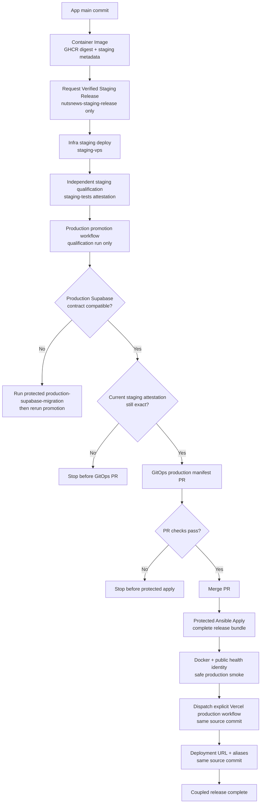
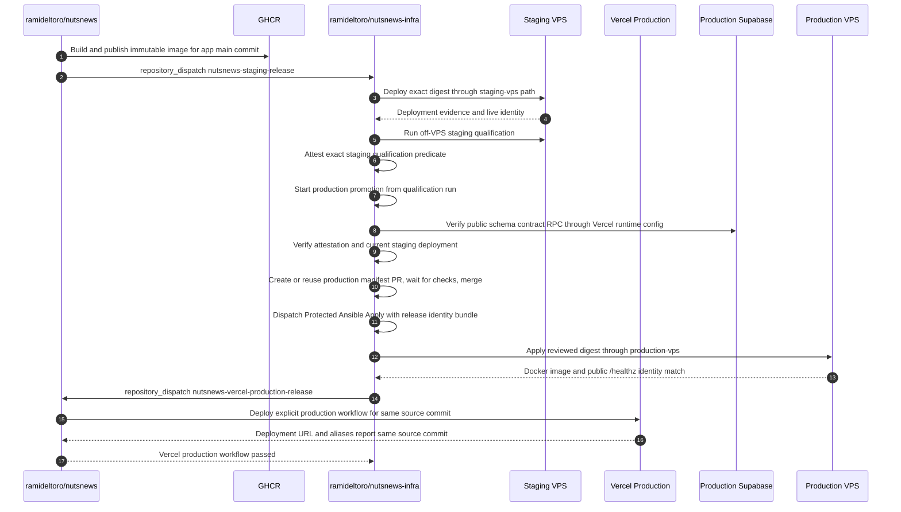

# NutsNews Release Pipeline

Current as of July 17, 2026.

This document maps the staging-qualified production release path across:

- `ramideltoro/nutsnews` at inspected `origin/main` commit `1a44391`
- `ramideltoro/nutsnews-infra` at inspected `origin/main` commit `bab60bc`
- `ramideltoro/nutsnews-docs` at base `main` commit `0682a0e`

It documents repository-owned behavior and workflow boundaries. It does not
contain secret values and does not authorize manual production database changes,
manual Docker changes, or direct VPS mutation outside protected workflows.

## Simple Summary

NutsNews production is staging-first. A release can reach the production VPS
only after the exact app source and immutable GHCR image have passed staging
deployment and independent staging qualification.

Production promotion is not a direct app-to-production dispatch. The old
`nutsnews-production-release` repository dispatch path is closed. The active
infra promotion path starts from a successful `nutsnews-staging-qualification`
workflow run, or from a manual dispatch that names that exact successful run and
uses the required confirmation phrase.

Before the production VPS can change, infra verifies:

1. the signed staging qualification attestation for the exact image, source,
   build, staging deployment, config generation, and test-suite revision;
2. the candidate is still the current successful staging deployment;
3. production Supabase already exposes the compatible migration/schema contract,
   or the protected production migration workflow has already applied it;
4. the reviewed GitOps production manifest PR passes checks and merges;
5. `Protected Ansible Apply` accepts the complete release identity bundle before
   it reaches `production-vps` secrets.
6. the app repository's explicit Vercel production workflow deploys and
   verifies the same source commit only after the VPS apply succeeds.

If the production Supabase schema is behind, promotion fails and points the
operator to `ramideltoro/nutsnews/.github/workflows/production-supabase-migration.yml`.
The production promotion workflow does not auto-migrate production.

The explicit Vercel production workflow also rewrites local build control names
in the pulled Vercel Production env file before running the prebuilt build.
It removes any Vercel-sourced `PATH`, `Path`, `SHELL`, or `HOME` entries and
then appends runner-safe `PATH`, `SHELL`, and `HOME` values. This prevents the
local GitHub runner build from losing the shell needed by `npm install` while
keeping secret values inside Vercel and GitHub Actions.

## Intermediate Summary

The app repository owns source, web checks, migration checks, the container
image, staging handoff metadata, and protected Supabase migration workflows.
The infra repository owns VPS staging deployment, staging qualification,
production promotion, GitOps production manifest changes, Protected Ansible
Apply, and fixed rollback. The docs repository owns this cross-repo explanation.

The release identity bundle is:

- source repository: `ramideltoro/nutsnews`
- source commit: full lowercase SHA on app `main`
- source workflow run ID
- image repository: `ghcr.io/ramideltoro/nutsnews`
- image digest: immutable `sha256:<digest>`
- build ID
- staging deployment ID
- staging qualification run ID
- migration head
- rollback-compatible schema version
- production Supabase project reference
- post-VPS Vercel Production deployment evidence and public alias URL for the
  same source commit

The app `Container Image` workflow uploads `nutsnews-staging-release` metadata.
`Request Verified Staging Release` dispatches only `nutsnews-staging-release`
to infra. It does not request production.

Infra deploys the candidate to the isolated staging VPS path and then runs
`Qualify Verified NutsNews Staging Candidate`. Qualification writes sanitized
evidence, creates a GitHub artifact attestation for the exact candidate, and
verifies that attestation before retaining the evidence artifact.

`Promote NutsNews Production Release` starts only after that qualification
workflow succeeds, or by a tightly validated manual dispatch for the exact
qualification run. It re-derives the release contract from the exact app source
commit, verifies production Supabase through the public
`nutsnews_migration_schema_contract` RPC, revalidates the staging attestation
and current staging deployment, then creates or reuses the production GitOps
PR. After the protected VPS apply succeeds, infra dispatches the app
repository's explicit Vercel production workflow and waits for the deployment
URL plus public aliases to report the same source commit.

The Vercel production workflow still pulls the Vercel Production environment
for the build, but it rewrites only runner-control names that can make `vercel
build --prod` fail locally. Application and secret configuration values remain
available to the build; the workflow logs only the prepared control names and
does not print or export their values.

The promotion workflow does not attach the `production-vps` environment. It
uses the existing infra release token only after the Supabase and
staging-attestation gates pass, so the token is used for GitOps mechanics:
branch push, PR creation, check waiting, merge, and protected workflow dispatch.
The production mutation still happens only inside `Protected Ansible Apply`
after the no-secret eligibility job and the protected `production-vps`
environment.

## Expert Summary

The production path deliberately separates evidence from mutation:

- The app `main` merge and image build create the immutable release artifact.
- Staging deployment proves the digest can run on the VPS staging runtime.
- Staging qualification proves the live staged candidate and writes signed,
  short-lived eligibility evidence.
- The production Supabase contract must already match the release migration
  head, legacy schema marker, and catalog fingerprint before VPS promotion
  proceeds.
- The GitOps PR changes only
  `ansible/inventories/production/host_vars/vps.nutsnews.com.yml`.
- Protected Ansible Apply rechecks the same release identity before secrets and
  SSH are available.
- Post-apply verification fails the run if Docker image identity or public
  `/healthz` source/build/production-target identity does not match. Runtime
  readiness and smoke checks also verify the reviewed `production-vps` target.
- Vercel Production deploys only after the protected VPS apply passes, and the
  release remains failed unless the deployment URL and public aliases report
  the same source commit.
- The Vercel local prebuilt build rewrites shell-sensitive env names after
  `vercel pull`, so platform configuration cannot remove the GitHub runner's
  shell path before `vercel build --prod`.

The release is not transactionally atomic across Vercel, Supabase, GitHub, and
the VPS. The safety property is narrower and testable: every production VPS app
mutation must be traceable to a current staging qualification, compatible
production Supabase schema, reviewed manifest PR, protected apply run, and
same-commit post-VPS Vercel Production deployment.

## Pipeline Diagram



## Sequence Diagram



## Gate Table

| Gate | Owning repo/workflow | Pass condition | Failure behavior |
| --- | --- | --- | --- |
| App PR checks | `ramideltoro/nutsnews` CI | Required app checks and release-candidate checks pass before merge | App `main` merge is blocked |
| Image publish | `container-image.yml` | GHCR full-SHA image and digest metadata match the app `main` run | No staging handoff artifact |
| Staging handoff | `staging-release.yml` | Only the validated `nutsnews-staging-release` payload is dispatched to infra | Staging deploy is not requested |
| Staging deploy | `nutsnews-staging-deploy.yml` | VPS staging runtime reports the expected source, build, digest, schema, and isolation | Qualification is not eligible |
| Staging qualification | `nutsnews-staging-qualification.yml` | Live staging tests pass and the exact-candidate attestation verifies | Production promotion is not eligible |
| Production Supabase contract | `nutsnews-release-promotion.yml` plus app migration workflow | Runtime config identifies production and the public schema contract RPC matches migration head, schema version, and fingerprint | Promotion fails and points to `production-supabase-migration.yml` |
| Current staging attestation | `verify_production_eligibility.py` | Fresh trusted attestation matches release identity and the same deployment is still current successful staging | Promotion stops before GitOps PR or protected apply |
| GitOps promotion PR | `nutsnews-release-promotion.yml` | Manifest PR checks pass and PR merges to infra `main` | Protected apply is not dispatched |
| Protected eligibility | `protected-ansible-apply.yml` | No-secret verifier accepts the merged manifest and complete release bundle before `production-vps` secrets | Production secrets and SSH remain unavailable |
| Production apply | `protected-ansible-apply.yml` | Ansible applies the reviewed digest and post-apply Docker/health/smoke checks match | Workflow fails; use fixed rollback only if production mutated |
| Vercel Production | `vercel-production-release.yml` dispatched by infra after VPS apply | The local prebuilt build rewrites shell-sensitive pulled env names to runner-safe control values; deployment URL, `www.nutsnews.com`, and `nutsnews.com` report the same source commit and `vercel-production` target | Coupled release fails after VPS apply; fix the Vercel blocker or use protected rollback if needed |
| Fixed rollback | `protected-nutsnews-rollback.yml` | Only the recorded last-known-good digest is selected from reviewed manifest history | Arbitrary digest, tag, SSH, or DB down migration is rejected |

## Vercel Local Build Environment Guard

The app workflow uses `vercel pull --environment=production` followed by a
local `vercel build --prod` and `vercel deploy --prebuilt --prod`. That local
build runs on a GitHub Actions runner, not on Vercel infrastructure. If a
pulled Vercel Production variable has a process-control name such as `PATH`,
`Path`, `SHELL`, or `HOME`, it can override the runner environment that the
Vercel CLI uses to spawn the install command. The observed failure mode is a
same-release Vercel deploy stopping at `Error: spawn sh ENOENT` after the VPS
apply has already passed.

The mitigation is intentionally narrow: after `vercel pull`, the workflow
removes `.vercel/.env.production.local` entries whose names match that small
shell-sensitive set, then appends safe local runner values for `HOME`, `PATH`,
and `SHELL`. It does not remove application configuration, does not print
values, and does not change the source-controlled Vercel project settings. The
`production_release_workflow_regression.mjs` check asserts that this local
build control guard remains present in the release workflow.

Rollback is to revert the app workflow change and rerun the coupled promotion
only after confirming the Vercel Production environment no longer contains a
shell-sensitive process-control name. The Vercel production workflow now accepts
only the infra repository dispatch path (`nutsnews-vercel-production-release`) and
is not manually dispatchable in normal operations. Do not work around this by
running a standalone Vercel production deploy, because that would bypass the
coupled VPS and Vercel release contract.

## Production Supabase Procedure

When promotion reports that production Supabase is not compatible, do not edit
the database manually and do not rerun promotion until the contract is fixed.

Run the app repository workflow:

```text
ramideltoro/nutsnews/.github/workflows/production-supabase-migration.yml
```

The protected migration request must use the same source commit and migration
head as the release candidate, a fresh successful manual backup run ID, and the
exact confirmation phrase required by that workflow. After the migration passes,
rerun `Promote NutsNews Production Release` with the same staging qualification
run ID if the qualification is still fresh and current.

## Operator Notes

- Do not dispatch `Protected Ansible Apply` for a new app digest until the
  promotion workflow has merged the reviewed production manifest.
- Do not run a standalone Vercel Production deployment for a release. Vercel
  production follows protected VPS apply through the coupled promotion chain.
- Do not treat staging qualification as database migration approval. Production
  Supabase migration remains a separate protected workflow.
- Do not use mutable image tags, manual Docker edits, direct SSH deployment,
  standalone production database edits, or arbitrary rollback digests.
- Treat `unknown`, `expired`, `superseded`, `failed`, or mismatched eligibility
  states as not production eligible.

## Source Map

| Repository | Source files or workflows |
| --- | --- |
| `ramideltoro/nutsnews` | `.github/workflows/container-image.yml`; `.github/workflows/staging-release.yml`; `.github/workflows/production-supabase-migration.yml`; `.github/workflows/staging-supabase-migration.yml`; `scripts/migration_contract.mjs`; `web/app/healthz/route.ts`; `web/app/readyz/route.ts`; `web/runtimePublicConfig.mjs` |
| `ramideltoro/nutsnews-infra` | `.github/workflows/nutsnews-staging-deploy.yml`; `.github/workflows/nutsnews-staging-qualification.yml`; `.github/workflows/nutsnews-release-promotion.yml`; `.github/workflows/protected-ansible-apply.yml`; `.github/workflows/protected-nutsnews-rollback.yml`; `ansible/scripts/staging_qualification.py`; `ansible/scripts/verify_production_eligibility.py`; `ansible/scripts/promote_nutsnews_release.py`; `ansible/inventories/production/host_vars/vps.nutsnews.com.yml` |
| `ramideltoro/nutsnews-docs` | `NUTSNEWS_RELEASE_PIPELINE.md`; `NUTSNEWS_PROTECTED_ANSIBLE_APPLY.md`; `MIGRATION_RELEASE_GATE.md` |

## Remaining Risks

- `production-vps` Environment approval can still require a human reviewer. If
  nobody approves, the apply run waits or fails by timeout; this is expected
  protection, not a bypass.
- Vercel, Supabase, GitHub, and the VPS are not atomic. If a late VPS apply
  verification fails after mutation, use the protected recorded rollback path.
- This document names secret identifiers but never secret values. Secret values
  must remain only in GitHub Environments, Vercel, Supabase, or other approved
  providers.
