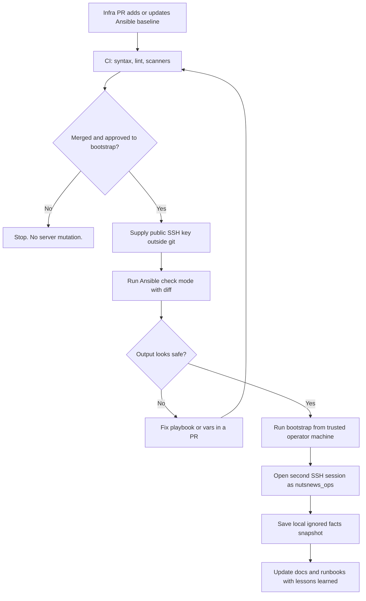
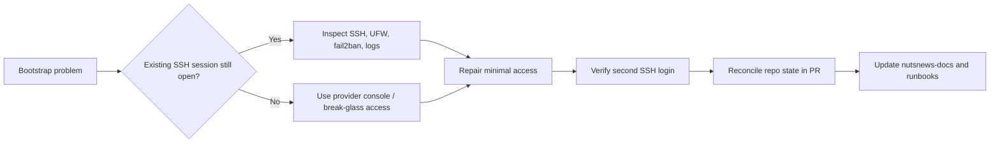

# NutsNews VPS Ansible Bootstrap

This explains the first Ansible baseline for the primary NutsNews VPS. It is the careful part before the flashy part: make the server boring, reachable, patched, logged, and recoverable before anything tries to deploy an app and call itself a platform.

## Easy Summary

The first Ansible layer prepares `vps.nutsnews.com` for future GitOps automation. It creates a non-root automation admin user, hardens SSH without trying to lock us outside in the rain, enables a basic firewall, turns on security updates, installs fail2ban, keeps time synced, makes journald persistent, sets up basic log rotation, and writes a local server facts snapshot.

It does not deploy the website. It does not run SSH deploys. It does not commit secrets. It does not mutate the VPS from CI. It is a bootstrap recipe, not a production push button.

## Intermediate Summary

The bootstrap playbook lives in `ramideltoro/nutsnews-infra` under `ansible/`. It targets the production inventory entry for:

```text
vps.nutsnews.com
IPv4: 65.75.202.112
IPv6: 2606:cc0:11:23ae::1
OS: Ubuntu 26.04 LTS
Specs: 4 vCPU, 10240 MiB RAM, 80 GiB disk
```

The playbook requires at least one public SSH key for the `nutsnews_ops` automation user. That key must be supplied outside the repository through an uncommitted vars file or extra vars. Private keys and passwords stay out of git, because git is forever and forever is a long time to leak a root credential.

## Expert Summary

This bootstrap layer is a provider-agnostic Ubuntu baseline. It is intentionally limited to host hardening and safety plumbing:

- `nutsnews_ops` non-root automation user with sudo access
- public-key SSH access for that user
- SSH hardening drop-in with port 22 preserved
- UFW default deny incoming, allow outgoing, allow SSH/HTTP/HTTPS
- unattended security updates
- fail2ban SSH jail
- UTC time sync through systemd-timesyncd
- persistent journald storage with retention limits
- placeholder `/var/log/nutsnews/*.log` rotation
- local ignored JSON facts snapshot for audit and rebuild context

The CI layer validates Ansible syntax and linting, but it does not run the playbook against production. Future apply workflows must be protected and explicit. Today, the safe answer is still: review, dry-run, verify access, then apply from a trusted operator machine only after approval.

## Bootstrap Flow



## Why This Exists

Fresh VPS hosts are a buffet of defaults. Some defaults are fine. Some defaults are tiny chaos seeds waiting for rain.

The bootstrap baseline gives the VPS a known starting shape:

- one expected automation user
- predictable SSH policy
- a firewall stance that starts closed
- basic brute-force protection
- automatic security patching
- durable logs
- audit-friendly host facts

That makes future GitOps safer because the server stops being "whatever the provider image happened to ship today."

## How We Avoid Lockout

Lockout prevention is the main design constraint. Security that strands the operator outside the host is not security; it is a locked door with the keys inside.

The bootstrap avoids lockout by doing these things:

- The playbook fails early if no admin public key is supplied.
- SSH stays on port `22` for the first baseline.
- UFW allows SSH before the firewall is enabled.
- Root SSH is set to `prohibit-password`, not immediately removed as a possible key-based break-glass path.
- Password authentication is disabled only as part of a reviewed SSH baseline.
- Operators must keep the original SSH session open while testing a second login as `nutsnews_ops`.
- Recovery notes explain how to move the SSH drop-in aside or reopen UFW if needed.

## What Can Go Wrong

| Failure | Why it happens | Recovery |
| --- | --- | --- |
| `nutsnews_ops` cannot log in | Bad public key, wrong user, wrong SSH client identity | Keep existing session open, fix authorized key input, rerun |
| SSH reload fails | Bad SSH config drop-in | Run `sshd -t`, move the drop-in aside, reload SSH |
| UFW blocks access | Firewall enabled before SSH allow rule, wrong port, provider firewall mismatch | Use existing session or console, allow `22/tcp`, reload UFW |
| fail2ban blocks an operator | Too many failed login attempts | `fail2ban-client set sshd unbanip <ip>` |
| unattended upgrades surprise a service | Future services need maintenance windows | Keep reboot disabled by default, add reporting before enabling automatic reboots |
| facts output is missing | Local output path not writable or play interrupted | Rerun after fixing local permissions |

## Validation Commands

From `ramideltoro/nutsnews-infra`:

```bash
cd ansible
ansible-galaxy collection install -r requirements.yml
ansible-playbook playbooks/bootstrap.yml --syntax-check
ansible-lint .
```

Check mode, after approval and with a public key supplied outside git:

```bash
cd ansible
ansible-playbook playbooks/bootstrap.yml --check --diff \
  --extra-vars '{"vps_baseline_admin_authorized_keys":["ssh-ed25519 AAAA... operator@example"]}'
```

The real run uses the same extra vars without `--check`, but only after review and explicit approval.

## Recovery Flow



## What This Does Not Do

This layer does not:

- deploy the web app
- configure Docker Compose services
- install production secrets
- create deploy keys
- run from GitHub Actions against the VPS
- replace provider console access
- make the home server required for production

That restraint is intentional. First we make the floor solid. Then we can put furniture on it. Preferably not the kind assembled from five competing shell scripts and a wish.

## Related Docs

- [NutsNews Infra Operations Platform](NUTSNEWS_INFRA_OPERATIONS_PLATFORM.md)
- [Operations](OPERATIONS.md)
- [Security CI Scans](SECURITY_CI_SCANS.md)
- [Troubleshooting](TROUBLESHOOTING.md)
- [Free-Tier Guardrails](FREE_TIER_GUARDRAILS.md)
