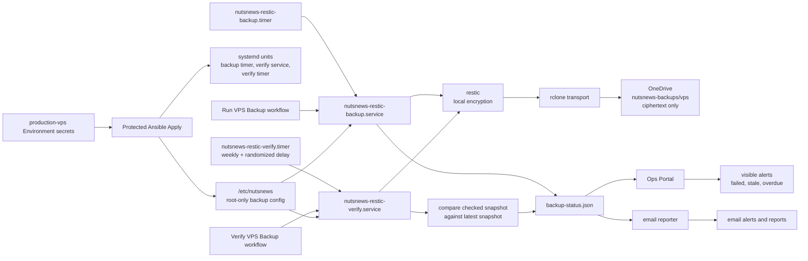

# NutsNews VPS Backups

This is the setup and operations guide for encrypted VPS backups to OneDrive.

The design is intentionally boring: restic encrypts the data on the VPS, rclone transports the encrypted repository to OneDrive, and GitHub Actions can only start fixed systemd units. No raw readable backup pile in OneDrive. No "paste a command and hope" workflow. No tiny production trapdoor wearing a workflow badge.

## Simple Summary

The VPS backs itself up with restic. Restic encrypts the backup before anything leaves the server. rclone then moves the encrypted restic repository to a OneDrive remote named `nutsnews-onedrive`.

OneDrive sees encrypted restic blobs, not readable `/opt/nutsnews` files. If someone opens the OneDrive folder, they should see backup confetti, not secrets with a newsletter subscription.

The VPS also verifies the latest restic snapshot on a weekly systemd timer. The Ops Portal shows whether the newest snapshot has a recent successful verification, whether the last check looked at an older snapshot, and whether verification has failed or gone stale. A newer daily snapshot waiting for the expected weekly check stays visible as pending status; it does not immediately generate email. The shared [VPS Alert Email Policy](VPS_ALERT_EMAIL_POLICY.md) defines the deadline and cooldown behavior.

This routine verification is not the full restore drill tracked separately in infra issue #24. It proves repository readability and latest-snapshot coverage; a restore drill still restores data to staging and inspects the result.

## Intermediate Summary

The infra repo manages the VPS backup layer through Ansible:

| Piece | Value |
| --- | --- |
| Backup tool | `restic` |
| Transport | `rclone` |
| Cloud destination | OneDrive |
| Dedicated rclone remote | `nutsnews-onedrive` |
| Restic repository | `rclone:nutsnews-onedrive:nutsnews-backups/vps` |
| Backup service | `nutsnews-restic-backup.service` |
| Backup timer | `nutsnews-restic-backup.timer` |
| Verification service | `nutsnews-restic-verify.service` |
| Verification timer | `nutsnews-restic-verify.timer` |
| Verification cadence | Weekly on Sunday around `05:15` server-local time, randomized by up to `6h` |
| Verification stale threshold | `192h` by default |
| Portal status file | `/opt/nutsnews/portal-assets/data/backup-status.json` |
| Root-only config | `/etc/nutsnews` |

Backups include the important VPS runtime and restore material:

- `/opt/nutsnews`
- `/etc/nutsnews`
- NutsNews systemd units and timers
- Docker daemon config
- SSH hardening config
- sudoers, unattended-upgrades, fail2ban, journald, and logrotate config managed by the infra repo
- future app data under `/opt/nutsnews/data`

The default retention policy is:

| Class | Keep |
| --- | --- |
| Daily | 14 |
| Weekly | 8 |
| Monthly | 12 |
| Yearly | 2 |

Pruning runs after a successful backup. If prune fails, the backup status becomes degraded and the portal emits an alert. That is useful because "the backup worked but the storage bill is doing pushups" is still an operations problem.

Scheduled verification runs `restic ls latest` and then `restic check --read-data-subset=5%` through the existing lock-protected backup runner. The service timeout is four hours. The manual GitHub workflow that starts the same verify service has a 60-minute Actions timeout, so unusually slow OneDrive/network reads may outlive the manual workflow even when the systemd service timeout is still larger.

## Expert Summary

The backup layer is GitOps-managed and provider-agnostic:

- Ansible installs `restic` and `rclone`.
- Ansible writes the restic password, rclone config, backup environment, path list, and exclude list as root-only files.
- The restic password is provided through the protected `production-vps` GitHub Environment.
- The rclone OneDrive OAuth config is provided through the same protected Environment.
- The systemd service uses `RESTIC_PASSWORD_FILE`, not a password embedded in the unit.
- The systemd units run as root but use hardening and constrained writable paths.
- The rclone config directory is writable because rclone may need to refresh OAuth tokens.
- The manual workflows have no dispatch inputs and start only fixed systemd units.
- The scheduled verify timer starts only `nutsnews-restic-verify.service`; it does not add any arbitrary remote shell control.
- The portal compares `last_check.latest_snapshot_id` and `last_check.latest_snapshot_time` against `latest_snapshot.id`, `latest_snapshot.short_id`, and `latest_snapshot.time`.
- The backup runner may write `latest_snapshot_age_seconds` to `backup-status.json`, but that value is diagnostic for the moment the runner wrote the file. The Ops Portal collector recomputes live snapshot age from `latest_snapshot.time` on every collection, including restic timestamps with nanosecond precision and a trailing `Z`.
- The public status output exposes counts and status fields, not raw backup path lists or restore targets.

The protected apply workflow rejects enabled backups unless these are true:

- `NUTSNEWS_BACKUP_RESTIC_PASSWORD` is present.
- `NUTSNEWS_BACKUP_RCLONE_CONFIG` is present.
- the repository uses the dedicated `rclone:nutsnews-onedrive:` remote prefix.

Pull request validation checks that backup workflows are not arbitrary remote command runners and that committed backup secret material is absent.

The verification state can be:

| State | Meaning |
| --- | --- |
| `success` | The latest snapshot has a recent successful verification. |
| `failed` | The latest verification command failed. |
| `stale` | The latest snapshot was verified, but the check is older than the stale threshold. |
| `latest_unverified` | The last successful check covered an older snapshot or no successful check exists yet. This is pending until the verification policy deadline, then overdue. |
| `disabled` | Backups are disabled. |
| `misconfigured` | Backups are enabled but required restic/rclone settings are missing. |

## Architecture



## Scheduled Latest Verification

The Ansible role manages `nutsnews-restic-verify.timer` alongside the backup timer. The default cadence is weekly, with randomized delay, and it stays enabled only when encrypted VPS backups are enabled. The timer starts the same fixed `nutsnews-restic-verify.service` used by the manual workflow.

The runner keeps the existing restic lock. If a backup is already running, verification records a busy state instead of fighting the backup for repository access.

Expected runtime depends on repository size, OneDrive response time, VPS network throughput, and the `NUTSNEWS_BACKUP_CHECK_READ_DATA_SUBSET` value. The default `5%` read-data subset is deliberately conservative for a small VPS and a free/consumer OneDrive-backed repository. Increasing the subset or running checks too frequently can consume OneDrive API/network quota and make manual GitHub verification hit its 60-minute workflow timeout.

The portal and reports warn when:

- verification failed
- verification is stale
- the latest snapshot remains unverified beyond the 192-hour policy deadline
- the verification timer is inactive while backups are enabled

Before that deadline, a newer daily snapshot is shown as a pending mismatch in the portal without creating predictable daily email noise.

Keep full restore drills separate. Issue #24 tracks the periodic restore drill that stages files on a trusted host and validates recoverability beyond repository checks.

## Required GitHub Environment Secrets

Add these in:

```text
ramideltoro/nutsnews-infra -> Settings -> Environments -> production-vps -> Environment secrets
```

| Secret | Required | Description |
| --- | --- | --- |
| `NUTSNEWS_BACKUP_ENABLED` | yes | Set to `true` when ready to enable the timer |
| `NUTSNEWS_BACKUP_RESTIC_PASSWORD` | yes | Long unique restic repository password |
| `NUTSNEWS_BACKUP_RCLONE_CONFIG` | yes | Full rclone config containing the `nutsnews-onedrive` remote |

Optional tuning:

| Secret | Default |
| --- | --- |
| `NUTSNEWS_BACKUP_REPOSITORY` | `rclone:nutsnews-onedrive:nutsnews-backups/vps` |
| `NUTSNEWS_BACKUP_STALE_AFTER_HOURS` | `30` |
| `NUTSNEWS_BACKUP_VERIFY_STALE_AFTER_HOURS` | `192` |
| `NUTSNEWS_BACKUP_CHECK_READ_DATA_SUBSET` | `5%` |
| `NUTSNEWS_BACKUP_KEEP_DAILY` | `14` |
| `NUTSNEWS_BACKUP_KEEP_WEEKLY` | `8` |
| `NUTSNEWS_BACKUP_KEEP_MONTHLY` | `12` |
| `NUTSNEWS_BACKUP_KEEP_YEARLY` | `2` |

Keep an offline copy of the restic password somewhere sane. A backup password stored only on the server being backed up is a very confident circle.

## Generate The rclone OneDrive Config Safely

Do this locally on your machine. Do not paste OAuth tokens into chat, PRs, issues, docs, or Slack messages from your future imaginary startup.

1. Install rclone locally.
2. Run:

```bash
rclone config
```

3. Create a OneDrive remote named exactly:

```text
nutsnews-onedrive
```

4. Let rclone open the browser and complete the Microsoft authorization flow.
5. Confirm the remote works:

```bash
rclone lsd nutsnews-onedrive:
```

6. Find the config file:

```bash
rclone config file
```

7. Open that file locally and copy the full config block for `nutsnews-onedrive` into the GitHub Environment secret `NUTSNEWS_BACKUP_RCLONE_CONFIG`.

Do not commit the config. It contains OAuth material. It is not cute. It is a credential.

## Apply The Backup Layer

1. Add the required `production-vps` Environment secrets.
2. Open GitHub Actions in `ramideltoro/nutsnews-infra`.
3. Run `Protected Ansible Apply` in `check` mode.
4. Review the diff.
5. Run `Protected Ansible Apply` in `apply` mode with:

```text
confirm_apply=vps.nutsnews.com
```

6. Run the manual `Run VPS Backup` workflow.
7. Run the manual `Verify VPS Backup` workflow.
8. Confirm `nutsnews-restic-verify.timer` is active.
9. Check the Ops Portal through the SSH tunnel and confirm latest verification is `success`.

## Manual Workflows

The backup workflows are intentionally narrow:

| Workflow | What it can do |
| --- | --- |
| `Run VPS Backup` | Start `nutsnews-restic-backup.service` |
| `Verify VPS Backup` | Start `nutsnews-restic-verify.service` |

They do not accept dispatch inputs. They do not stream arbitrary shell over SSH. They do not take a command parameter. Production does not need a karaoke machine for root commands.

The scheduled verify timer exists so manual verification is not the only path. The manual workflow remains useful after setup, incidents, or restores.

## Portal And Alerts

The Ops Portal backup section shows:

- enabled/configured state
- repository and repository path
- latest snapshot ID and age
- fresh/stale status
- last backup result
- last prune result
- latest snapshot verification result
- whether the last verification checked the latest snapshot
- next timer run
- next verification timer run
- protected path count

Email alerts fire through the existing alert pipeline for:

- failed backups
- stale snapshots
- prune failures
- verification failures
- stale verification
- latest snapshot not yet verified
- inactive backup timer
- inactive verification timer
- enabled but missing backup configuration

Freshness alerts use the collector's recomputed live age, not the age stored by the backup runner. If `latest_snapshot.time` is older than `NUTSNEWS_BACKUP_STALE_AFTER_HOURS`, the portal status becomes `stale` and the email alert pipeline sees the same stale status on the next collector run.

## Validation

The infra PR validation includes:

- Ansible syntax check
- ansible-lint
- actionlint
- portal fixture validation for backup status
- backup workflow guardrail validation
- committed backup secret safety check
- Gitleaks

The workflow guardrail test specifically confirms the manual backup workflows cannot become arbitrary remote command runners without CI complaining like it found a fork in the microwave.

## Related Docs

- [VPS Restore](NUTSNEWS_VPS_RESTORE.md)
- [VPS Disaster Recovery](NUTSNEWS_VPS_DISASTER_RECOVERY.md)
- [Operations Portal v1](NUTSNEWS_OPERATIONS_PORTAL_V1.md)
- [Protected Ansible Apply](NUTSNEWS_PROTECTED_ANSIBLE_APPLY.md)
- [Infra Operations Platform](NUTSNEWS_INFRA_OPERATIONS_PLATFORM.md)
