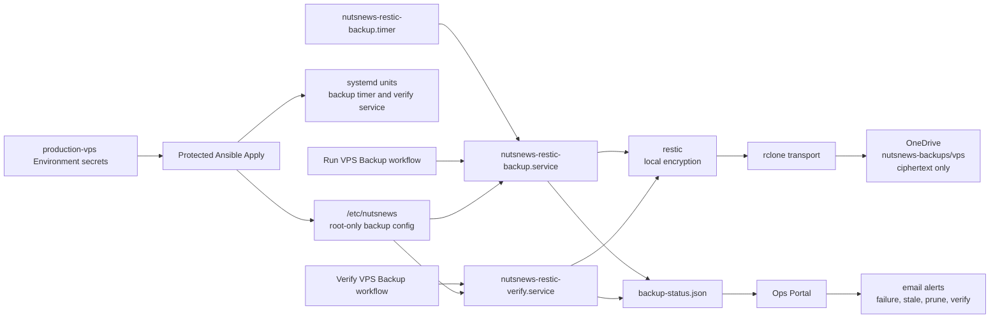

# NutsNews VPS Backups

This is the setup and operations guide for encrypted VPS backups to OneDrive.

The design is intentionally boring: restic encrypts the data on the VPS, rclone transports the encrypted repository to OneDrive, and GitHub Actions can only start fixed systemd units. No raw readable backup pile in OneDrive. No "paste a command and hope" workflow. No tiny production trapdoor wearing a workflow badge.

## Easy Summary

The VPS backs itself up with restic. Restic encrypts the backup before anything leaves the server. rclone then moves the encrypted restic repository to a OneDrive remote named `nutsnews-onedrive`.

OneDrive sees encrypted restic blobs, not readable `/opt/nutsnews` files. If someone opens the OneDrive folder, they should see backup confetti, not secrets with a newsletter subscription.

The Ops Portal shows whether backups are enabled, fresh, successful, pruned, verified, or stale. Email alerts already use the portal alert feed, so backup failures and stale snapshots can yell politely.

## Intermediate Summary

The infra repo manages the VPS backup layer through Ansible:

| Piece | Value |
| --- | --- |
| Backup tool | `restic` |
| Transport | `rclone` |
| Cloud destination | OneDrive |
| Dedicated rclone remote | `nutsnews-onedrive` |
| Restic repository | `rclone:nutsnews-onedrive:nutsnews-backups/vps` |
| Backup service | `nutsnews-restic-backup.service` |
| Backup timer | `nutsnews-restic-backup.timer` |
| Verification service | `nutsnews-restic-verify.service` |
| Portal status file | `/opt/nutsnews/portal-assets/data/backup-status.json` |
| Root-only config | `/etc/nutsnews` |

Backups include the important VPS runtime and restore material:

- `/opt/nutsnews`
- `/etc/nutsnews`
- NutsNews systemd units and timers
- Docker daemon config
- SSH hardening config
- sudoers, unattended-upgrades, fail2ban, journald, and logrotate config managed by the infra repo
- future app data under `/opt/nutsnews/data`

The default retention policy is:

| Class | Keep |
| --- | --- |
| Daily | 14 |
| Weekly | 8 |
| Monthly | 12 |
| Yearly | 2 |

Pruning runs after a successful backup. If prune fails, the backup status becomes degraded and the portal emits an alert. That is useful because "the backup worked but the storage bill is doing pushups" is still an operations problem.

## Expert Summary

The backup layer is GitOps-managed and provider-agnostic:

- Ansible installs `restic` and `rclone`.
- Ansible writes the restic password, rclone config, backup environment, path list, and exclude list as root-only files.
- The restic password is provided through the protected `production-vps` GitHub Environment.
- The rclone OneDrive OAuth config is provided through the same protected Environment.
- The systemd service uses `RESTIC_PASSWORD_FILE`, not a password embedded in the unit.
- The systemd units run as root but use hardening and constrained writable paths.
- The rclone config directory is writable because rclone may need to refresh OAuth tokens.
- The manual workflows have no dispatch inputs and start only fixed systemd units.

The protected apply workflow rejects enabled backups unless these are true:

- `NUTSNEWS_BACKUP_RESTIC_PASSWORD` is present.
- `NUTSNEWS_BACKUP_RCLONE_CONFIG` is present.
- the repository uses the dedicated `rclone:nutsnews-onedrive:` remote prefix.

Pull request validation checks that backup workflows are not arbitrary remote command runners and that committed backup secret material is absent.

## Architecture



## Required GitHub Environment Secrets

Add these in:

```text
ramideltoro/nutsnews-infra -> Settings -> Environments -> production-vps -> Environment secrets
```

| Secret | Required | Description |
| --- | --- | --- |
| `NUTSNEWS_BACKUP_ENABLED` | yes | Set to `true` when ready to enable the timer |
| `NUTSNEWS_BACKUP_RESTIC_PASSWORD` | yes | Long unique restic repository password |
| `NUTSNEWS_BACKUP_RCLONE_CONFIG` | yes | Full rclone config containing the `nutsnews-onedrive` remote |

Optional tuning:

| Secret | Default |
| --- | --- |
| `NUTSNEWS_BACKUP_REPOSITORY` | `rclone:nutsnews-onedrive:nutsnews-backups/vps` |
| `NUTSNEWS_BACKUP_STALE_AFTER_HOURS` | `30` |
| `NUTSNEWS_BACKUP_CHECK_READ_DATA_SUBSET` | `5%` |
| `NUTSNEWS_BACKUP_KEEP_DAILY` | `14` |
| `NUTSNEWS_BACKUP_KEEP_WEEKLY` | `8` |
| `NUTSNEWS_BACKUP_KEEP_MONTHLY` | `12` |
| `NUTSNEWS_BACKUP_KEEP_YEARLY` | `2` |

Keep an offline copy of the restic password somewhere sane. A backup password stored only on the server being backed up is a very confident circle.

## Generate The rclone OneDrive Config Safely

Do this locally on your machine. Do not paste OAuth tokens into chat, PRs, issues, docs, or Slack messages from your future imaginary startup.

1. Install rclone locally.
2. Run:

```bash
rclone config
```

3. Create a OneDrive remote named exactly:

```text
nutsnews-onedrive
```

4. Let rclone open the browser and complete the Microsoft authorization flow.
5. Confirm the remote works:

```bash
rclone lsd nutsnews-onedrive:
```

6. Find the config file:

```bash
rclone config file
```

7. Open that file locally and copy the full config block for `nutsnews-onedrive` into the GitHub Environment secret `NUTSNEWS_BACKUP_RCLONE_CONFIG`.

Do not commit the config. It contains OAuth material. It is not cute. It is a credential.

## Apply The Backup Layer

1. Add the required `production-vps` Environment secrets.
2. Open GitHub Actions in `ramideltoro/nutsnews-infra`.
3. Run `Protected Ansible Apply` in `check` mode.
4. Review the diff.
5. Run `Protected Ansible Apply` in `apply` mode with:

```text
confirm_apply=vps.nutsnews.com
```

6. Run the manual `Run VPS Backup` workflow.
7. Run the manual `Verify VPS Backup` workflow.
8. Check the Ops Portal through the SSH tunnel.

## Manual Workflows

The backup workflows are intentionally narrow:

| Workflow | What it can do |
| --- | --- |
| `Run VPS Backup` | Start `nutsnews-restic-backup.service` |
| `Verify VPS Backup` | Start `nutsnews-restic-verify.service` |

They do not accept dispatch inputs. They do not stream arbitrary shell over SSH. They do not take a command parameter. Production does not need a karaoke machine for root commands.

## Portal And Alerts

The Ops Portal backup section shows:

- enabled/configured state
- repository and repository path
- latest snapshot ID and age
- fresh/stale status
- last backup result
- last prune result
- last verification result
- next timer run
- protected path count

Email alerts fire through the existing alert pipeline for:

- failed backups
- stale snapshots
- prune failures
- verification failures
- inactive backup timer
- enabled but missing backup configuration

## Validation

The infra PR validation includes:

- Ansible syntax check
- ansible-lint
- actionlint
- portal fixture validation for backup status
- backup workflow guardrail validation
- committed backup secret safety check
- Gitleaks

The workflow guardrail test specifically confirms the manual backup workflows cannot become arbitrary remote command runners without CI complaining like it found a fork in the microwave.

## Related Docs

- [VPS Restore](NUTSNEWS_VPS_RESTORE.md)
- [VPS Disaster Recovery](NUTSNEWS_VPS_DISASTER_RECOVERY.md)
- [Operations Portal v1](NUTSNEWS_OPERATIONS_PORTAL_V1.md)
- [Protected Ansible Apply](NUTSNEWS_PROTECTED_ANSIBLE_APPLY.md)
- [Infra Operations Platform](NUTSNEWS_INFRA_OPERATIONS_PLATFORM.md)
