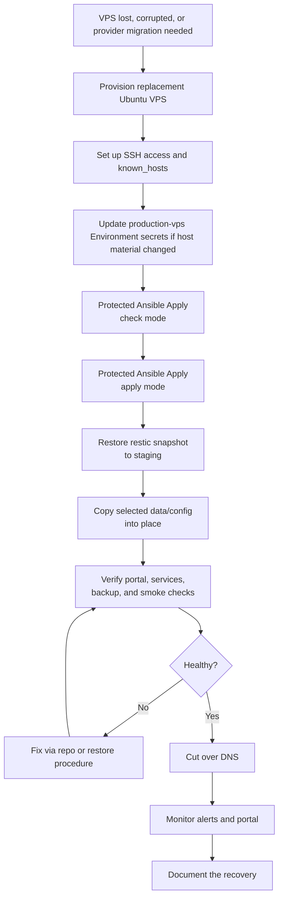

# NutsNews VPS Disaster Recovery

This is the rebuild runbook for moving NutsNews to another VPS provider after a serious host failure or provider migration.

The goal is provider-agnostic recovery: build a new Ubuntu VPS, apply the repo-managed baseline, restore encrypted data, verify, then cut over DNS. Panic is not a dependency.

## Easy Summary

If the VPS disappears, do not start inventing a new platform by vibes.

Use the infra repo to rebuild the server, use restic backups to restore data, verify the new host, then move traffic. Keep the old host around if possible until rollback risk is low.

OneDrive stores encrypted restic data. You need the restic password and rclone config to restore it. Keep those outside the failed VPS, because "the recovery key was on the thing that exploded" is a classic album nobody wants to hear.

## Intermediate Summary

Disaster recovery order:

1. Provision a replacement Ubuntu VPS.
2. Update host/IP/known-hosts material if needed.
3. Run `Protected Ansible Apply` in check mode.
4. Run `Protected Ansible Apply` in apply mode.
5. Restore restic backup to staging.
6. Copy needed `/opt/nutsnews` and `/etc/nutsnews` data/config.
7. Verify services, portal, backup timer, verify timer, and latest backup verification.
8. Cut over DNS.
9. Monitor.
10. Document anything weird.

This keeps provider details isolated and makes migration annoying but survivable, which is the correct tier of drama.

## Expert Summary

The rebuild path separates infrastructure state from recoverable data:

- Infrastructure desired state comes from `ramideltoro/nutsnews-infra`.
- Long-form operating docs come from `ramideltoro/nutsnews-docs`.
- Runtime/private data comes from encrypted restic snapshots.
- DNS and external managed services remain external systems.

The replacement VPS should become reproducible through Ansible before restored data is copied in. If a restored file conflicts with the repo-managed baseline, prefer the repo unless the restored file contains non-recreatable private runtime state. Then reconcile the repo afterward.

## Disaster Recovery Flow



## Recovery Checklist

### 1. Provision Replacement VPS

Pick a provider that can run a small Ubuntu VPS. Keep it boring. Boring is portable.

Record:

- public IPv4
- public IPv6, if available
- SSH host key
- provider console recovery access
- billing/project/account notes

### 2. Update GitHub Environment Secrets

In `ramideltoro/nutsnews-infra` -> Settings -> Environments -> `production-vps`, update anything that changed:

- `NUTSNEWS_VPS_SSH_PRIVATE_KEY`
- `NUTSNEWS_VPS_KNOWN_HOSTS`
- `NUTSNEWS_VPS_ADMIN_AUTHORIZED_KEYS_JSON`

Backup secrets should already exist:

- `NUTSNEWS_BACKUP_ENABLED`
- `NUTSNEWS_BACKUP_RESTIC_PASSWORD`
- `NUTSNEWS_BACKUP_RCLONE_CONFIG`

If the restic password is missing everywhere, stop. The encrypted backup repository is doing exactly what it was designed to do: keep unreadable data unreadable.

### 3. Apply The Baseline

Run:

1. `Protected Ansible Apply` in `check` mode.
2. Review output.
3. `Protected Ansible Apply` in `apply` mode with `confirm_apply=vps.nutsnews.com`.

Do not use manual SSH as a lifestyle choice. Use it only to recover access if the automated path is blocked.

### 4. Restore Data

Follow [VPS Restore](NUTSNEWS_VPS_RESTORE.md).

Restore to staging first:

```bash
sudo install -m 0700 -d /tmp/nutsnews-restore
sudo -E restic restore latest --target /tmp/nutsnews-restore
```

Copy only the needed data/config into place. Keep root-only permissions on `/etc/nutsnews`.

### 5. Verify Before DNS Cutover

From the VPS:

```bash
curl -fsS http://127.0.0.1:8080/healthz
curl -fsS http://127.0.0.1:8080/data/status.json
systemctl status nutsnews-ops-portal-collector.timer --no-pager
systemctl status nutsnews-restic-backup.timer --no-pager
systemctl status nutsnews-restic-verify.timer --no-pager
```

From GitHub Actions:

1. Run `Run VPS Backup`.
2. Run `Verify VPS Backup`.

If public web routing is already attached to this VPS, run the relevant public smoke tests before cutover. If it is not attached yet, keep testing local health until the host looks boring.

### 6. DNS Cutover

Cut over DNS only after validation passes.

After cutover:

- watch external uptime checks
- watch the Ops Portal
- watch email alerts
- keep the old VPS or old provider snapshot available until confidence is high

### 7. Rollback

If cutover fails:

1. Point DNS back to the old VPS if it still exists.
2. If the old VPS is gone, stop and fix the new VPS through the repo or restore procedure.
3. Document the failed step.
4. Do not manually snowflake the new server and then pretend GitOps is still true. Git has receipts.

## Restore Test Requirement

Run a restore test before you need disaster recovery.

Minimum restore test:

1. Restore latest snapshot to staging on a trusted host.
2. Confirm `/opt/nutsnews`, `/etc/nutsnews`, and systemd unit files exist.
3. Run `restic check --read-data-subset=5%`.
4. Record the snapshot ID and result.

The scheduled VPS verify timer should already be green before a disaster, but it does not replace this drill. Infra issue #24 tracks the recurring full restore drill.

Untested backups are emotional support files. They may make us feel prepared, but they cannot carry production out of a ditch until proven.

## Related Docs

- [VPS Backups](NUTSNEWS_VPS_BACKUPS.md)
- [VPS Restore](NUTSNEWS_VPS_RESTORE.md)
- [Infra Operations Platform](NUTSNEWS_INFRA_OPERATIONS_PLATFORM.md)
- [Protected Ansible Apply](NUTSNEWS_PROTECTED_ANSIBLE_APPLY.md)
- [Operations Portal v1](NUTSNEWS_OPERATIONS_PORTAL_V1.md)
