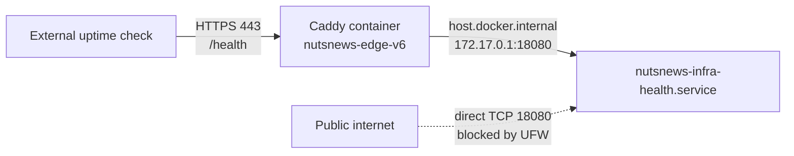

# NutsNews VPS Health Endpoint Network

This document defines the intended production network boundary for the
NutsNews infrastructure health endpoint. It is managed through
`ramideltoro/nutsnews-infra`; do not alter the listener, Caddy route, or UFW
rule directly on the VPS.

## Simple Summary

External uptime checks use `https://vps.nutsnews.com/health`. They reach Caddy
over HTTPS on port `443`; they do not connect to port `18080`.

Port `18080` is intentionally private. It is only the connection between the
Caddy container and the host health service, so a public connection to that
port must fail.

## Intermediate Summary

The health service is the systemd unit `nutsnews-infra-health.service`. Its
Ansible-managed configuration binds it only to `172.17.0.1:18080`, the current
Docker host-gateway address that Caddy resolves as `host.docker.internal`.

Caddy is on the `nutsnews-edge-v6` Docker network. UFW permits only that Docker
source range, `172.20.0.0/16`, to reach TCP `18080`; it does not permit public
sources. Caddy accepts the public HTTPS request and proxies `/health` across
that private host/Docker path.

## Expert Summary

`host.docker.internal` is provided to Caddy through Docker's `host-gateway`
mapping. On the production topology verified for this change, it resolves to
the host's `172.17.0.1` Docker bridge address. Caddy's own endpoint is on
`172.20.0.0/16`, which is the only UFW source range allowed to reach the
health listener. The listener must not use `0.0.0.0`, and port `18080` must
not be published by Compose or opened publicly in UFW.

This intentionally separates the public contract from the internal hop:

- Monitor availability at `https://vps.nutsnews.com/health` and require HTTP `200`.
- Treat a failed direct request to `http://vps.nutsnews.com:18080/health` as the expected security posture.
- After a protected Ansible apply, verify the listener, Caddy response, and UFW rule over read-only SSH before reporting success.
- When the health systemd unit changes, or a listener inspection finds a stale bind, protected apply restarts the service and asserts that `172.17.0.1:18080` is the only health listener.

If Docker gateway topology changes, do not widen the bind or firewall rule.
Update the Ansible configuration, focused validation, and this document in a
reviewed GitOps change, then run protected apply and re-verify the live path.

## Related Docs

- [NutsNews VPS Service Foundation](NUTSNEWS_VPS_SERVICE_FOUNDATION.md)
- [NutsNews Protected Ansible Apply Workflow](NUTSNEWS_PROTECTED_ANSIBLE_APPLY.md)
- [NutsNews Operations Portal v1](NUTSNEWS_OPERATIONS_PORTAL_V1.md)
