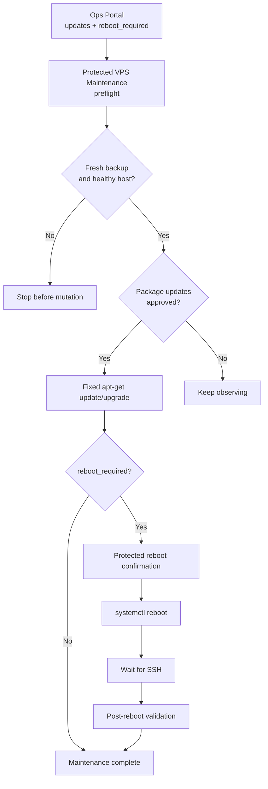

# NutsNews VPS Maintenance

This is the canonical operator guide for routine VPS package maintenance and
controlled reboots through `ramideltoro/nutsnews-infra`.

## Simple Summary

Use the `Protected VPS Maintenance` GitHub Actions workflow when the Ops Portal
shows pending package updates or `reboot_required=true`.

The workflow is manual, protected by the `production-vps` GitHub Environment,
and fixed-purpose. It can run preflight checks, apply package maintenance,
reboot the VPS, and validate the host after reboot. It cannot run arbitrary SSH
commands.

Do not run `apt upgrade` or `systemctl reboot` manually over SSH as routine
maintenance.

## Intermediate Summary

The workflow has four modes:

| Mode | What it does |
| --- | --- |
| `preflight` | Reads system state, failed units, reboot-required state, package update counts, backup freshness, Docker container health, local Caddy health, Ops Portal auth redirect, and public `/health`. |
| `package-maintenance` | Requires `confirm_package_maintenance=apply-package-maintenance`, then runs fixed `apt-get update` and `apt-get upgrade` commands after preflight passes. |
| `reboot` | Requires `confirm_reboot=reboot-vps.nutsnews.com`, records the boot ID, reboots through systemd, waits for SSH to return, and runs post-reboot validation. |
| `post-reboot` | Validates SSH reachability, systemd state, failed units, Docker, Caddy, Ops Portal auth redirect, backup status, public `/health`, changed boot ID when applicable, and absence of `/var/run/reboot-required`. |

The maintenance runner checks backup freshness before mutation. A maintenance
run fails if backups are missing, stale, misconfigured, failed, or overdue for
verification. Non-security package updates stay informational in the portal
until this workflow applies them.

## Expert Summary

The production mutation boundary remains GitOps and GitHub Environment based.
`Protected VPS Maintenance` attaches to `production-vps`, uses only
`NUTSNEWS_VPS_SSH_PRIVATE_KEY` and `NUTSNEWS_VPS_KNOWN_HOSTS`, connects as
`nutsnews_ops`, and streams the reviewed `scripts/vps_maintenance.py` runner
from the infra repository to `sudo /usr/bin/python3 -`.

The workflow has no free-form command input, no `bash -s` remote shell, no
repository dispatch trigger, no schedule, no pull-request trigger, and no push
trigger. Package maintenance and reboot require explicit confirmation choices
in addition to the protected Environment approval.

The runner prints sanitized JSON summaries only. It does not print secrets,
cookies, CSRF tokens, credentials, raw provider responses, backup repository
passwords, app runtime values, or full health response bodies.

## Normal Maintenance Procedure

1. Open the `Protected VPS Maintenance` workflow in `ramideltoro/nutsnews-infra`.
2. Run `maintenance_mode=preflight` with both confirmation inputs left at their defaults.
3. Review the sanitized summary:
   - `system.system_state` should be `running`.
   - `system.failed_units_count` should be `0`.
   - `backups.latest_status` should be `fresh`.
   - `backup_fresh` should be `true`.
   - local Caddy health and public `/health` should pass.
   - required Docker containers should be running and either `healthy` or `none`.
4. If updates should be applied, run `maintenance_mode=package-maintenance` with `confirm_package_maintenance=apply-package-maintenance`.
5. If the package run or Ops Portal reports `reboot_required=true`, run `maintenance_mode=reboot` with `confirm_reboot=reboot-vps.nutsnews.com`.
6. Confirm the reboot run reports a changed boot ID, public `/health` success, Ops Portal redirect success, no failed units, and `reboot_required=false`.

## Rollback And Failure Handling

Package rollback is not automated. If package maintenance breaks the application
but the host stays healthy, use the existing immutable app rollback path. If the
host itself is unhealthy, follow
[VPS Disaster Recovery](NUTSNEWS_VPS_DISASTER_RECOVERY.md).

Do not reverse database migrations as part of VPS package maintenance. Database
compatibility and rollback are handled by the release and migration runbooks.

If `preflight` fails because backups are stale or verification is overdue, fix
the backup path first with the protected backup workflows. If public health
fails before maintenance, treat the situation as an incident instead of a
routine update window.

## Validation Checklist

After a completed maintenance window, record:

- workflow run URL
- mode sequence used
- package update counts before and after
- reboot-required state before and after
- boot ID change for reboot runs
- backup freshness state
- Docker required container state
- Caddy local health
- Ops Portal auth redirect status
- public `/health` status

Keep sensitive values out of issue comments and reports.
