# VPS production runtime 500 incident

## Simple Summary

The VPS website failed because its deployment settings and database were not
ready for the same app release. The recovery restored the reviewed settings,
backed up and upgraded the real production database, and made the release gate
remember exactly which database it checked. The site is healthy again, and a
future mismatch now stops before replacing the working container.

## Intermediate Summary

On 2026-07-14, `https://vps.nutsnews.com/` returned HTTP 500 after the
production container was recreated without the runtime-safety and public
Supabase configuration required by the web application. The first durable fix
restored the reviewed Vercel-to-VPS mapping and changed Docker health from
`/healthz` to `/readyz`. That stricter gate then exposed the second problem:
production had not applied the migration contract required by the current
image.

The first protected migration succeeded against `nutsnews-staging` because the
application repository's managed “production” Supabase variables incorrectly
named that project. The image release gate therefore passed against staging,
while Vercel synchronization correctly rendered the separate live production
project on the VPS. The resulting image returned
`supabase_dependency_failed`; direct read-only PostgREST probes returned
`PGRST205` for `release_readiness` and `PGRST202` for the schema-contract RPC.

Recovery corrected the managed project identity and dedicated credentials,
created a fresh successful backup, and ran the protected forward migrations
against the actual production project. `/readyz`, `/`, and the public articles
API then returned HTTP 200. The final release contract carries the verified
Supabase project reference into the reviewed infrastructure manifest and
compares it with Vercel-synchronized runtime configuration before rendering or
Compose.

Operators must recover only through the reviewed Vercel-to-VPS sync and
Protected Ansible Apply. Do not edit the VPS environment file or restart the
container over SSH.

## Expert Summary

### Preserved observed evidence

- Visiting https://vps.nutsnews.com/ returns:
  “Application error: a client-side exception has occurred (see the browser console for more information).”
- Browser console:
  `11ttv01fstsdk.js:50 Error: An error occurred in the Server Components render. The specific message is omitted in production builds to avoid leaking sensitive details. A digest property is included on this error instance which may provide additional details about the nature of the error.`
- Network:
  `(index):1 Failed to load resource: the server responded with a status of 500`

### Correlated production evidence

A fresh read-only request at `2026-07-14T04:03:50Z` returned HTTP/2 500 from
`https://vps.nutsnews.com/` through Caddy. The response did not include a
request-ID or correlation-ID header. Its Server Components payload contained:

```text
digest: 3549087173
Sentry trace: c9bdcdc713c80a1fa14cc2f6cf43e6fb
```

At the same timestamp, the `nutsnews-app` server log recorded:

```text
Error [RuntimeSafetyError]: Runtime is not ready because its safety policy is invalid.
code: runtime_environment_invalid
digest: 3549087173
```

Caddy recorded the matching `GET /` as status 500 with a 14,414-byte response.
This proves the browser bundle only surfaced the server failure; it was not the
root cause.

A later uncached boundary probe confirmed the false-green condition directly:
`/healthz` returned HTTP 200 with the expected immutable release identity, while
`/readyz` returned HTTP 503 with `runtimeEnv: invalid` and
`code: runtime_environment_invalid`.

The production and staging containers used the same immutable image:

```text
image: ghcr.io/ramideltoro/nutsnews@sha256:ae5efea8e03590e37b4565df57dc2e9616fc1057e939200f329a0d0173cdcceb
source commit: 4a9b727b260f1380f1529524b8a01ba0b0caaac2
build ID: 29245347761-1
```

The production environment lacked the runtime policy, data identity, Supabase
project identity, public Supabase URL, and public anonymous-key names. The
staging environment on the same host and image had those names. This rules out
an incompatible image, Caddy routing failure, and generic Docker availability
as the primary cause.

The deployed infrastructure apply state was:

```text
infra commit: e17795f8534c5c972fe44dacac23e8eaaec19e9f
workflow: Protected Ansible Apply
run: 29268383268
recorded at: 2026-07-13T16:55:56Z
```

The successful workflow log shows `sync_vercel_production=false` and a skipped
“Fetch and diff reviewed Vercel Production variables” step. Ansible then
recreated the production container, while its shallow `/healthz` Compose check
continued to report healthy. No secret values were inspected or recorded in
this investigation.

### Protected recovery attempt and compatibility rollback

Infrastructure pull request `ramideltoro/nutsnews-infra#157` restored the
reviewed production environment contract and changed the managed health gate to
`/readyz`. Protected check run `29306095984` passed. Protected apply run
`29306171719` then failed safely at the production container-health assertion;
the release-verification steps were skipped and temporary credentials were
removed.

The strict gate exposed two additional release-compatibility facts that the old
`/healthz` check had hidden:

- The current image received a valid production/live runtime policy, but
  `/readyz` returned `runtime_identity_invalid` because production did not
  materialize the staging-only OCI attestation fields.
- A read-only PostgREST probe returned `PGRST202` for
  `nutsnews_migration_schema_contract`, proving that the current image depends
  on migration `20260713000000_add_migration_schema_contract.sql` while the
  production database does not yet expose that function. The preceding image
  also depends on the absent `release_readiness` table (`PGRST205`).

Database migration was outside the authorized recovery scope. The safe GitOps
recovery therefore pins production to the most recent reviewed image whose
`/readyz` has no database dependency:

```text
image: ghcr.io/ramideltoro/nutsnews@sha256:c4fea9e3d468df1bad3cc2ba9e84bb4361d7ea580be28e3466829acbf64c9ff8
source commit: 9e5280398a73408593b27eaf49f324e6baaf5dbc
build ID: 29217842808-1
```

This rollback keeps the corrected environment sync and the strict `/readyz`
gate. The migration-dependent image must not be promoted again until its
database migration is separately reviewed, applied, and verified through the
owned Supabase migration workflow.

The subsequent approved follow-up closes that release gap without changing the
host manually. The application repository adds the protected production
Supabase workflow, a fresh-backup identity/freshness gate, a pre-migration
schema snapshot, and a direct post-migration contract check. Image metadata and
the cross-repository promotion payload now include both the compiled migration
head and the rollback-compatible schema marker. The infrastructure repository
records and validates those values, materializes the full OCI runtime identity
for production, and refuses promotion unless the schema contract is complete.

The recovery completed through infrastructure pull request `#158` (merge
commit `b96409f7522b329570c029bffe9bd997d1a42804`). Protected check run
`29306974751` and protected apply run `29307039328` both passed with production
sync enabled. Post-apply verification confirmed the reviewed digest, healthy
Docker state, all required environment names, and HTTP 200 responses from
`/readyz`, `/`, `/api/articles?page=0`, and `/healthz`. The app log contained
only normal startup output; the prior runtime-safety exception and digest did
not recur.

### Completed production migration and identity correction

The initial protected database workflow completed against the project that was
then labeled production in GitHub, but a later runtime comparison proved that
project was actually `nutsnews-staging`. No secret values were printed. The
authoritative project list and the deployed runtime identity showed the
mislabeling directly.

The managed repository variables and dedicated production anon/service-role
credentials were corrected without logging values. Fresh production backup run
`29313461483` passed. Protected migration run `29313510544` then applied the
reviewed forward-only migration set to the actual live project and verified:

```text
legacy schema version: 20260712170000
migration head: 20260713000000
catalog fingerprint match: true
```

The already deployed immutable image became ready without a host edit or
manual restart. Read-only checks returned HTTP 200 for `/readyz`, `/`, and
`/api/articles?page=0`; Docker reported the reviewed digest healthy. Protected
Ansible Apply run `29314521854` subsequently completed successfully and
verified the same runtime identity through the controlled workflow.

Application pull request `#200` and infrastructure pull request `#161` make the
Supabase project reference part of the cross-repository release contract. The
infrastructure guard compares the reviewed release project with the merged
Vercel runtime map under `no_log` before materialization. Infrastructure pull
request `#162` separately distinguishes the infrastructure deployment target
`production-vps` from the immutable image build target `vps`, avoiding a false
failure in final public-health verification.

The final guarded rollout is recorded as:

```text
application source commit: c848fabc5bd8312b1b45c81d1b2d17efc20cf478
container build run/build ID: 29314730458 / 29314730458-1
immutable image digest: sha256:8aadaeb300225b291f7685537c2a3bd576f6659564c05e1e8949fd05e10bf8bb
release promotion run: 29315097692
infrastructure promotion PR/merge: #163 / d2526bcb3d3f7496bd534b719ec7d20d16a9a694
protected apply run: 29315200287
```

All final runs completed successfully. At `2026-07-14T07:43:18Z`, an uncached
root request returned HTTP/2 200 through Caddy and again had no request or
correlation ID header. `/readyz` and `/api/articles?page=0` also returned 200.
The health identity reported source `c848fabc5bd8312b1b45c81d1b2d17efc20cf478`,
build `29314730458-1`, and image target `vps`; Docker reported the exact reviewed
digest running and healthy. The live RPC returned the expected legacy marker
and migration head with a matching fingerprint. Recent application logs
contained only normal Next.js startup output and no recurrence of digest
`3549087173`, `runtime_environment_invalid`, or `supabase_dependency_failed`.

### Required production contract

The infrastructure preflight requires these names for an enabled production
runtime:

```text
NUTSNEWS_RUNTIME_ENV
NUTSNEWS_SIDE_EFFECTS_MODE
NUTSNEWS_DATA_ENVIRONMENT
NUTSNEWS_SUPABASE_CREDENTIALS_ENV
NUTSNEWS_SUPABASE_PROJECT_REF
NUTSNEWS_PRODUCTION_SUPABASE_PROJECT_REF
NUTSNEWS_PUBLIC_SUPABASE_URL
NUTSNEWS_PUBLIC_SUPABASE_ANON_KEY
```

The four policy values must resolve to the reviewed production/live identity.
The two project references must match, and the public Supabase URL must identify
that same project. Values remain in the protected synchronization path and must
never be printed in logs or documentation.

### Request and deployment flow

```mermaid
flowchart TD
  subgraph Before[Failure path]
    applyFalse[Protected apply with sync false] --> incomplete[Incomplete production env rendered]
    incomplete --> shallow[Compose checks healthz]
    shallow --> healthy[Container reported healthy]
    request[GET vps.nutsnews.com] --> rsc[RSC reads feed]
    rsc --> policy[Runtime policy rejects missing identity]
    policy --> error500[HTTP 500 and digest 3549087173]
  end

  subgraph After[Guarded path]
    reviewed[Reviewed Vercel Production mapping] --> merge[Merge with protected VPS-only inputs]
    merge --> contract{Runtime contract complete and coherent?}
    contract -- no --> stop[Fail before materialization]
    contract -- yes --> ansible[Ansible renders managed env]
    ansible --> ready[Compose checks readyz]
    ready --> serve[Serve public traffic only when ready]
  end

  subgraph Recovery[Compatibility recovery]
    strict[readyz exposes missing database contract] --> stopRelease[Reject incompatible image]
    stopRelease --> rollback[GitOps pin database-independent image]
    rollback --> verify[Verify readyz, home, and articles]
  end

  subgraph DurableRelease[Durable migration and release path]
    backup[Fresh successful Supabase backup] --> migration[Protected forward migration]
    migration --> dbContract[Verify migration head and catalog fingerprint]
    dbContract --> imageGate[Image release checks live database contract]
    imageGate --> projectIdentity[Carry verified Supabase project identity]
    projectIdentity --> gitops[GitOps records OCI, schema, and project identity]
    gitops --> productionReady[Protected apply requires readyz]
  end
```



### Repository ownership and changes

- `ramideltoro/nutsnews` owns the Next.js application, fail-closed runtime
  policy, `/readyz`, protected Supabase migration workflow, and image-to-schema
  release gate.
- `ramideltoro/nutsnews-infra` owns the protected sync, Ansible render,
  Compose health check, Caddy route, and durable preflight fix.
- `ramideltoro/nutsnews-docs` owns this cross-repository incident and recovery
  record.

### Controlled recovery and deployment

After the infrastructure change is reviewed:

1. Open a normal `nutsnews-infra` pull request and let all infrastructure,
   Ansible, Compose, and security checks pass.
2. Merge the reviewed pull request. Do not apply from an unreviewed branch.
3. Run `Protected Ansible Apply` in `check` mode with
   `sync_vercel_production=true`, `confirm_apply` blank, and unrelated optional
   services left at their current reviewed settings.
4. Review the name-only Vercel/VPS diff and Ansible recap. Confirm the required
   names are selected without printing values.
5. Run the workflow in `apply` mode with
   `sync_vercel_production=true` and `confirm_apply=vps.nutsnews.com`, then pass
   the protected `production-vps` approval boundary.
6. Verify read-only that the container uses the reviewed immutable digest, its
   environment contains the required names, and Docker reports healthy through
   `/readyz`.
7. Run uncached checks for `/readyz`, `/`, and
   `/api/articles?page=0`. Expect readiness and the public route to return 200,
   and confirm no new runtime-policy digest appears in application logs.

Do not manually patch `/etc/nutsnews/nutsnews-app.env`, restart containers,
change Caddy, or deploy directly over SSH.

### Acceptance criteria

- Missing or empty required production configuration fails before Ansible
  materializes an environment file or invokes Compose.
- Staging/mismatched production policy values fail before materialization.
- Mismatched Supabase project identity or URL fails before materialization.
- A complete fixture renders valid Compose configuration.
- Managed production and staging Compose health checks target `/readyz`.
- The controlled production check/apply with synchronization enabled restores
  `/readyz`, `/`, and the public articles API to HTTP 200.
- The running release identity matches the final reviewed digest, source
  commit, build ID, migration head, schema marker, and Supabase project
  reference recorded above.
- A migration-dependent digest cannot dispatch infrastructure promotion unless
  production reports its exact migration head, legacy marker, and matching
  catalog fingerprint.
- Production materializes the deployed digest, expected source/build,
  configuration generation, and expected schema marker from the reviewed
  infrastructure manifest.

### Risks, mitigations, and rollback

The stricter preflight may block an apply that previously proceeded with an
incomplete map. That is intentional: repair the reviewed Vercel Production
source or protected VPS-only input, then rerun check mode. Do not bypass the
guard.

`/readyz` evaluates runtime policy, Supabase access, and the schema contract, so
Docker may mark the app unhealthy during a real dependency or migration
failure. This prevents false-green public releases. Diagnose the dependency or
schema state; do not switch health back to `/healthz` merely to obtain a green
container.

To roll back the code change, revert the infrastructure pull request through
the normal GitOps flow and run Protected Ansible Apply check/apply. To roll back
configuration, restore the last-known-good values in Vercel Production, review
the name-only sync diff, and apply through the same protected workflow. SSH
remains read-only throughout.
