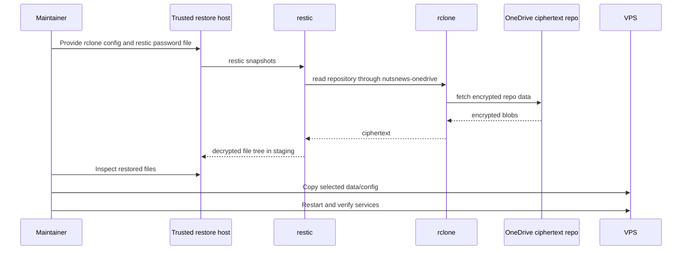

# NutsNews VPS Restore

This is the restore runbook for encrypted VPS restic backups.

The short version: restore to a staging directory first, inspect it, then copy only what you actually need. Restores are surgery, not confetti.

## Easy Summary

Backups are useful only if they restore. Otherwise they are emotional support files with timestamps.

To restore, you need:

- restic
- rclone
- the `nutsnews-onedrive` rclone config
- the restic repository password
- a trusted machine or replacement VPS

The OneDrive folder is not directly readable because restic encrypted everything before rclone uploaded it. That is good. It also means losing the restic password is bad. Keep the password somewhere outside the VPS.

## Intermediate Summary

The restic repository is:

```text
rclone:nutsnews-onedrive:nutsnews-backups/vps
```

The restore flow is:

1. Prepare restic and rclone on a trusted host.
2. Set `RCLONE_CONFIG`, `RESTIC_REPOSITORY`, and `RESTIC_PASSWORD_FILE`.
3. List snapshots.
4. Restore the chosen snapshot to a staging directory.
5. Inspect restored files.
6. Copy selected data/config into place.
7. Restart services.
8. Verify the Ops Portal and backup verification workflow.

Do not blindly restore `/etc` over a running server like a digital leaf blower. Stage first.

## Expert Summary

The VPS backup contains both runtime data and host restore clues:

- `/opt/nutsnews`
- `/etc/nutsnews`
- NutsNews systemd units and timers
- selected service configs managed by Ansible

The best restore shape is still GitOps-first:

- rebuild or repair the host with Ansible
- restore data and private config from restic
- reconcile any restored config drift back into the infra repo
- run validation

Restic is the data recovery path, not a replacement for source-controlled infrastructure.

## Restore Flow



## Prepare A Restore Environment

Install restic and rclone on a trusted host.

Create local files:

```text
/path/to/rclone.conf
/path/to/restic-password
```

Then export:

```bash
export RCLONE_CONFIG=/path/to/rclone.conf
export RESTIC_REPOSITORY=rclone:nutsnews-onedrive:nutsnews-backups/vps
export RESTIC_PASSWORD_FILE=/path/to/restic-password
```

Confirm access:

```bash
restic snapshots
restic ls latest
restic check --read-data-subset=5%
```

## Restore To Staging

Use a staging directory. Always.

```bash
sudo install -m 0700 -d /tmp/nutsnews-restore
sudo -E restic restore latest --target /tmp/nutsnews-restore
```

Inspect:

```bash
sudo find /tmp/nutsnews-restore -maxdepth 3 -type d | sort
sudo ls -la /tmp/nutsnews-restore/opt/nutsnews
sudo ls -la /tmp/nutsnews-restore/etc/nutsnews
sudo find /tmp/nutsnews-restore/etc/systemd/system -maxdepth 1 -name 'nutsnews-*' -print
```

## Restore Selected Data

For app/runtime data:

```bash
sudo rsync -aHAX --numeric-ids \
  /tmp/nutsnews-restore/opt/nutsnews/data/ \
  /opt/nutsnews/data/
```

For private config:

```bash
sudo rsync -aHAX --numeric-ids \
  /tmp/nutsnews-restore/etc/nutsnews/ \
  /etc/nutsnews/
sudo chmod 0700 /etc/nutsnews
sudo find /etc/nutsnews -type f -exec chmod 0600 {} \;
```

Use judgment. If the infra repo now manages a config file differently, prefer the repo and only restore the secret/data portion that cannot be recreated.

## Restore Test Procedure

Run this after initial setup and periodically after meaningful changes:

1. Run the `Run VPS Backup` workflow.
2. Run the `Verify VPS Backup` workflow.
3. On a trusted restore host, run `restic snapshots`.
4. Restore `latest` to `/tmp/nutsnews-restore`.
5. Confirm these paths exist:
   - `/tmp/nutsnews-restore/opt/nutsnews`
   - `/tmp/nutsnews-restore/etc/nutsnews`
   - `/tmp/nutsnews-restore/etc/systemd/system`
6. Confirm `/opt/nutsnews/data` is present if app data exists in production.
7. Run `restic check --read-data-subset=5%`.
8. Record the snapshot ID, date, and result.
9. Delete the staging directory when finished.

Restore tests are the adult in the room. They are also how we find out that the backup is a backup instead of a very organized wish.

## After Restore

Reload systemd if unit files changed:

```bash
sudo systemctl daemon-reload
```

Check services:

```bash
systemctl status nutsnews-ops-portal-collector.timer --no-pager
systemctl status nutsnews-restic-backup.timer --no-pager
```

Check the portal:

```bash
curl -fsS http://127.0.0.1:8080/healthz
curl -fsS http://127.0.0.1:8080/data/status.json
```

Then run:

- `Run VPS Backup`
- `Verify VPS Backup`

## Related Docs

- [VPS Backups](NUTSNEWS_VPS_BACKUPS.md)
- [VPS Disaster Recovery](NUTSNEWS_VPS_DISASTER_RECOVERY.md)
- [Protected Ansible Apply](NUTSNEWS_PROTECTED_ANSIBLE_APPLY.md)
- [Operations Portal v1](NUTSNEWS_OPERATIONS_PORTAL_V1.md)
