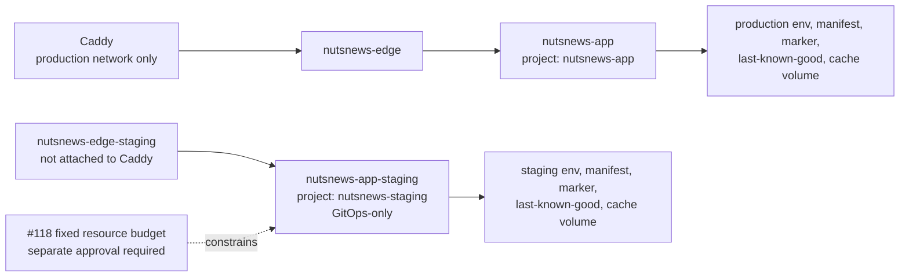

# NutsNews VPS Runtime Environment Isolation

NutsNews has separate production and staging runtime identities. Production
retains its existing route and reviewed image; staging remains deliberately
disabled even though the VPS capacity decision is now recorded.

## When To Use This

Use this guide when reviewing the NutsNews Compose/Ansible app layer and the
fixed staging deployment path for
[nutsnews-infra #117](https://github.com/ramideltoro/nutsnews-infra/issues/117).
It does not itself authorize a live staging apply.

## Simple Explanation

Production and staging use different Docker projects, files, networks,
containers, and writable cache volumes. Production keeps its current identity,
so the staging deployment path cannot move the live route or swap its image
digest.

Staging has a fixed-purpose, approval-gated deployment path. It still cannot
receive a Caddy route or public traffic. [The #118 capacity contract](NUTSNEWS_VPS_STAGING_CAPACITY.md)
defines its hard CPU, memory, PID, log, disk-preflight, and test-traffic
budget. See [Immutable Staging Deployment](NUTSNEWS_VPS_STAGING_DEPLOYMENT.md)
for the candidate trust boundary and separate live-apply evidence.

Any configured application image must be a reviewed immutable reference:

```text
ghcr.io/ramideltoro/nutsnews@sha256:<64 lowercase hexadecimal characters>
```

Mutable tags, including `latest`, fail before Compose materializes a runtime.

## Intermediate Explanation

| Runtime item | Production | Staging |
| --- | --- | --- |
| Compose project | `nutsnews-app` | `nutsnews-staging` |
| Container | `nutsnews-app` | `nutsnews-app-staging` |
| Docker network | `nutsnews-edge` | `nutsnews-edge-staging` |
| Caddy access | Attached only to this network | Not attached; no route in #119 |
| App directory | `/opt/nutsnews/apps/nutsnews` | `/opt/nutsnews/apps/nutsnews-staging` |
| Env file | `/etc/nutsnews/nutsnews-app.env` | `/etc/nutsnews/nutsnews-staging-app.env` |
| Release manifest | `/opt/nutsnews/ops/apps/production/release.json` | `/opt/nutsnews/ops/apps/staging/release.json` |
| Apply marker | `/opt/nutsnews/ops/last-app-apply.json` | `/opt/nutsnews/ops/apps/staging/last-apply.json` |
| Last-known-good record | `/opt/nutsnews/ops/apps/production/last-known-good.json` | `/opt/nutsnews/ops/apps/staging/last-known-good.json` |
| Writable cache volume | `nutsnews-app-cache` | `nutsnews-app-staging-cache` |
| State | Existing protected production behavior | Fixed-purpose `staging-vps` workflow only; no route |

The existing protected workflow continues to consume reviewed production release
state and production runtime secrets from `NUTSNEWS_APP_ENVS_JSON`. The separate
staging workflow consumes only the `staging-vps` Environment after its
no-secret preflight succeeds. It cannot configure a staging route, TLS, public
access boundary, or production promotion.

## Expert Explanation

Ansible allows exactly two environment keys: `production` and `staging`. The
default selected environment is production. Each selected environment gets its
own Compose file, root-only env file, release manifest, apply marker,
last-known-good record, project name, Docker network name and alias, and named
writable cache volume.

The per-environment Compose command passes `--project-name` explicitly. Its
`--remove-orphans` scope is therefore that project only; the task has no
`down`, `stop`, or remove command against another environment. Regression
coverage renders both Compose configurations, proves a staging-only Ansible
check does not target production application paths or containers, and verifies
that a staging-only input change leaves production runtime renders byte-for-byte
unchanged.

Caddy has a narrower trust boundary than the runtime model: it joins only
`nutsnews-edge`, the production network. Its app route templates read only the
production configuration. The staging network is not attached to Caddy, so a
staging service-name collision cannot become the production upstream.

On a successful enabled deployment, the environment release manifest becomes
that environment's last-known-good record. Release manifests and markers record
the environment, project, image/review metadata, container, network, cache
volume, and route state—never application secret values.

## Runtime Topology



## Operational Rules

1. Use only the immutable staging workflow. Do not add a manual deploy,
   hostname, TLS, access boundary, data access, Caddy route, or production
   promotion behavior outside its reviewed GitOps contract.
2. Never use a mutable image tag. Review the exact GHCR digest through normal
   GitOps review before the environment can materialize.
3. Use protected check mode before any approved production apply. Do not SSH to
   mutate runtime files or invoke Compose directly on the VPS.
4. Treat manifests and last-known-good records as deployment evidence, not as a
   substitute for the later qualification and promotion gates.

## Local Verification

From `ramideltoro/nutsnews-infra`:

```bash
python3 ansible/tests/validate_nutsnews_environment_isolation.py
cd ansible && ansible-playbook playbooks/bootstrap.yml --syntax-check
cd ansible && ansible-lint .
```

The isolation regression renders both Compose configurations, checks all
identity/path separation, rejects mutable inputs for both environment names,
and checks that staging-only rendering cannot change production artifacts.

## Current Blocker And Follow-Up Work

Issue #118 records a same-host go decision with enforceable application CPU,
memory, PID, and log ceilings. The fixed-purpose deployment workflow consumes
that contract, but no live staging apply has occurred merely by merging its
infrastructure PR. A separately approved dispatch and the completion evidence
in [Immutable Staging Deployment](NUTSNEWS_VPS_STAGING_DEPLOYMENT.md) remain
required. Public routing, TLS/access control, and production promotion/rollback
remain intentionally out of scope.

## Related Docs

- [NutsNews Protected Ansible Apply Workflow](NUTSNEWS_PROTECTED_ANSIBLE_APPLY.md)
- [NutsNews VPS Service Foundation](NUTSNEWS_VPS_SERVICE_FOUNDATION.md)
- [NutsNews VPS Same-Host Staging Capacity Budget](NUTSNEWS_VPS_STAGING_CAPACITY.md)
- [NutsNews Immutable Staging Deployment](NUTSNEWS_VPS_STAGING_DEPLOYMENT.md)
- [NutsNews Dual-Target Web Deployment](NUTSNEWS_DUAL_TARGET_WEB_DEPLOYMENT.md)
