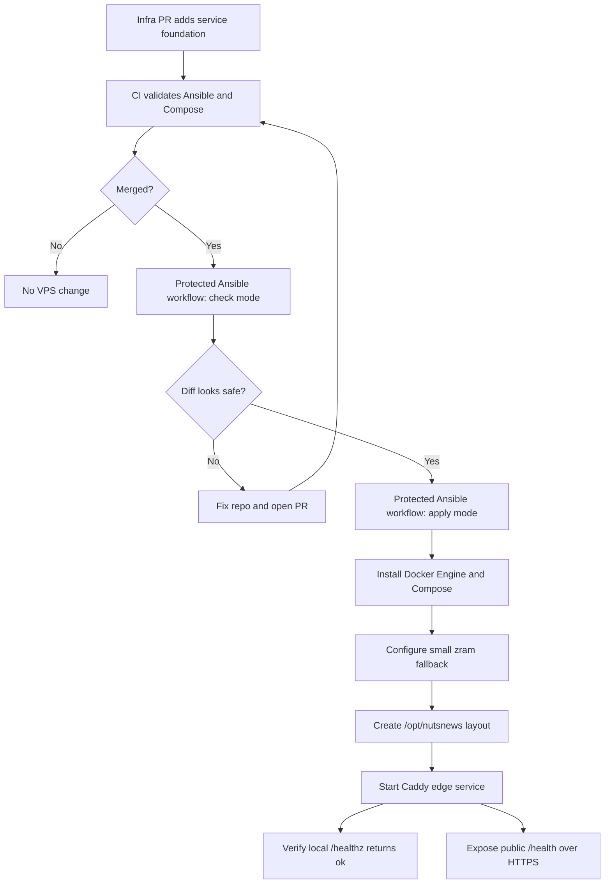
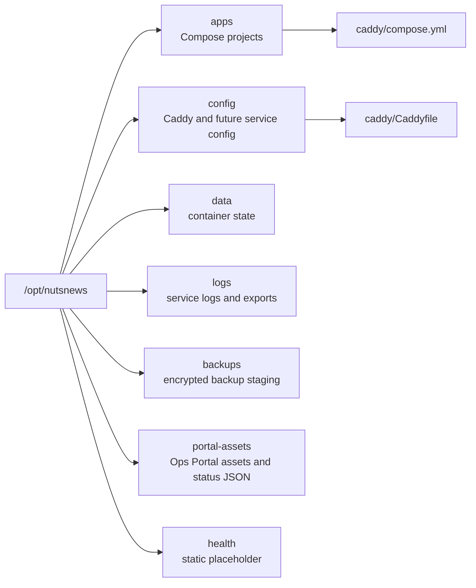
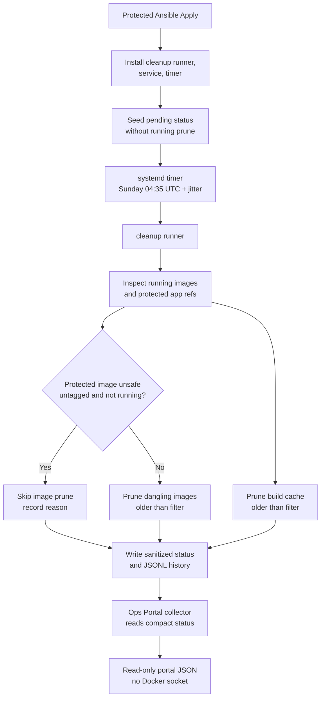
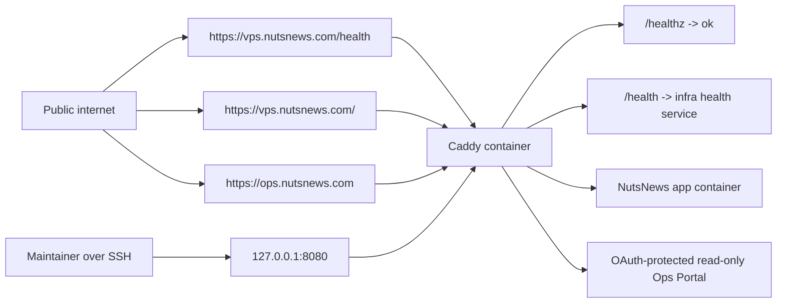
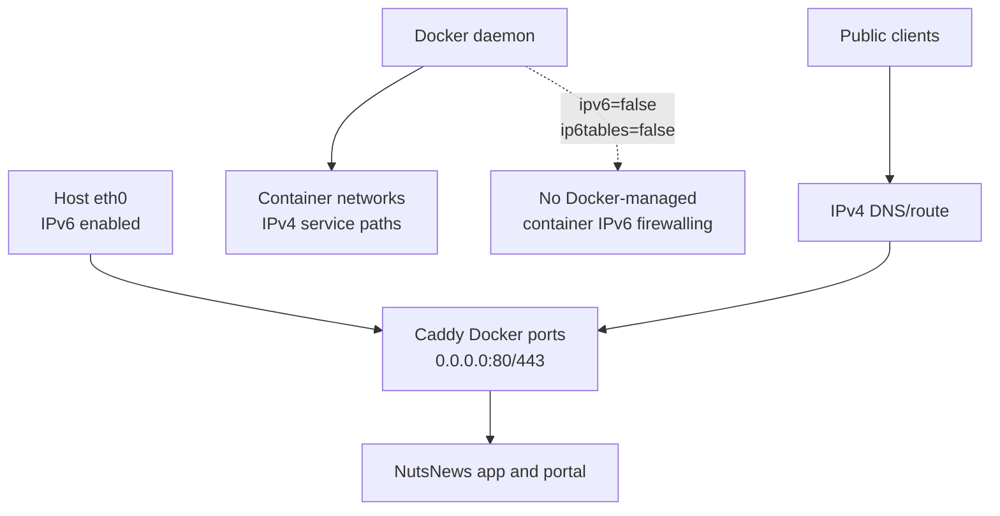
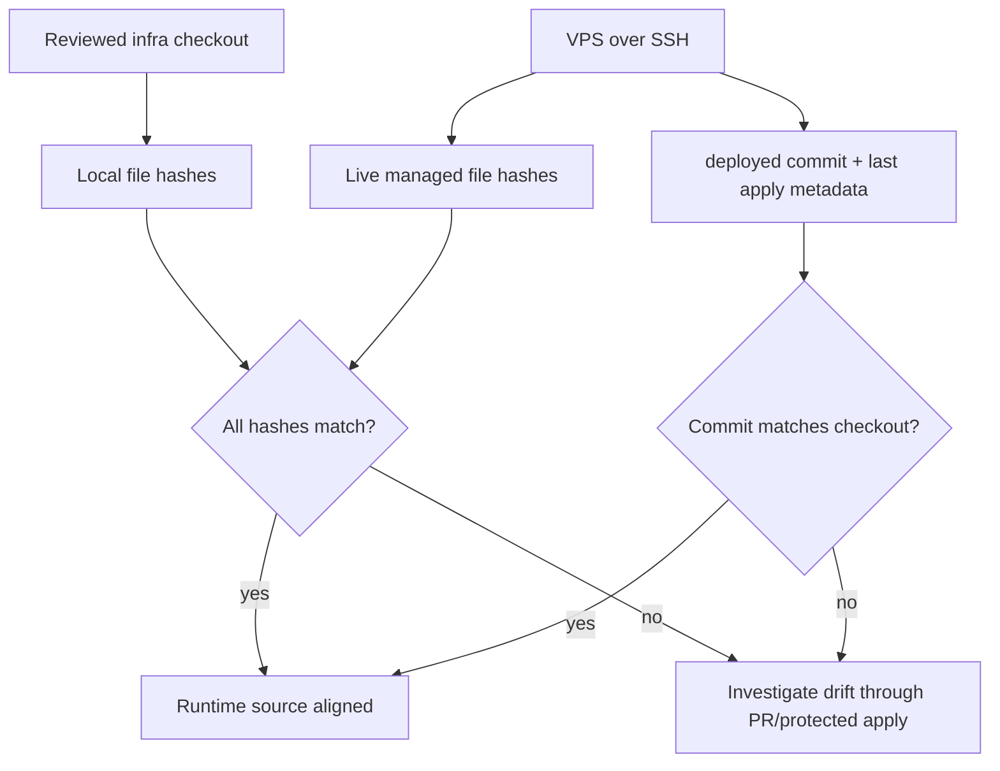

# NutsNews VPS Service Foundation

This explains the next layer in the NutsNews VPS platform: Docker Engine, Docker Compose, the `/opt/nutsnews` runtime layout, a small zram fallback, Caddy, public infrastructure health, the protected Ops Portal route, Caddy rate limiting, and the GitOps-controlled NutsNews app foundation.

## Easy Summary

The VPS now gets a small container foundation managed by Ansible. The playbook installs Docker Engine and Docker Compose from Ubuntu packages, creates the standard `/opt/nutsnews` directory layout, configures a small compressed-memory zram fallback, and starts Caddy through Compose.

The zram fallback is intentionally small: `/dev/zram0`, 1536 MiB of virtual compressed swap, `vm.swappiness=10`, and no changes to Docker memory limits. It is there to buy time during transient deploy, package upgrade, backup verification, or app spikes. It is not a capacity plan.

Caddy now has four jobs. It exposes `https://vps.nutsnews.com/health` publicly for Better Stack, can route the digest-pinned NutsNews app on `https://vps.nutsnews.com`, serves the Google OAuth-protected Ops Portal at `https://ops.nutsnews.com`, and keeps `127.0.0.1:8080` available for local health checks and SSH tunnel fallback. It also enforces free Caddy-based rate limiting before traffic reaches health, portal, API, auth, admin, ops, or app handlers.

Issue [nutsnews-infra #67](https://github.com/ramideltoro/nutsnews-infra/issues/67) prepared the app deployment plumbing and staged health route. Issue #93 reviews the next promotion for only the `vps.nutsnews.com` public app route. `nutsnews.com` remains on Vercel.

## Intermediate Summary

The infra repo adds a new Ansible role:

```text
ansible/roles/vps_service_foundation
```

That role runs after the existing VPS baseline role. It manages:

- Docker Engine from Ubuntu packages
- Docker Compose v2 from Ubuntu packages
- Docker daemon log limits for cheap-VPS disk sanity
- a GitOps-managed Docker image and build-cache cleanup timer with conservative age filters
- explicit Docker IPv6 defaults: host IPv6 remains enabled, but container IPv6 and Docker-managed `ip6tables` are disabled until a reviewed dual-stack rollout
- `systemd-zram-generator` with a small `/dev/zram0` fallback swap device
- a non-login Caddy runtime user
- `/opt/nutsnews/apps`
- `/opt/nutsnews/config`
- `/opt/nutsnews/data`
- `/opt/nutsnews/logs`
- `/opt/nutsnews/backups`
- `/opt/nutsnews/portal-assets`
- `/opt/nutsnews/health`
- a Compose-managed Caddy edge service
- a pinned Caddy build with the free `mholt/caddy-ratelimit` module
- generated Caddy rate-limit config under `/opt/nutsnews/config/caddy/rate-limits`
- the first read-only operations portal surface and local status collector
- a Better Stack-compatible `/health` endpoint for infrastructure health
- a disabled app Compose project that accepts only an immutable GHCR digest
- separately controlled health-only staged and public app routes

The protected Ansible workflow still defaults to check mode. In real apply mode, the service role can start Caddy and verify `http://127.0.0.1:8080/healthz`. In check mode, it skips Docker Compose mutation because pretending to start containers without Docker being installed yet is how automation starts gaslighting everyone.

Fresh-host check mode has one classic trick: it says "sure, Docker would be installed" without actually creating the `docker` service, `docker` group, Caddy user, or `/opt/nutsnews` directories. Very impressive. Very resume-coded. The service foundation role now treats Docker package installation as the check-mode preview and skips runtime-dependent Docker/Caddy tasks until apply mode creates the real host state.

The first real Caddy apply found the next layer of "computers are technically correct, which is the most annoying kind of correct." Compose reported that it started the container, but `/healthz` refused connections. The fix makes the Caddy container more explicit about its runtime: Caddy binds inside the container on `0.0.0.0`, gets writable `/config`, `/data`, `/run`, and `/tmp` locations while keeping the root filesystem read-only, and the Ansible role now prints `docker compose ps` plus Caddy logs if health still fails.

Then the container taught us that hardening can go full gym-bro and become unusable. The official Caddy image carries a file capability on `/usr/bin/caddy`; combining that with `cap_drop: ALL`, `no-new-privileges`, and a non-root UID made Docker refuse to exec the binary at all. The fix keeps the container non-root and read-only, but grants only `NET_BIND_SERVICE` and removes the specific `no-new-privileges` flag that blocked startup.

The app and staging-access Compose projects still use `no-new-privileges`, but they use Docker's supported `no-new-privileges=true` form. Do not reintroduce the deprecated colon separator in managed Compose files.

## Expert Summary

This layer creates the runtime substrate and one narrow production route. The design is intentionally conservative:

- Caddy publishes public ports `80` and `443` for `vps.nutsnews.com`.
- Caddy binds those public Docker-published sockets on IPv4 (`0.0.0.0`) while the hostname has no production AAAA record.
- The public host always keeps `/health` on the infrastructure health service.
- The reviewed app route can proxy all other `vps.nutsnews.com` paths to the digest-pinned NutsNews app container.
- Caddy exposes `ops.nutsnews.com` publicly behind the Ops Portal Google OAuth gateway.
- Caddy keeps the loopback listener available on host `127.0.0.1:8080`.
- Caddy applies rate limits keyed by client remote host, with IPv6 clients grouped by `/64`.
- UFW allows the Caddy Docker network to reach the host health service on TCP `18080`.
- `/dev/zram0` provides a 1536 MiB compressed-memory swap fallback with `vm.swappiness=10`.
- Caddy admin API is disabled.
- Caddy automatic HTTPS is enabled for the public hostname.
- The container runs as a dedicated numeric non-root user.
- The container uses `read_only`, dropped capabilities plus only `NET_BIND_SERVICE`, memory limits, PID limits, and small tmpfs mounts.
- Docker JSON log files are capped to avoid slow disk doom.
- Existing Docker memory limits stay in place. zram is a resilience fallback, not permission for containers to grow.
- No secrets, environment files, app credentials, or production tokens are introduced.
- Compose validation runs in CI before the PR can merge.
- Ansible syntax and lint checks cover the role wiring before apply.
- App release state is reviewed in Git, while secret values remain in the protected `production-vps` Environment.
- Mutable app references such as `latest` are rejected whenever the app is enabled.

The point is to establish a stable convention now so future services have somewhere predictable to live. The platform should grow in layers, not in one heroic blob of YAML that future operators study like a cursed family recipe.

## Zram Fallback Model

The production VPS uses `systemd-zram-generator` from Ubuntu packages. Ansible renders:

```text
/etc/systemd/zram-generator.conf
/etc/sysctl.d/90-nutsnews-zram.conf
```

Current production sizing:

| Setting | Value | Why |
| --- | --- | --- |
| Device | `/dev/zram0` | Temporary compressed-memory swap, recreated by systemd |
| Size | `1536 MiB` | Small 1-2 GiB fallback on a 10 GiB RAM VPS |
| Compression | `lz4` | Fast compression for short pressure spikes |
| Swap priority | `100` | Prefer the managed zram device if swap is needed |
| Swappiness | `10` | Keep normal operation in RAM; use swap only under pressure |

Expected normal usage is `0 B` or very low. Any sustained or non-trivial usage means something is leaning on the fallback and should be investigated. Do not respond by removing container memory limits or simply increasing zram size. First check what changed: recent deploys, package upgrades, backup verification, app rollout, process memory rankings, Docker restart loops, and kernel OOM logs.

If swap climbs:

1. Check the Ops Portal resource and alert sections.
2. Inspect top memory processes and Docker container health.
3. Check kernel logs for OOM evidence.
4. Review recent GitOps apply, deploy, backup, and package activity.
5. Fix the workload or limit before changing zram sizing.

## Service Foundation Flow



## Runtime Layout



This layout is boring on purpose. "Where does this service put its files?" should not require a séance with shell history.

## Docker Cleanup

### Simple

The VPS now has a scheduled Docker cleanup job managed by Ansible. It runs from
`nutsnews-docker-cleanup.timer`, not from manual SSH commands. The default
schedule is Sunday at `04:35 UTC` with a `30min` randomized delay.

The cleanup is intentionally conservative. It prunes build cache older than
`168h` and unused dangling images older than `168h`. It does not prune Docker
volumes, containers, or all tagged images.

### Intermediate

The cleanup runner is installed at:

```text
/usr/local/bin/nutsnews-docker-cleanup
```

It writes its latest sanitized status to:

```text
/opt/nutsnews/portal-assets/data/docker-cleanup-status.json
```

It also appends bounded JSONL history to:

```text
/opt/nutsnews/logs/docker-cleanup/cleanup.jsonl
```

Before pruning, the runner reads the current production and staging app image
refs plus each environment's last-known-good digest ref from the Ansible-managed
environment model. It also inspects the images used by currently running
containers. If a protected image is present only as an unsafe untagged,
non-running image, the image-prune phase is skipped and the status records
`protected_untagged_image_present`.

The protected apply workflow seeds an `installed_pending_first_run` status file
when the timer is first installed. That gives the Ops Portal honest visibility
before the first scheduled prune runs, without forcing a prune during apply.

### Expert

The unit runs as root because Docker cleanup requires the local Docker socket,
but the public Ops Portal still never receives that socket. The service is a
oneshot systemd unit with hardening such as `NoNewPrivileges=true`,
`ProtectSystem=strict`, `PrivateTmp=true`, `RestrictAddressFamilies=AF_UNIX`,
and writable paths limited to the portal data directory and Docker cleanup log
directory. The command runner uses argument vectors, not shell strings.

The cleanup deliberately avoids `docker system prune`, `docker volume prune`,
and `docker container prune`. Build cache cleanup uses:

```text
docker builder prune --force --filter until=168h
```

Image cleanup uses:

```text
docker image prune --force --filter until=168h
```

That image command prunes dangling unused images only. It is less aggressive
than `docker image prune --all`, but it fits the current risk profile: Docker
had reclaimable build cache and dangling image headroom, while the root disk was
not under emergency pressure. Broader cleanup should be a separate reviewed
policy change.



Operators should verify cleanup through status and systemd:

```bash
systemctl list-timers nutsnews-docker-cleanup.timer
systemctl status nutsnews-docker-cleanup.timer
systemctl status nutsnews-docker-cleanup.service
sudo python3 -m json.tool /opt/nutsnews/portal-assets/data/docker-cleanup-status.json
sudo tail -n 20 /opt/nutsnews/logs/docker-cleanup/cleanup.jsonl
```

Do not run ad hoc prune commands over SSH as routine maintenance. Change the
timer, filters, or protection behavior in `ramideltoro/nutsnews-infra`, merge
through PR checks, and apply through the protected workflow.

## Prepared NutsNews Application Layer

The application source stays entirely in `ramideltoro/nutsnews`. That
repository builds the Vercel artifact and the production OCI image from the
same commit. The infra repository contains only deployment configuration,
immutable identity, Compose/Ansible/Caddy plumbing, health/status logic, and
rollback state.

Reviewed non-secret release state lives in:

```text
ansible/inventories/production/host_vars/vps.nutsnews.com.yml
```

It records app enabled state, staged/public route states, image repository,
image digest, source commit, build ID, deployment target, and the
last-known-good digest. The staged deployment uses the reviewed immutable image
identity. The issue #93 promotion changes the reviewed public route state to
`true`; the live VPS changes only after the infra PR is merged and Protected
Ansible Apply runs.

Runtime secrets are namespaced through `NUTSNEWS_APP_ENVS_JSON` in the
protected `production-vps` Environment. Ansible renders them into the existing
root-only app environment path with `no_log`. The Ops Portal receives safe
key-presence and status metadata only, never values.

`NUTSNEWS_APP_ENVS_JSON` must be a JSON object whose keys are the application
environment variable names and whose values are strings. The protected workflow
passes that object to Ansible as a mapping and renders it directly into the
root-only app env file; do not wrap the object in a list or store shell-style
`KEY=value` lines in this secret.

The staged Caddy contract remains health-only:

```text
http://127.0.0.1:8080/app-stage/healthz
```

The separately controlled public route serves the application on
`vps.nutsnews.com` when `vps_service_foundation_nutsnews_app_public_route_enabled`
is `true`. It must preserve the infrastructure `/health` route and pass through
application security and cache headers instead of applying the placeholder
`default-src 'none'` CSP.
See [Dual-Target Web Deployment](NUTSNEWS_DUAL_TARGET_WEB_DEPLOYMENT.md).

## Caddy Exposure Model



Public HTTP and HTTPS are used for the Better Stack-compatible health endpoint, the reviewed `vps.nutsnews.com` app route, and the OAuth-protected Ops Portal. Caddy obtains and renews certificates for `vps.nutsnews.com` and `ops.nutsnews.com`; Cloudflare stays DNS-only unless a future PR deliberately enables proxying.

The health service listens on the host at TCP `18080`. Because UFW denies inbound traffic by default, Ansible also installs an internal-only firewall rule that allows the Caddy Docker network to reach that host port. Do not add this manually on the VPS; run the protected apply workflow so the rule is reconciled from the infra repo.

## Docker IPv6 Boundary

### Simple

The VPS itself keeps IPv6 enabled. Docker containers stay on the current IPv4-only service networks, and Caddy publishes the public web ports on IPv4 only until there is a reviewed plan for dual-stack production traffic.

### Intermediate

Docker was creating IPv4-only container interfaces and writing container-side IPv6 sysctls during container changes. `systemd-networkd` reported those writes as conflicts with the managed host IPv6 setting. The service foundation now makes the intended boundary explicit in `/etc/docker/daemon.json`: container IPv6 is disabled and Docker does not manage `ip6tables`. Caddy also publishes `80` and `443` as `0.0.0.0` bindings instead of implicit dual-stack host bindings.

### Expert

This is not a global host IPv6 disable. The protected apply verification should continue to show:

- `net.ipv6.conf.all.disable_ipv6 = 0`
- `net.ipv6.conf.default.disable_ipv6 = 0`
- `net.ipv6.conf.eth0.disable_ipv6 = 0`
- the provider IPv6 address and default IPv6 route on `eth0`
- no Docker proxy listener on `[::]:80` or `[::]:443`
- healthy IPv4 service on `https://vps.nutsnews.com/health`

If production later needs public IPv6, change this through a separate infra PR: add DNS AAAA intent, allocate reviewed container IPv6 ranges, re-enable Docker IPv6/ip6tables deliberately, update UFW and Caddy exposure evidence, run protected check/apply, and verify both IPv4 and IPv6 health.



## NutsNews App Route Promotion

Issue #93 promotes only `vps.nutsnews.com`. It does not change `nutsnews.com`, Cloudflare routing, DNS records, load balancing, failover, ingestion ownership, or app secrets. The app image remains pinned by immutable digest:

```text
ghcr.io/ramideltoro/nutsnews@sha256:26d525541c33d12fdd026b2d69f176e25d60c4e876094aa1a357aec3098580b6
sourceCommit=93399a76dbb5c681faf82c9b0e2f87c223cc81ff
buildId=29087977894-1
```

The pre-promotion staged route is intentionally limited. The Caddy staged template proxies only:

```text
http://127.0.0.1:8080/app-stage/healthz
```

That route proves the container health endpoint and source/build identity, but it cannot prove full authenticated HTML, asset, navigation, public API, Auth.js callback, Turnstile, contact-form, cookie, CSRF/CORS, Sentry, writable-cache, or cache-header parity. Before public promotion, `/app-stage/`, `/app-stage/api/articles?page=0`, and `/app-stage/api/auth/signin/google` are handled by the Ops Portal OAuth fallback and return `302`; they are not app parity probes.

Because of that route shape, full app parity must be validated immediately after the reviewed PR is merged and Protected Ansible Apply enables the public app route. Required post-apply probes:

```bash
curl -i https://vps.nutsnews.com/health
curl -i https://vps.nutsnews.com/
curl -i https://vps.nutsnews.com/healthz
curl -i 'https://vps.nutsnews.com/api/articles?page=0'
curl -i https://vps.nutsnews.com/api/auth/signin/google
curl -i https://vps.nutsnews.com/api/auth/callback/google
```

Record the exact HTTP statuses and redirect locations. `/health` must remain the infrastructure health endpoint. `/healthz` must return the app health response with the reviewed source commit and build ID. Representative HTML, `_next/static` assets, public APIs, Auth.js redirects/callback handling, security headers, cookies, CSRF/CORS behavior, Turnstile/contact-form origins, Sentry release identity, cache headers, and writable-cache behavior must be reviewed before issue #67 is closed.

Rollback is GitOps-only. To remove public app traffic, set `vps_service_foundation_nutsnews_app_public_route_enabled: false`, open and merge an infra PR, run Protected Ansible Apply in check mode, then apply after approval. If the container itself is bad, promote a new immutable digest or disable the app container through the same PR/check/merge/apply path. Do not hand-edit Caddy, Docker Compose, firewall rules, DNS, or Cloudflare routing on the VPS.

## Better Stack Infrastructure Health

The service foundation includes a small Python stdlib service named `nutsnews-infra-health.service`. Caddy routes `/health` to that local service. The endpoint is designed for Better Stack HTTP status-code monitoring and returns minimal public JSON only:

```json
{"ok":true,"service":"nutsnews-infra"}
```

It returns HTTP `200` only when required checks pass. It returns HTTP `503` when any required check fails. Failure responses stay safe for public monitoring and only include generic failed check groups.

Default required checks:

- CPU usage below `60%`
- memory usage below `60%`
- disk usage below `60%` for `/` and `/opt/nutsnews`
- active systemd units: `ssh.service`, `docker.service`, `unattended-upgrades.service`, `ufw.service`, `fail2ban.service`, `nutsnews-infra-health.service`, `nutsnews-ops-portal-collector.timer`, `nutsnews-ops-alert-check.timer`, and `nutsnews-ops-health-report.timer`
- running and healthy Docker containers: `nutsnews-caddy`, plus `nutsnews-app` when the app layer is enabled

Failure details are intentionally logged server-side instead of returned publicly. Check:

```bash
sudo journalctl -u nutsnews-infra-health.service -n 80 --no-pager
sudo tail -n 40 /opt/nutsnews/logs/health/health-failures.jsonl
```

Each failure log entry includes timestamp, failed check, measured value, threshold, relevant service/container/path, and a short reason. The health service does not log secrets, environment values, tokens, database URLs, or stack traces.

Better Stack monitor settings after the public health route is applied:

```text
Monitor type: HTTP status code
URL: https://vps.nutsnews.com/health
Expected status: 2xx
Check frequency: 1 minute
Alert after: 2-3 failed checks
Suggested monitor name: NutsNews Infra Health
Recommended regions: US East, US West, EU West
```

## Caddy Rate Limiting

The VPS uses Caddy as its public edge, so the rate limiter lives there instead of adding another service. The infra repo builds a custom Caddy image from `compose/caddy/Dockerfile` with the pinned free `mholt/caddy-ratelimit` module, copies a generated Caddy snippet to `/opt/nutsnews/config/caddy/rate-limits`, mounts it read-only into the Caddy container, and imports it in every Caddy server block.

Default limits:

| Route group | Paths | Limit |
| --- | --- | --- |
| Health-sensitive endpoints | `/health`, `/healthz` | 30 requests per minute |
| Auth/admin/ops-sensitive routes | `/api/auth/*`, `/login*`, `/admin*`, `/ops*` | 20 requests per minute |
| API routes | `/api/*` | 60 requests per minute |
| Public/default content | `/*` | 600 requests per minute |

The zones are cumulative. For example, `/api/auth/*` is covered by the auth-sensitive zone, the API zone, and the public/default zone. Normal public reading and crawler traffic gets the broadest bucket, while health and auth-like paths get tighter buckets.

Limits are configurable in `ansible/roles/vps_service_foundation/defaults/main.yml` through:

- `vps_service_foundation_caddy_rate_limits_enabled`
- `vps_service_foundation_caddy_rate_limit_key`
- `vps_service_foundation_caddy_rate_limit_ipv6_prefix`
- `vps_service_foundation_caddy_rate_limit_jitter_percent`
- `vps_service_foundation_caddy_rate_limit_zones`

Requests over the limit return HTTP `429` with `Retry-After`. Caddy writes access logs to Docker stdout, and the rate-limit module logs the key when a request is rejected.

Verify rate limiting after deployment:

```bash
for i in $(seq 1 35); do curl -sk -o /dev/null -w "%{http_code}\n" https://vps.nutsnews.com/health; done
sudo docker logs nutsnews-caddy --since 10m | grep -E 'status=429|rate'
```

Roll back through GitOps by setting `vps_service_foundation_caddy_rate_limits_enabled: false`, merging the infra PR, and running the protected Ansible apply workflow. Do not hand-edit `/opt/nutsnews/config/caddy/rate-limits` on the VPS.

Cloudflare is currently managed in `nutsnews-infra` only for DDNS records, with proxying disabled by default. If Cloudflare proxying is enabled later, add complementary Cloudflare WAF/rate-limit rules and review Caddy client IP handling before relying on `{remote_host}`.

## Validation

Before merge, CI checks:

- Ansible syntax for `playbooks/bootstrap.yml`
- Ansible lint for the roles
- explicit service foundation role wiring
- required Compose service files
- `docker compose config` for the Caddy bundle
- Caddy rate-limit guardrails, generated config wiring, and Compose rebuild behavior
- broader workflow, secret, supply-chain, runtime, and config scanners

After apply, verify from the VPS:

```bash
sudo docker compose -f /opt/nutsnews/apps/caddy/compose.yml ps
curl -fsS http://127.0.0.1:8080/healthz
curl -i http://127.0.0.1:8080/health
curl -fsS http://127.0.0.1:8080/
free -h
swapon --show
cat /proc/sys/vm/swappiness
sudo journalctl -k --since "-7 days" --no-pager | grep -Ei "out of memory|oom-killer|killed process" || true
sudo /usr/local/bin/nutsnews-ops-portal-collector
systemctl status nutsnews-infra-health.service
sudo docker logs nutsnews-caddy --since 10m | grep -E 'status=429|rate'
```

Verify the public Better Stack route from outside the VPS:

```bash
curl -i https://vps.nutsnews.com/health
```

After issue #93 is applied, also verify the expected and actual immutable
digest, non-root container UID, `/healthz` source/build identity, staged route,
application security headers, sanitized logs, and Ops Portal app fields.
Verify the public app route from outside the VPS:

```bash
curl -i https://vps.nutsnews.com/
curl -i https://vps.nutsnews.com/healthz
curl -i 'https://vps.nutsnews.com/api/articles?page=0'
curl -i https://vps.nutsnews.com/api/auth/signin/google
```

Expected `/healthz` output:

```text
ok
```

After the portal layer is applied, also verify:

```bash
curl -fsS http://127.0.0.1:8080/data/status.json
systemctl status nutsnews-ops-portal-collector.timer
```

## Runtime Drift Check

Simple: after protected apply, run one read-only check to confirm the live VPS
still has the same non-secret Compose and gateway files as the reviewed infra
commit.

Intermediate: `ansible/scripts/vps_runtime_drift_check.py` connects over SSH,
hashes copied GitOps artifacts on the VPS, compares them with the local
checkout, and checks `/opt/nutsnews/ops/deployed-infra-commit` plus
`/opt/nutsnews/ops/last-apply.json`. It does not print file contents.

Expert: the drift check deliberately covers copied, non-secret runtime
artifacts: Caddy Compose/Dockerfile, the shared NutsNews app Compose file in
production and staging runtime directories, staging-access Compose, and the
staging-access gateway. It avoids `/etc/nutsnews` env files, rendered secret
material, cookies, CSRF values, provider tokens, and full response bodies. The
baseline also refreshes the shared app Compose source into any existing
non-selected app runtime directory without rendering that environment's secrets
or restarting it.

```bash
python3 ansible/scripts/vps_runtime_drift_check.py --target nutsnews-vps
```



## What Can Go Wrong

| Failure | Likely cause | Recovery |
| --- | --- | --- |
| Check mode says Docker would install, then runtime tasks cannot find Docker | Check mode simulated the package install but did not create the service | Runtime-dependent service tasks are skipped in check mode; rerun apply only after reviewing the preview |
| Docker package install fails | Ubuntu package mirror issue or package name change | Rerun check mode later, then update package vars through PR if needed |
| Compose config fails | Invalid YAML, bad bind mount, or unsupported Compose option | Fix `compose/caddy/compose.yml` and let CI prove it |
| Caddy logs `exec /usr/bin/caddy: operation not permitted` | Over-hardening blocked the official image file capability | Keep `NET_BIND_SERVICE`, remove Caddy `no-new-privileges`, and rerun through PR |
| Caddy container exits | Bad Caddyfile, missing mount, wrong file permissions, or read-only runtime paths | The role prints Compose status and Caddy logs; fix repo files, rerun check mode, then apply |
| `/healthz` fails | Caddy not started, not listening inside the container, or unable to write runtime state | Check the printed Compose status/logs, verify `0.0.0.0:8080` and runtime mounts, then rerun after a PR fix |
| `https://vps.nutsnews.com/health` fails to connect | Caddy is not published on `80`/`443`, firewall rules are not applied, or the protected apply has not run | Confirm the PR is merged, run protected check/apply after approval, then verify ports and Caddy logs |
| Public `/health` returns `502` | Caddy cannot reach the host health service, often because the internal UFW rule is missing | Run protected check/apply from the infra repo and confirm the Caddy Docker network is allowed to TCP `18080` |
| Public `/health` returns `503` | One required service, container, or resource threshold check is failing | Check `journalctl -u nutsnews-infra-health.service` and `/opt/nutsnews/logs/health/health-failures.jsonl` |
| `https://vps.nutsnews.com/` still returns `404` after promotion | The public app route flag was not applied, Caddy did not reload, or the protected apply ran from the wrong revision | Confirm the merged host vars set the public route flag to `true`, rerun Protected Ansible Apply check mode, then apply after approval |
| Public app paths return `502` | Caddy cannot reach the app container or the app container is unhealthy | Check Docker/Caddy health read-only, then fix the repo-managed app route, digest, or environment and apply through GitOps |
| Expected traffic gets HTTP `429` | Caddy rate-limit zones are too strict for the observed traffic pattern | Tune `vps_service_foundation_caddy_rate_limit_zones` through an infra PR, run protected check mode, then apply |
| Caddy build fails during apply | Docker cannot fetch the pinned Caddy base image or Go module, or the module pin is invalid | Rerun check/apply after network recovery, or update the Caddy/module pin through PR |
| Disk grows too fast | Container logs or future service data are noisy | Docker log caps are already set; add service-specific retention before adding heavier workloads |
| App enablement rejects the image | The digest is empty, malformed, mutable, or inconsistent with source/build identity | Keep routes disabled and promote a real verified GHCR digest through a reviewed infra change |
| Staged app health fails | App/route is disabled, the container is unhealthy, Caddy cannot reach it, or build identity mismatches | Inspect read-only runtime state, fix the app or infra source of truth through PR, then rerun protected check/apply after approval |

## What This Does Not Do

In the issue #93 route-promotion state, this layer does not:

- change DNS, Cloudflare routing, `nutsnews.com`, load balancing, or failover
- install production app secrets
- add databases or queues
- add a self-hosted observability stack
- require the home server
- mutate the VPS from pull request validation
- run Protected Ansible Apply by itself
- close issue #67 by itself

It gives future services a safe landing zone. That is less glamorous than launching everything at once, but it is also less likely to make Friday evening weird.

## Related Docs

- [NutsNews VPS Health Endpoint Network](NUTSNEWS_VPS_HEALTH_ENDPOINT_NETWORK.md)
- [NutsNews Dual-Target Web Deployment](NUTSNEWS_DUAL_TARGET_WEB_DEPLOYMENT.md)
- [NutsNews Protected Ansible Apply Workflow](NUTSNEWS_PROTECTED_ANSIBLE_APPLY.md)
- [NutsNews Operations Portal v1](NUTSNEWS_OPERATIONS_PORTAL_V1.md)
- [NutsNews VPS Ansible Bootstrap](NUTSNEWS_VPS_ANSIBLE_BOOTSTRAP.md)
- [NutsNews Infra Operations Platform](NUTSNEWS_INFRA_OPERATIONS_PLATFORM.md)
- [Operations](OPERATIONS.md)
- [Troubleshooting](TROUBLESHOOTING.md)
