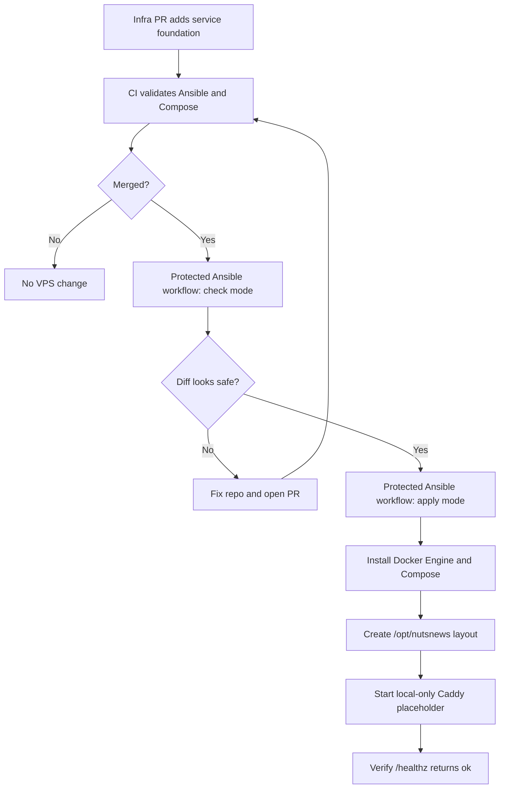
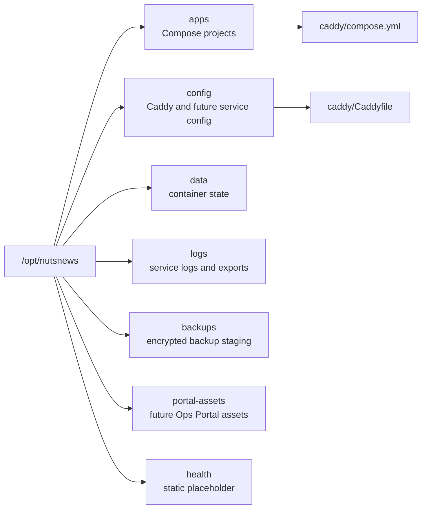
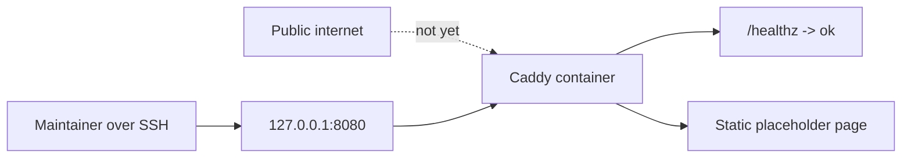

# NutsNews VPS Service Foundation

This explains the next layer in the NutsNews VPS platform: Docker Engine, Docker Compose, the `/opt/nutsnews` runtime layout, and a local-only Caddy placeholder. It is not the shiny app deploy yet. It is the floor, outlets, labels, and "does this thing actually turn on?" light switch.

## Easy Summary

The VPS now gets a small container foundation managed by Ansible. The playbook installs Docker Engine and Docker Compose from Ubuntu packages, creates the standard `/opt/nutsnews` directory layout, and starts a tiny Caddy service through Compose.

Caddy is not public yet. It listens only on `127.0.0.1:8080`, serves a static placeholder page, and answers `/healthz` with `ok`. That lets us verify the service layer before adding real apps, public routing, TLS automation, and the other useful things that become less useful when introduced all at once during a caffeine incident.

## Intermediate Summary

The infra repo adds a new Ansible role:

```text
ansible/roles/vps_service_foundation
```

That role runs after the existing VPS baseline role. It manages:

- Docker Engine from Ubuntu packages
- Docker Compose v2 from Ubuntu packages
- Docker daemon log limits for cheap-VPS disk sanity
- a non-login Caddy runtime user
- `/opt/nutsnews/apps`
- `/opt/nutsnews/config`
- `/opt/nutsnews/data`
- `/opt/nutsnews/logs`
- `/opt/nutsnews/backups`
- `/opt/nutsnews/portal-assets`
- `/opt/nutsnews/health`
- a Compose-managed Caddy placeholder service

The protected Ansible workflow still defaults to check mode. In real apply mode, the service role can start Caddy and verify `http://127.0.0.1:8080/healthz`. In check mode, it skips Docker Compose mutation because pretending to start containers without Docker being installed yet is how automation starts gaslighting everyone.

## Expert Summary

This layer creates the runtime substrate without exposing a production route. The design is intentionally conservative:

- Caddy binds to host loopback only: `127.0.0.1:8080`.
- Caddy admin API is disabled.
- Caddy automatic HTTPS is disabled until public domain routing is intentionally added.
- The container runs as a dedicated numeric non-root user.
- The container uses `read_only`, `no-new-privileges`, dropped capabilities, memory limits, PID limits, and a small tmpfs.
- Docker JSON log files are capped to avoid slow disk doom.
- No secrets, environment files, app credentials, or production tokens are introduced.
- Compose validation runs in CI before the PR can merge.
- Ansible syntax and lint checks cover the role wiring before apply.

The point is to establish a stable convention now so future services have somewhere predictable to live. The platform should grow in layers, not in one heroic blob of YAML that future operators study like a cursed family recipe.

## Service Foundation Flow



## Runtime Layout



This layout is boring on purpose. "Where does this service put its files?" should not require a séance with shell history.

## Caddy Exposure Model



Public HTTP and HTTPS routing are future work. The baseline firewall may allow ports `80` and `443`, but this Caddy service does not bind them yet. That means the container layer can be tested without accidentally publishing a half-built front door.

## Validation

Before merge, CI checks:

- Ansible syntax for `playbooks/bootstrap.yml`
- Ansible lint for the roles
- explicit service foundation role wiring
- required Compose service files
- `docker compose config` for the Caddy bundle
- broader workflow, secret, supply-chain, runtime, and config scanners

After apply, verify from the VPS:

```bash
sudo docker compose -f /opt/nutsnews/apps/caddy/compose.yml ps
curl -fsS http://127.0.0.1:8080/healthz
curl -fsS http://127.0.0.1:8080/
```

Expected health output:

```text
ok
```

## What Can Go Wrong

| Failure | Likely cause | Recovery |
| --- | --- | --- |
| Docker package install fails | Ubuntu package mirror issue or package name change | Rerun check mode later, then update package vars through PR if needed |
| Compose config fails | Invalid YAML, bad bind mount, or unsupported Compose option | Fix `compose/caddy/compose.yml` and let CI prove it |
| Caddy container exits | Bad Caddyfile, missing mount, wrong file permissions | Check `sudo docker logs nutsnews-caddy`, fix repo files, rerun |
| `/healthz` fails | Caddy not started or bound incorrectly | Check Compose status and Caddy config, then rerun apply after a PR fix |
| Disk grows too fast | Container logs or future service data are noisy | Docker log caps are already set; add service-specific retention before adding heavier workloads |
| Someone wants to expose 80/443 immediately | Understandable impatience | Make a follow-up PR with routing, TLS, health checks, and rollback notes instead of freelancing in production |

## What This Does Not Do

This layer does not:

- deploy the NutsNews web app
- expose public Caddy routing
- configure TLS certificates
- install production app secrets
- add databases or queues
- add a self-hosted observability stack
- require the home server
- mutate the VPS from pull request validation

It gives future services a safe landing zone. That is less glamorous than launching everything at once, but it is also less likely to make Friday evening weird.

## Related Docs

- [NutsNews Protected Ansible Apply Workflow](NUTSNEWS_PROTECTED_ANSIBLE_APPLY.md)
- [NutsNews VPS Ansible Bootstrap](NUTSNEWS_VPS_ANSIBLE_BOOTSTRAP.md)
- [NutsNews Infra Operations Platform](NUTSNEWS_INFRA_OPERATIONS_PLATFORM.md)
- [Operations](OPERATIONS.md)
- [Troubleshooting](TROUBLESHOOTING.md)
