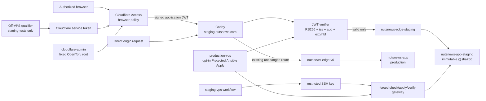
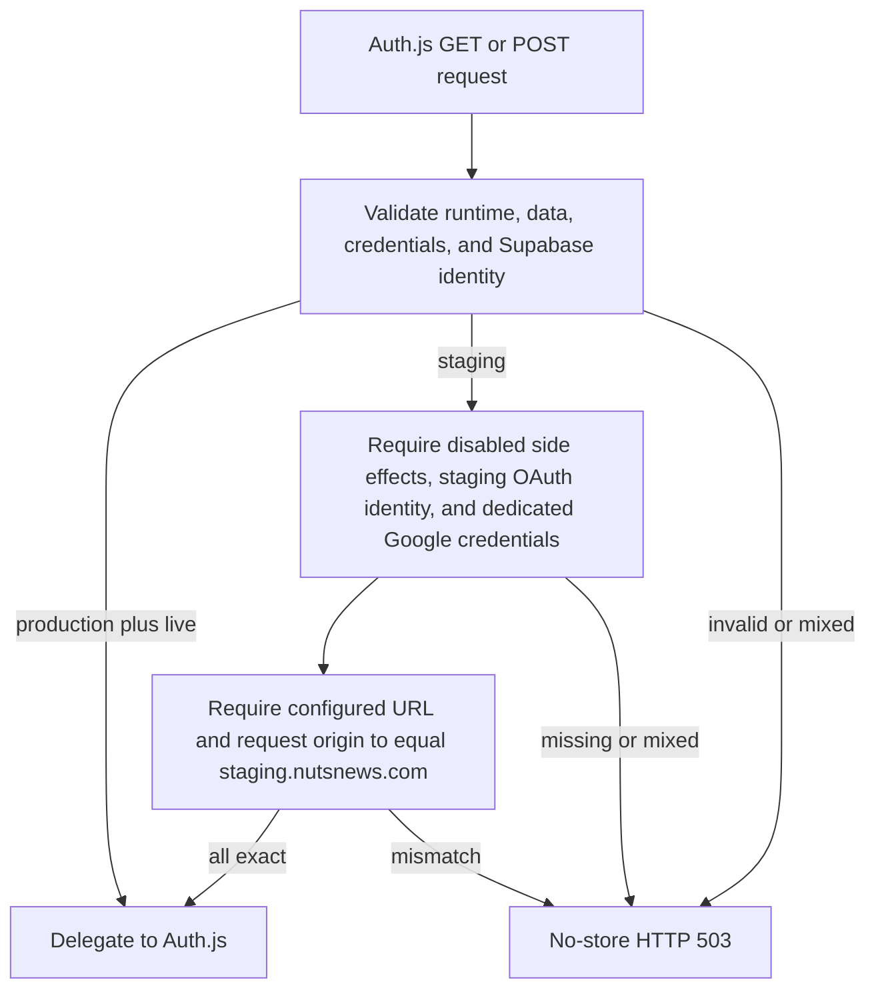
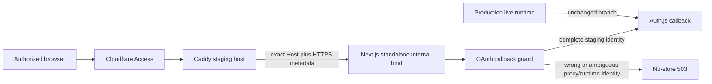

# NutsNews VPS Staging Access And Credential Boundary

Status: complete. Cloudflare and VPS staging infrastructure are live, the
reviewed immutable application candidate is deployed, Google OAuth returns to
the staging application, and the resulting owner session is functional. All
service-token, browser, Safe Browsing, host-boundary, and production-invariance
checks passed for `nutsnews-infra#120`.

## Easy Summary

Production and staging share one physical VPS, but they do not share an app
container, Docker project/network, files, writable state, release state, or
credentials. `staging.nutsnews.com` is an additive hostname that can reach only
`nutsnews-app-staging`.

Cloudflare Access is the front door. An approved person signs in through a
browser; an independent test runner uses a service token. The VPS also verifies
Cloudflare's signed Access token, so a request sent directly to the origin IP
does not bypass the front door. `noindex` headers are defense in depth, not the
access control.

The rollout was additive. Production DNS was not changed, production stayed on
its existing project/network/route, and its public `/healthz` and `/readyz`
continued to return 200 after the staging apply.

## Intermediate Summary

| Boundary | Responsibility | Credentials it may receive | Credentials it must not receive |
| --- | --- | --- | --- |
| `staging-vps` | Submit immutable candidate configuration to the VPS fixed command | restricted SSH private key, known hosts, staging server runtime JSON, dedicated staging OAuth client | production secrets, provider-admin token, qualifier/test user credentials |
| `staging-tests` | Probe the protected hostname from an off-VPS runner | Cloudflare Access client ID/secret and future synthetic test-user material | SSH, Ansible, provider admin, app service-role/runtime secrets, production secrets |
| `cloudflare-admin` | Apply only the reviewed staging DNS/Access OpenTofu root | scoped Cloudflare token, state backend, account/zone/provider IDs | app runtime secrets, deploy SSH, test-user credentials |
| `production-vps` | Existing protected host baseline; opt-in installation of the staging origin boundary and forced command | existing production administration plus non-value staging Access verifier inputs and the deploy public key | staging deploy private key and qualifier token secret |

The staging SSH public key is installed for `nutsnews_staging_deploy` with an
OpenSSH forced command and `restrict`. The account has sudo permission for one
root-owned gateway only. The gateway rejects `SSH_ORIGINAL_COMMAND` and accepts
only JSON operations `check`, `apply`, and `verify`. It runs the root-owned
staging-only bundle whose recorded infra commit must equal the request. It
cannot select production, run a caller-provided shell command, or rewrite
production paths.

The staging app env remains `/etc/nutsnews/nutsnews-staging-app.env`, owned by
`root:root` with mode `0600`; secret-bearing Ansible tasks use `no_log: true`.
The renderer rejects test-user fields, an equal production/staging Supabase
project identity, a non-staging site/auth URL, live email, and incomplete
staging configuration.

## Expert Summary

Cloudflare owns the proxied DNS record and the self-hosted Access application.
The browser policy allows exact email addresses; the service-auth policy allows
one provider-created service token ID. The service token secret is deliberately
not an OpenTofu resource output or state value. The Access application audience
and team domain configure the origin verifier. The verifier fetches the team
JWKS, accepts only RS256, selects the configured key ID, validates the RSA
signature and expected issuer/audience, and applies bounded clock skew.

Caddy's production source remains byte-for-byte the prior `Caddyfile` when
staging access is disabled. Enabling the opt-in template inserts one host block
between the existing production and Ops Portal blocks. That block adds private
no-store/noindex/security headers, invokes `forward_auth`, and proxies only
`nutsnews-app-staging:3000`. Caddy is connected additively to
`nutsnews-edge-staging`; production stays on `nutsnews-edge-v6` with its existing
hostname, imports, headers, authentication, upstream, and digest.

## Runtime Topology

| Item | Production | Staging |
| --- | --- | --- |
| Compose project | `nutsnews-app` | `nutsnews-staging` |
| App container/upstream | `nutsnews-app` | `nutsnews-app-staging` |
| Network | `nutsnews-edge-v6` | `nutsnews-edge-staging` |
| App directory | `/opt/nutsnews/apps/nutsnews` | `/opt/nutsnews/apps/nutsnews-staging` |
| Env file | `/etc/nutsnews/nutsnews-app.env` | `/etc/nutsnews/nutsnews-staging-app.env` |
| Release/apply/LKG state | production-only paths | `/opt/nutsnews/ops/apps/staging/*` |
| Writable cache | `nutsnews-app-cache` | `nutsnews-app-staging-cache` |
| Hostname | unchanged `vps.nutsnews.com` | additive `staging.nutsnews.com` |
| Edge access | unchanged | Cloudflare Access plus origin JWT validation |

The #118 ceilings remain one CPU, 512 MiB memory limit, 256 MiB reservation,
128 PIDs, and 10 MiB times three app logs. The Access verifier adds a bounded
64 MiB/64 PID/5 MiB times two-log service. The app image remains
`ghcr.io/ramideltoro/nutsnews@sha256:<digest>`; staging never rebuilds it.

## Environment-Specific Application Configuration

`NUTSNEWS_STAGING_APP_ENVS_JSON` is one protected transport bundle, not a file
to commit. The bundle, together with the protected OAuth overlay, must provide
staging-owned values for:

- Supabase URL/project, public anonymous key, and service-role key;
- the production Supabase project reference only as a non-secret mismatch
  sentinel—never a production key or URL credential;
- staging-only `AUTH_SECRET` and `NEXTAUTH_URL` set to
  `https://staging.nutsnews.com`;
- app OAuth client ID/secret supplied by the separate protected overlay described
  below, not copied into or recovered from this write-only bundle;
- staging Turnstile and Sentry values only when those providers are explicitly
  enabled; disabled providers may remain unset;
- `NUTSNEWS_EMAIL_MODE=disabled` or a dedicated sandbox; disabled mode rejects
  a Resend key;
- `NUTSNEWS_SITE_URL=https://staging.nutsnews.com` and staging runtime identity.

Test-user credentials or namespaces must not appear in this bundle. They
belong only in `staging-tests`. Staging side effects remain disabled by default,
so it cannot send real email, write production telemetry, invoke production
ingestion, or use production data.

## Application OAuth Change (`nutsnews#201`)

### Simple Summary

Production keeps its existing locked door. Staging gets a different key that
works only at the staging address and cannot be mistaken for production's key.

### Intermediate Summary

Application PR [`nutsnews#202`](https://github.com/ramideltoro/nutsnews/pull/202),
merged as `7619eac85450cc5db376f927aaa2def6894a6887`, introduces an
OAuth-callback-specific runtime check for `nutsnews#201`.
Production continues to use the existing production/live rule.
Staging is eligible only when global side effects remain disabled, the runtime,
data, Supabase credentials, OAuth credentials, Supabase project, configured
Auth.js URL, and incoming request origin all identify the isolated staging
system. Missing, preview, local, mixed, or ambiguous identities continue to
receive the existing no-store HTTP 503 response before Auth.js runs.

### Expert Summary

The focused policy is implemented at the Auth.js GET/POST route boundary rather
than weakening `assertProductionOperation` for unrelated operations. The
staging branch requires all existing `assertRuntimeReady` invariants plus:

- `NUTSNEWS_SIDE_EFFECTS_MODE=disabled`;
- `NUTSNEWS_OAUTH_CREDENTIALS_ENV=staging`;
- dedicated nonempty `AUTH_GOOGLE_ID` and `AUTH_GOOGLE_SECRET` values;
- `AUTH_URL` or legacy `NEXTAUTH_URL` exactly equal to
  `https://staging.nutsnews.com` (if both exist, they must agree); and
- the incoming request origin exactly equal to
  `https://staging.nutsnews.com`.

Production's existing runtime/data/project validation and live-side-effects
requirement are unchanged. No identity value, URL, client ID, secret, token, or
callback material is added to readiness output. Focused regression tests cover
production allow, isolated-staging allow, mixed/missing refusal, and guard
placement on both GET and POST paths.

The staging-only Google OAuth client registers only the reviewed origin and
callback URL: `https://staging.nutsnews.com` and
`https://staging.nutsnews.com/api/auth/callback/google`. Its client ID and
secret are stored as the separate `staging-vps` Environment secrets
`NUTSNEWS_STAGING_AUTH_GOOGLE_ID` and
`NUTSNEWS_STAGING_AUTH_GOOGLE_SECRET`. The protected deploy job requires both,
overlays them in memory onto the existing write-only runtime bundle, and forces
`AUTH_URL=https://staging.nutsnews.com` and
`NUTSNEWS_OAUTH_CREDENTIALS_ENV=staging`. Pinning `AUTH_URL` gives Auth.js v5
an exact canonical trusted host without enabling a broad host-trust flag. The
application callback guard still independently requires the same exact request
origin and all staging isolation identities. The credential values are
unavailable to the preflight and rehearsal jobs and are not written to summaries, deployment
records, logs, or artifacts. This avoids reading or blindly replacing
`NUTSNEWS_STAGING_APP_ENVS_JSON`.

Build and deploy only a reviewed immutable application digest through the
fixed staging workflow. Never copy the production OAuth client, `AUTH_SECRET`,
Supabase credentials, allowed-email/test-user credentials, or telemetry
credentials.

Risk is limited to staging authentication because production follows its
existing branch. A missing or incorrect staging value fails closed. Roll back
by redeploying the previous reviewed staging digest and removing or rotating
only the staging OAuth client values; do not change the production guard or
production provider configuration. Cloudflare browser auth remains independent
from application OAuth.

## Standalone Callback Origin Follow-Up (`nutsnews#203`)

### Simple Summary

The staging sign-in request came through the correct safe door, but the app saw
the name of its room inside the container instead of the name on the outside
door. The fix checks the exact safe door labels that Caddy supplies.

### Intermediate Summary

After the Caddy verifier-query and log-redaction corrections were live, a
browser completed Cloudflare Access and Google consent. The callback reached
the application but received the existing sanitized OAuth-disabled response.
The deployed Next.js standalone server runs on `0.0.0.0:3000`, so
`NextRequest.url` contains that internal bind origin. The staging guard compared
it with `https://staging.nutsnews.com` and failed closed even though Caddy had
preserved `Host: staging.nutsnews.com` and supplied `X-Forwarded-Proto: https`.

Application PR [`nutsnews#203`](https://github.com/ramideltoro/nutsnews/pull/203)
keeps every staging runtime, data, Supabase, provider-credential, and configured
Auth.js URL invariant. For the reverse-proxied request identity, it requires the
exact staging Host and HTTPS forwarding value. Wrong host, HTTP, a host with an
explicit port, missing/mixed runtime identity, or incomplete staging credentials
still fail closed. Production's existing live-runtime allow branch is unchanged.

### Expert Summary

Next.js 16.2.9 standalone constructs request metadata from the configured
`HOSTNAME` and `PORT` before adapting the Node request to `NextRequest`. Enabling
the broad experimental host-trust switch would expand trust for every route and
was rejected. Instead, the Auth.js GET/POST boundary passes a small typed request
identity to `assertOAuthCallback`: the internal URL for context, the read-only
`Host` header, and `X-Forwarded-Proto`. Only the staging branch consumes the
proxy fields, and only the exact pair `staging.nutsnews.com` plus `https` is
accepted. The app container has no published host port and the external path
remains Cloudflare Access, origin JWT verification, and the staging-only Caddy
virtual host.

Local validation for PR #203 passed `npm ci`, all 28 runtime-safety tests,
ESLint, a full Next.js production build with non-secret fixture identity, and
`git diff --check`. No callback query, cookie, token, authorization header,
provider value, or browser storage was retained. Roll back by reverting PR #203
and redeploying the prior immutable staging digest through the fixed staging
workflow; staging OAuth will fail closed again and production requires no
configuration or credential change.

PR #203 merged as `ee8bd5d0207ac84ace1f2acda2454bddbdc2a4de`. Container
Image run `29388226439` published build `29388226439-1` at immutable digest
`sha256:abb94e4f1c21ae96b096e8707e57094f2bafb063a1d67f1ba05cb100b589440b`,
with migration head `20260713000000` and schema version `20260712170000`.

## Exact Onboarding

The live rollout confirmed every name in this table is configured in its
designated Environment. The commands remain the rotation/onboarding reference.
Never paste values into a terminal command line, issue, PR, log, or document.

| Secret name | Provider/owner | GitHub Environment | Source/UI path | Required scope | New? | Safe command |
| --- | --- | --- | --- | --- | --- | --- |
| `NUTSNEWS_STAGING_VPS_SSH_PRIVATE_KEY` | operator/OpenSSH | `staging-vps` | generate offline with `ssh-keygen -t ed25519`; keep private half here | authenticates only forced `nutsnews_staging_deploy` key | yes | `gh secret set NUTSNEWS_STAGING_VPS_SSH_PRIVATE_KEY --env staging-vps --repo ramideltoro/nutsnews-infra < /secure/path/staging_deploy` |
| `NUTSNEWS_STAGING_VPS_KNOWN_HOSTS` | VPS/OpenSSH | `staging-vps` | independently verify VPS host key, then save a namespaced known-hosts file | exact VPS host key only | yes | `gh secret set NUTSNEWS_STAGING_VPS_KNOWN_HOSTS --env staging-vps --repo ramideltoro/nutsnews-infra < /secure/path/staging_known_hosts` |
| `NUTSNEWS_STAGING_APP_ENVS_JSON` | staging providers | `staging-vps` | compose offline from the provider settings listed above | staging runtime only; no test users or production keys | yes | `gh secret set NUTSNEWS_STAGING_APP_ENVS_JSON --env staging-vps --repo ramideltoro/nutsnews-infra < /secure/path/staging-app-envs.json` |
| `NUTSNEWS_STAGING_AUTH_GOOGLE_ID` | Google Auth Platform | `staging-vps` | NutsNews Staging OAuth → NutsNews staging client | dedicated staging web client ID only | yes | `gh secret set NUTSNEWS_STAGING_AUTH_GOOGLE_ID --env staging-vps --repo ramideltoro/nutsnews-infra < /secure/path/staging-google-client-id` |
| `NUTSNEWS_STAGING_AUTH_GOOGLE_SECRET` | Google Auth Platform | `staging-vps` | same staging-only client; rotate independently | paired staging client secret only | yes | `gh secret set NUTSNEWS_STAGING_AUTH_GOOGLE_SECRET --env staging-vps --repo ramideltoro/nutsnews-infra < /secure/path/staging-google-client-secret` |
| `NUTSNEWS_STAGING_ACCESS_CLIENT_ID` | Cloudflare | `staging-tests` | Zero Trust → Access controls → Service credentials → Service Tokens | one token selected by the staging service-auth policy | yes | `gh secret set NUTSNEWS_STAGING_ACCESS_CLIENT_ID --env staging-tests --repo ramideltoro/nutsnews-infra < /secure/path/access-client-id` |
| `NUTSNEWS_STAGING_ACCESS_CLIENT_SECRET` | Cloudflare | `staging-tests` | same creation screen; shown once | paired staging token only | yes | `gh secret set NUTSNEWS_STAGING_ACCESS_CLIENT_SECRET --env staging-tests --repo ramideltoro/nutsnews-infra < /secure/path/access-client-secret` |
| `NUTSNEWS_STAGING_ACCESS_TOFU_BACKEND_CONFIG` | R2/S3 backend | `cloudflare-admin` | dedicated state bucket/access-key UI | bucket/prefix for this root only | yes | `gh secret set NUTSNEWS_STAGING_ACCESS_TOFU_BACKEND_CONFIG --env cloudflare-admin --repo ramideltoro/nutsnews-infra < /secure/path/staging-access-backend.hcl` |
| `NUTSNEWS_STAGING_ACCESS_CLOUDFLARE_API_TOKEN` | Cloudflare | `cloudflare-admin` | My Profile → API Tokens → Create custom token | DNS Edit for `nutsnews.com`; Access Apps and Policies Write for the account | yes | `gh secret set NUTSNEWS_STAGING_ACCESS_CLOUDFLARE_API_TOKEN --env cloudflare-admin --repo ramideltoro/nutsnews-infra < /secure/path/cloudflare-token` |
| `NUTSNEWS_STAGING_ACCESS_CLOUDFLARE_ACCOUNT_ID` | Cloudflare | `cloudflare-admin` | dashboard account overview | identifier only | no | `gh secret set NUTSNEWS_STAGING_ACCESS_CLOUDFLARE_ACCOUNT_ID --env cloudflare-admin --repo ramideltoro/nutsnews-infra < /secure/path/account-id` |
| `NUTSNEWS_STAGING_ACCESS_CLOUDFLARE_ZONE_ID` | Cloudflare | `cloudflare-admin` | `nutsnews.com` zone overview | identifier only | no | `gh secret set NUTSNEWS_STAGING_ACCESS_CLOUDFLARE_ZONE_ID --env cloudflare-admin --repo ramideltoro/nutsnews-infra < /secure/path/zone-id` |
| `NUTSNEWS_STAGING_ACCESS_ORIGIN_IPV4` | VPS provider | `cloudflare-admin` | VPS network overview | existing VPS IPv4 only | no | `gh secret set NUTSNEWS_STAGING_ACCESS_ORIGIN_IPV4 --env cloudflare-admin --repo ramideltoro/nutsnews-infra < /secure/path/origin-ipv4` |
| `NUTSNEWS_STAGING_ACCESS_BROWSER_EMAILS_JSON` | operator | `cloudflare-admin` | offline JSON array of exact authorized emails | browser allowlist only | yes | `gh secret set NUTSNEWS_STAGING_ACCESS_BROWSER_EMAILS_JSON --env cloudflare-admin --repo ramideltoro/nutsnews-infra < /secure/path/browser-emails.json` |
| `NUTSNEWS_STAGING_ACCESS_SERVICE_TOKEN_ID` | Cloudflare | `cloudflare-admin` | service token details page; provider ID, not client secret | exact qualifier token ID | yes | `gh secret set NUTSNEWS_STAGING_ACCESS_SERVICE_TOKEN_ID --env cloudflare-admin --repo ramideltoro/nutsnews-infra < /secure/path/service-token-id` |
| `NUTSNEWS_STAGING_ACCESS_TEAM_DOMAIN` | Cloudflare | `production-vps` | Zero Trust → Settings → Custom Pages/organization domain | `<team>.cloudflareaccess.com` only | no | `gh secret set NUTSNEWS_STAGING_ACCESS_TEAM_DOMAIN --env production-vps --repo ramideltoro/nutsnews-infra < /secure/path/team-domain` |
| `NUTSNEWS_STAGING_ACCESS_AUDIENCE` | Cloudflare | `production-vps` | Access application → overview → Application Audience (AUD) | staging application audience only | generated by apply | `gh secret set NUTSNEWS_STAGING_ACCESS_AUDIENCE --env production-vps --repo ramideltoro/nutsnews-infra < /secure/path/staging-aud` |
| `NUTSNEWS_STAGING_DEPLOY_PUBLIC_KEY` | operator/OpenSSH | `production-vps` | public half of the new restricted deploy key | one `ssh-ed25519` public key | yes | `gh secret set NUTSNEWS_STAGING_DEPLOY_PUBLIC_KEY --env production-vps --repo ramideltoro/nutsnews-infra < /secure/path/staging_deploy.pub` |

Any future synthetic app test user goes only in `staging-tests`, under names
defined by the independent qualifier issue. It is intentionally not invented
here.

## Safe Apply And Verification Procedure

1. Merge the reviewed infra PR only after all required checks pass. Do not
   close issue #120.
2. Onboard the names above and confirm with names-only inventory.
3. Run `Cloudflare Access Apply` from protected `main` with `run_mode=plan`.
   Review that only the staging A record, Access app, and its two policies are
   in scope. With separate explicit approval, rerun `run_mode=apply` and
   `confirm_apply=staging.nutsnews.com`.
4. Store the resulting staging Application Audience and existing team domain
   through stdin as described above. Do not print state or secret outputs.
5. Run `Protected Ansible Apply` with `run_mode=check`,
   `enable_staging_access=true`, normal production options preserved, and no
   apply confirmation. Review the plan for the verifier, forced user/bundle,
   Caddy additive host, and staging-network connection only.
6. With a separate explicit approval, rerun it with `run_mode=apply`,
   `confirm_apply=vps.nutsnews.com`, and `enable_staging_access=true`.
7. Run `Staging Access Probe`. It must deny anonymous access and return 200 for
   authenticated `/healthz` and `/readyz` requests without retaining
   bodies/cookies.
8. Perform read-only verification: listening sockets/published ports; Docker
   projects, containers, digests, networks, limits and upstreams; env filenames,
   owners and modes without contents; active Caddy config/TLS; authenticated and
   anonymous HTTPS; staging `/healthz` and `/readyz`; production health and route.

## Failure And Rollback

- Provider apply failure: do not enable the VPS route. Fix the reviewed module
  or credentials and rerun plan; never hand-edit DNS/Access as a substitute.
- Protected check/apply failure: production remains on its existing project,
  network, route and digest. Do not retry with staging isolation disabled.
- Access verification failure: remove/disable only the staging Access app/record
  through a reviewed OpenTofu change, or rerun Protected Ansible Apply with
  `enable_staging_access=false`. Do not change the production host block.
- Staging app failure: use the existing fixed staging deployment history and
  staging-only rollback state. Never point staging at production or rebuild the
  application image.
- Lost deploy key: generate a new pair, replace the public key through the
  protected host apply and the private key in `staging-vps`, then revoke the old
  key. Do not grant the staging key to `nutsnews_ops`.

## Troubleshooting

- Anonymous 200: stop; Access or origin JWT validation is bypassed. Do not run
  qualification.
- Authenticated 401: verify service-token policy/ID, token rotation, team domain
  and app audience by name/path without logging values.
- Browser login works but app OAuth does not: distinguish Cloudflare Access from
  the application callback guard, then correlate only sanitized origin/path,
  status, immutable identity, and bounded time-window metadata.
- 502 after Access: confirm Caddy and `nutsnews-staging-access` are on
  `nutsnews-edge-staging`, then confirm `nutsnews-app-staging` is healthy.
- Forced command returns `unreviewed_infra_commit`: the installed root-owned
  bundle and workflow commit differ. Run the protected host check/apply; do not
  bypass the commit check.
- Readiness fails: inspect sanitized reason codes and release identity only. Do
  not print the env file or response bodies containing authentication material.

## Live Rollout Record

Cloudflare Zero Trust Free and the `nutsnews.com` Free zone were used; no paid
dependency was added. The applied provider resources are:

- proxied `staging.nutsnews.com` A record;
- `NutsNews staging` Access application;
- authorized-browser, independent service-token, and ACME challenge policies;
- `NutsNews staging independent qualifier` service token;
- least-privilege `NutsNews staging access OpenTofu` API token;
- private `nutsnews-staging-access-tofu-state` R2 state bucket and isolated
  state credential.

The approved immutable candidate is source commit
`4a9b727b260f1380f1529524b8a01ba0b0caaac2`, build
`29245347761-1`, and image digest
`sha256:ae5efea8e03590e37b4565df57dc2e9616fc1057e939200f329a0d0173cdcceb`.
Run `29354831098` passed provenance, fixed check/apply, readiness, digest, and
the sanitized host-boundary report. That report proved no staging host ports,
the reviewed Compose identities, network/upstream separation, the #118/#119
resource and log limits, distinct root-owned directories, root-owned mode 0600
env files without reading contents, the active Caddy staging route, healthy
production, and a healthy Access verifier.

Run `29354941163` then proved anonymous denial plus service-token `/healthz`
and `/readyz` access without retaining bodies, cookies, or tokens. Public
production health/readiness remained 200. On 2026-07-14, an authorized browser
completed the Cloudflare Access flow and reached both staging `/healthz` and
`/readyz`; only allow/health metadata was retained. This established the
pre-application-OAuth browser baseline.

Application merge commit `7619eac85450cc5db376f927aaa2def6894a6887`
produced immutable candidate build `29357494815-1` in
[Container Image run `29357494815`](https://github.com/ramideltoro/nutsnews/actions/runs/29357494815).
The candidate digest is
`sha256:7f236c59266bf3bbdd84383dcd5b14abab811a9bd77352d10076cdee50a84f79`,
with migration head `20260713000000` and schema version `20260712170000`.
The dedicated staging-only Google OAuth client secret names are configured in
`staging-vps`. Infrastructure PR
[`nutsnews-infra#180`](https://github.com/ramideltoro/nutsnews-infra/pull/180)
merged as `19ab268a56b4f74fc39e1acfa0d62ba3430ce1cb`; Protected Ansible check run
`29361469048` and apply run `29361570686` succeeded. Rehearsal run
`29362020580` verified the exact candidate and its OCI provenance. Staging
deployment run `29362056657` then applied that digest and passed immutable
digest, readiness, network, port, resource/log limit, directory, permission,
Caddy, Access-verifier, and production-health checks. Access probe run
`29362233346` proved anonymous denial plus service-token health/readiness.

The first application OAuth browser attempt passed Cloudflare Access but
stopped at `/api/auth/signin/google` with an Auth.js security error before any
Google redirect. The reviewed cause is that the legacy write-only bundle
provides `NEXTAUTH_URL`, while Auth.js v5 establishes trusted-host processing
from `AUTH_URL` (or a broad trust flag). The focused remediation pins the exact
staging `AUTH_URL` in the protected overlay. Infrastructure PR
[`nutsnews-infra#181`](https://github.com/ramideltoro/nutsnews-infra/pull/181)
merged as `afb59800e4a919df180dfade48a8df747e133e8d`; check run `29365712148`,
apply run `29365806062`, redeployment run `29366227324`, and Access probe run
`29366329250` all succeeded. Production health/readiness remained 200.

The next browser attempt reached Google, proving the Auth.js trusted-host fix,
but the cross-site callback entered a Cloudflare Access redirect loop. A clean
browser session then reproduced the loop even on `/healthz`. Protected plan run
`29367170265` found no drift and confirmed live state exactly matched the
GitOps application setting `SameSite=Strict`. Cloudflare documents that Strict
can cause `ERR_TOO_MANY_REDIRECTS`. The focused staging-only remediation uses
`SameSite=Lax`, which continues to block cross-site subrequests while permitting
the top-level GET navigation used by the Google callback. HttpOnly, binding
cookie, browser allow policy, independent service-token qualifier, DNS, VPS JWT
verification, and all production behavior remain unchanged. The exact Cloudflare
plan (`29367539018`) changed only that one staging Access attribute; apply
(`29367590285`) and the following no-drift plan (`29367643170`) succeeded, as
did Access probe `29367644575`.

After that correction, Cloudflare Access and Google consent both succeeded, but
the callback reached `https://staging.nutsnews.com/api/auth/callback/google`
and received a 404 before the application handled it. Sanitized Caddy metadata
identified the cause: `forward_auth` rewrote the cloned verifier request to
`/verify` but preserved the Google callback query, whereas the fail-closed
verifier intentionally accepts only the exact `/verify` endpoint. The same
metadata established that the staging Caddy access logger retained request URIs,
which could retain OAuth callback query material. A focused GitOps correction
therefore uses `/verify?` (an explicit empty query on the verifier clone only)
and deletes the staging access-log URI, Cloudflare Access JWT and service-token
headers, cookies, `Set-Cookie`, and redirect-location fields. It is limited to
`staging.nutsnews.com`; the production and operations Caddy virtual hosts remain
byte-for-byte unchanged. Applying the filter force-recreates the Caddy
container, discarding the earlier local container log before the browser retry.
Infrastructure PRs
[`#183`](https://github.com/ramideltoro/nutsnews-infra/pull/183) and
[`#184`](https://github.com/ramideltoro/nutsnews-infra/pull/184) merged as
`0c09a381d2d6df3126c86c18f0f98a4491ba4506` and
`7647ca6c3aaba5f3f88eb7b66717e5d62f58efab`. Their protected rollout and
regression checks proved the verifier clone drops callback query material and
the staging access logger removes URI and credential-bearing request/response
fields without changing the production virtual host.

## Current Honest Status

Cloudflare plan run `29340114473` proved an isolated `4 to add, 0 to change, 0
to destroy` scope. Apply run `29340218273` then created the proxied staging DNS
record, staging Access application, authorized-browser policy, and independent
qualifier policy in the dedicated remote state backend. The required
`cloudflare-admin`, `staging-tests`, and `production-vps` secret names are now
configured without values appearing in the repository or workflow output.

Protected Ansible check run `29340458679` stopped at
`Validate opt-in staging access boundary inputs`. The public-key regular
expression included an unquoted `: ` sequence, so YAML produced a mapping where
Ansible requires a string conditional. Corrective commit
[`ad37238`](https://github.com/ramideltoro/nutsnews-infra/commit/ad372381ab3d90ff7fb135e289ddb6ad051187bd)
implements that focused fix for [issue #120](https://github.com/ramideltoro/nutsnews-infra/issues/120)
without changing production behavior. After merge, provider plan run
`29341446703` reported zero drift, and protected check run `29341499410`
completed with no remote materialization in check mode and no unexpected
production change.

Protected apply run `29341663329` then stopped while validating the dedicated
staging deploy user's sudoers fragment. YAML's `>-` chomping indicator removed
the terminal newline, and `visudo` rejected the generated file with `missing
line terminator at end of file`. The apply had already installed the additive
staging Caddy route and part of the dedicated staging deployment identity, but
had not completed the origin verifier or staging network materialization.
Production `/healthz` and `/readyz` both continued to return HTTP 200 with valid
TLS after the partial apply. The proxied staging hostname continued to return
the Cloudflare Access login redirect rather than exposing the incomplete
origin. Corrective PR
[`#166`](https://github.com/ramideltoro/nutsnews-infra/pull/166) preserved the
sudoers fragment's terminal newline and added a regression assertion against
the parsed task scalar. It merged as `98c425b` after all required checks passed.

Corrected protected check run `29342602190` then passed with `failed=0` and no
remote materialization in check mode. Protected apply run `29342742569` passed
the previous assertion and sudoers blockers, then stopped while validating the
staging access Compose project. The Compose definition requires
`NUTSNEWS_STAGING_ACCESS_ENV_FILE` for interpolation, but the Ansible validation
and startup commands did not define that variable. The apply had installed the
staging verifier definition, verifier code, root-owned mode-0600 environment,
and isolated network before Compose validation failed; it had not started the
verifier. Production `/healthz` and `/readyz` again remained HTTP 200 with valid
TLS, and the proxied staging hostname continued to return the Access login
redirect. Corrective PR
[`#167`](https://github.com/ramideltoro/nutsnews-infra/pull/167) passed the
reviewed env-file path to both Compose invocations and added regression coverage
for both task environments. It merged as `e0685a7` after all required checks
passed.

Corrected protected check run `29343622521` passed with `failed=0`. Protected
apply run `29343791298` then validated and started the verifier and connected
Caddy to the isolated staging network. It stopped only when the final staging
task invoked `caddy reload`: the reviewed Caddyfile deliberately configures
`admin off`, so no admin endpoint was available for the CLI's reload request.
Network attachment takes effect immediately and the already-running Caddy had
loaded the staging route during the earlier service-foundation reconciliation,
so no reload is required. Production `/healthz` and `/readyz` remained HTTP 200
with valid TLS, while the proxied staging hostname continued to return the
Access login redirect. Corrective PR
[`#168`](https://github.com/ramideltoro/nutsnews-infra/pull/168) removed the
impossible reload without altering the Caddyfile, route, or production service
behavior and added regression coverage for the disabled admin API convention.
It merged as `1359f5f` after all required checks passed.

Corrected protected check run `29344892770` passed with `failed=0`, and
protected apply run `29345020979` completed successfully with `ok=156`,
`changed=9`, and `failed=0`. Production `/healthz` and `/readyz` remained HTTP
200 with valid TLS. Anonymous staging health and readiness remained denied by
Cloudflare Access with HTTP 302. Service-token probe run `29345490515` failed
without exposing credentials or response data; diagnostic PR
[`#169`](https://github.com/ramideltoro/nutsnews-infra/pull/169) added only the
numeric failure status to that safe probe and merged as `36ef37a`. Probe run
`29345777605` then identified HTTP 525. Direct TLS metadata confirmed that the
origin presented no certificate for `staging.nutsnews.com`, while the production
hostname continued to present its valid Let's Encrypt certificate.

The durable staging-only correction is a path-scoped Access application for
`staging.nutsnews.com/.well-known/acme-challenge/*` with a Bypass/Everyone
policy. This allows Caddy's automatic certificate challenge and renewal without
weakening Cloudflare SSL mode, changing production TLS, or exposing the staging
application: outside an active ACME challenge, requests still reach the
fail-closed origin JWT verifier. The protected hostname application and its
browser/service-token policies remain unchanged.

### Final OAuth Acceptance — 2026-07-15

The final root cause was application-layer request identity, not Cloudflare,
Caddy, Google client configuration, or a stale image. Next.js standalone built
`NextRequest.url` from its internal `0.0.0.0:3000` bind. The staging-only OAuth
guard therefore rejected a valid reverse-proxied callback before Auth.js. App
PR [`nutsnews#203`](https://github.com/ramideltoro/nutsnews/pull/203), merged as
`ee8bd5d0207ac84ace1f2acda2454bddbdc2a4de`, validates the exact external
`Host: staging.nutsnews.com` and forwarded HTTPS identity in the staging branch.
Wrong, missing, port-bearing, or HTTP identities still fail closed; the
production/live branch returns before these staging checks and is unchanged.

The immutable accepted candidate is:

- source: `ee8bd5d0207ac84ace1f2acda2454bddbdc2a4de`;
- build: `29388226439-1` from Container Image run
  [`29388226439`](https://github.com/ramideltoro/nutsnews/actions/runs/29388226439);
- digest: `sha256:abb94e4f1c21ae96b096e8707e57094f2bafb063a1d67f1ba05cb100b589440b`;
- migration head: `20260713000000`; schema version: `20260712170000`.

During rollout, the app main pipeline proposed a VPS production manifest
promotion. Its apply was canceled before staging SSH/Ansible or production
materialization, and infra PR
[`#186`](https://github.com/ramideltoro/nutsnews-infra/pull/186), merged as
`4079aac396eff9121b9817ade40be73a25ea8cd0`, restored the production manifest
exactly to its prior reviewed values. A separate fail-closed baseline run showed
that `sync_vercel_production=false` still selected the production runtime for
validation. Infra PR
[`#187`](https://github.com/ramideltoro/nutsnews-infra/pull/187), merged as
`94e2d6ae46f6e0ad54cc42d04eff295936ec767b`, makes that input authoritative:
staging-boundary refreshes select no production app runtime, while the default
reviewed production sync continues to select production.

Protected Ansible check run
[`29389277317`](https://github.com/ramideltoro/nutsnews-infra/actions/runs/29389277317)
completed with `changed=2`, `failed=0`, and production sync skipped. Matching
apply run
[`29389333130`](https://github.com/ramideltoro/nutsnews-infra/actions/runs/29389333130)
completed with `changed=6`, `failed=0`, no release identity, and no production
app runtime selected. Final immutable staging run
[`29389565541`](https://github.com/ramideltoro/nutsnews-infra/actions/runs/29389565541)
passed source-main reachability, OCI provenance, arbitrary-command rejection,
fixed server-side check then apply, exact digest/readiness, Compose/container/
network/path separation, one-CPU/512-MiB/128-PID limits, bounded logs, root-owned
mode-0600 environment files without reading them, Caddy routing, production
health, and Access verifier health. Deployment `5451794386` recorded success
with the exact digest above. Final Access probe
[`29389630224`](https://github.com/ramideltoro/nutsnews-infra/actions/runs/29389630224)
proved anonymous denial plus service-token health/readiness without retaining
bodies, cookies, or tokens.

Chrome acceptance used the `chrome-devtools` MCP only. A clean profile was
redirected to the Cloudflare Access sign-in page. An Access-authenticated
profile received staging `/healthz` with the exact source/build above and
`/readyz` with `runtimeEnv=staging`, disabled side effects, and `code=ready`.
The Google account chooser and consent completed, the callback returned to
`/admin` without an error, and the page showed an authenticated owner session
with a working sign-out control and protected dashboard links. A post-deploy
recheck confirmed the session remained functional. Google Transparency Report
showed **No unsafe content found** for `staging.nutsnews.com` (updated
2026-07-14); the earlier warning did not reproduce in the normal MCP-controlled
Chrome profile, so no false-positive review was necessary and no provider wait
remains.

Production `/healthz` and `/readyz` remained HTTP 200, production readiness
remained `runtimeEnv=production` with live side effects, and the production
admin login route retained its Google sign-in boundary. The normal Vercel main
deployment advanced to the reviewed app merge, but regression tests and live
checks confirmed the production code path and behavior are invariant. The VPS
production manifest and service were not promoted to the staging candidate.
No production secret was exposed to staging jobs, and no staging credential,
OAuth callback query, code, cookie, browser storage, authorization header,
CSRF value, provider secret, or credential-bearing log/artifact was retained.

Rollback remains staging-only: dispatch the previous reviewed source/digest
through the immutable staging workflow, or revert app PR #203 and qualify its
replacement digest. If the boundary automation itself must be rolled back,
revert infra PR #187, run protected check then apply, and do not enable
production sync. Never copy production credentials, edit the VPS manually, or
bypass Access/origin verification.

Cloudflare provisioning, durable remote state, the protected VPS baseline,
immutable staging deployment, origin TLS, service-token and browser-authenticated
health/readiness, application Google OAuth, Safe Browsing verification, and
metadata-only host verification are complete. Production remained healthy and
behaviorally unchanged, and issue #120 may be closed.
