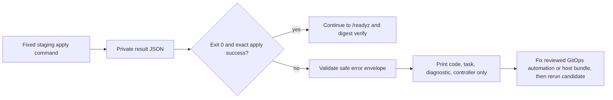
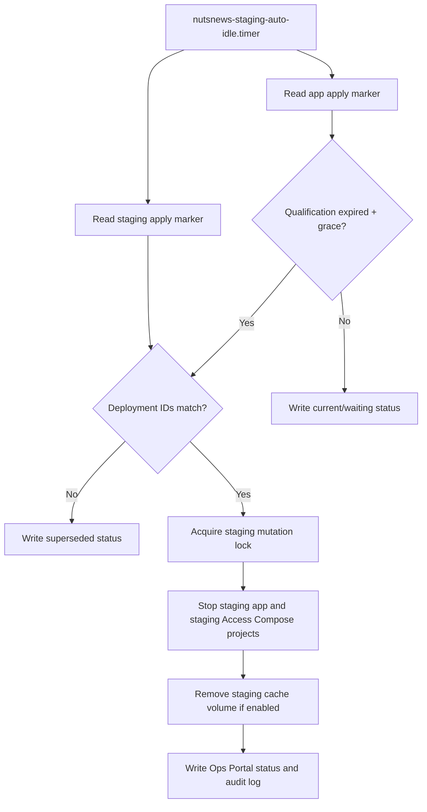
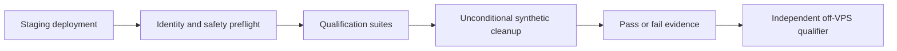
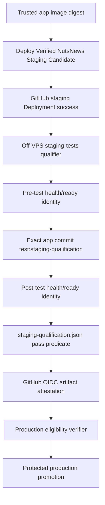
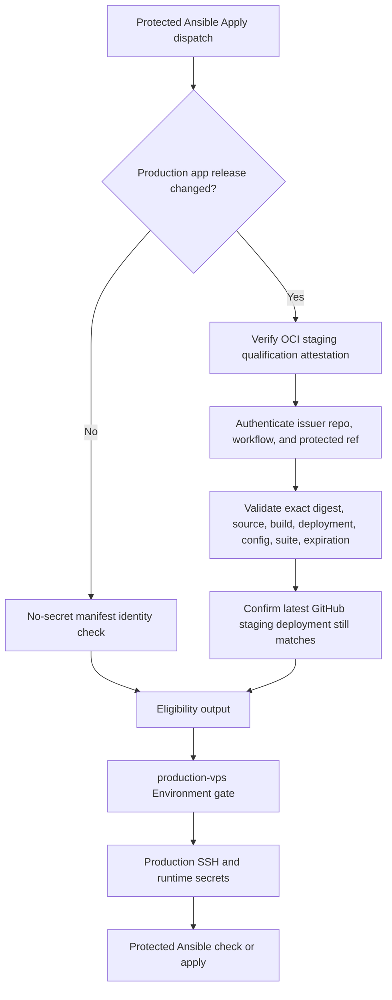

# NutsNews Immutable Staging Deployment

## Purpose

The `Deploy Verified NutsNews Staging Candidate` workflow in
`ramideltoro/nutsnews-infra` is the only GitOps path that can mutate the
NutsNews staging runtime. It deploys a reviewed GHCR digest to the isolated
`nutsnews-app-staging` Compose project; it does not promote production, change
the production container, attach Caddy to staging, or create a public staging
route.

The deployment key is designed to terminate at a server-side forced command
for the root-owned staging bundle. The workflow proves arbitrary SSH commands
are rejected, then submits only `check`, `apply`, and sanitized `verify`
requests. Hostname/Access onboarding remains a separate protected step; see
[VPS Staging Access And Credential Boundary](NUTSNEWS_VPS_STAGING_ACCESS_BOUNDARY.md).

The workflow is activated only by the `nutsnews-staging-release`
`repository_dispatch` event. Its manual `workflow_dispatch` path is a
validation-only rehearsal: it can never attach `staging-vps`, read a staging
secret, use SSH, or run Ansible.

## Candidate Contract

The dispatch `client_payload` must be exactly this JSON object. Extra fields,
missing fields, non-string values, leading/trailing whitespace, mutable tags,
and incompatible values are rejected.

```json
{
  "schema_version": "20260712170000",
  "source_repository": "ramideltoro/nutsnews",
  "source_commit": "<full lowercase 40-character SHA>",
  "image_repository": "ghcr.io/ramideltoro/nutsnews",
  "image_digest": "sha256:<64 lowercase hexadecimal characters>",
  "build_id": "<GitHub workflow run ID>-<positive attempt>",
  "source_workflow_run_id": "<GitHub workflow run ID>"
}
```

`schema_version` is the 14-digit application migration schema version expected
by `/readyz`. `build_id` must be the supplied source workflow-run ID followed
by its actual run attempt. The image is always addressed as
`ghcr.io/ramideltoro/nutsnews@sha256:…`; no tag is accepted.

## Trust Boundary Before Secrets

The preflight job has no GitHub Environment attachment, SSH credential, or
staging secret. Before the `staging-vps` job is eligible to start, it requires:

1. The exact candidate contract above.
2. A completed, successful `Container Image` `push` workflow on the trusted
   app repository's `main`, whose head SHA and attempt match the candidate.
3. GitHub's `<candidate-SHA>...main` comparison to prove the source SHA is
   reachable from app `main`: only `ahead` (current `main` contains the
   candidate) or `identical` is accepted. `behind` and `diverged` fail closed.
4. OCI index, linux/amd64 manifest, and attached SLSA v1 provenance checks in
   GHCR. The provenance must bind the manifest, app repository, source SHA,
   build ID, deployment target, and GitHub Actions run/attempt to the candidate.

No event field is interpolated into a shell or SSH command. The staging job
revalidates the approved fields into a private Ansible vars file before use.

## What an Approved Dispatch Does

After the `staging-vps` Environment approval, the workflow:

1. Uses only `NUTSNEWS_STAGING_VPS_SSH_PRIVATE_KEY`,
   `NUTSNEWS_STAGING_VPS_KNOWN_HOSTS`, and optional
   `NUTSNEWS_STAGING_APP_ENVS_JSON` from that Environment. Production secrets
   and the `production-vps` Environment are never referenced.
2. Runs repository guardrails, Ansible syntax validation, and the fixed
   `ansible/playbooks/deploy-staging.yml` in check mode. That play initializes
   its reviewed service-foundation defaults before evaluating the fixed
   staging-only guard, so no check can rely on a later role include.
3. Uses a non-cancelling GitHub concurrency queue and a staging-host mutation
   lock. The play accepts only the `staging-vps` inventory alias, staging
   project/container/network identity, and the `nutsnews-staging-deploy` tag.
4. Applies only `nutsnews-staging`, then performs bounded `/readyz` retries
   (30 attempts, three seconds apart; SSH commands have explicit timeouts).
5. Requires both the configured container reference and Docker's resolved
   `RepoDigests` to equal the requested immutable digest.
6. Creates a GitHub Deployment in environment `staging`, with a sanitized
   candidate-derived deployment ID, requested digest, source/build metadata,
   infrastructure commit, config generation, timestamp, and per-run history.
   Its final Deployment status records the actual digest. A failed, timed-out,
   or cancelled run can never post a successful status.

Rerunning a candidate is idempotent at the Compose layer and intentionally
creates another GitHub Deployment history entry for auditability.

## Staging Deploy Bundle Freshness

The forced staging command accepts only the infra commit that last refreshed
the root-owned staging deploy bundle on the VPS. Automated production release,
pre-merge production, and fixed rollback protected applies therefore dispatch
with `enable_staging_access=true` so the bundle marker stays aligned with the
reviewed infra commit.

If staging check mode reports `unreviewed_infra_commit`, the deploy workflow
briefly retries while the reviewed bundle marker propagates to the staging
gateway. The retry summary records only the sanitized code and attempt count.
If the bounded retry window expires, treat it as a stale bundle marker or stale
workflow path. Fix the reviewed infra guard, rerun Protected Ansible Apply with
staging access enabled, and then rerun the staging candidate. Do not edit
`/opt/nutsnews/staging-deploy-bundle/infra-commit` manually.

## Sanitized Apply Failure Diagnostics

### Simple Summary

When staging apply fails, the workflow now says which safe checkpoint failed
without showing the private deployment output.

### Intermediate Summary

The fixed staging command already returns a small JSON error envelope with a
safe code, reviewed Ansible task label, diagnostic class, and controller
version. The deploy workflow now parses that envelope during apply, just as it
already did for check mode. If Ansible runs an `always` cleanup block after a
failure, the label points at the reviewed task that emitted the failure rather
than the cleanup task that ran last. Operators can see whether the failure is a
reviewed task, syntax, missing file, undefined variable, or other classified
controller problem, while raw Ansible output, rendered diffs, request JSON,
environment values, and secrets remain hidden.

### Expert Summary

The `Apply through the server-side fixed staging command` step captures the SSH
exit status and reads only the forced-command response file. A passing response
must be exactly `{"ok": true, "operation": "apply"}` with exit status 0.
Failures are accepted for logging only if their fields match the same strict
allowlist used by check mode: `code` is lowercase snake case, `task` is a
bounded reviewed task label, `diagnostic` is lowercase snake case, and
`controller` is empty, `unknown`, or a dotted Ansible core version. Anything
else fails as an invalid gateway response. The workflow never prints the
Ansible stdout/stderr body across the forced-command boundary. The server-side
parser walks Ansible task output and records the most recent reviewed task that
emitted `fatal`, `FAILED`, or `UNREACHABLE`; it falls back to the last reviewed
task only if no explicit failed task can be detected.



Related infrastructure change:
[ramideltoro/nutsnews-infra#245](https://github.com/ramideltoro/nutsnews-infra/pull/245).

## Production-Health Recovery Note

The staging deploy verifier still proves that staging is isolated from
production: separate Compose project, container, network, directories, env
files, route, runtime limits, log limits, immutable digest, and Access verifier
health. It also inspects production container identity, network separation, and
root-only production env-file permissions.

Current production app health is sanitized observation in the staging runtime
result, not a staging deploy prerequisite. This matters during recovery from an
already-unhealthy production container: staging must be able to deploy and
qualify the exact replacement image before the protected production
migration/apply path can restore production. Do not restart or patch production
over SSH to make staging pass. Use the successful staging Deployment and
qualification evidence, then run the protected production release/apply
workflow with the matching image, source, build, migration, schema, and
Supabase project identity.

For the July 16, 2026 production recovery, the reviewed production manifest
promotion uses app source commit `6fd45791f26a81a6c804549b0c53468c62eccdab`,
image digest
`sha256:8eff7cf67f43ce4dd53b63c61b6dad8eb38b39dbb67e5ac716d026981be7dcb5`,
build `29529818438-1`, migration head `20260716180000`, schema marker
`20260712170000`, and Supabase project ref `mpqfulvvagyzqneiaqky`. Production
apply must still run only through `Protected Ansible Apply` after the matching
staging deployment, staging qualification, production backup, and protected
production Supabase migration have succeeded.

## Staging Auto-Idle After Qualification Expiry

### Simple Summary

Staging no longer has to run forever after a qualification window expires. A
GitOps-managed VPS timer checks the recorded qualification expiry and idles only
the matching staging app and staging Access verifier after a grace period.

### Intermediate Summary

The protected service-foundation apply installs
`nutsnews-staging-auto-idle.timer` and `nutsnews-staging-auto-idle.service`.
The service reads the production app apply marker, the staging apply marker,
and the configured qualification expiry. If the expiry plus grace period has
passed, and the staging deployment ID still matches the deployment ID that was
qualified, it stops the `nutsnews-staging` and `nutsnews-staging-access`
Compose projects and removes the `nutsnews-app-staging-cache` volume when that
cleanup is enabled. It writes sanitized state to the Ops Portal and an audit
JSONL log.

If staging has been redeployed to a newer deployment ID, the service reports
`superseded` and does not idle it. If another staging mutation is already in
progress, it reports `blocked` and tries again on the next timer run.

### Expert Summary

The auto-idle unit is not a production deploy path. It runs on the VPS as root
through systemd, but its environment points only at staging Compose projects,
the staging app marker, the production app marker used for qualification
metadata, the staging cache volume, and the existing staging mutation lock. It
does not reference the `production-vps` GitHub Environment, production SSH,
deploy SSH, app runtime secrets, or release tokens. The status record always
sets `production_touched: false`.

The matcher deliberately compares:

- `staging_deployment_id` from `/opt/nutsnews/ops/last-app-apply.json`
- `deployment_id` from `/opt/nutsnews/ops/apps/staging/last-apply.json`
- `qualification_expires_at` from the production app apply marker

Only a matching expired deployment may be idled. This prevents an old,
expired production marker from stopping a newer staging candidate that is being
qualified.



### Rehydrate Staging Safely

1. If the staging hostname or Access verifier was idled, run the protected
   `Protected Ansible Apply` workflow from `main` with
   `enable_staging_access=true`. Use check mode first, then apply after review.
2. Request or rerun the exact staging candidate through the app staging-first
   handoff or the reviewed infra staging dispatch path. Do not SSH into the
   VPS to start containers manually.
3. Approve only the `staging-vps` Environment for the staging deploy job after
   the no-secret preflight has validated the candidate.
4. Confirm the staging deploy workflow reports `ready`, a GitHub staging
   Deployment ID, the actual Docker digest, and sanitized boundary evidence.
5. Run the independent off-VPS staging qualification. A new production
   promotion must use the fresh qualification record for the exact digest,
   deployment ID, config, and test revision.

Rollback is to disable the auto-idle timer through a reviewed service-foundation
change or revert the PR that introduced it, then run protected apply. Do not
replace it with a manual Docker or SSH workflow.

## Staging Supabase Schema Prerequisite

The app repository now supplies a separate, fixed-purpose `Apply Verified
NutsNews Staging Supabase Migrations` workflow. It is the only GitOps path for
the staging Supabase schema. It exists because `/readyz` rejects a staging
runtime until `nutsnews_migration_schema_contract` reports the migration head
and catalog fingerprint expected by the immutable app image. This is a
staging-only forward-migration path; it does not deploy a container, open SSH,
use `staging-vps`, or promote production.

### Simple Summary

Before the staging app can say it is ready, this workflow safely gives the
staging database the page it is missing. A person must approve the staging
database step, and the workflow checks that it used the right app version.

### Intermediate Summary

An operator starts the workflow from the protected `main` branch with a full
source SHA, the migration head expected by that source, and an exact
confirmation phrase. The unprotected preflight rejects incomplete or mutable
values and proves that the SHA is already in `main`. Only then can the
`staging-supabase` GitHub Environment provide a staging database connection.
The protected job serializes requests, applies forward migrations under the
database advisory lock, reloads PostgREST's schema cache, and verifies the
database contract before reporting success.

### Expert Summary

The request contract is intentionally narrower than the immutable image
candidate contract: the schema operation executes reviewed SQL from a trusted
source commit, so it accepts only `source_commit`, `migration_head`, and the
literal `apply-staging-supabase-migrations` confirmation. The preflight has no
Environment attachment or database secret. It checks the full lowercase SHA,
the 14-digit head, and `git merge-base --is-ancestor <sha> origin/main`, then
checks out that exact commit and requires its compiled migration contract to
match the requested head. The protected job uses
`NUTSNEWS_STAGING_MIGRATION_DATABASE_URL` only from `staging-supabase`, runs
the reviewed workflow revision's forward-only locked migration runner against
the approved source checkout's migration files, invokes `NOTIFY pgrst, 'reload
schema'`, and queries `nutsnews_migration_schema_contract` directly for both
the expected head and matching fingerprint. It never executes scripts from the
older approved source checkout, so a valid historical source cannot bypass a
newer automation safeguard.

```mermaid
flowchart LR
  A[Operator supplies source SHA and migration head] --> B[Preflight on main: strict validation and main reachability]
  B -->|no secrets available| C[Checkout exact reviewed source and validate migration contract]
  C --> D[staging-supabase Environment approval]
  D --> E[Advisory lock and forward-only supabase db push]
  E --> F[Record head, reload PostgREST schema cache, verify fingerprint]
  F --> G[Dispatch immutable staging runtime candidate]
  G --> H[/readyz and actual Docker digest verification]
```

### Required One-Time Environment Setup

Before an authorized run, a repository administrator must create the
`staging-supabase` GitHub Environment in `ramideltoro/nutsnews`, limit its
deployment branches to protected `main`, and configure required reviewers.
Store exactly one database credential there:

- `NUTSNEWS_STAGING_MIGRATION_DATABASE_URL` — a connection URL for the
  isolated staging Supabase Postgres project with only the privileges needed
  to apply its reviewed migrations.

Do not put this value in repository secrets, `NUTSNEWS_STAGING_APP_ENVS_JSON`,
workflow inputs, application configuration, logs, or documentation. Do not
reuse a production database URL or production credential. The preflight job
must remain free of this Environment and its secret.

### Authorized Run and Evidence

Run `Apply Verified NutsNews Staging Supabase Migrations` from `main` with:

1. `source_commit`: the exact full SHA of the already-qualified app source.
2. `migration_head`: the 14-digit last migration filename at that SHA (for the
   current `/readyz` failure, `20260713000000`).
3. `confirmation`: `apply-staging-supabase-migrations`.

The run is queued under a non-cancelling concurrency group and the database
advisory lock, so a repeated approved request is safe to retry and does not
apply concurrently. Success evidence is the workflow's direct database
contract/fingerprint verification. It is schema evidence only, not staging
runtime evidence. After it succeeds, send the existing immutable
`nutsnews-staging-release` candidate to the infrastructure workflow and retain
that workflow's `/readyz` and actual Docker digest evidence before considering
the staging deployment complete.

### Safe Connection-Failure Diagnosis

#### Simple Summary

If the staging database cannot be reached, the workflow says what kind of
connection problem it found without showing the database password.

#### Intermediate Summary

The advisory-lock client keeps at most a small internal amount of PostgreSQL
error text and converts it to one fixed, non-secret diagnosis. The available
diagnoses cover malformed connection URLs, rejected authentication, DNS,
network reachability, a missing database, and TLS or database access-policy
rejection. A failure stops before the lock is acquired, so no migration SQL is
applied and no staging runtime deployment may be dispatched.

#### Expert Summary

The reviewed lock runner never writes the `psql` stderr stream, connection
string, or password to GitHub Actions output. It only matches the bounded
internal stderr buffer against predefined patterns and emits a constant
operator message. In particular, a password containing reserved URL characters
can be diagnosed as a malformed URL without exposing the URL; encode those
password characters before saving the Session Pooler URL in
`NUTSNEWS_STAGING_MIGRATION_DATABASE_URL`. Any unrecognized error remains a
generic fail-closed connection failure. The migration command and PostgREST
reload are reached only after the advisory lock is acquired.

The reviewed runner creates a private per-run `psql` script and starts `psql`
directly, with no wrapper process. After PostgreSQL grants the advisory lock,
the script writes the constant `LOCK_ACQUIRED` result to a local marker file
and immediately closes that file; the runner polls only that flushed local
marker. This avoids treating a buffered stdout pipe as a 30-second lock
timeout and ensures a timeout or normal release signals the actual lock-holder
process. The temporary script and marker are mode-restricted and removed on
both failure and release. The exact lock key, timeout, and no-secret logging
boundary remain unchanged.

### Risks, Mitigations, and Rollback

- Forward SQL is intentionally not automatically reversed. If a migration is
  wrong, stop the staging release, correct it in a reviewed follow-up
  migration, and use the separately documented staging restore process if a
  restore is genuinely required.
- The workflow cannot silently use production because it references neither a
  production Environment nor a production secret or target. GitHub Environment
  branch restrictions and required reviewers add an independent boundary.
- If the runner cannot start `psql`, create its private lock files, or observe
  the flushed marker within the bounded wait, the lock client fails before any
  migration SQL runs; it never bypasses locking to keep the release moving.
- A cancelled or failed run cannot claim the schema contract was verified; the
  infrastructure release remains blocked by `/readyz` until a later successful
  run proves the contract.

This prerequisite supports [infrastructure issue #117](https://github.com/ramideltoro/nutsnews-infra/issues/117).

## Rehearse a Candidate

From GitHub Actions, select `Deploy Verified NutsNews Staging Candidate`, enter
the exact candidate JSON, and type:

```text
rehearse-staging-candidate
```

Success is evidence that schema validation, source-main trust, and OCI
provenance checks agree. It is not deployment evidence and it changes no VPS
state.

## Separate Live-Apply Approval and Evidence

This documentation and its infrastructure PR do not authorize or perform a
live staging apply. After the infrastructure PR is merged, an authorized source
workflow must send the exact `nutsnews-staging-release` candidate. Approve the
`staging-vps` Environment only after the candidate and check-mode output are
reviewed.

The issue may be closed only after one approved workflow run supplies all of
the following evidence:

- a successful GitHub Deployment status for `staging`;
- the workflow's bounded `/readyz` success with matching source SHA, build ID,
  `vps-staging` target, config generation, schema version, and expected digest;
- Docker's actual `RepoDigests` containing the requested
  `ghcr.io/ramideltoro/nutsnews@sha256:…` reference; and
- read-only staging/production capacity and health verification required by
  [VPS Staging Capacity Budget](NUTSNEWS_VPS_STAGING_CAPACITY.md).

Do not SSH in manually to start, repair, or verify a deployment outside this
GitOps workflow. If a workflow fails, fix the reviewed configuration in a new
pull request and retry the same immutable candidate.

## Deterministic Application Qualification (`nutsnews#177`)

### Simple Summary

After a safe staging deployment, one test command checks that the exact app is
healthy, private, and working. It uses pretend test records, cleans them up even
when a check fails, and makes a report. It refuses to touch the real production
website.

### Intermediate Summary

Run `npm run test:staging-qualification` from `ramideltoro/nutsnews/web` only
against `https://staging.nutsnews.com`. The command first rejects unsafe or
incomplete inputs without making a request. It then compares `/healthz`,
uncached `/readyz`, `/api/runtime-config`, and the canonical GitHub staging
Deployment record before it permits a synthetic write.

The bounded suite reuses the existing deployment smoke and staging fixture
implementation. It checks Cloudflare Access/TLS, routes and public APIs, JSON,
CORS, cache/security headers, Auth.js public endpoints, the unauthenticated
admin redirect, disabled contact delivery, private/noindex behavior, and a
small Chromium/axe navigation. The fixture uses a unique `nutsnews-test-*`
namespace and is reset in an unconditional cleanup path. JSON, JUnit, and
Playwright failure evidence are retained; skip, cancellation, timeout, test
failure, or cleanup failure makes the overall result fail.

### Expert Summary

Required inputs may be supplied as flags or the corresponding environment
variables:

| Input flag | Environment variable | Contract |
| --- | --- | --- |
| `--base-url` | `NUTSNEWS_QUALIFICATION_BASE_URL` | Exactly `https://staging.nutsnews.com/`; no port, path, query, credentials, preview, local, or other hostname |
| `--expected-source-commit` | `NUTSNEWS_EXPECTED_SOURCE_COMMIT` | Full lowercase 40-character application commit |
| `--expected-build-id` | `NUTSNEWS_EXPECTED_BUILD_ID` | Complete immutable candidate build identity |
| `--expected-image-digest` | `NUTSNEWS_EXPECTED_IMAGE_DIGEST` | `sha256:` plus 64 lowercase hexadecimal characters |
| `--expected-runtime-env` | `NUTSNEWS_EXPECTED_RUNTIME_ENV` | Exactly `staging` |
| `--expected-deployment-target` | `NUTSNEWS_EXPECTED_DEPLOYMENT_TARGET` | Exactly `vps-staging` |
| `--expected-config-generation` | `NUTSNEWS_EXPECTED_CONFIG_GENERATION` | Exact reviewed staging config generation |
| `--staging-deployment-id` | `NUTSNEWS_STAGING_DEPLOYMENT_ID` | Exact sanitized `stg-*` ID from the GitHub Deployment payload |
| `--suite-revision` | `NUTSNEWS_QUALIFICATION_SUITE_REVISION` | Full commit containing the qualification suite; defaults to checked-out `HEAD` |
| `--artifact-dir` | `NUTSNEWS_QUALIFICATION_ARTIFACT_DIR` | Non-secret evidence destination |

The runner also requires only staging-owned `CF_ACCESS_CLIENT_ID`,
`CF_ACCESS_CLIENT_SECRET`, `NUTSNEWS_SUPABASE_URL`, and
`SUPABASE_SERVICE_ROLE_KEY`. Do not provide a production key, deploy SSH key,
OAuth secret, or test-user credential. The GitHub Deployment lookup is
read-only; `GITHUB_TOKEN`/`GH_TOKEN` is optional for API rate capacity and must
not have production deployment authority.

```bash
cd web
npm run test:staging-qualification -- \
  --base-url https://staging.nutsnews.com/ \
  --expected-source-commit "$SOURCE_COMMIT" \
  --expected-build-id "$BUILD_ID" \
  --expected-image-digest "$IMAGE_DIGEST" \
  --expected-runtime-env staging \
  --expected-deployment-target vps-staging \
  --expected-config-generation "$CONFIG_GENERATION" \
  --staging-deployment-id "$STAGING_DEPLOYMENT_ID"
```

Never enable shell tracing around this command. Load secrets from the protected
`staging-tests` context or a local credential mechanism that does not expose
values in arguments, logs, shell history, screenshots, or process summaries.



#### Fail-closed safety preflight

Input validation is pure and runs before any network or fixture action. It
rejects `nutsnews.com`, `www.nutsnews.com`, other production-looking hosts,
HTTP, local/preview hosts, userinfo, non-root paths, malformed commits/builds,
mutable or malformed digests, and mixed target/environment identity. The first
authenticated phase requires complete matching runtime identity and disabled
side effects. The next read-only phase locates the exact `stg-*` payload in the
`nutsnews-infra` GitHub Deployment history and requires staging,
non-production/transient classification, source, build, requested and actual
digest, config generation, deployment ID, and a successful status. Any
mismatch stops before the synthetic database write.

Do not use real production as a negative fixture. The repository regression
driver proves that `https://www.nutsnews.com/` is rejected before its mock
fetch or mutation adapters are called.

#### Fixture lifecycle and cleanup

The suite calls the existing `scripts/staging_fixtures.mjs` seed/reset code.
It creates only deterministic synthetic articles, translations, feeds, quota
events, and test users under a unique `nutsnews-test-*` namespace with the
existing 60-minute default TTL. Readiness supplies a bounded isolated staging
database read before mutation. The seed exercises the controlled staging write.
The namespace reset executes in `finally` whenever seeding began.

The result records `originalFailure` and `cleanupFailure` separately. Cleanup
never replaces the original error; either value makes the run non-passing. A
cleanup-only failure also fails. Follow `MIGRATION_RELEASE_GATE.md` to reset
only the affected namespace; never clear shared staging data.

#### Evidence and secret handling

The default evidence directory is
`web/test-results/staging-qualification/`. It contains
`staging-qualification.json` and `staging-qualification.junit.xml`, including
the suite revision, expected candidate identity, required step statuses,
original failure, and cleanup status. The Playwright sub-suite writes JUnit,
screenshots, and retained-on-failure traces below
`web/test-results/staging-qualification-playwright/`.

All required steps are blocking: `pass` is the only passing state. A required
skip, timeout, cancellation, missing component, test failure, or cleanup
failure is not success. Evidence redacts Cloudflare Access token values,
authorization/cookie headers, CSRF/OAuth tokens, service-role/database
credentials, API keys, passwords/test-user credentials, and sensitive response
bodies. The suite records shapes/statuses and bounded sanitized errors, not full
auth/contact/readiness bodies. Before evidence is reported, it recursively
redacts text reports and rewrites retained trace ZIPs to remove Access headers,
cookies, authorization/CSRF fields, and supplied secret values. Never attach an
unreviewed raw browser trace or network capture to an issue or PR.

#### Local and controlled-failure validation

The committed regression suite and test-only fixture driver use the real
orchestrator with in-memory HTTP/deployment adapters and synthetic mutation
counters. They never resolve or contact production:

```bash
cd web
npm run test:staging-qualification-regression

ARTIFACT_ROOT="$(mktemp -d)"
node ../tests/fixtures/staging-qualification-cli.mjs positive "$ARTIFACT_ROOT/positive"
node ../tests/fixtures/staging-qualification-cli.mjs production-host "$ARTIFACT_ROOT/production-host"
node ../tests/fixtures/staging-qualification-cli.mjs browser-failure "$ARTIFACT_ROOT/browser-failure"
node ../tests/fixtures/staging-qualification-cli.mjs cleanup-failure "$ARTIFACT_ROOT/cleanup-failure"
node ../tests/fixtures/staging-qualification-cli.mjs skip "$ARTIFACT_ROOT/skip"
node ../tests/fixtures/staging-qualification-cli.mjs timeout "$ARTIFACT_ROOT/timeout"
node ../tests/fixtures/staging-qualification-cli.mjs cancel "$ARTIFACT_ROOT/cancel"
```

Expect only `positive` to exit zero. The production-host case must create no
evidence because it stops at the pure safety preflight. The controlled browser
failure must retain JSON, JUnit, and `playwright/trace.zip`. Every scenario
must report zero residual mutations; cleanup failure still exits nonzero and is
recorded separately.

#### Live staging execution and operator evidence

Run the live command only after the deploy workflow has recorded a successful
exact-digest staging Deployment and the necessary `staging-tests` material is
available. Review the resulting machine evidence, then use Chrome DevTools MCP
only for additional bounded interactive confirmation of Access redirects,
console/network status, `noindex`, auth endpoints, and accessibility-relevant
behavior. Browser inspection supplements but never replaces Playwright.

Read-only SSH may confirm container status, running digest, networks, limits,
upstream identity, and production health. It must not print environments, edit
files, restart/recreate containers, apply Ansible, or run deployment commands.
If the Access token, isolated staging database credential, DevTools MCP, or
unlocked SSH key is unavailable, report that exact blocker and do not claim a
live qualification pass.

The suite explicitly excludes `scripts/post_deploy_verify.sh` and therefore
never runs its Worker/controller section. It must not invoke ingestion, toggle
feeds, run AI/backfill jobs, send production telemetry, or use production data
or credentials. Full accessibility, performance, ZAP, chaos, load, and
unbounded crawl suites remain advisory or CI-only until separately approved
and budgeted.

#### Risks, mitigation, and removal

- **Wrong target:** exact host/runtime/deployment validation precedes mutation.
- **Redeploy race:** the app suite checks identity before mutation, and the
  independent `nutsnews-infra#122` qualifier repeats identity after tests before
  it can write or attest a passing predicate.
- **Synthetic residue:** unique namespace, TTL, unconditional reset, separate
  cleanup failure, and non-passing cleanup semantics limit and expose residue.
- **Secret leakage:** allowlisted evidence, structural assertions, aggressive
  redaction, and regression tests prevent known credential/body classes from
  entering artifacts.
- **Shared VPS load:** navigation and timeouts are bounded; heavy suites are not
  part of the live profile.

To roll back or remove this application-only capability, revert the
`nutsnews#177` application commit/PR and delete only its generated qualification
artifact directories. Do not change the deployed staging digest, staging
database, Cloudflare Access, infra deployment history, or production. Any
already-created synthetic namespace must first be reset with the existing
fixture command; never delete unrelated staging rows. Removal fails closed by
leaving the future independent qualifier without a required application suite.

The independent `nutsnews-infra#122` workflow consumes a committed suite
revision and these JSON, JUnit, and Playwright results from an off-VPS
`staging-tests` runner, repeats identity around the run, and creates/attests
its own short-lived qualification predicate. The predicate is eligibility
evidence only; it does not authorize production promotion by itself.

## Independent Off-VPS Qualification (`nutsnews-infra#122`)

### Simple Summary

After staging says a candidate is ready, a separate GitHub-hosted runner checks
that exact candidate from outside the VPS. It uses only staging test access,
runs the application qualification suite from the exact app commit, checks that
staging did not change during the test, and then signs a short-lived pass
record. Failed, skipped, timed-out, cancelled, stale, or mismatched tests do not
get a passing record.

### Intermediate Summary

The `Qualify Verified NutsNews Staging Candidate` workflow starts from the
successful `Deploy Verified NutsNews Staging Candidate` workflow, or from a
manual rerun that names an existing successful staging deploy run. It resolves
one matching GitHub Deployment, requires `environment=staging`,
`production_environment=false`, `transient_environment=true`, the
`nutsnews-staging-deploy` task, the exact `stg-*` deployment ID, the requested
digest, the actual digest in the successful deployment status, the infra commit,
and the staging config generation.

The qualifier attaches only the `staging-tests` Environment. It does not use
VPS deploy SSH, production application secrets, release-promotion credentials,
or the protected host-apply Environment. Before tests it reads
`https://staging.nutsnews.com/healthz` and uncached `/readyz` through
Cloudflare Access service-token material. After tests it repeats the same
identity check. A drift in source commit, build ID, digest, runtime environment,
deployment target, config generation, or hostname fails qualification.
If the application repository is private, `staging-tests` also provides
`NUTSNEWS_STAGING_TESTS_SOURCE_TOKEN` with read-only checkout access to
`ramideltoro/nutsnews`; public checkout can use the default token.

#### Staging health and readiness target split

##### Simple Summary

The staging qualification test checks two labels on purpose. The simple health
answer comes from the image and says `vps`; the ready answer comes from the
staging runtime and says `vps-staging`.

##### Intermediate Summary

The deployed-staging qualification suite expects `/healthz` to keep the static
image deployment target `vps`, while `/readyz` and runtime config must report
the live staging target `vps-staging`. This matches how the Next.js health
route is built and how the runtime readiness route is rendered by the VPS
environment. Operators still get the independent infra-side pre/post identity
checks, so source commit, build ID, digest, config generation, runtime
environment, deployment target, and hostname drift continue to fail closed.

##### Expert Summary

`ramideltoro/nutsnews` passes `NUTSNEWS_EXPECTED_HEALTH_DEPLOYMENT_TARGET=vps`
into `scripts/dual_target_web_smoke.mjs` while keeping
`NUTSNEWS_EXPECTED_DEPLOYMENT_TARGET=vps-staging` for readiness/runtime
assertions. The infra qualifier still checks the GitHub Deployment evidence,
then independently reads the live health/ready identity before and after the
suite. This change affects only the application suite's expected health target;
it does not grant production authority, change staging credentials, alter the
attestation predicate, or relax the `staging-tests` boundary. Related app
changes: `ramideltoro/nutsnews#249` and `ramideltoro/nutsnews#250`.

```mermaid
flowchart LR
  deploy[Staging deploy ready] --> identity[Infra pre-identity check]
  identity --> suite[App suite smoke]
  suite --> health[/healthz expects image target vps]
  suite --> ready[/readyz expects runtime target vps-staging]
  suite --> post[Infra post-identity drift check]
  health --> post
  ready --> post
  post --> attest[Pass predicate only if all required suites pass]
```

Rollback is to revert the app-suite change and deploy a fresh staging
candidate from that reverted app commit. The risk is a candidate being blocked
by a target-name mismatch rather than a real runtime failure; the mitigation is
that infra still verifies exact source, build, digest, deployment ID, config
generation, and pre/post runtime identity before any passing attestation.

On full success only, infra writes `staging-qualification.json` and uses
GitHub OIDC-backed artifact attestations with custom predicate type
`https://nutsnews.com/attestations/staging-qualification/v1`. The attestation
subject is `ghcr.io/ramideltoro/nutsnews@sha256:...`, and the predicate binds
the source commit, build ID, source workflow run, infra commit/config
generation, staging deployment ID, test-suite commit, qualifier workflow/run,
evidence URLs, required suite results, start/completion time, and expiration.

### Expert Summary

The trusted predicate is valid only when all of these are true:

| Field | Required value |
| --- | --- |
| Issuer repository | `ramideltoro/nutsnews-infra` |
| Issuer workflow | `.github/workflows/nutsnews-staging-qualification.yml` |
| Issuer ref | protected `refs/heads/main` |
| Subject | `ghcr.io/ramideltoro/nutsnews` with the exact qualified `sha256:` digest |
| Predicate result | `pass` |
| Staging deployment | exact `stg-*` ID plus matching GitHub Deployment database ID |
| Runtime identity | identical pre/post health and ready identity |
| Test-suite revision | exact trusted app source commit |
| Required suites | every required suite present and `pass` |
| Expiration | current time before `timing.expires_at` |

The recommended TTL is implemented as 24 hours. Treat the pass as invalid
earlier if staging redeploys, the relevant infra/config generation changes, or
the required test policy changes. A rerun creates a new artifact and
attestation tied to the new qualifier run ID and attempt; it must not overwrite
prior failure evidence.



#### Verification

Use the qualifier run's own verification step as the first proof. It calls
`gh attestation verify` against the OCI subject and validates that the verified
predicate exactly matches the local `staging-qualification.json`.

For an operator or later production gate, verify the attestation and inspect
the predicate without printing secrets:

```bash
gh attestation verify "oci://ghcr.io/ramideltoro/nutsnews@${IMAGE_DIGEST}" \
  --repo ramideltoro/nutsnews-infra \
  --predicate-type https://nutsnews.com/attestations/staging-qualification/v1 \
  --format json
```

Then require trusted issuer repository, workflow, protected ref, exact subject
digest, unexpired predicate, exact staging deployment ID, exact infra/config
generation, exact app test-suite commit, and all required suite results. A
wrong digest, wrong issuer, wrong ref, expired timestamp, changed staging
deployment ID, missing suite, tampered predicate, skipped/cancelled/timed-out
suite, or pre/post identity mismatch must fail.

#### Evidence Handling

The qualifier retains sanitized JSON, JUnit, logs, screenshots, and Playwright
failure traces in a run-and-attempt-specific artifact. Do not paste cookies,
CSRF tokens, Access tokens, service-role keys, test-user credentials, or full
sensitive response bodies into issues, pull requests, screenshots, run
summaries, or artifacts. Browser verification, when needed, must use the
Chrome DevTools MCP surface only and should record sanitized observations
rather than raw session material.

## Production Eligibility Gate (`nutsnews-infra#121`)

### Simple Summary

Production cannot use a staging pass by reputation. Before the protected
production workflow can reach `production-vps`, a separate no-secret job checks
that the requested production app release is the exact digest, source commit,
build, staging deployment, infra config, and test-suite revision that passed
staging. If the attestation is missing, expired, tampered, stale, superseded,
or tied to a different candidate, the workflow fails before production secrets
or SSH material are available.

### Intermediate Summary

`Protected Ansible Apply` now starts with `verify-production-eligibility`, a
GitHub-hosted job with read-only repository, deployment, and attestation
permissions. Baseline-only infrastructure changes may proceed only when the
reviewed production release identity is unchanged. Any app release change must
include the complete release identity bundle:

- source commit
- image digest
- build ID
- source workflow run ID
- migration head
- rollback-compatible schema version
- Supabase project reference

The verifier calls `gh attestation verify` for the OCI subject
`ghcr.io/ramideltoro/nutsnews@sha256:...`, authenticates that the issuer is
`ramideltoro/nutsnews-infra`, the workflow is
`.github/workflows/nutsnews-staging-qualification.yml`, and the ref is the
protected `refs/heads/main`. It then validates the predicate contents and asks
GitHub Deployments for the current staging deployment. A redeploy, changed
digest, changed staging deployment ID, changed config generation, skipped
required suite, or expired predicate fails closed.

Production promotion starts from a successful infra-owned staging
qualification workflow run, not from an app handoff or direct production
repository dispatch. `ramideltoro/nutsnews` may request only
`nutsnews-staging-release` with its staging dispatch credential. The
staging-qualification workflow in `ramideltoro/nutsnews-infra` must finish
successfully after attesting the exact candidate; `nutsnews-release-promotion`
then starts from that successful run. Reintroducing an app-held infra release
token, mutable tags, independent Vercel production `main` auto-deploys, direct
`nutsnews-production-release` dispatch, or `production-vps` access in the app
repository is a workflow regression.

### Expert Summary

The verifier is intentionally outside the production trust boundary. It has no
`production-vps` Environment, no production application secrets, no deploy SSH,
and no release-promotion token. Production jobs depend on its result and cannot
load protected Environment material until it has accepted the exact candidate.

Replay protection comes from binding all of these values together:

| Evidence | Binding |
| --- | --- |
| Attestation subject | exact OCI digest |
| Certificate | issuer repository, workflow, and protected ref |
| Predicate | source commit, build ID, source workflow run, infra commit, config generation, staging deployment ID, test-suite commit, suite results, and expiration |
| Live GitHub Deployments | latest successful staging deployment still matches the predicate |
| Production manifest | requested release identity matches the reviewed manifest inputs |

A rerun creates new workflow history and does not overwrite prior failure
evidence. Negative regression coverage rejects missing, expired, tampered,
wrong digest/source/build/workflow, wrong issuer/ref, skipped suite, stale
staging, superseded staging, and release changes without the gate.



## Related Docs

- [VPS Runtime Environment Isolation](NUTSNEWS_VPS_RUNTIME_ENVIRONMENT_ISOLATION.md)
- [VPS Staging Capacity Budget](NUTSNEWS_VPS_STAGING_CAPACITY.md)
- [Dual-Target Web Deployment](NUTSNEWS_DUAL_TARGET_WEB_DEPLOYMENT.md)
