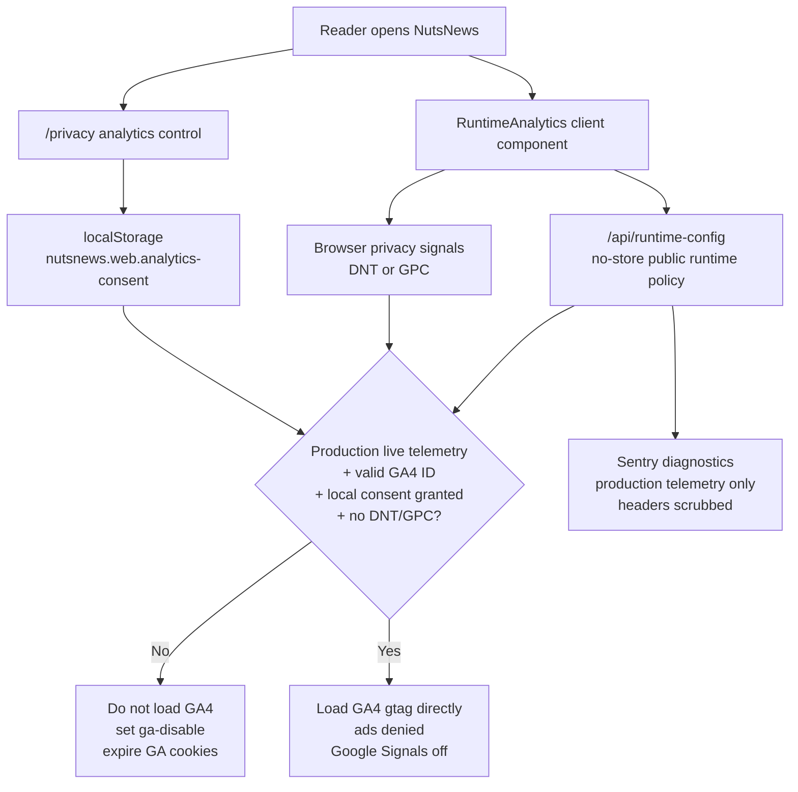

# Privacy Analytics And Consent

Related issue: `ramideltoro/nutsnews#114`

## Simple Summary

NutsNews keeps website analytics off unless a reader chooses to allow a small amount of anonymous traffic measurement. The privacy page explains the choice, and the site respects browser privacy signals.

## Intermediate Summary

The web app may use Google Analytics 4 for minimal website measurement, but only when production telemetry is live, a GA4 measurement ID is configured, the browser is not sending Do Not Track or Global Privacy Control, and the reader has allowed analytics from `/privacy`. The privacy policy now names GA4 and Sentry, documents the allowed event taxonomy, and states which personal or sensitive data must not be sent.

## Expert Summary

The app-side consent boundary is implemented in `RuntimeAnalytics`, `analyticsConsent`, and `/privacy` copy/control components. Default state is denied. A local browser setting under `nutsnews.web.analytics-consent` can grant or deny analytics, but DNT/GPC overrides local grant. Denial sets the GA disable flag and expires known first-party GA cookies. Granting clears the GA disable flag and allows the GA script only if runtime public config exposes production `telemetryEnabled` and a valid `G-*` measurement ID. GA4 is configured with advertising personalization and Google Signals disabled. Sentry remains separately gated by production telemetry and existing event scrubbing.

## Consent Flow

## Provider Decision

| Surface | Decision |
| --- | --- |
| Website analytics provider | Google Analytics 4, optional and opt-in through the privacy page |
| Error diagnostics | Sentry, gated by production telemetry and scrubbed before send |
| Server/edge logs | Existing hosting, CDN, Supabase, and app logs for reliability and abuse prevention |
| Analytics proxy/tunnel | Not used; telemetry goes directly to the provider when enabled |
| iOS app analytics SDK | Not added by this web change |

## Allowed Analytics Taxonomy

Allowed GA4 measurement is intentionally limited to:

| Category | Allowed detail |
| --- | --- |
| Page views | Standard GA4 page views for public web pages |
| Engagement | Basic GA4 engagement signals such as session/page engagement |
| Device/browser class | Coarse browser, OS, and device category from GA4 defaults |
| Referrer | Standard referrer/source fields |
| Approximate region | Coarse geography from GA4 defaults, not precise GPS |
| Performance timing | Basic site performance timing available to GA4 |

NutsNews does not currently define custom analytics events for article clicks, likes, searches, categories, themes, publisher outbound clicks, account behavior, or personal profiles. Any future custom event must be added to this table before implementation and reviewed for privacy impact.

## Disallowed Analytics Data

Do not send these values to analytics tools:

| Disallowed data | Reason |
| --- | --- |
| Name, email, phone, account ID, user ID, or payment detail | Direct or account-level personal data |
| Precise location, contacts, photos, camera, microphone, health data, or local-network data | Not part of NutsNews web analytics |
| Liked-story identifiers, local theme/haptics settings, or local app preferences | Stored locally for user experience, not analytics |
| Search text, AI prompts, admin data, or moderation decisions | Could reveal sensitive interests or operations |
| Service-role keys, auth cookies, authorization headers, tokens, or secrets | Credentials and session data |
| Full raw request payloads or high-cardinality identifiers | Hard to minimize and hard to safely retain |

## Retention

Configure GA4 property-level data retention to the shortest available setting. As of July 16, 2026, Google documents 2 months and 14 months for standard GA4 user-level/key-event retention, so NutsNews should use 2 months unless a documented product need requires a longer period. Standard aggregated GA reports may not follow the same retention control; do not treat aggregate reports as a source for personal profiling.

Sentry retention follows the Sentry project plan and should remain limited to diagnostics. Do not add replay, session, or user-identifying telemetry without a separate issue and privacy review.

## Operational Controls

- Disable website analytics globally by removing or blanking `NUTSNEWS_PUBLIC_GA_ID`.
- Disable all production telemetry by moving runtime policy away from `NUTSNEWS_RUNTIME_ENV=production` plus `NUTSNEWS_SIDE_EFFECTS_MODE=live`.
- A reader can deny analytics from `/privacy`; this stores only a local browser preference.
- DNT/GPC always wins over the local allow setting.
- Staging and preview should keep `telemetryEnabled=false`.

## Risks And Mitigations

| Risk | Mitigation |
| --- | --- |
| GA4 loads before consent | RuntimeAnalytics defaults to denied and returns `null` until consent is granted |
| Browser privacy signals ignored | DNT/GPC are checked before loading GA4 |
| Advertising features accidentally enabled | GA config disables ad personalization and Google Signals |
| Cookies remain after denial | Denial sets the GA disable flag and expires known GA first-party cookies |
| Custom events expand scope | This document is the allowlist; update it before adding events |

## Rollback

1. Revert the app PR that adds the consent gate and privacy copy.
2. Remove or blank `NUTSNEWS_PUBLIC_GA_ID` if analytics must be disabled immediately.
3. Verify `/api/runtime-config` reports `gaId: null` or `telemetryEnabled: false` for non-production targets.
4. Confirm `/privacy` still renders and the footer link remains reachable.

## Validation

- `npm run test:privacy-analytics`
- `npm run test:i18n`
- `npm run test:components`
- `npx tsc --noEmit`
- `npm run lint`
- Staging-safe `npm run build` with disabled side effects
- `git diff --check`

## Source Notes

Google Analytics retention settings were checked against Google Analytics Help on July 16, 2026: https://support.google.com/analytics/answer/7667196
