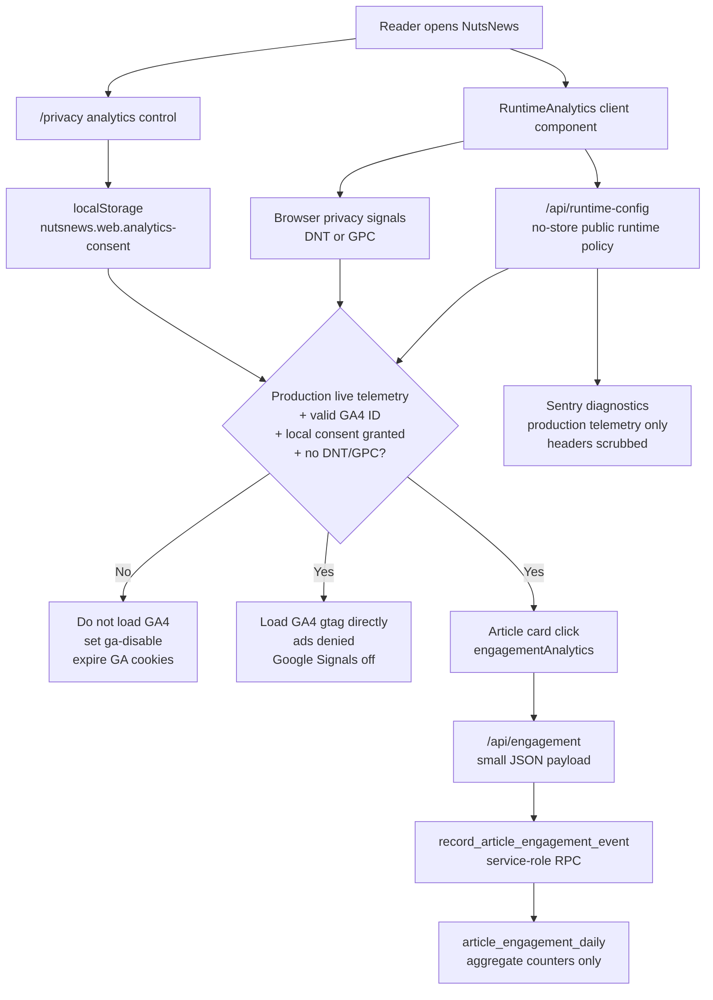

# Privacy Analytics And Consent

Related issue: `ramideltoro/nutsnews#114`

Related engagement issue: `ramideltoro/nutsnews#22`

Related app PR: `ramideltoro/nutsnews#235`

## Simple Summary

NutsNews keeps website analytics off unless a reader chooses to allow a small amount of anonymous traffic measurement. The privacy page explains the choice, and the site respects browser privacy signals. Article engagement analytics are first-party aggregate counters only.

## Intermediate Summary

The web app may use Google Analytics 4 for minimal website measurement, but only when production telemetry is live, a GA4 measurement ID is configured, the browser is not sending Do Not Track or Global Privacy Control, and the reader has allowed analytics from `/privacy`. The same consent and browser-signal boundary gates first-party article engagement counters for outbound article clicks and category interest. The privacy policy names GA4, Sentry, and first-party aggregate engagement events, documents the allowed taxonomy, and states which personal or sensitive data must not be sent.

## Expert Summary

The app-side consent boundary is implemented in `RuntimeAnalytics`, `analyticsConsent`, `engagementAnalytics`, and `/privacy` copy/control components. Default state is denied. A local browser setting under `nutsnews.web.analytics-consent` can grant or deny analytics, but DNT/GPC overrides local grant. Denial sets the GA disable flag, expires known first-party GA cookies, and prevents engagement beacon/fetch calls. Granting clears the GA disable flag and allows the GA script only if runtime public config exposes production `telemetryEnabled` and a valid `G-*` measurement ID. GA4 is configured with advertising personalization and Google Signals disabled. Sentry remains separately gated by production telemetry and existing event scrubbing.

Article engagement writes go through `/api/engagement`, `recordArticleEngagementEvent`, and the `record_article_engagement_event` RPC. The database stores daily aggregate rows in `article_engagement_daily` keyed by date, event type, article ID, source, and category. Category interest rows use a nil article UUID sentinel. Public clients never receive direct table access, and the summary views are service-role only.

## Consent Flow

## Provider Decision

| Surface | Decision |
| --- | --- |
| Website analytics provider | Google Analytics 4, optional and opt-in through the privacy page |
| Article engagement analytics | First-party aggregate counters, optional and opt-in through the same privacy page control |
| Error diagnostics | Sentry, gated by production telemetry and scrubbed before send |
| Server/edge logs | Existing hosting, CDN, Supabase, and app logs for reliability and abuse prevention |
| Analytics proxy/tunnel | Not used; telemetry goes directly to the provider when enabled |
| iOS app analytics SDK | Not added by this web change |

## Allowed Analytics Taxonomy

Allowed GA4 measurement is intentionally limited to:

| Category | Allowed detail |
| --- | --- |
| Page views | Standard GA4 page views for public web pages |
| Engagement | Basic GA4 engagement signals such as session/page engagement |
| Device/browser class | Coarse browser, OS, and device category from GA4 defaults |
| Referrer | Standard referrer/source fields |
| Approximate region | Coarse geography from GA4 defaults, not precise GPS |
| Performance timing | Basic site performance timing available to GA4 |
| Outbound article clicks | First-party aggregate count by article ID, source, and category |
| Category interest | First-party aggregate count by source and category inferred from article-card clicks |

NutsNews defines no custom analytics events for likes, searches, themes, account behavior, personal profiles, or cross-device tracking. Any future custom event must be added to this table before implementation and reviewed for privacy impact.

## Disallowed Analytics Data

Do not send these values to analytics tools:

| Disallowed data | Reason |
| --- | --- |
| Name, email, phone, account ID, user ID, or payment detail | Direct or account-level personal data |
| Precise location, contacts, photos, camera, microphone, health data, or local-network data | Not part of NutsNews web analytics |
| Liked-story identifiers, local theme/haptics settings, or local app preferences | Stored locally for user experience, not analytics |
| Search text, AI prompts, admin data, or moderation decisions | Could reveal sensitive interests or operations |
| Raw outbound URLs, article titles, referrers, IP addresses, user agents, or visitor identifiers in engagement events | Not needed for aggregate source/category reporting |
| Service-role keys, auth cookies, authorization headers, tokens, or secrets | Credentials and session data |
| Full raw request payloads or high-cardinality identifiers | Hard to minimize and hard to safely retain |

## Retention

Configure GA4 property-level data retention to the shortest available setting. As of July 16, 2026, Google documents 2 months and 14 months for standard GA4 user-level/key-event retention, so NutsNews should use 2 months unless a documented product need requires a longer period. Standard aggregated GA reports may not follow the same retention control; do not treat aggregate reports as a source for personal profiling.

Sentry retention follows the Sentry project plan and should remain limited to diagnostics. Do not add replay, session, or user-identifying telemetry without a separate issue and privacy review.

## Operational Controls

- Disable website analytics globally by removing or blanking `NUTSNEWS_PUBLIC_GA_ID`.
- Disable all production telemetry by moving runtime policy away from `NUTSNEWS_RUNTIME_ENV=production` plus `NUTSNEWS_SIDE_EFFECTS_MODE=live`.
- A reader can deny analytics from `/privacy`; this stores only a local browser preference.
- DNT/GPC always wins over the local allow setting.
- Staging and preview should keep `telemetryEnabled=false`.
- Staging and preview side effects should remain disabled unless a local sandbox is explicitly used; blocked engagement writes return `recorded: false` without breaking outbound publisher links.

## Risks And Mitigations

| Risk | Mitigation |
| --- | --- |
| GA4 loads before consent | RuntimeAnalytics defaults to denied and returns `null` until consent is granted |
| Browser privacy signals ignored | DNT/GPC are checked before loading GA4 |
| Advertising features accidentally enabled | GA config disables ad personalization and Google Signals |
| Cookies remain after denial | Denial sets the GA disable flag and expires known GA first-party cookies |
| Engagement events expand scope | This document is the allowlist; events remain aggregate-only and consent-gated |
| Aggregate counts are mistaken for complete audience measurement | Counts include only consenting web readers and should be interpreted as a privacy-preserving sample |
| Spam inflates aggregate counters | API payloads are small, strictly validated, same-origin checked, and bounded to one count per accepted event |
| Custom events expand scope | This document is the allowlist; update it before adding events |

## Rollback

1. Revert the app PR that adds the engagement API, aggregate migration, admin dashboard, consent-gated client helper, and privacy copy.
2. Remove or blank `NUTSNEWS_PUBLIC_GA_ID` if analytics must be disabled immediately.
3. Keep runtime side effects disabled if engagement writes need to stop before a revert reaches production.
4. Verify `/api/runtime-config` reports `gaId: null` or `telemetryEnabled: false` for non-production targets.
5. Confirm `/privacy` still renders and the footer link remains reachable.

## Validation

- `npm run test:privacy-analytics`
- `npm run test:article-engagement-analytics`
- `npm run test:i18n`
- `npm run test:components`
- `npx tsc --noEmit`
- `npm run lint`
- Staging-safe `npm run build` with disabled side effects
- `git diff --check`

## Source Notes

Google Analytics retention settings were checked against Google Analytics Help on July 16, 2026: https://support.google.com/analytics/answer/7667196
