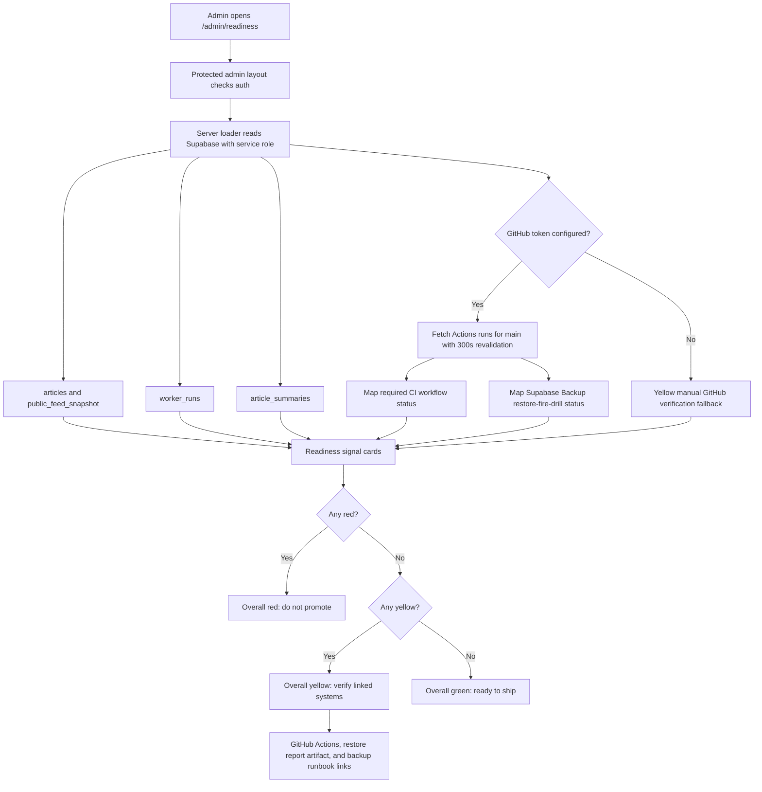

# Production Readiness Dashboard

NutsNews has an admin-only production readiness scorecard at `/admin/readiness`.

## Simple Summary

The admin now has one page that says whether NutsNews looks ready to ship, using green, yellow, and red cards.

## Intermediate Summary

The production readiness dashboard helps an admin decide whether NutsNews is healthy enough to promote in under 30 seconds. It checks public feed/API readiness, the latest Worker/controller run, database growth, translation coverage, image coverage, backup restore verification, and CI status. Backup and CI status are live when a read-only GitHub token is configured; otherwise those cards stay yellow and link admins to GitHub Actions for manual verification.

## Expert Summary

Issue #86 adds a protected Next.js admin route at `/admin/readiness`, backed by `web/lib/adminProductionReadiness.ts`. Issue #110 extends the backup card so it can read the latest `Supabase Backup` workflow run when `ACTIONS_READ_TOKEN` is configured. The loader uses server-side Supabase service-role reads for `articles`, `public_feed_snapshot`, `worker_runs`, and `article_summaries`; it does not expose credentials to the browser. The GitHub-backed signals use a server-only GitHub REST API call to `/repos/ramideltoro/nutsnews/actions/runs?branch=main&per_page=50`. The call sends the required GitHub API headers, is cached/revalidated for 300 seconds, matches workflows by explicit workflow file/name mappings, and returns only sanitized workflow names, status, conclusion, branch, commit SHA, updated time, and links to the admin UI. Backup freshness is green only when the latest `Supabase Backup` run completed successfully within 30 hours, which means the workflow exported backup artifacts, restored them into disposable local Supabase, and ran `supabase/restore_validation.sql`.

## What Changed

- Added an admin-facing `/admin/readiness` scorecard.
- Added the Production Readiness card to the admin landing page.
- Added a focused regression script for the readiness dashboard contract.
- Added yellow verification states for backup freshness and unconfigured CI status rather than faking live success.
- Added live GitHub Actions CI status when a server-side read-only token is configured, while preserving the yellow manual verification fallback when it is not.
- Added live GitHub Actions backup restore-fire-drill status when the same server-side token is configured.

## Why It Matters

NutsNews has production dependencies across Vercel, Cloudflare, Workers, Supabase, translations, images, backups, and CI. The scorecard gives admins a single operational view before shipping or promoting.

## Who Is Affected

- Admins use `/admin/readiness` before promotion decisions.
- Developers use the regression script to protect the dashboard contract.
- Readers are not directly affected; the change is admin-only.

## Behavior Differences

The admin landing page now links to Production Readiness. The new page groups signals by severity and includes next-step remediation copy on every card.

## Signals

| Signal | Source | Green means | Yellow means | Red means |
| --- | --- | --- | --- | --- |
| Public API health | `public_feed_snapshot` and recent `articles` rows | Snapshot has enough rows for a first page | Articles exist but snapshot is short | Neither source has enough rows |
| Latest Worker/controller success | Latest `worker_runs` row | Latest success is fresh | Latest success is aging or missing | Latest run failed or is stale |
| DB growth signal | Recent published `articles` rows | Published rows arrived in 24 hours | Growth exists in 7 days but not 24 hours | No recent published growth |
| Translation coverage | Recent `article_summaries` rows | Recent multilingual coverage is high | Coverage is partial or unmeasurable | Coverage is low |
| Image coverage | Recent published article thumbnails | Thumbnail coverage is high | Thumbnail coverage is thin | Thumbnail coverage is too low |
| Backup freshness | `Supabase Backup` GitHub Actions workflow | Latest workflow completed successfully within 30 hours and uploaded the restore fire drill report | Token missing, workflow missing, run pending, run skipped/neutral, GitHub unavailable, or manual verification required | Latest workflow failed/cancelled/timed out/requires action, or latest completed restore check is stale |
| CI status | GitHub Actions REST API when `ACTIONS_READ_TOKEN` is configured | Every required workflow has a latest completed successful run on `main` within the freshness window | Token is missing, a workflow is missing/pending/stale/skipped/neutral, GitHub is rate-limited, or the API is unavailable | A required workflow failed, was cancelled, timed out, or requires action |

## Live Backup Restore Status

The backup card checks the latest main-branch run for:

| Dashboard row | Workflow file | Expected workflow name |
| --- | --- | --- |
| Backup restore fire drill | `.github/workflows/supabase-backup.yml` | `Supabase Backup` |

Status mapping:

- Green: the latest run completed with `conclusion=success` and is not older than 30 hours.
- Yellow: `ACTIONS_READ_TOKEN` is missing, the workflow is missing, the latest run is queued or in progress, GitHub is rate-limited, or the API is unavailable.
- Red: the latest run failed, was cancelled, timed out, requires action, or the latest completed check is stale.

The linked workflow run is the visible latest restore-check record. Its artifacts include `supabase-rest-backup` and `supabase-restore-fire-drill-report`; the report artifact contains `latest.md` and `latest.json`.

## Live GitHub Actions CI Status

The CI card checks these required workflows on the `main` branch:

| Dashboard row | Workflow file | Expected workflow name |
| --- | --- | --- |
| Web CI | `.github/workflows/web-ci.yml` | `Web CI` |
| Public smoke | `.github/workflows/public-reader-smoke.yml` | `Public Reader Smoke Tests` |
| Preview smoke | `.github/workflows/vercel-preview-smoke.yml` | `Vercel Preview Smoke Test` |
| Lighthouse | `.github/workflows/lighthouse-ci.yml` | `Lighthouse CI` |
| Axe accessibility | `.github/workflows/accessibility-ci.yml` | `Accessibility CI` |
| CodeQL | `.github/workflows/codeql.yml` | `CodeQL Security Scan` |
| Gitleaks secrets | `.github/workflows/gitleaks.yml` | `Gitleaks Secret Scan` |
| OSV Scanner | `.github/workflows/osv-scanner.yml` | `OSV Scanner` |
| Dependency Review | `.github/workflows/dependency-review.yml` | `Dependency Review` |
| OpenSSF Scorecard | `.github/workflows/openssf-scorecard.yml` | `OpenSSF Scorecard` |
| Snyk Security Scan | `.github/workflows/snyk.yml` | `Snyk Security Scan` |

Status mapping:

- Green: every required workflow has a latest completed run with `conclusion=success` and the run is not stale.
- Yellow: the token is missing, the workflow is missing, the latest run is queued or in progress, the latest run is stale, the conclusion is skipped or neutral, GitHub returns an API error, or GitHub rate-limits the request.
- Red: the latest completed required workflow failed, was cancelled, timed out, or requires action.

The admin UI shows each workflow name, dashboard status, GitHub status, conclusion, branch, commit SHA, updated time, and link to the run when GitHub data is available. If live status is unavailable, the card keeps the manual next step: open GitHub Actions and confirm Web CI, public smoke, preview smoke, Lighthouse, axe, CodeQL, and security scans are green.

## Operational Steps

1. Open `/admin/readiness`.
2. Read the overall status.
3. Fix red cards before promotion.
4. Verify yellow cards by following their links.
5. Use the linked admin pages, workflows, or runbooks for remediation.

## Environment And Permissions

The dashboard uses existing server-side admin Supabase configuration:

- `SUPABASE_URL` or `NEXT_PUBLIC_SUPABASE_URL`
- `SUPABASE_SERVICE_ROLE_KEY`

Optional server-only CI status configuration:

- `ACTIONS_READ_TOKEN`

Use a read-only GitHub token with access to read repository Actions metadata for `ramideltoro/nutsnews`. The token MUST be configured only as a server/runtime secret and MUST NOT be exposed as a `NEXT_PUBLIC_*` variable. Do not create `GITHUB_ACTIONS_READ_TOKEN`; GitHub blocks custom secrets that start with `GITHUB_`. No GitHub Actions workflow needs this token for CI because the dashboard builds and renders the yellow missing-token fallback without it; configure `ACTIONS_READ_TOKEN` in the deployed server/runtime environment where admins load `/admin/readiness`. No browser-visible GitHub secret is required. No backup metrics token is introduced by this change.

## Request/Data Flow

## Risks And Mitigations

| Risk | Mitigation |
| --- | --- |
| Backup workflow succeeds without a usable restore | The `Supabase Backup` workflow now runs the restore fire drill before a green backup card is possible. |
| Backup card cannot query GitHub | It stays yellow and links directly to the workflow for manual verification. |
| GitHub token is missing or under-scoped | The CI card stays yellow and keeps the manual GitHub Actions verification link. |
| GitHub API is rate-limited or unavailable | The CI card stays yellow and tells admins to verify Actions directly. |
| A blocked `GITHUB_*` custom secret name is used | Use only `ACTIONS_READ_TOKEN`; GitHub reserves the `GITHUB_` prefix for built-in variables/secrets. |
| Workflow names change | The code matches by explicit workflow file path first and by known workflow name second; update the CI and backup mappings when workflow files are renamed. |
| Supabase schema drift breaks the dashboard | The focused regression script protects required dashboard strings and route linkage; TypeScript/build checks catch loader type issues. |
| Thresholds need tuning | Threshold constants live in `web/lib/adminProductionReadiness.ts` and can be adjusted without changing the UI contract. |

## Rollback

Revert the app PR that adds or changes `/admin/readiness`, `web/lib/adminProductionReadiness.ts`, the admin landing card, package scripts, and regression scripts. If only the live backup restore status must be rolled back, remove the `Supabase Backup` workflow mapping from `web/lib/adminProductionReadiness.ts`; the backup card will return to the manual yellow workflow fallback. Then revert this documentation page and any related backup/restore docs updates.

## Related

- App issue: https://github.com/ramideltoro/nutsnews/issues/86
- Backup restore issue: https://github.com/ramideltoro/nutsnews/issues/110
- Backup runbook: [NUTSNEWS_DB_BACKUPS.md](NUTSNEWS_DB_BACKUPS.md)
- GitHub Actions automation: [GITHUB_ACTIONS_AUTOMATION.md](GITHUB_ACTIONS_AUTOMATION.md)
