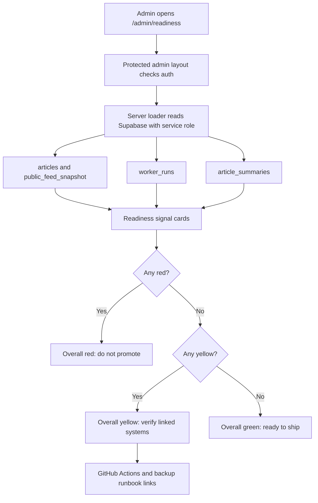

# Production Readiness Dashboard

NutsNews has an admin-only production readiness scorecard at `/admin/readiness`.

## Simple Summary

The admin now has one page that says whether NutsNews looks ready to ship, using green, yellow, and red cards.

## Intermediate Summary

The production readiness dashboard helps an admin decide whether NutsNews is healthy enough to promote in under 30 seconds. It checks public feed/API readiness, the latest Worker/controller run, database growth, translation coverage, image coverage, backup verification, and CI verification. Signals that cannot be measured from existing in-app data are shown as yellow verification items with links to the correct external system or runbook.

## Expert Summary

Issue #86 adds a protected Next.js admin route at `/admin/readiness`, backed by `web/lib/adminProductionReadiness.ts`. The loader uses server-side Supabase service-role reads for `articles`, `public_feed_snapshot`, `worker_runs`, and `article_summaries`; it does not expose credentials to the browser. Backup freshness and CI status remain yellow because the app repository does not currently have a live GitHub Actions, Grafana, or backup-metrics API integration that can be queried without adding new secrets or infrastructure. The dashboard links those signals to the Supabase Backup workflow, GitHub Actions, and existing admin/runbook pages.

## What Changed

- Added an admin-facing `/admin/readiness` scorecard.
- Added the Production Readiness card to the admin landing page.
- Added a focused regression script for the readiness dashboard contract.
- Added yellow verification states for backup freshness and CI status rather than faking live success.

## Why It Matters

NutsNews has production dependencies across Vercel, Cloudflare, Workers, Supabase, translations, images, backups, and CI. The scorecard gives admins a single operational view before shipping or promoting.

## Who Is Affected

- Admins use `/admin/readiness` before promotion decisions.
- Developers use the regression script to protect the dashboard contract.
- Readers are not directly affected; the change is admin-only.

## Behavior Differences

The admin landing page now links to Production Readiness. The new page groups signals by severity and includes next-step remediation copy on every card.

## Signals

| Signal | Source | Green means | Yellow means | Red means |
| --- | --- | --- | --- | --- |
| Public API health | `public_feed_snapshot` and recent `articles` rows | Snapshot has enough rows for a first page | Articles exist but snapshot is short | Neither source has enough rows |
| Latest Worker/controller success | Latest `worker_runs` row | Latest success is fresh | Latest success is aging or missing | Latest run failed or is stale |
| DB growth signal | Recent published `articles` rows | Published rows arrived in 24 hours | Growth exists in 7 days but not 24 hours | No recent published growth |
| Translation coverage | Recent `article_summaries` rows | Recent multilingual coverage is high | Coverage is partial or unmeasurable | Coverage is low |
| Image coverage | Recent published article thumbnails | Thumbnail coverage is high | Thumbnail coverage is thin | Thumbnail coverage is too low |
| Backup freshness | External workflow/runbook | Not measured in app yet | Admin must verify backup workflow/runbook | Reserved for future live metric integration |
| CI status | GitHub Actions | Not measured in app yet | Admin must verify GitHub Actions | Reserved for future live GitHub status integration |

## Operational Steps

1. Open `/admin/readiness`.
2. Read the overall status.
3. Fix red cards before promotion.
4. Verify yellow cards by following their links.
5. Use the linked admin pages, workflows, or runbooks for remediation.

## Environment And Permissions

The dashboard uses existing server-side admin Supabase configuration:

- `SUPABASE_URL` or `NEXT_PUBLIC_SUPABASE_URL`
- `SUPABASE_SERVICE_ROLE_KEY`

No new browser-visible secrets are required. No GitHub token or backup metrics token is introduced by this change.

## Request/Data Flow

## Risks And Mitigations

| Risk | Mitigation |
| --- | --- |
| Backup and CI cards look less automated | They are intentionally yellow and link to the workflow/runbook until a live status integration exists. |
| Supabase schema drift breaks the dashboard | The focused regression script protects required dashboard strings and route linkage; TypeScript/build checks catch loader type issues. |
| Thresholds need tuning | Threshold constants live in `web/lib/adminProductionReadiness.ts` and can be adjusted without changing the UI contract. |

## Rollback

Revert the app PR that adds `/admin/readiness`, `web/lib/adminProductionReadiness.ts`, the admin landing card, package script, and regression script. Then revert this documentation page and README link.

## Related

- App issue: https://github.com/ramideltoro/nutsnews/issues/86
- Backup runbook: [NUTSNEWS_DB_BACKUPS.md](NUTSNEWS_DB_BACKUPS.md)
- GitHub Actions automation: [GITHUB_ACTIONS_AUTOMATION.md](GITHUB_ACTIONS_AUTOMATION.md)
