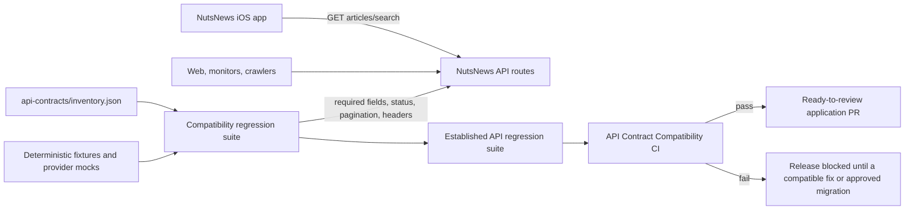

# NutsNews API Compatibility Contracts

NutsNews treats its deployed response behavior as a compatibility contract. The iOS app consumes the public article and search APIs, so a field removal, type change, status change, pagination change, cache regression, or authentication change is release-blocking unless it follows the migration process below.

## Simple Summary

NutsNews has an automated safety check that makes sure phones, browsers, search engines, and monitoring tools keep receiving the important information they already understand. If someone accidentally changes one of those important API boxes, CI stops the change before it can ship.

## Intermediate Summary

The source-controlled inventory in `ramideltoro/nutsnews/api-contracts/inventory.json` records every custom API, health, sitemap, robots, and generated Open Graph response. `npm run test:api-contracts` runs a new deterministic compatibility suite before the existing regression suite. The check uses fixtures and mocked providers, so it never calls production Supabase, Turnstile, Resend, Google, or the edge Worker.

The protected iOS surface is `GET /api/articles` and `GET /api/search`. The suite verifies the server's current snake-case article fields, `nextPage` semantics, status codes, cache headers, and error responses that the Swift app relies on. CI runs the command for pull requests that change web routes, shared response code, auth, serialization, database migrations, contract scripts, fixtures, or relevant dependencies.

## Expert Summary

The machine-readable source of truth is `api-contracts/inventory.json` in `ramideltoro/nutsnews`. It maps each endpoint to its method, request rules, auth, success and error shape, pagination, cache behavior, iOS call sites, and the comprehensive test file. The primary implementation is `scripts/api_contract_compatibility_regression.mjs`, run through the `pretest:api-contracts` lifecycle hook before the established `scripts/api_contract_regression.mjs`; the existing `test:api-contracts` command remains unchanged to preserve immutable test protections.

The `API Contract Compatibility` GitHub Actions workflow runs `npm ci` and `npm run test:api-contracts` with Node 22. It is intentionally separate from the locked legacy workflow, and its path filters cover `web/**`, `supabase/**`, `scripts/**`, `api-contracts/**`, and the workflow itself. The suite loads route modules through a TypeScript VM harness with deterministic fixtures and mocks. It asserts method exports, success and error status codes, required keys, types, nullability, enums, nested arrays and objects, pagination continuation/order, headers, cache policy, auth delegation, input validation, rate limiting, and non-JSON metadata/image behavior. It contains negative cases that prove a missing or type-incompatible field or an incompatible status fails the contract assertions.

## Compatibility Policy

The following rules apply to every endpoint recorded in the inventory.

- Existing paths and HTTP methods do not change.
- Required response fields cannot be removed, renamed, or changed to an incompatible type.
- Field meaning, nullability, enum values, status codes, pagination semantics, authentication behavior, error shape, relevant response headers, and cache semantics remain compatible.
- Additive fields are allowed only when they do not break the existing decoder and are covered by an updated contract test.
- Error responses must retain their documented JSON shape wherever the application owns that response. Framework-owned NextAuth and metadata errors are documented as such rather than guessed.
- A failing API contract test is release-blocking. Do not weaken, skip, or delete a failing assertion to ship a change.
- Do not change iOS expectations to hide a server mismatch. First preserve the old server behavior with a compatibility layer when that is safe; otherwise use the migration process below.

## Request And Enforcement Flow



## Complete Server Inventory

The table is human-readable; the JSON inventory is authoritative for CI and must be updated in the same change as any contract change.

| Method and path | Request and auth | Success contract | Error/pagination/cache | iOS use and test mapping |
| --- | --- | --- | --- | --- |
| `GET /api/articles` | Public. `page`, `cursor`, `home=1`, `category`, `lang`; `limit` is intentionally a no-op for backward compatibility. | `200` JSON: `articles`, `nextPage`, `nextCursor`, `dataSource`, `languageCode`; `home=1` also has `sections`. | `500` JSON has empty `articles`, null pagination, and `error`; edge recovery remains `200`. Offset `nextPage:number|null`; cursor `nextCursor:string|null`; public cache headers. | Main feed and widget. `scripts/api_contract_compatibility_regression.mjs` protects normal, empty, cursor, home, fallback, error, order, headers, and iOS pagination cases. |
| `GET /api/home-feed` | Public. Optional `lang`. | `200` article payload plus ordered category `sections`. | `500` has empty root/sections and `error`; public cache headers. | Not called by iOS. Covered by the compatibility suite. |
| `GET /api/search` | Public. `q`, `page`, `limit`, `lang`; short query returns an empty success response. | `200` JSON: `articles`, `nextPage`, `query`, `page`, `pageSize`, `languageCode`. | `500` preserves request metadata and adds `error`; offset `nextPage:number|null`; public search cache headers. | Archive search. Covered for normal, empty, bounded query/page/limit, error, headers, and numeric/null `nextPage`. |
| `POST /api/contact` | Public JSON request; allowed origin, Turnstile, honeypot, and per-IP/email rate limit apply. | `200` JSON `{ "ok": true }`. | `400`, `403`, `413`, `415`, `429` with `Retry-After`, `502`, and `503` use `{ "error": string }`; every response is no-store. | Not called by iOS. Covered with mocked Turnstile and Resend only. |
| `GET`, `POST /api/auth/[...nextauth]` | Framework-managed NextAuth catch-all; Google OAuth and JWT; only the configured admin allowlist can sign in. | NextAuth-managed redirect, HTML, and JSON flows. | NextAuth owns detailed error bodies; auth responses are no-store. | Not called by iOS. Route delegation and allowlist configuration are covered. |
| `GET /api/log-test` | Public; no parameters. | `200` JSON with `ok`, `message`, and `searchInBetterStackFor`. | No application-defined catch shape; no-store. | Not called by iOS. Nested response and logger behavior are covered. |
| `GET /healthz` | Public monitoring endpoint. | `200` JSON with `ok`, `service`, `sourceCommit`, `buildId`, and `deploymentTarget`. | No application-defined error shape; public CDN cache and deployment identity headers. | Not called by iOS. Covered for payload and headers. |
| `GET /sitemap.xml` | Public metadata response. | XML sitemap with root, apps, privacy, contact, and published article URLs. | Framework-generated failure if sitemap data cannot load; public cache. | Not called by iOS. Covered for required metadata entries. |
| `GET /about/sitemap.xml` | Public metadata response. | XML sitemap with root, about, and published article URLs. | Framework-generated failure if sitemap data cannot load. | Not called by iOS. Covered for required metadata entries. |
| `GET /robots.txt` | Public metadata response. | Text rules allow `/`, disallow `/api/`, and name the root sitemap. | No application-defined error response; public cache. | Not called by iOS. Covered for directives and sitemap URL. |
| `GET /opengraph-image` | Public generated image. | `200 image/png`, stable social-card metadata and OG dimensions. | Framework-generated image failures; public cache. | Not called by iOS. Covered with a mocked `ImageResponse`. |
| `GET /articles/:id/opengraph-image` | Public generated image; current renderer does not load the article record. | `200 image/png`, stable article social-card metadata and OG dimensions. | Framework-generated image failures; public cache. | Not called by iOS. Covered with a mocked `ImageResponse`. |

Static assets such as `icon.png` and `apple-icon.png` are not custom API handlers. Admin pages are protected HTML/RSC views, not custom `/api/admin` endpoints. NutsNews currently has no inbound RSS or Atom endpoint. The edge Worker snapshot URLs are outbound dependencies, not `nutsnews` routes.

## Article Response Contract

For successful article and search results, each article keeps these keys and types. The iOS decoder is tolerant in several places, but the server still protects the current shape so an accidental omission does not silently degrade the reader experience.

| Field | Contract | iOS meaning |
| --- | --- | --- |
| `id` | required string | Stable identity and page de-duplication |
| `source` | required string | Publisher label |
| `title` | required string | Story title |
| `original_url` | required string | Safari destination URL |
| `image_url` | string or null | Thumbnail URL when present |
| `published_at` | string or null | Display date |
| `published_on_site_at` | string or null | Fallback display date |
| `ai_summary` | string or null | Article summary |
| `category` | string or null | Split into category labels by iOS |
| `positivity_score` | number or null | Currently ignored by iOS, still protected |
| `language_code` | required string | Current language metadata |
| `requested_language_code` | required string | Requested language metadata |
| `translation_available` | required boolean | Translation availability metadata |

`dataSource` is one of `public_feed_snapshot`, `articles_fallback`, or `edge_feed_snapshot`. Supported response language values are `en`, `fr`, `ja`, `de-CH`, `de`, and `el`. Optional edge snapshot metadata must preserve its documented nullable values and status enum when present.

## iOS Call-Site Mapping

| iOS consumer | Request | Decoder and behavioral assumptions | Server contract test |
| --- | --- | --- | --- |
| Main feed | `GET https://www.nutsnews.com/api/articles?page=<page>&category=<optional>` | Accepts any `2xx`, decodes `articles` and camel-case `nextPage`, caches a successful response for 15 minutes, and uses stale same-key data after a transport/status/decode failure. | `testArticlesContract`, including page/category normalization, article fields, empty payload, ordered results, `nextPage:number|null`, status, and cache headers. |
| Feed pagination | Requests exactly the returned numeric `nextPage`. | Ignores `nextCursor`; changing to cursor-only pagination would truncate the iOS feed. | `testArticlesContract` asserts offset `nextPage` remains numeric when more items exist and null when finished. |
| Widget | `GET https://www.nutsnews.com/api/articles?page=0&limit=5` | Needs an `articles` array and uses the first article; 12-second request timeout, URLSession cache fallback, three-hour timeline. `limit=5` is currently a no-op because the server page size is fixed at five. | `testArticlesContract` sends the widget query and protects the root array and usable article shape. |
| Archive search | `GET https://www.nutsnews.com/api/search?q=<q>&page=<page>&limit=<limit>` | Normalizes whitespace, requires two client-side characters, clamps limit to `1...50`, decodes `articles` and `nextPage`, and caches for five minutes. | `testSearchContract` asserts query/page/limit behavior, articles, empty results, errors, pagination, and cache headers. |

There are no current first-party iOS calls to authenticated, admin, health, sitemap, robots, Open Graph, contact, or log-test endpoints. The iOS app does load `image_url` values and opens `original_url` values, so valid string URLs remain part of the article contract.

## How To Run

From the application repository:

```bash
cd web
npm run test:api-contracts
```

The npm lifecycle first runs the comprehensive compatibility suite, then the established legacy API regression suite. The command does not need live Supabase credentials, Turnstile secrets, Resend keys, Google OAuth credentials, or network access.

GitHub Actions runs the same command in the `API Contract Compatibility` workflow. A failure is a release blocker, including when TypeScript compilation and the production build still succeed.

## Fixture Strategy

- Route modules load in a TypeScript VM harness with deterministic article, section, search, and health fixtures.
- Supabase-backed helpers, logging, cache-header helpers, NextAuth, Open Graph image generation, Turnstile, Resend, and quota recording are mocked at module boundaries.
- Contact tests replace `fetch` and fail if a test would send an external request or email.
- Success, empty, error, rate-limit, and edge-fallback fixtures exercise the same route serialization branches the deployed server uses.
- The inventory itself is a committed response-contract baseline. The suite fails if a new custom route or metadata response module lacks an inventory and test mapping.

## Add or Change an Endpoint Safely

1. Trace server handler code and every client call site, including `nutsnews-ios` when the endpoint is public.
2. Add or update the endpoint in `api-contracts/inventory.json` with request, auth, success, error, pagination, header/cache, and iOS mapping details.
3. Add deterministic success, empty, validation, auth, error, and header cases to `scripts/api_contract_compatibility_regression.mjs`.
4. Keep established tests and immutable protections intact. Add new tests rather than editing locked test files unless an explicit reviewed override exists.
5. Run `cd web && npm run test:api-contracts`, plus the relevant typecheck, lint, build, security, and offline E2E checks.
6. Update this document when the supported surface or maintenance process changes, then have the application pull request reviewed normally.

## Breaking Change and Migration Process

Never silently repurpose an existing endpoint.

1. Keep the existing path, method, and response compatible for iOS and other clients whenever a server-side adapter or additive field can do so safely.
2. If compatibility cannot be preserved, create a new explicit versioned endpoint, for example `/api/v2/articles`, and document the old/new contract side by side.
3. Obtain explicit review for the migration plan before changing clients. Include clients to migrate, rollout order, telemetry/monitoring, rollback, sunset date, and the contract tests for both versions.
4. Release the new endpoint alongside the old one. Do not remove or alter the original contract until all known clients have migrated and the deprecation is reviewed.
5. Record the approved migration in this document and the application PR. A failing old-contract test remains a blocker until the old endpoint is formally retired.

## Risks, Mitigations, and Rollback

- Risk: a route import changes and the VM harness no longer loads it. Mitigation: unexpected imports fail the suite, and inventory completeness checks detect untracked handler files.
- Risk: a fixture hides a production dependency problem. Mitigation: this suite protects serialization semantics; existing typecheck, build, security, offline E2E, preview, and deployment-smoke checks retain their separate responsibilities.
- Risk: contact tests send email or call a provider. Mitigation: all provider calls are mocked and an unexpected `fetch` fails immediately.
- Risk: a strict assertion blocks a legitimate additive change. Mitigation: tests require existing keys/types but allow documented additive fields; update the inventory and test intentionally during review.

Rollback is limited to reverting the application compatibility commit and, if needed, the documentation commit. No database migration, secret, provider configuration, or runtime feature flag is introduced by this testing and CI work.

## Related Docs

- [Full Archive Search](FULL_ARCHIVE_SEARCH.md)
- [Public Feed Snapshot and Edge Fallback](PUBLIC_FEED_SNAPSHOT.md)
- [Cloudflare Turnstile Contact Form](CLOUDFLARE_TURNSTILE_CONTACT_FORM.md)
- [Cloudflare Cache Observability](CLOUDFLARE_CACHE_OBSERVABILITY.md)
- [Web Offline E2E Regression Test](WEB_OFFLINE_E2E_REGRESSION_TEST.md)
